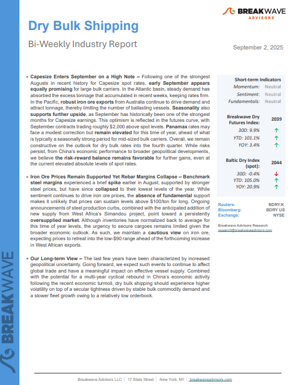
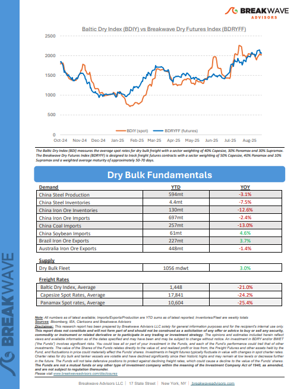
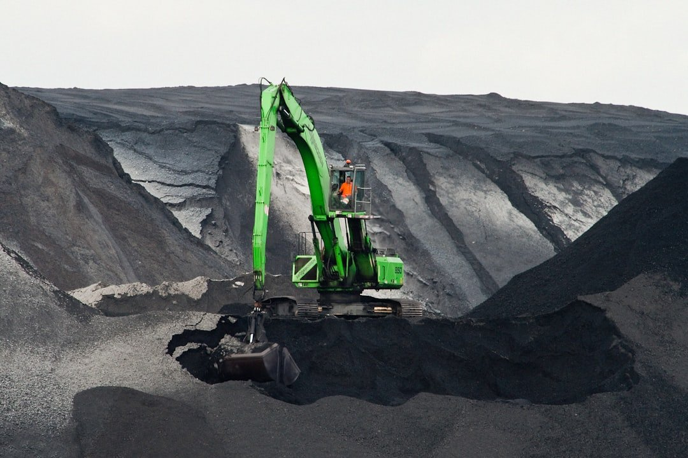
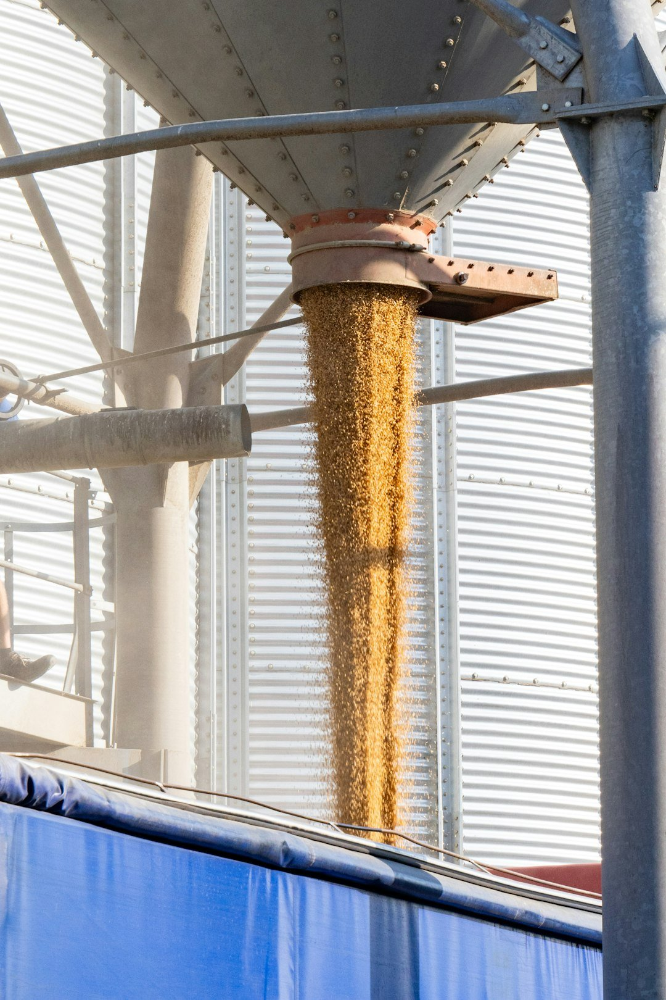
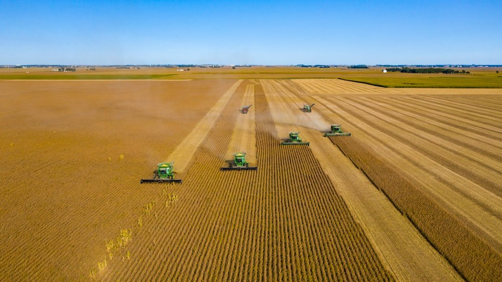
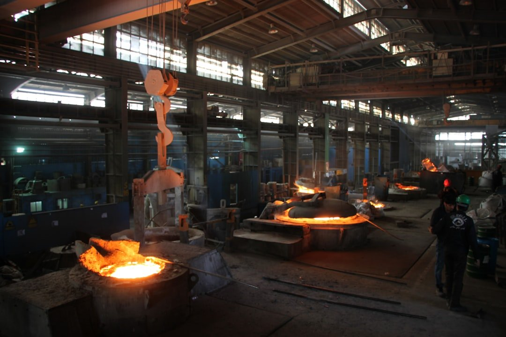

# Breakwave Weekend Read

**Date:** September 05, 2025  
**Publisher:** Breakwave Advisors | **Category:** Market Insights  
**Original URL:** [https://www.breakwaveadvisors.com/insights/2024/10/25/breakwave-weekend-read-547kk-rw7zy-awmfb-mf26k-dk29d-56ysb-x3jbe-xbwk9-dnpbr-b6jhc-l4mb2-d4l2e](https://www.breakwaveadvisors.com/insights/2024/10/25/breakwave-weekend-read-547kk-rw7zy-awmfb-mf26k-dk29d-56ysb-x3jbe-xbwk9-dnpbr-b6jhc-l4mb2-d4l2e)  

---

## Welcome Tobreakwave Advisorsweekend Read

***As the week comes to a close, take a moment to review the key insights from the past few days. Missed something? We've gathered all the top insights for you to catch up at your convenience.***

## Breakwave Shipping Report

**Capesize Enters September on a High Note**– Following one of the strongest Augusts in recent history for Capesize spot rates,**early September appears equally promising**for large bulk carriers.

[Read More](https://www.breakwaveadvisors.com/insights/202592db-5cnlk417)

> **Figure 1: Στιγμιότυπο Οθόνης 2025 09 03 124450**  
> **Interactive Data & Source:** [Breakwave Advisors Market Insights](https://www.breakwaveadvisors.com/insights/2025/9/1/china-the-worlds-dominant-steel-exporter) | [Local Asset](file:///C:/Users/Dell/Github/Shipping/corpus/03-breakwave/insights/2025/assets/2025-09-05_breakwave-weekend-read-547kk-rw7zy-awmfb-mf26k-dk29d-56ysb-x3jbe-xbwk9-dnpbr-b6j_img_cea3cf84ceb9ceb3cebcceb9cf8ccf84cf85_02ea438f2ff8.png)

> **Figure 2: Στιγμιότυπο Οθόνης 2025 09 03 124504**  
> **Interactive Data & Source:** [Breakwave Advisors Market Insights](https://www.breakwaveadvisors.com/insights/2025/9/1/china-the-worlds-dominant-steel-exporter) | [Local Asset](file:///C:/Users/Dell/Github/Shipping/corpus/03-breakwave/insights/2025/assets/2025-09-05_breakwave-weekend-read-547kk-rw7zy-awmfb-mf26k-dk29d-56ysb-x3jbe-xbwk9-dnpbr-b6j_img_cea3cf84ceb9ceb3cebcceb9cf8ccf84cf85_fee1d4f2bc1a.png)

## Insights of the Week

## China: The World’s Dominant Steel Exporter

> **Figure 3: Unsplash Image Gcgna3ikmt4**  
> **Interactive Data & Source:** [Breakwave Advisors Market Insights](https://www.breakwaveadvisors.com/insights/2025/9/1/china-the-worlds-dominant-steel-exporter) | [Local Asset](file:///C:/Users/Dell/Github/Shipping/corpus/03-breakwave/insights/2025/assets/2025-09-05_breakwave-weekend-read-547kk-rw7zy-awmfb-mf26k-dk29d-56ysb-x3jbe-xbwk9-dnpbr-b6j_img_unsplash-image-gcgna3ikmt4_6d79d1580967.jpg)

China’s steel exports have been running at record levels in 2025, with shipments over January-July reaching the highest volume since records began in 1990.

Doric Weekly Market Insights

## Shenhua Shift Coal Dynamics – What’s the Rationale?

> **Figure 4: Unsplash Image Dqgiay0k08o**  
> **Interactive Data & Source:** [Breakwave Advisors Market Insights](https://www.breakwaveadvisors.com/insights/2025/9/1/shenhua-shift-coal-dynamics-whats-the-rationale) | [Local Asset](file:///C:/Users/Dell/Github/Shipping/corpus/03-breakwave/insights/2025/assets/2025-09-05_breakwave-weekend-read-547kk-rw7zy-awmfb-mf26k-dk29d-56ysb-x3jbe-xbwk9-dnpbr-b6j_img_unsplash-image-dqgiay0k08o_1c46f799458b.jpg)

On 12 August, after a seven-year pause, China Shenhua Group, China’s biggest coal producer, once again launched a large-scale asset merge and acquisition program,

BRS Weekly Dry Bulk Newsletter

## The Global Iron Ore Market

> **Figure 5: Unsplash Image 8mhejqeghlk**  
> **Interactive Data & Source:** [Breakwave Advisors Market Insights](https://www.breakwaveadvisors.com/insights/2025/9/3/the-global-iron-ore-market) | [Local Asset](file:///C:/Users/Dell/Github/Shipping/corpus/03-breakwave/insights/2025/assets/2025-09-05_breakwave-weekend-read-547kk-rw7zy-awmfb-mf26k-dk29d-56ysb-x3jbe-xbwk9-dnpbr-b6j_img_unsplash-image-8mhejqeghlk_72e92a089326.jpg)

The global iron ore market continues to navigate a period of uncertainty in 2025, affected by subdued demand conditions.

Intermodal Weekly Market Report

## Grain Market Dynamics: China Moving Away From the U.s.

> **Figure 6: Unsplash Image Bdfob9nxk98**  
> **Interactive Data & Source:** [Breakwave Advisors Market Insights](https://www.breakwaveadvisors.com/insights/2025/9/3/grain-market-dynamics-china-moving-away-from-the-us) | [Local Asset](file:///C:/Users/Dell/Github/Shipping/corpus/03-breakwave/insights/2025/assets/2025-09-05_breakwave-weekend-read-547kk-rw7zy-awmfb-mf26k-dk29d-56ysb-x3jbe-xbwk9-dnpbr-b6j_img_unsplash-image-bdfob9nxk98_e5661bebe2a7.jpg)

The U.S.–China trade war has fundamentally altered traditional dry bulk freight flows, particularly in grains, once a core employment base for Panamax and Supramax vessels on the U.S.–China route.

Allied Weekly Report

## China Shifts to South American Soy, U.s. Corn Rises to Japan

> **Figure 7: Unsplash Image Pbbkarmfts**  
> **Interactive Data & Source:** [Breakwave Advisors Market Insights](https://www.breakwaveadvisors.com/insights/2025/9/4/china-shifts-to-south-american-soy-us-corn-rises-to-japan) | [Local Asset](file:///C:/Users/Dell/Github/Shipping/corpus/03-breakwave/insights/2025/assets/2025-09-05_breakwave-weekend-read-547kk-rw7zy-awmfb-mf26k-dk29d-56ysb-x3jbe-xbwk9-dnpbr-b6j_img_unsplash-image-pbbkarmfts_6d9c7ea60333.jpg)

This week we take a closer look at the shifting grain flows of 2025, as U.S.–China trade tensions continue to dominate global perspectives.

Signal Ocean Dry Weekly Market Monitor

## Return of Steel Production Growth Ex-China, But Only Because of India

> **Figure 8: Unsplash Image P8jevckndse**  
> **Interactive Data & Source:** [Breakwave Advisors Market Insights](https://www.breakwaveadvisors.com/insights/2025/9/5/return-of-steel-production-growth-ex-china-but-only-because-of-india) | [Local Asset](file:///C:/Users/Dell/Github/Shipping/corpus/03-breakwave/insights/2025/assets/2025-09-05_breakwave-weekend-read-547kk-rw7zy-awmfb-mf26k-dk29d-56ysb-x3jbe-xbwk9-dnpbr-b6j_img_unsplash-image-p8jevckndse_052b3f19602d.jpg)

As we discussed in Commodore. Research's most recent Weekly Executive Report, global steel production totaled approximately 150.1 million tons in July.

From Commodore's Weekly Dry Bulk Reports

## Oil Falls Amid Concerns of Higher OPEC Supply

> **Figure 9: Unsplash Image Vahad5kobj8**  
> **Interactive Data & Source:** [Breakwave Advisors Market Insights](https://www.breakwaveadvisors.com/insights/2025/9/5/oil-falls-amid-concerns-of-higher-opec-supply) | [Local Asset](file:///C:/Users/Dell/Github/Shipping/corpus/03-breakwave/insights/2025/assets/2025-09-05_breakwave-weekend-read-547kk-rw7zy-awmfb-mf26k-dk29d-56ysb-x3jbe-xbwk9-dnpbr-b6j_img_unsplash-image-vahad5kobj8_80cbf782774d.jpg)

Commodity markets pushed lower as a stronger USD weighed on investor appetite. Expectations of further increases in OPEC output pushed oil prices lower.

Commodities Wrap

---

**Tags:** Shipping, Tankers, Drybulk  
