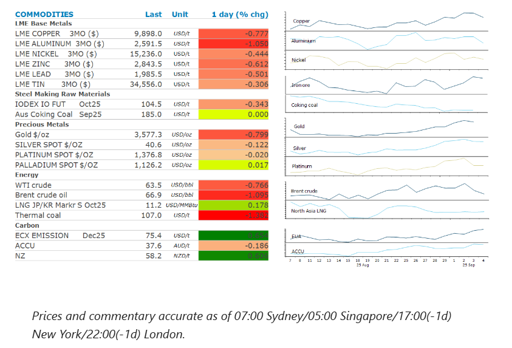
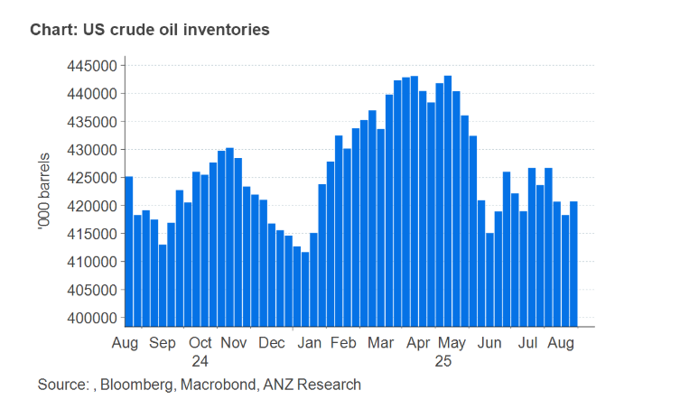

# Oil falls amid concerns of higher OPEC supply

**Date:** September 05, 2025  
**Publisher:** Breakwave Advisors | **Category:** Market Insights  
**Original URL:** [https://www.breakwaveadvisors.com/insights/2025/9/5/oil-falls-amid-concerns-of-higher-opec-supply](https://www.breakwaveadvisors.com/insights/2025/9/5/oil-falls-amid-concerns-of-higher-opec-supply)  

---

Commodity markets pushed lower as a stronger USD weighed on investor appetite. Expectations of further increases in OPEC output pushed oil prices lower.

*By*[*Daniel Hynes*](https://www.linkedin.com/in/dahynes/)

> **Figure 1: Στιγμιότυπο Οθόνης 2025 09 05 111925**  
> **Interactive Data & Source:** [Linkedin](https://www.linkedin.com/newsletters/commodities-wrap-6692196755876012032/?fbclid=IwAR3kiXJqZdxmp9ZcRwBNI7FsBySI-XSC0pfPur1qzjt7OZp7PTE59Tsl1QI) | [Local Asset](file:///C:/Users/Dell/Github/Shipping/corpus/03-breakwave/insights/2025/assets/2025-09-05_oil-falls-amid-concerns-of-higher-opec-supply_img_cea3cf84ceb9ceb3cebcceb9cf8ccf84cf85_448bcdb28cb0.png)

### Market Commentary

**Crude oil**remained under pressure amid concerns of rising OPEC supply. The group is due to meet on Sunday to discuss its current unwinding of voluntary cuts made by eight members in 2024. Russia’s Deputy Prime Minister, Alexander Novak, said the OPEC+ alliance “will look at the current situation as a whole” before deciding. Several delegates told Bloomberg they had yet to decide on how to proceed. However, market expectations are growing that the group will continue to push more barrels into the market, in an effort to gain market share lost to US shale producers in recent years. Sentiment wasn’t helped by a bearish US inventory report. US crude oil stockpiles rose more than expected last week, building by 2,415kbbl according to the Energy Information Administration. They are now at their highest level since early August. Promisingly, gasoline inventories fell by almost 4mbbl to the lowest level since late November as retailers stocked up ahead of the Labor Day holiday. Meanwhile, escalating tensions persist as Ukraine continues to target Russian oil refineries, disrupting Russia’s oil product flows. Russian crude processing fell to 5.09mb/d through 27 August, their lowest since May 2022.

**European natural gas**prices pushed higher, as strikes in France disrupted nuclear power generation. Industrial action by workers at Electricite de France cut as much as 2GW at the nation’s power plants, with some impact also seen on hydropower facilities. For the moment, France’s power exports continued and operations at French LNG import terminals were not affected. However, the market remains sensitive to any risks of supply disruptions or sudden jumps in demand.**North Asian LNG**prices also gained as hot weather continues to boost demand. Kansai Electric Power Co purchased a prompt LNG cargo after high temperatures in parts of Japan drove up electricity demand and led to a drawdown of fuel stockpiles. The blistering heat has already led to the grid operator requesting that transmission companies serving Tokyo and Tohoku suspend or reschedule work on electricity facilities amid forecasts for tight power supply.

**Copper**led the base metals lower. This was exacerbated by concerns of weaker demand in China. Electric vehicle maker, BYD, slashed its sales targets for this year due to intense competition in its home market. The world’s biggest seller of EVs now plans to deliver 4.6m units this year, down 16% from its previous expectation of 5.5m. Demand for copper and other battery metals has been well supported by the EV sector in China in recent years. However, the losses were limited as the market continues to face supply side issues. Codelco said that Chile’s copper production could stagnate at approximately 5.5mt/y as the industry confronts mounting operational challenges.

**Iron ore**futures extended recent gains as recent production restrictions lifted. Steel mills in northern China had been told to reduce operations to reduce pollution as foreign dignitaries arrived for a military parade. Demand should now start to pick up.

**Gold’s**recent rally took a breather as traders await the release of US jobs data tonight. They also took the opportunity to lock in profits after a seven-day rally that was fuelled by strong haven demand and expectations of rate cuts by the Fed.

### Chart of the Day

US crude oil inventories are rebuilding earlier than in previous years following the driving season, suggesting demand is not as strong as originally suspected. This may see OPEC hold back from rising output further on October.

> **Figure 2: Στιγμιότυπο Οθόνης 2025 09 05 112020**  
> **Interactive Data & Source:** [Linkedin](https://www.linkedin.com/newsletters/commodities-wrap-6692196755876012032/?fbclid=IwAR3kiXJqZdxmp9ZcRwBNI7FsBySI-XSC0pfPur1qzjt7OZp7PTE59Tsl1QI) | [Local Asset](file:///C:/Users/Dell/Github/Shipping/corpus/03-breakwave/insights/2025/assets/2025-09-05_oil-falls-amid-concerns-of-higher-opec-supply_img_cea3cf84ceb9ceb3cebcceb9cf8ccf84cf85_82b2c4f2b36a.png)

Data source:[Commodities Wrap](https://www.linkedin.com/newsletters/commodities-wrap-6692196755876012032/?fbclid=IwAR3kiXJqZdxmp9ZcRwBNI7FsBySI-XSC0pfPur1qzjt7OZp7PTE59Tsl1QI)

---

**Tags:** Shipping, Commodities, Markets  
