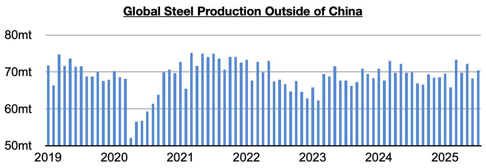
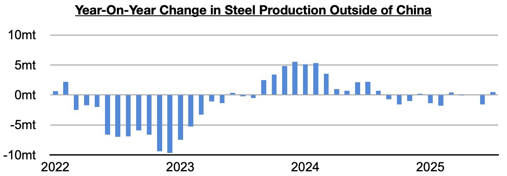
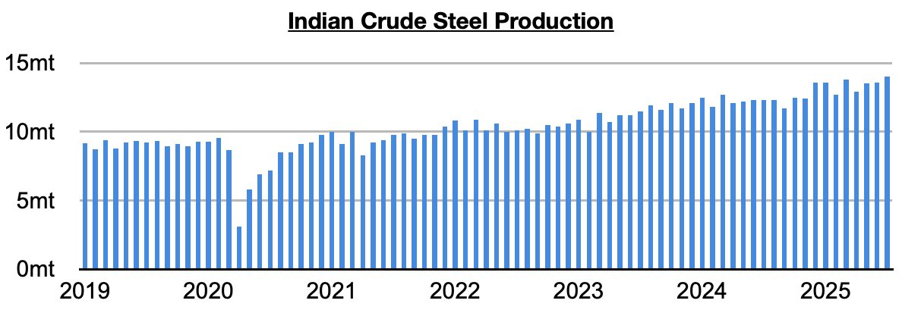

# Return of Steel Production Growth Ex-China, But Only Because of India

**Date:** September 05, 2025  
**Publisher:** Breakwave Advisors | **Category:** Market Insights  
**Original URL:** [https://www.breakwaveadvisors.com/insights/2025/9/5/return-of-steel-production-growth-ex-china-but-only-because-of-india](https://www.breakwaveadvisors.com/insights/2025/9/5/return-of-steel-production-growth-ex-china-but-only-because-of-india)  

---

*By*[*Jeffrey Landsberg*](https://www.linkedin.com/in/jeffrey-landsberg-70ab957/)

As we discussed in Commodore. Research's most recent Weekly Executive Report, global steel production totaled approximately 150.1 million tons in July. This is down month-on-month by 1.3 million tons (-1%) and is down year-on-year by 2.7 million tons (-2%). Steel production outside of China totaled approximately 70.4 million tons. This is up month-on-month by 2.2 million tons (3%) and is up year-on-year by 500,000 tons (1%).

> **Figure 1: Chart 1**  
> [Local Asset](file:///C:/Users/Dell/Github/Shipping/corpus/03-breakwave/insights/2025/assets/2025-09-05_return-of-steel-production-growth-ex-china-but-only-because-of-india_img_chart1_e6733c2c8a9e.jpg)

July has marked only the third time during the last eleven months that steel production ex-China has grown on a year-on-year basis. However, taking India out of the equation, it has contracted on a year-on-year basis during all eleven of these months.

> **Figure 2: Chart 2**  
> [Local Asset](file:///C:/Users/Dell/Github/Shipping/corpus/03-breakwave/insights/2025/assets/2025-09-05_return-of-steel-production-growth-ex-china-but-only-because-of-india_img_chart2_d866b3c0eff9.jpg)

India’s steel production set a new record in July. Indian steel production totaled 14 million tons last month. This is up month-on-month by 400,000 tons (3%) and is up year-on-year by 1.7 million tons (14%). India’s steel production has now grown for twenty-nine straight months.

> **Figure 3: Chart 3**  
> [Local Asset](file:///C:/Users/Dell/Github/Shipping/corpus/03-breakwave/insights/2025/assets/2025-09-05_return-of-steel-production-growth-ex-china-but-only-because-of-india_img_chart3_461281a2ed18.jpg)

---

**Tags:** China, Ironore, Markets  
