# Nigeria’s Comeback: Oil Flows Rise as Production Hits a Record in July

**Date:** September 07, 2025  
**Publisher:** Breakwave Advisors | **Category:** Market Insights  
**Original URL:** [https://www.breakwaveadvisors.com/insights/2025/9/7/nigerias-comeback-oil-flows-rise-as-production-hits-a-record-in-july](https://www.breakwaveadvisors.com/insights/2025/9/7/nigerias-comeback-oil-flows-rise-as-production-hits-a-record-in-july)  

---

### Tanker - Weekly Market Monitor

### Snapshot of Crude and Product Freight Rates, Supply-Demand

### Week 36, 05 Sept, 2025

Nigeria has re-emerged as a key player in global oil markets, with production reaching new heights in July. Output averaged 1.71 million bpd, according to the Nigerian Upstream Petroleum Regulatory Commission (NUPRC), up 9.9% year-on-year.

Terminal performance underlines the recovery. Bonny posted 8.07 million barrels in July, a 13% jump from June, while Forcados edged higher to 9.04 million barrels, up 2.1% month-on-month. Yet, despite the strong momentum, volumes remain short of Nigeria’s 2025 budget benchmark of 2.06 million barrels per day (bpd), underscoring both the progress made and the challenge of sustaining higher output. Export flows reflect the rebound. Dirty oil shipments surged at the end of Q1 and continued into the summer, with France, Spain, and the U.S. remaining the major buyers.

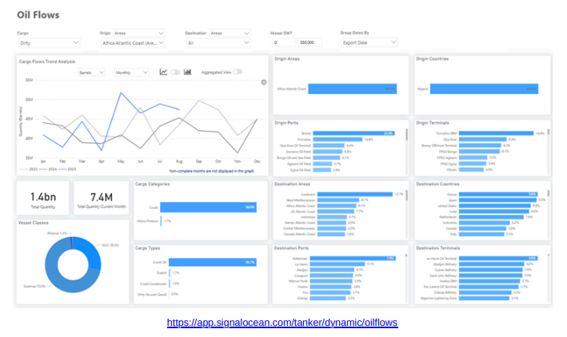

> **Figure 1: Στιγμιότυπο Οθόνης 2025 09 08 005843**  
> **Interactive Data & Source:** [Signal Ocean Platform](https://www.thesignalgroup.com/signal-ocean-platform) | [Local Asset](file:///C:/Users/Dell/Github/Shipping/corpus/03-breakwave/insights/2025/assets/2025-09-07_nigerias-comeback-oil-flows-rise-as-production-hits-a-record-in-july_img_cea3cf84ceb9ceb3cebcceb9cf8ccf84cf85_77eff2d0b872.png)

India has proven to be a significant market. Nigerian exports to India reached a high of over 11 million barrels in March, then decreased to 7 million barrels in August, which is still more than double the levels seen in the same period last year.

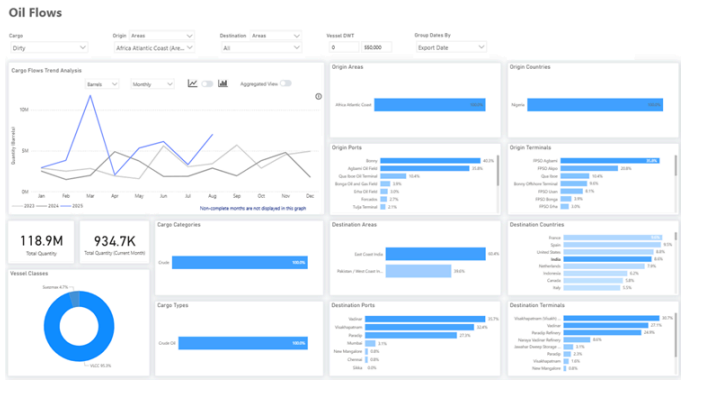

> **Figure 2: Στιγμιότυπο Οθόνης 2025 09 08 005940**  
> **Interactive Data & Source:** [Signal Ocean Platform](https://www.thesignalgroup.com/signal-ocean-platform) | [Local Asset](file:///C:/Users/Dell/Github/Shipping/corpus/03-breakwave/insights/2025/assets/2025-09-07_nigerias-comeback-oil-flows-rise-as-production-hits-a-record-in-july_img_cea3cf84ceb9ceb3cebcceb9cf8ccf84cf85_1eaad355d4a9.png)

One factor behind the shift has been lower buying activity from Indian refiners. Since late Q1, India’s imports of Russian crude dipped by 17% in April and 8% in May, before showing a modest 7% rebound in August.

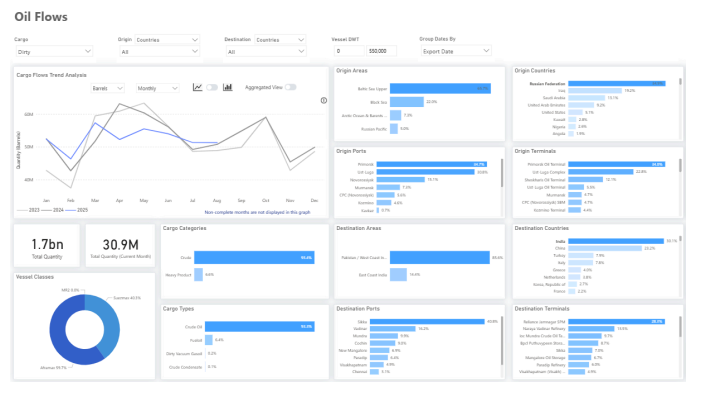

> **Figure 3: Στιγμιότυπο Οθόνης 2025 09 08 005951**  
> **Interactive Data & Source:** [Signal Ocean Platform](https://www.thesignalgroup.com/signal-ocean-platform) | [Local Asset](file:///C:/Users/Dell/Github/Shipping/corpus/03-breakwave/insights/2025/assets/2025-09-07_nigerias-comeback-oil-flows-rise-as-production-hits-a-record-in-july_img_cea3cf84ceb9ceb3cebcceb9cf8ccf84cf85_72fd2f5e0fe2.png)

Russia's refining capacity has been significantly impacted by Ukraine's drone strikes, with approximately 17% disabled across facilities in Syzran, Volgograd, Saratov, Ryazan, and Krasnodar, raising concerns about supply reliability. Further uncertainty stems from U.S. warnings regarding restrictions on India's purchases of Russian oil, which could strengthen Nigeria's position as a more secure alternative supplier.

This situation is already evident in the growth of oil tonne-days. Reduced Russian flows to the Far East have slowed tonne-day growth since late summer, though current levels remain about one-third above the seasonal norm of the past two years. This creates a favorable environment for Nigeria, where the recent July production increase, if sustained, together with shifting global demand dynamics, could enhance its role as a stronger supplier in the months ahead.

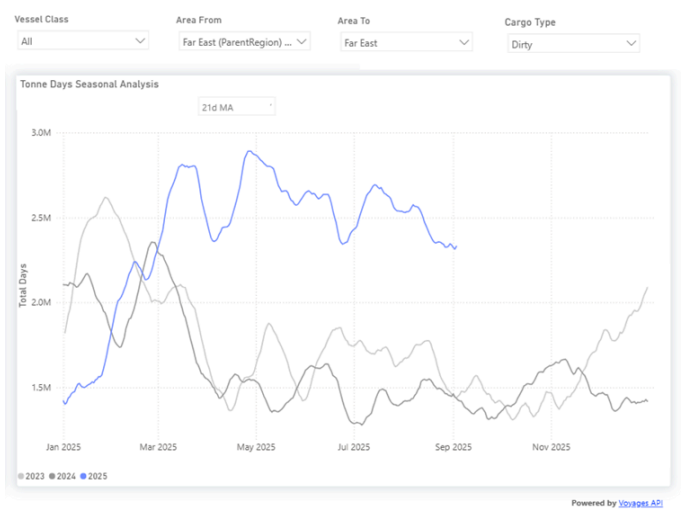

> **Figure 4: Στιγμιότυπο Οθόνης 2025 09 08 010133**  
> **Interactive Data & Source:** [Signal Ocean Platform](https://www.thesignalgroup.com/signal-ocean-platform) | [Local Asset](file:///C:/Users/Dell/Github/Shipping/corpus/03-breakwave/insights/2025/assets/2025-09-07_nigerias-comeback-oil-flows-rise-as-production-hits-a-record-in-july_img_cea3cf84ceb9ceb3cebcceb9cf8ccf84cf85_1e56372d6ce6.png)

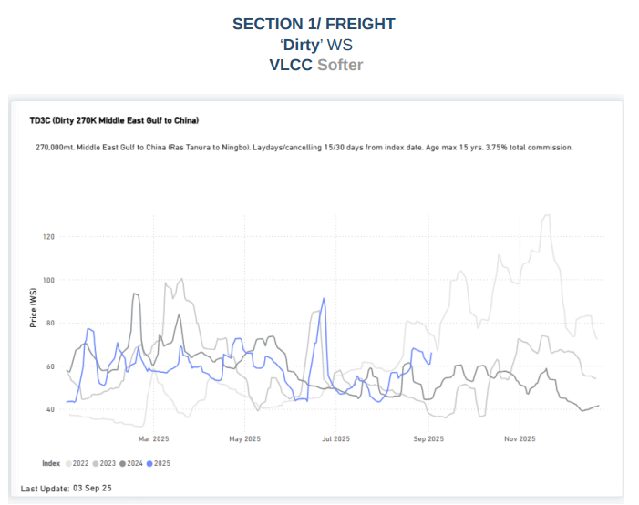

> **Figure 5: Στιγμιότυπο Οθόνης 2025 09 08 010146**  
> **Interactive Data & Source:** [Signal Ocean Platform](https://www.thesignalgroup.com/signal-ocean-platform) | [Local Asset](file:///C:/Users/Dell/Github/Shipping/corpus/03-breakwave/insights/2025/assets/2025-09-07_nigerias-comeback-oil-flows-rise-as-production-hits-a-record-in-july_img_cea3cf84ceb9ceb3cebcceb9cf8ccf84cf85_d9d9bda931e9.png)

Following a summer increase, VLCC freight rates on the MEG-China route have decreased to WS 66. Nevertheless, this still represents a significant 40% rise on a monthly basis.

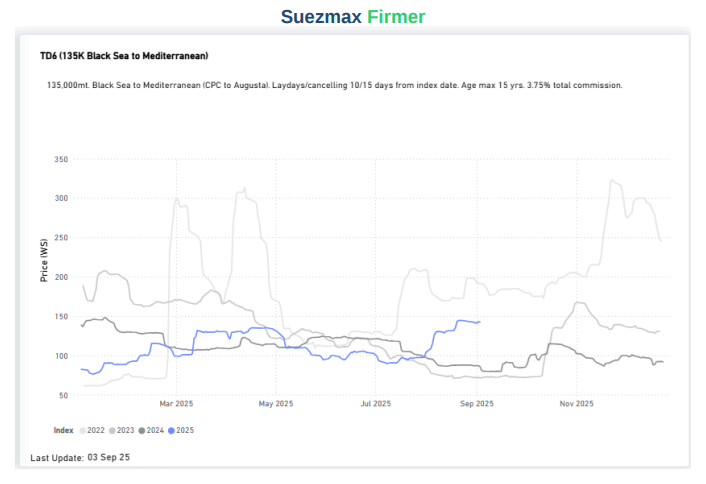

> **Figure 6: Στιγμιότυπο Οθόνης 2025 09 08 010155**  
> **Interactive Data & Source:** [Signal Ocean Platform](https://www.thesignalgroup.com/signal-ocean-platform) | [Local Asset](file:///C:/Users/Dell/Github/Shipping/corpus/03-breakwave/insights/2025/assets/2025-09-07_nigerias-comeback-oil-flows-rise-as-production-hits-a-record-in-july_img_cea3cf84ceb9ceb3cebcceb9cf8ccf84cf85_a305f44a56af.png)

Suezmax rates on the Black Sea – Mediterannean route have surged at WS140, up 30% on a monthly basis.

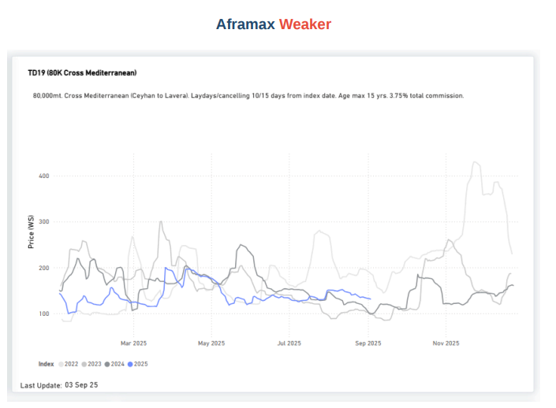

> **Figure 7: Στιγμιότυπο Οθόνης 2025 09 08 010202**  
> **Interactive Data & Source:** [Signal Ocean Platform](https://www.thesignalgroup.com/signal-ocean-platform) | [Local Asset](file:///C:/Users/Dell/Github/Shipping/corpus/03-breakwave/insights/2025/assets/2025-09-07_nigerias-comeback-oil-flows-rise-as-production-hits-a-record-in-july_img_cea3cf84ceb9ceb3cebcceb9cf8ccf84cf85_c0efac902ce8.png)

A downward trend is seen in Aframax rates in the Mediterranean, which have dipped to WS 130, representing a 13% monthly decline.

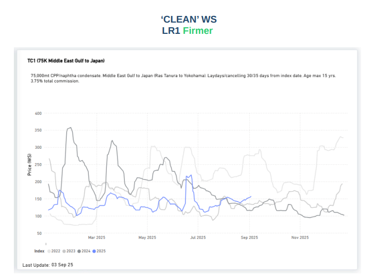

> **Figure 8: Στιγμιότυπο Οθόνης 2025 09 08 010209**  
> **Interactive Data & Source:** [Signal Ocean Platform](https://www.thesignalgroup.com/signal-ocean-platform) | [Local Asset](file:///C:/Users/Dell/Github/Shipping/corpus/03-breakwave/insights/2025/assets/2025-09-07_nigerias-comeback-oil-flows-rise-as-production-hits-a-record-in-july_img_cea3cf84ceb9ceb3cebcceb9cf8ccf84cf85_e4f25e1ab3aa.png)

Freight rates for the AG–Japan route have increased to WS 157. This marks a gradual rise, following a previous surge in mid-June when rates surpassed WS 200.

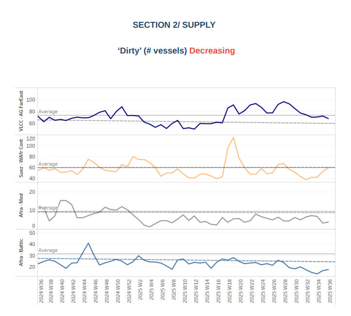

> **Figure 9: Στιγμιότυπο Οθόνης 2025 09 08 010558**  
> **Interactive Data & Source:** [Signal Ocean Platform](https://www.thesignalgroup.com/signal-ocean-platform) | [Local Asset](file:///C:/Users/Dell/Github/Shipping/corpus/03-breakwave/insights/2025/assets/2025-09-07_nigerias-comeback-oil-flows-rise-as-production-hits-a-record-in-july_img_cea3cf84ceb9ceb3cebcceb9cf8ccf84cf85_5b27ee812ff4.png)

The VLCC count at Ras Tanura has reached approximately 68 vessels, marking a decrease of about 28 from the Week 28 peak. Concurrently, Suezmax vessel availability in West Africa remains low, despite signs of an increase, with the vessel count approaching the annual average trend of 59.

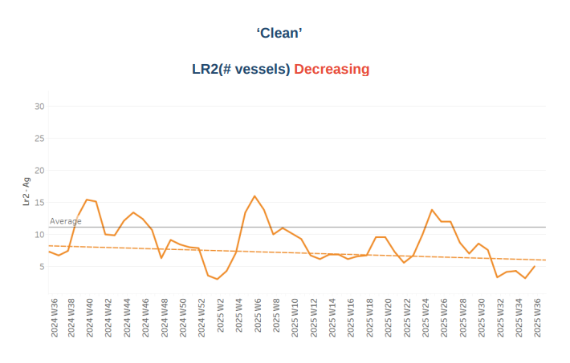

> **Figure 10: Στιγμιότυπο Οθόνης 2025 09 08 010646**  
> **Interactive Data & Source:** [Signal Ocean Platform](https://www.thesignalgroup.com/signal-ocean-platform) | [Local Asset](file:///C:/Users/Dell/Github/Shipping/corpus/03-breakwave/insights/2025/assets/2025-09-07_nigerias-comeback-oil-flows-rise-as-production-hits-a-record-in-july_img_cea3cf84ceb9ceb3cebcceb9cf8ccf84cf85_ba83a4284e1a.png)

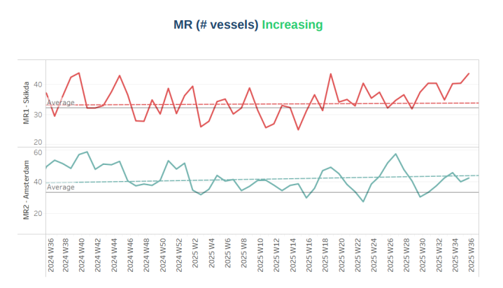

> **Figure 11: Στιγμιότυπο Οθόνης 2025 09 08 010654**  
> **Interactive Data & Source:** [Signal Ocean Platform](https://www.thesignalgroup.com/signal-ocean-platform) | [Local Asset](file:///C:/Users/Dell/Github/Shipping/corpus/03-breakwave/insights/2025/assets/2025-09-07_nigerias-comeback-oil-flows-rise-as-production-hits-a-record-in-july_img_cea3cf84ceb9ceb3cebcceb9cf8ccf84cf85_3a3fc73e5d17.png)

In early September, clean tanker supply for LR2 vessels began to decrease. Specifically, in the Arabian Gulf, LR2 availability is significantly lower than the annual average of 11 vessels. Conversely, MR1 vessel activity at Skikda shows an increasing trend, recently reaching a new peak of 44, up from a low of 35 during week 32.

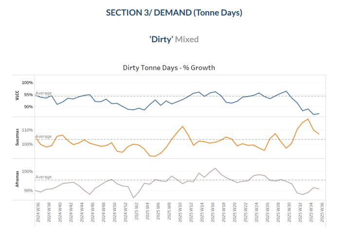

> **Figure 12: Στιγμιότυπο Οθόνης 2025 09 08 010819**  
> **Interactive Data & Source:** [Signal Ocean Platform](https://www.thesignalgroup.com/signal-ocean-platform) | [Local Asset](file:///C:/Users/Dell/Github/Shipping/corpus/03-breakwave/insights/2025/assets/2025-09-07_nigerias-comeback-oil-flows-rise-as-production-hits-a-record-in-july_img_cea3cf84ceb9ceb3cebcceb9cf8ccf84cf85_47fa8319028f.png)

Dirty tonne days: Over the past six weeks, dirty tonne-days in the VLCC segment have remained significantly below the annual average growth rate. Conversely, the Suezmax segment experienced a spike in tonne-days during the summer, which continued into early September. The Aframax segment also saw persistent, albeit weakening, tonneday growth, with levels significantly below the annual average, similar to the VLCC segment.

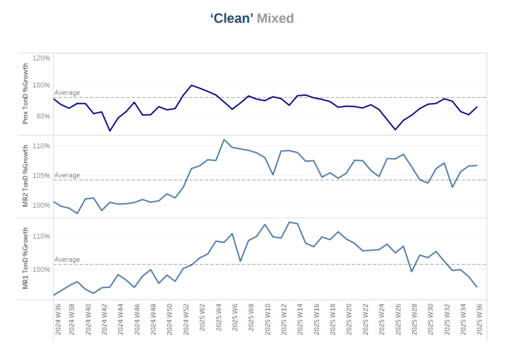

> **Figure 13: Στιγμιότυπο Οθόνης 2025 09 08 010911**  
> **Interactive Data & Source:** [Signal Ocean Platform](https://www.thesignalgroup.com/signal-ocean-platform) | [Local Asset](file:///C:/Users/Dell/Github/Shipping/corpus/03-breakwave/insights/2025/assets/2025-09-07_nigerias-comeback-oil-flows-rise-as-production-hits-a-record-in-july_img_cea3cf84ceb9ceb3cebcceb9cf8ccf84cf85_c199c05d2eb7.png)

Clean tonne days:.In early September, the clean tanker segment's seasonal tonne-day development showed varied trends. Panamax and MR1 tanker levels were below the annual average, while the MR2 segment has indicated stronger growth over the past four weeks.

Data Source:[Signal Ocean Platform](https://www.thesignalgroup.com/signal-ocean-platform)

---

**Tags:** Tankers, Crude, Markets  
