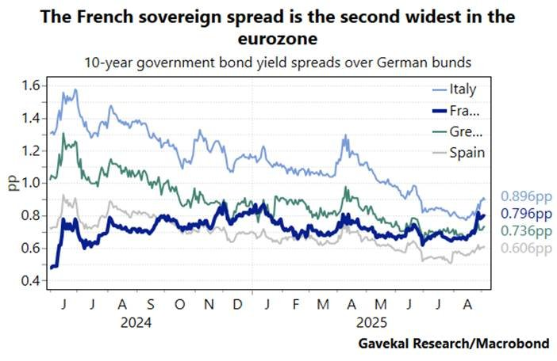

# France, down but not out!

**Date:** September 08, 2025  
**Publisher:** Breakwave Advisors | **Category:** Market Insights  
**Original URL:** [https://www.breakwaveadvisors.com/insights/2025/9/8/france-down-but-not-out](https://www.breakwaveadvisors.com/insights/2025/9/8/france-down-but-not-out)  

---

*By*[*George Lagarias*](https://www.linkedin.com/in/george-lagarias-mba-3baa769/)

The French PM Francois Bayrou, called for a confidence vote on the 8th of September, on his own minority government. This is a bid to force his opponents, who outnumber him in the National Assembly, to either accept €44bn in spending cuts and tax hikes, or down-vote the government, accepting the economic consequences of fresh political uncertainties at a time when French borrowing spreads have passed Greek and are reaching Italian ones. This is important because, while all borrowing costs are now rising, as a result of the trade war,**France (and the UK for that matter) has been singled out by markets as being problematic.**

> **Figure 1: Market Chart 1**  
> [Local Asset](file:///C:/Users/Dell/Github/Shipping/corpus/03-breakwave/insights/2025/assets/2025-09-08_france-down-but-not-out_img_image002_d4aa3facff00.jpg)

The vote is a political risk, calculated for a “win” or “blame”. Bayrou achieved his lifelong dream of becoming PM, so his legacy would matter to him.

### Why Is There Pressure on French Debt?

There are**four significant pressures**on French borrowing costs, only one of which is internal.

1. **Worries over debt buildup**. This is the only internal factor, and the only one the government can address by cutting spending.
2. **American trade wars,**which are slowing down global growth and putting pressure on US borrowing yields, are then spilling over to borrowing costs across the board.
3. **The stronger Euro**, which puts further economic pain on Europe
4. **The change in the Dutch pension system**(from defined benefit to defined contribution) which is expected to significantly reduce demand for longer-term debt in Europe.

### How Much Will the Vote Matter for Markets?

A fall of the government is likely to increase market volatility and possibly spike French borrowing costs over the short term.

What the vote is more likely to tell us is whether the National Front is eager to seek power now, risking blame for adverse economic outcomes, or whether will it wait for an economic crisis before it seeks a wider mandate.

Nevertheless, we don’t believe that the outcome of the vote will matter significantly over the longer term. At first instance, the ECB will likely step in to avert a fire-sale of French OATs. Beyond that, France is running a deficit of nearly 6%, one of the biggest among developed nations and the biggest among the major European economies. This is double the deficit allowed by the European Stability Pact. At a time when investors are overall worried about the levels of debt and fiscal discipline, such deficits increase borrowing premiums.

### Will France End Up Seeking the Assistance of the Imf?

Likely not. The Fifth Republic has never had to borrow from the IMF, despite the various economic and financial crises in the past.

The European Stability Mechanism (ESM) can intervene to reduce volatility in the bond market.

Additionally, the ECB, led by a French former Finance Minister, can buy French bonds to prevent significant market pressures, the type that usually leads countries to ask for the assistance of the IMF. It has done so for Italy and would likely do so for the Eurozone’s second biggest economy.

### Is Austerity a Likely Outcome?

Yes. The ECB, as a lender of the last resort, can only prevent short-term market pressures from metastasising into a fully-fledged economic crisis. It can’t single-handedly finance the French economy, the same way the White House might use the Fed to increase demand for Treasuries and finance the government deficits.

So, in the end, whether the government survives or not is of lesser importance. This is a political issue as to “who gets the immediate blame” that will likely grab headlines and be used to explain market volatility.

The larger issue is that pension reforms and austerity are very likely outcomes if France is to get its house in order.

Governments have two options.

1. Blame foreign creditors as the source of austerity (like Greece did), which may save the political system, but erodes faith in Europe. Greece in particular, saw power passed on to a populist government, which was forced to implement very harsh austerity measures, in essence disintegrating itself before passing the torch back to the normal political establishment.
2. Accept the blame, impose austerity and then assume the political cost.

Given the Greek experience, we would think that option A is the likeliest. In both instances, some sort of political turbulence that could challenge markets may feature in the next chapters of French politics.

### What Should Investors Know?

Some market volatility is probable if the Bayrou government falls, a likely scenario. However, the previous experience with Greece, Italy, Spain, Portugal and Ireland will serve as a “how to” guide to prevent the situation from becoming problematic. We think that European mechanisms are very experienced in dealing with debt volatility issues, and a lot of the potential volatility is likely to be mitigated.

The Euro is likely to weaken, which would be good news for European businesses already suffering from tariffs and Euro appreciation vs the Dollar. Some volatility in the equity market may be in order, but swift responses from European mechanisms should mitigate that.

Having said that, political uncertainty will likely be prolonged, as balancing the budget without a strong government mandate, in the midst of international bond market turmoil, can prove especially tricky.

Political uncertainty doesn’t need to translate to market volatility. Nevertheless, it can translate into French economic volatility if protests spiral. In previous instances (“Yellow Jackets”), we saw the economy slow down as a result of extended disturbances.

---

**Tags:** Macro, Economy, Markets  
