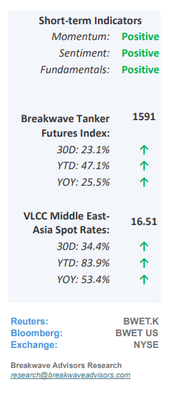
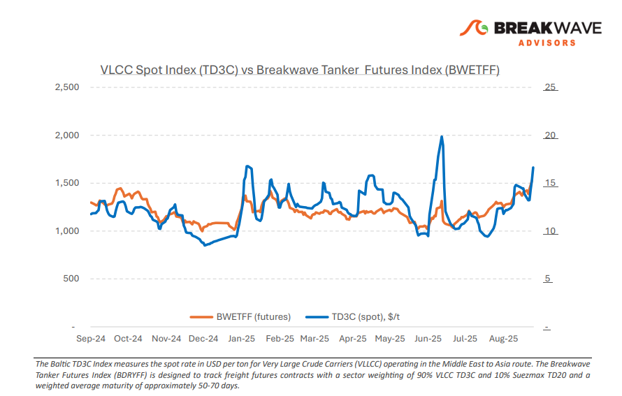
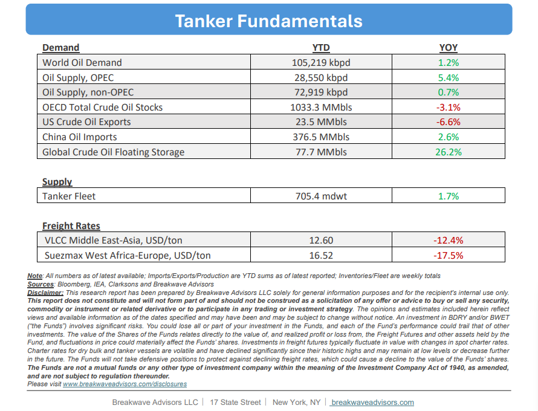

# Breakwave Bi-Weekly Tanker Report - September 9, 2025

**Date:** September 09, 2025  
**Publisher:** Breakwave Advisors | **Category:** Market Insights  
**Original URL:** [https://www.breakwaveadvisors.com/insights/202599wetreport547-oik5847](https://www.breakwaveadvisors.com/insights/202599wetreport547-oik5847)  

---

•**VLCC Strength Continues on the Back of Solid Oil Flows**– VLCC spot rates entered September on their**strongest footing**since the earlier June surge, with uncovered third-decade stems in the East again driving**heightened activity**and pushing AG-East rates higher.**Chinese stockpiling**continues to provide support, while charterers face resistance as owners maintain a firm stance amid a tightening tonnage list. Rates for VLCCs moved sharply higher both East and West of Suez. The tonnage lists remain constrained, and incremental Nigerian and Iraqi volumes are creating additional employment opportunities. Despite increasing ballasting tonnage from the East entering the market,**charterers are finding it difficult to cap**gains in the Atlantic as owners push for higher returns. For now, VLCC freight is supported by uncovered September stems and a tight tonnage list, but the sustainability of this strength into Q4 will depend on October program activity and the pace at which available tonnage replenishes. Furthermore,**Asia’s**import**appetite**remains**critical**, particularly regarding China’s strategic stockpiling, currently estimated at more than half a million barrels per day. This development continues to be a**wild card**for the tanker market but also across the oil markets as core oil demand is not currently growing to the same extend as the recent oil supply increases and flow**distortion**from**Chinese stockpiling**remains an issue.

> **Figure 1: Στιγμιότυπο Οθόνης 2025 09 09 101702**  
> [Local Asset](file:///C:/Users/Dell/Github/Shipping/corpus/03-breakwave/insights/2025/assets/2025-09-09_202599wetreport547-oik5847_img_cea3cf84ceb9ceb3cebcceb9cf8ccf84cf85_b6592a416a7d.png)

•**OPEC+ Add More Barrels into the Market, Tankers to Benefit**– OPEC+ has**continued**its monthly production**increases**, adding another 137,000 barrels per day in October. Although most member states are at or near their production limits, Saudi Arabia and the United Arab Emirates remain the two countries with sufficient spare capacity to raise output further. With approximately 2.5 million barrels per day of new production added over the past year, the oil market appears to be undergoing a**strategic shift**: OPEC+ seems prepared to pursue**market share**even if it means weaker**price control,**a stance not widely observed in the past decade. With oil prices hovering in the low $60s per barrel, U.S. shale oil, characterized by higher breakeven levels relative to many other regions, becomes the focal point of this strategy. For the**tanker market**, the notable volume increase and the long-haul nature of these cargos suggest that OPEC+’s approach could**sustain robust tanker rates**in the near term, particularly through the traditionally strong fourth quarter.

•**Our Long-term View**– The tanker market is recovering from a long period of staggered rates as the growth in new vessel supply shrinks while oil demand remains elevated in line with the global economy. A historically low orderbook combined with favorable shifting trade patterns should continue to support increased spot rate volatility, which combined with the ongoing geopolitical turmoil, should sustain freight rates in the medium to long term.

> **Figure 2: Στιγμιότυπο Οθόνης 2025 09 09 091119**  
> [Local Asset](file:///C:/Users/Dell/Github/Shipping/corpus/03-breakwave/insights/2025/assets/2025-09-09_202599wetreport547-oik5847_img_cea3cf84ceb9ceb3cebcceb9cf8ccf84cf85_90673c92b187.png)

> **Figure 3: Στιγμιότυπο Οθόνης 2025 09 09 101714**  
> [Local Asset](file:///C:/Users/Dell/Github/Shipping/corpus/03-breakwave/insights/2025/assets/2025-09-09_202599wetreport547-oik5847_img_cea3cf84ceb9ceb3cebcceb9cf8ccf84cf85_122eae3b7a7b.png)

### Subscribe:
