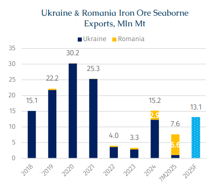
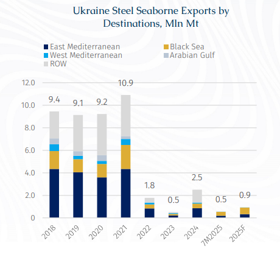

# Ukraine Ferrous Export Flux – Ups and Downs

**Date:** September 11, 2025  
**Publisher:** Breakwave Advisors | **Category:** Market Insights  
**Original URL:** [https://www.breakwaveadvisors.com/insights/2025/9/10/ukraine-ferrous-export-flux-ups-and-downs](https://www.breakwaveadvisors.com/insights/2025/9/10/ukraine-ferrous-export-flux-ups-and-downs)  

---

> **Figure 1: Rgb Color Brs Shipbrokers Monogram Logo**  
> [Local Asset](file:///C:/Users/Dell/Github/Shipping/corpus/03-breakwave/insights/2025/assets/2025-09-11_ukraine-ferrous-export-flux-ups-and-downs_img_rgb-color-brs-shipbrokers-monogram-l_ee79606c8e74.png)

Ukraine’s dry bulk exports, particularly through the Black Sea, continue to encounter headwinds both domestically and internationally. For shipping, these political flashpoints translate directly into risks over the security of the Black Sea corridor, higher insurance premiums, and potential diversions through EU ports such as Constanta or Sulina. Recently, the Kyiv Independent reported that Russia has ordered ports in the occupied cities of Mariupol and Berdiansk in southern Ukraine to be opened up to international ships. Against this backdrop of political theatre and market strain, it is worth taking stock of recent developments and assessing what lies ahead.

Traditionally, Ukraine’s reputation as the “Breadbasket of Europe” has led dry bulk and geared operators to focus primarily on the country’s grain exports, particularly corn and wheat. These cargoes typically move on sub-Cape bulkers, reflecting the smaller parcel sizes and short-haul routes to Mediterranean and European ports. However, iron ore remains a key, if unheralded, export, forming the second pillar of Ukraine’s dry bulk trade, while steel loadings come in a distant third place.

> **Figure 2: Στιγμιότυπο Οθόνης 2025 09 10 120256**  
> [Local Asset](file:///C:/Users/Dell/Github/Shipping/corpus/03-breakwave/insights/2025/assets/2025-09-11_ukraine-ferrous-export-flux-ups-and-downs_img_cea3cf84ceb9ceb3cebcceb9cf8ccf84cf85_9e34101ba1b7.png)

Iron Ore - For much of the past decade, Ukraine ranked among the world’s top 10 iron ore producers and exporters. This was despite Russia’s annexation of Crimea in March 2015, which cost Ukraine the Kerch iron ore basin containing about 14% of its reserves, along with direct access to Crimean ports. As a result, exports were rerouted through Pivdennyi and Odessa, adding pressure to already congested facilities. By 2020, Ukraine was the seventh largest producer and the fifth largest exporter globally, with roughly 85% of volumes shipped to China on Capesizes, thereby accounting for around 3% of total seaborne iron ore exports.

Nonetheless, Ukraine’s iron ore sector has faced major disruptions since Russia’s invasion in February 2022, with exports peaking at 30.2 mln mt in 2020 before collapsing to just 4.0 mln mt in 2022, according to AXSMarine data. The operations of key producers in the Donetsk region were hit, including Metinvest, the country’s largest miner, which runs several ore enrichment facilities in the area. By 2024, exports had partially recovered to 15.2 mln mt, supported by the establishment of a “safe maritime corridor” in the Black Sea that allowed commercial shipping to resume. At the same time, Romania emerged as a critical logistics hub for routing Ukrainian iron ore to international markets via the port of Sulina.

The rebound in Capesize iron ore shipments from the Black Sea in 2024 provided a much-needed boost to ton-miles for the segment, helping lift C5TC rates from $16,389/day in 2023 to $22,593/day in 2024. While much of the credit was directed toward Guinean and Brazilian ore for driving last year’s rally, Ukrainian stems also played a meaningful role. However, looking ahead the sustainability of this upward trend appears uncertain, given the ongoing turbulence stemming from the war.

Taxes on Ukrainian miners have been hiking consistently over recent quarters to provide much-needed funds to the cash-strapped government. The tax authorities’ non-refund of value added tax (VAT) on exported products has led to financial hurdles for a number of companies which have accordingly curbed output. For instance, in March 2025, the Kryvyi Rih Iron Ore Plant (KZRK), the country’s largest producer of sinter ore, was shut following the destruction of the Mariupol steel mills by Russia while its cashflow was aggravated by a delay in the refund of VAT by the government. In May 2025, Ferrexpo, a large producer of high-grade, low alumina (>65 % Fe) iron ore pellets used to reduce carbon emissions in the Chinese steel industry, announced it was shutting two pelletizing lines due to the same issues with VAT refunds.

Another notable example is the idling of Ingulets Mining and Processing Plant (Ingulets GOK, part of Metinvest) in summer 2024. According to the GMK Center, the main reasons for this included high electricity costs and delivery charges, elevated railway tariffs for transporting products to port, which in US Dollar terms are 1.5 times higher than across 2019-21. Meanwhile, port dues more than double those at European ports. To add salt to injury, electricity costs are soaring. For example, in June 2024, Ukraine’s Energy Ministry reported that electricity tariffs for households were set at 4.32 hryvnias ($0.107) per kilowatt-hour until 30 April 2025, up from the previous rate of 2.64 hryvnias. This reflects war-related damage to power generation infrastructure.

Concurrently, the decline in global iron ore prices, combined with high logistics costs for Ukrainian producers, has compounded the challenges faced by iron ore miners. For the Ukrainian economy, a reduction in iron ore exports not only reduces foreign exchange revenues and weakens support for the hryvnia, but also leads to a drop in tax receipts.

It is also worth highlighting that Ukrainian iron ore loadings via Romania in the first seven months of 2025 have already reached 6.6 mln mt, surpassing the full-year 2024 figure of 2.9 mln mt, underscoring the difficult conditions confronting Ukrainian exports.

> **Figure 3: Στιγμιότυπο Οθόνης 2025 09 10 120308**  
> [Local Asset](file:///C:/Users/Dell/Github/Shipping/corpus/03-breakwave/insights/2025/assets/2025-09-11_ukraine-ferrous-export-flux-ups-and-downs_img_cea3cf84ceb9ceb3cebcceb9cf8ccf84cf85_e1fdbe80dd3a.png)

Steel – similar to iron ore, Ukrainian seaborne steel exports have fallen from 10.9 mln mt in 2021 to at historical low of 0.5 mln mt in 2023 and remained relatively flatlined thereafter. Beside the above-mentioned woes, steel is facing stiff competition from China. Historically, most steel (circa 60-70%) is exported to short-haul destinations, notably the Mediterranean, Black Sea and Arabian Gulf.

Over the past few years, Chinese steel has made massive inroads into international markets. For instance, across 2021-24, Chinese shipments to the Mediterranean (2.64 to 5.06 mln mt), Black Sea (0.85 to 2.38 mln mt) and Arabian Gulf (2.62 to 7.92 mln mt) ports, rose by circa 92%, 180% and 202%, respectively. While this development has been a net-benefit to geared bulkers, in the form of increased ton miles and higher utilization due to reduced need for ballast legs, this had no doubt pressured Ukraine.

Looking ahead, Ukraine’s ferrous export prospects should face headwinds for as long as the war continues and supports production costs across nearly every aspect of the value chain. Under the current operating environment, this is likely to slow down or halt new iron ore projects from coming online. Furthermore, considering that the Simandou project is due to deliver its first cargo by the end of this year, iagw & ucae basis, this should prove to be another headwind to Ukraine as well as for other suppliers in the Atlantic.

Complicating matters further is the structural compression in demand for both Ukrainian iron ore and steel. China, historically Ukraine’s largest iron ore buyer, is simultaneously emerging as a top competitor in the downstream steel sector. For context, Chinese and Japanese steel exports on bulkers stood at 38.6 mln mt and 31.8 mln mt, respectively, in 2018. By 2024, China’s exports had surged to 68 mln mt and are likely to exceed 70 mln mt by end-2025. Meanwhile, Japan, a traditional steel stalwart, has stagnated at the low- to mid-28 mln mt range from 2022 to 2024.

---

**Tags:** Ironore, Drybulk, Shipping  
