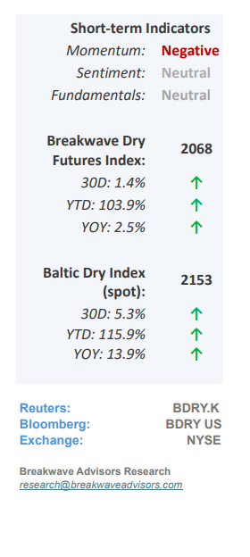
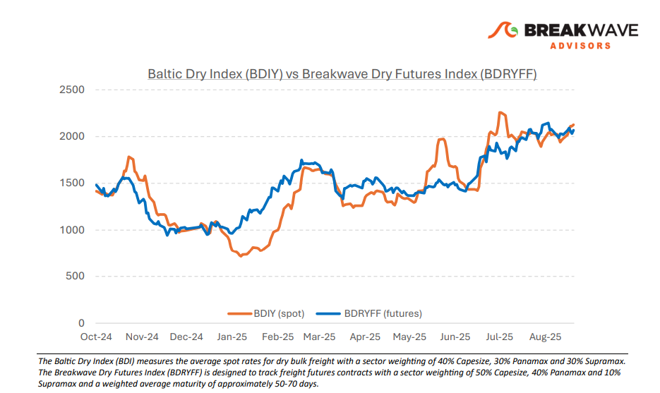
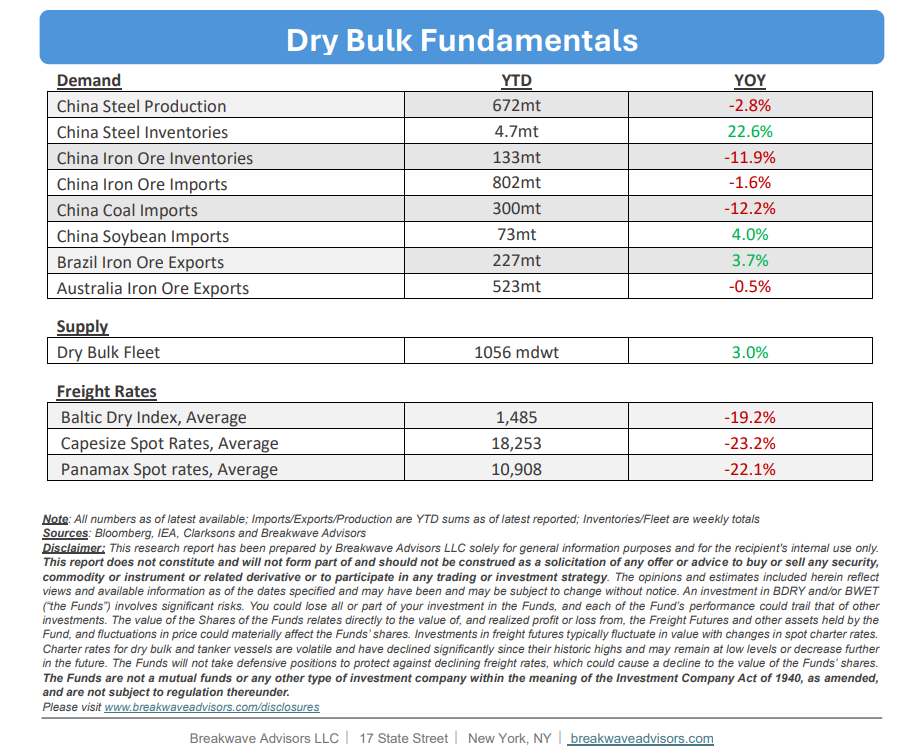

# Breakwave Bi-Weekly Dry Bulk Report - September 16, 2025

**Date:** September 16, 2025  
**Publisher:** Breakwave Advisors | **Category:** Market Insights  
**Original URL:** [https://www.breakwaveadvisors.com/insights/2025916db-5cnlk547](https://www.breakwaveadvisors.com/insights/2025916db-5cnlk547)  

---

•**Spot Indices Stabilize at Elevated Levels with Q4 in Sight**– The recent push in spot dry bulk indices that lifted the market to**relatively high levels**seem at first sight to have run its course. Nonetheless, we continue to observe a well-supported spot market as we approach the**seasonally strong fourth quarter**. While it is true that freight spot rates rarely remain static, we believe there is real potential for an even**higher move in rates**, which we view as outweighing the near-term risk of lower average rates. Consequently, we expect the seasonal push that has characterized this market recently to persist, with**spot rates moving higher for the remainder of September:**In six of the last seven years, Capesize spot rates have risen in the latter part of September, with an average increase of approximately 5,000. At present,**futures are pricing only a modest uptick**. This suggests a**favorable risk-reward**balance for maintaining a positive outlook on spot rates. While volatility is inherent in shipping markets, we anticipate that average rates over the next few months will exceed the current futures curve, particularly for the large Capesize class. Smaller vessel sizes may encounter headwinds due to weaker US grain exports this year, but we see**little reason for a steep correction**as long as Capesize rates remain firm.

> **Figure 1: Cea3cf84ceb9ceb3cebcceb9cf8ccf84cf85**  
> [Local Asset](file:///C:/Users/Dell/Github/Shipping/corpus/03-breakwave/insights/2025/assets/2025-09-16_2025916db-5cnlk547_img_cea3cf84ceb9ceb3cebcceb9cf8ccf84cf85_85e1e9e8e0e1.png)

•**Iron Ore Prices Flattish Despite Negative Chinese Data**– Despite**another weak economic report from China**, showing a continued decline in housing prices, weaker-than-expected industrial production and fixed asset investment, and a third consecutive monthly drop in steel output, iron ore prices remain above the $100/ton mark. Real assets such as metals have recently rallied on the back of increased risk appetite and inflation concerns, and iron ore appears to have participated in this broader trend. Nevertheless, the**fundamentals**surrounding iron ore remain**challenging**. China accounts for the vast majority of global iron ore demand, so without a meaningful improvement in China’s steel fundamentals, upside for iron ore is limited. With**more supply**entering the market,**tightening**steel-production**capacity**, and the potential for a broader economic slowdown, we remain cautious on iron ore price development in both the near and medium term.

•**Our Long-term View**– The last few years have been characterized by increased geopolitical uncertainty. Going forward, we expect such events to continue to affect global trade and have a meaningful impact on effective vessel supply. Combined with the potential for a multi-year cyclical rebound in China’s economic activity following the recent economic turmoil, dry bulk shipping should experience higher volatility on top of a secular tightness driven by stable bulk commodity demand and a slower fleet growth owing to a relatively low orderbook.

> **Figure 2: Στιγμιότυπο Οθόνης 2025 09 16 084326**  
> [Local Asset](file:///C:/Users/Dell/Github/Shipping/corpus/03-breakwave/insights/2025/assets/2025-09-16_2025916db-5cnlk547_img_cea3cf84ceb9ceb3cebcceb9cf8ccf84cf85_ef89105b1443.png)

> **Figure 3: Στιγμιότυπο Οθόνης 2025 09 16 084339**  
> [Local Asset](file:///C:/Users/Dell/Github/Shipping/corpus/03-breakwave/insights/2025/assets/2025-09-16_2025916db-5cnlk547_img_cea3cf84ceb9ceb3cebcceb9cf8ccf84cf85_a8e1ea316a9b.png)

### Subscribe:
