# Iron Ore Shipments to China are gaining stronger momentum

**Date:** September 16, 2025  
**Publisher:** Breakwave Advisors | **Category:** Market Insights  
**Original URL:** [https://www.breakwaveadvisors.com/insights/2025/9/16/iron-ore-shipments-to-china-are-gaining-stronger-momentum](https://www.breakwaveadvisors.com/insights/2025/9/16/iron-ore-shipments-to-china-are-gaining-stronger-momentum)  

---

**WEEKLY DRY MARKET MONITOR
Spot Rates | Supply-Demand Trends | Port Congestion Overview**

### Week 37, 2025 | Date: Sept 11, 2025

### Chart of the Week: Iron Ore Shipments to China Are Gaining Stronger Momentum

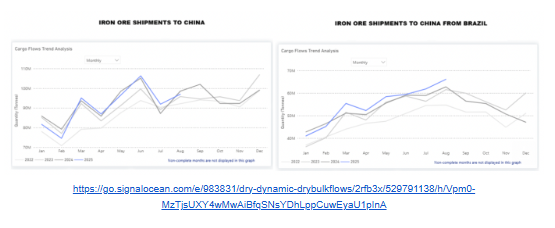

> **Figure 1: Στιγμιότυπο Οθόνης 2025 09 16 142654**  
> **Interactive Data & Source:** [Signal Ocean Platform](https://www.thesignalgroup.com/signal-ocean-platform) | [Local Asset](file:///C:/Users/Dell/Github/Shipping/corpus/03-breakwave/insights/2025/assets/2025-09-16_iron-ore-shipments-to-china-are-gaining-stronger-momentum_img_cea3cf84ceb9ceb3cebcceb9cf8ccf84cf85_6face6182db5.png)

Iron ore shipments to China surprisingly strengthened in August, seemingly driven by the drop in iron ore prices and preparations from Chinese mills for a traditional summer pickup. Brazilian exports, in particular, stood out: shipments increased by 7% month-over-month, exceeding August 2024 levels by roughly 3 million tons, marking the highest monthly total for 2025 as shown in the chart. The recent upward trend in iron ore imports has already started to be reflected in the growth of Capesize iron ore days, while whether Chinese iron ore imports will sustain excess levels of 100 Mt will be highly dependent on prices and port inventories.

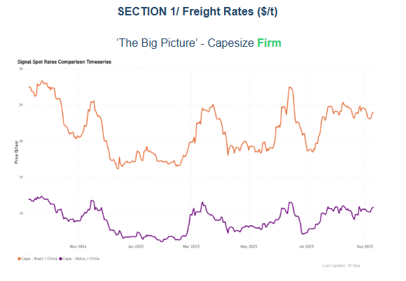

> **Figure 2: Στιγμιότυπο Οθόνης 2025 09 16 142741**  
> **Interactive Data & Source:** [Signal Ocean Platform](https://www.thesignalgroup.com/signal-ocean-platform) | [Local Asset](file:///C:/Users/Dell/Github/Shipping/corpus/03-breakwave/insights/2025/assets/2025-09-16_iron-ore-shipments-to-china-are-gaining-stronger-momentum_img_cea3cf84ceb9ceb3cebcceb9cf8ccf84cf85_ed2b88a00dd7.png)

In early September, both the C3 and C5 routes are maintaining strong support levels, with current rates at $24/ton for Brazil–China and nearly $11/ton for Australia–China. This positive sentiment appears to be driven by demand, as the daily loaded volume on the C5 route has significantly exceeded the 2M mt demand benchmark, while the C3 route is just above 1M mt. From a demand perspective, market expectations for the C5 route are more bullish regarding the absorption of ballasters compared to the C3 route.

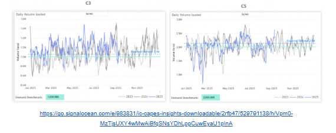

> **Figure 3: Στιγμιότυπο Οθόνης 2025 09 16 142823**  
> **Interactive Data & Source:** [Signal Ocean Platform](https://www.thesignalgroup.com/signal-ocean-platform) | [Local Asset](file:///C:/Users/Dell/Github/Shipping/corpus/03-breakwave/insights/2025/assets/2025-09-16_iron-ore-shipments-to-china-are-gaining-stronger-momentum_img_cea3cf84ceb9ceb3cebcceb9cf8ccf84cf85_69386696cfcf.png)

Panamax - ECSA / Far East | USG / China**Firm**

**Panamax**spot rates for East Coast South America (ECSA) and US Gulf (USG) to Far East routes have firmed up after a softer trend last week. Prices from ECSA to the Far East are now 7% higher than the previous month. This positive sentiment is supported by a continuous drop in the number of vessels ballasting to ECSA and steady demand.

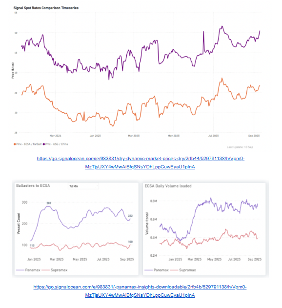

> **Figure 4: Στιγμιότυπο Οθόνης 2025 09 16 142918**  
> **Interactive Data & Source:** [Signal Ocean Platform](https://www.thesignalgroup.com/signal-ocean-platform) | [Local Asset](file:///C:/Users/Dell/Github/Shipping/corpus/03-breakwave/insights/2025/assets/2025-09-16_iron-ore-shipments-to-china-are-gaining-stronger-momentum_img_cea3cf84ceb9ceb3cebcceb9cf8ccf84cf85_1913365836c8.png)

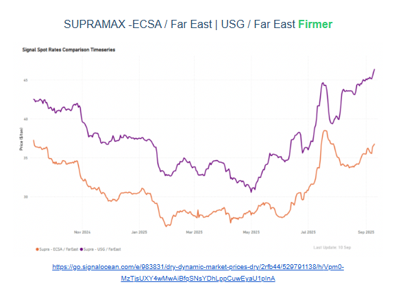

> **Figure 5: Στιγμιότυπο Οθόνης 2025 09 16 142925**  
> **Interactive Data & Source:** [Signal Ocean Platform](https://www.thesignalgroup.com/signal-ocean-platform) | [Local Asset](file:///C:/Users/Dell/Github/Shipping/corpus/03-breakwave/insights/2025/assets/2025-09-16_iron-ore-shipments-to-china-are-gaining-stronger-momentum_img_cea3cf84ceb9ceb3cebcceb9cf8ccf84cf85_78adc5aeef3c.png)

**Supramax**spot rates experienced a steady increase in the East Coast South America (ECSA) to the Far East, reaching $37/tonne, an 8% increase from the prior month. The US Gulf (USG) to Far East route also saw gains, reaching $44/tonne, up 7% monthly. This continued strength since July is linked to a consistent decline in supramax vessel supply to the USG/USEC, with counts now around 80, compared to over 100 in early June.

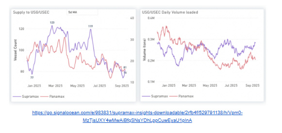

> **Figure 6: Στιγμιότυπο Οθόνης 2025 09 16 143026**  
> **Interactive Data & Source:** [Signal Ocean Platform](https://www.thesignalgroup.com/signal-ocean-platform) | [Local Asset](file:///C:/Users/Dell/Github/Shipping/corpus/03-breakwave/insights/2025/assets/2025-09-16_iron-ore-shipments-to-china-are-gaining-stronger-momentum_img_cea3cf84ceb9ceb3cebcceb9cf8ccf84cf85_f44bc449cd71.png)

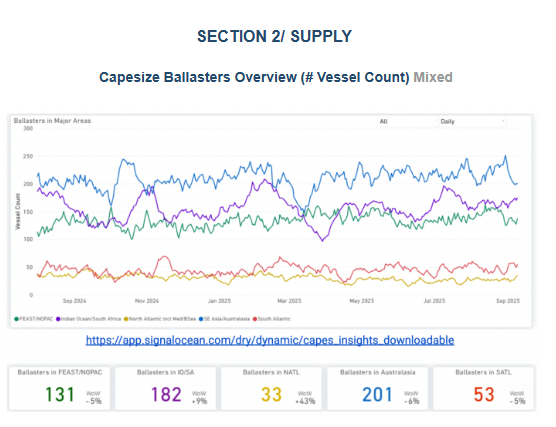

> **Figure 7: Στιγμιότυπο Οθόνης 2025 09 16 143033**  
> **Interactive Data & Source:** [Signal Ocean Platform](https://www.thesignalgroup.com/signal-ocean-platform) | [Local Asset](file:///C:/Users/Dell/Github/Shipping/corpus/03-breakwave/insights/2025/assets/2025-09-16_iron-ore-shipments-to-china-are-gaining-stronger-momentum_img_cea3cf84ceb9ceb3cebcceb9cf8ccf84cf85_644386cbdeef.png)

**Capesize ballasters view**: The South Atlantic saw a decrease of 5%, while the North Atlantic experienced a notable increase of 40%. Conversely, the Pacific region continues to demonstrate better absorption of ballasters, with a 5% decrease in the Far East/NOPAC region and a 6% decrease in Australasia.

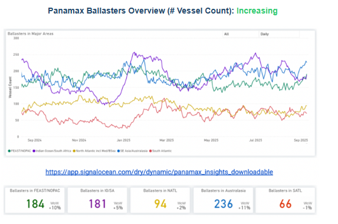

> **Figure 8: Στιγμιότυπο Οθόνης 2025 09 16 143154**  
> **Interactive Data & Source:** [Signal Ocean Platform](https://www.thesignalgroup.com/signal-ocean-platform) | [Local Asset](file:///C:/Users/Dell/Github/Shipping/corpus/03-breakwave/insights/2025/assets/2025-09-16_iron-ore-shipments-to-china-are-gaining-stronger-momentum_img_cea3cf84ceb9ceb3cebcceb9cf8ccf84cf85_4ccfe4acbff5.png)

**Panamax ballasters view**: The number of ballasters significantly increased by 10% in the Pacific, specifically in Australasia and Feast/NOPAC. Conversely, the South Atlantic experienced a slight decrease of 1%, while the North Atlantic maintained levels similar to the previous week.

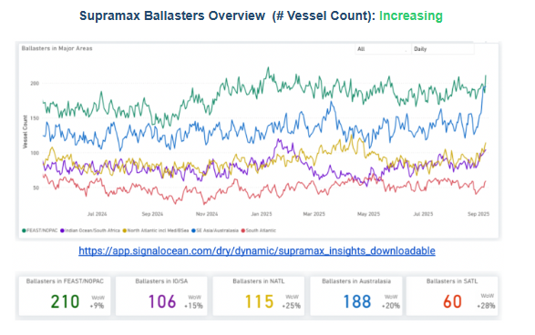

> **Figure 9: Στιγμιότυπο Οθόνης 2025 09 16 143246**  
> **Interactive Data & Source:** [Signal Ocean Platform](https://www.thesignalgroup.com/signal-ocean-platform) | [Local Asset](file:///C:/Users/Dell/Github/Shipping/corpus/03-breakwave/insights/2025/assets/2025-09-16_iron-ore-shipments-to-china-are-gaining-stronger-momentum_img_cea3cf84ceb9ceb3cebcceb9cf8ccf84cf85_ef99aebb6890.png)

**Supramax ballasters view**: Oversupply persists in the Pacific basin, evidenced by a 20% increase in ballasters in Australasia and a 15% increase in the Indian Ocean/South Africa region. The Atlantic also saw a significant rise, with a 28% increase in the South and a 25% increase in the North.

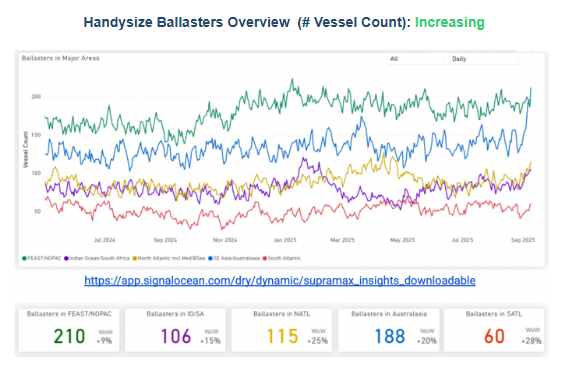

> **Figure 10: Στιγμιότυπο Οθόνης 2025 09 16 143327**  
> **Interactive Data & Source:** [Signal Ocean Platform](https://www.thesignalgroup.com/signal-ocean-platform) | [Local Asset](file:///C:/Users/Dell/Github/Shipping/corpus/03-breakwave/insights/2025/assets/2025-09-16_iron-ore-shipments-to-china-are-gaining-stronger-momentum_img_cea3cf84ceb9ceb3cebcceb9cf8ccf84cf85_6fb8a4b7951c.png)

**Handysize ballasters:**Both the Pacific and Atlantic basins have experienced substantial increases. In the Pacific, the Far East/NOPAC region saw a 22% rise, while Australasia recorded a 25% increase. In the Atlantic, the number of ballasters showed a more significant increase in the South, with a 20% rise, compared to the North.

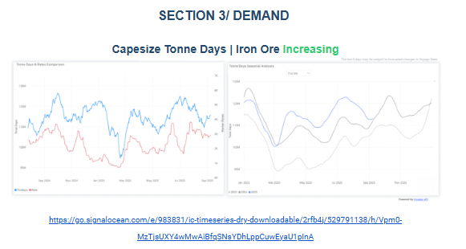

> **Figure 11: Στιγμιότυπο Οθόνης 2025 09 16 143416**  
> **Interactive Data & Source:** [Signal Ocean Platform](https://www.thesignalgroup.com/signal-ocean-platform) | [Local Asset](file:///C:/Users/Dell/Github/Shipping/corpus/03-breakwave/insights/2025/assets/2025-09-16_iron-ore-shipments-to-china-are-gaining-stronger-momentum_img_cea3cf84ceb9ceb3cebcceb9cf8ccf84cf85_825a9cdbb65c.png)

**Tonne-day**growth for Capesize iron ore shipments to the Far East has been stronger this year compared to the past two. After a significant drop in July, it started to recover by late Q3, with August maintaining this strength. This was supported by robust Chinese imports, driven by higher daily hot metal output. Mysteel data shows that average daily hot metal output in August reached 2.41 Mt, remaining steady from July and reflecting a 5% year-on-year increase. A pre-emptive restocking by steel mills in anticipation of a seasonal rise in September steel demand also helped boost August imports. If iron ore prices stay below the critical $100/t threshold, strong Chinese imports and continued tonne-day growth are expected.

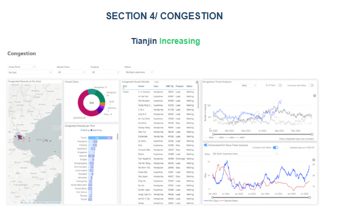

> **Figure 12: Στιγμιότυπο Οθόνης 2025 09 16 143423**  
> **Interactive Data & Source:** [Signal Ocean Platform](https://www.thesignalgroup.com/signal-ocean-platform) | [Local Asset](file:///C:/Users/Dell/Github/Shipping/corpus/03-breakwave/insights/2025/assets/2025-09-16_iron-ore-shipments-to-china-are-gaining-stronger-momentum_img_cea3cf84ceb9ceb3cebcceb9cf8ccf84cf85_fbf94046d345.png)

Tianjin congestion is piling up. From 120+ vessels last week, port delays are now spiking to an estimated 13 days. It remains to be seen whether this will decelerate in the second half of the month, with the Supramax vessel size segment being at the forefront of this congestion.

Data Source:[Signal Ocean Platform](https://www.thesignalgroup.com/signal-ocean-platform)

---

**Tags:** Ironore, Drybulk, Markets  
