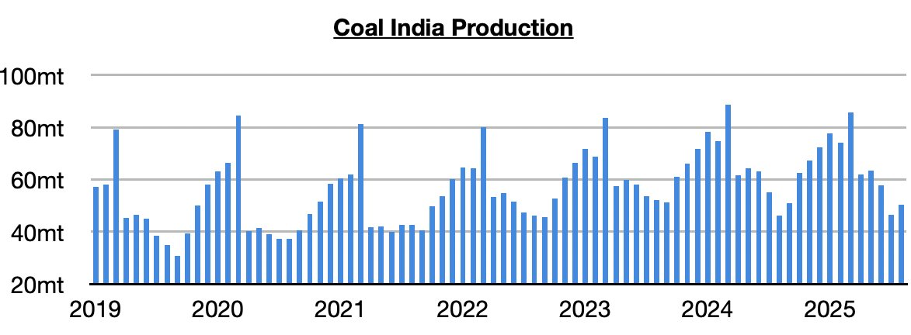
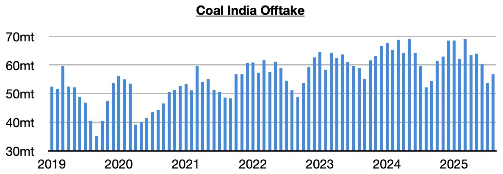
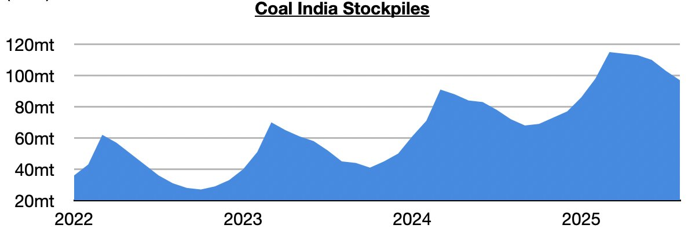

# Sudden Strong Growth in Coal India's Output

**Date:** September 16, 2025  
**Publisher:** Breakwave Advisors | **Category:** Market Insights  
**Original URL:** [https://www.breakwaveadvisors.com/insights/2025/9/16/sudden-strong-growth-in-coal-indias-output](https://www.breakwaveadvisors.com/insights/2025/9/16/sudden-strong-growth-in-coal-indias-output)  

---

*By*[*Jeffrey Landsberg*](https://www.linkedin.com/in/jeffrey-landsberg-70ab957/)

India produced approximately 133.7 billion kilowatt hours of electricity in August. This is unchanged from July and is up year-on-year by 1.5 billion kilowatt hours (1%). While it is a positive that India’s electricity production grew last month, concerning is that seven of the last thirteen months have seen India’s electricity production contract on a year-on-year basis.

> **Figure 1: Chart 1**  
> [Local Asset](file:///C:/Users/Dell/Github/Shipping/corpus/03-breakwave/insights/2025/assets/2025-09-16_sudden-strong-growth-in-coal-indias-output_img_chart1_def2e6a0d0e8.jpg)

Coal-derived electricity generation totaled approximately 104.5 billion kilowatt hours. This is down month-on-month by 1.6 billion kilowatt hours (-2%) and is up year-on-year by only 500 million kilowatt hours (0.5%). India’s coal-derived generation has contracted on a year-on-year basis during eight of the last thirteen months. Prior to the last thirteen months, it had grown on a year-on-year basis for fifteen straight months.

> **Figure 2: Chart 2**  
> [Local Asset](file:///C:/Users/Dell/Github/Shipping/corpus/03-breakwave/insights/2025/assets/2025-09-16_sudden-strong-growth-in-coal-indias-output_img_chart2_637887684bf4.jpg)

Hydropower output totaled approximately 23.5 billion kilowatt hours. This is up month-on-month by 1.9 billion kilowatt hours (9%) and is up year-on-year by 2 billion kilowatt hours (9%). Hydropower output has grown on a year-on-year basis for twelve straight months. Prior to the last twelve months, it had fallen on a year-on-year basis during sixteen of the prior eighteen months. Weakness in India’s economy, combined with the return of growth in hydropower output, continues to act as a headwind on coal-derived electricity generation and demand for coal imports.

> **Figure 3: Chart 3**  
> [Local Asset](file:///C:/Users/Dell/Github/Shipping/corpus/03-breakwave/insights/2025/assets/2025-09-16_sudden-strong-growth-in-coal-indias-output_img_chart3_edfac03c192d.jpg)

---

**Tags:** Coal, Markets, Commodities  
