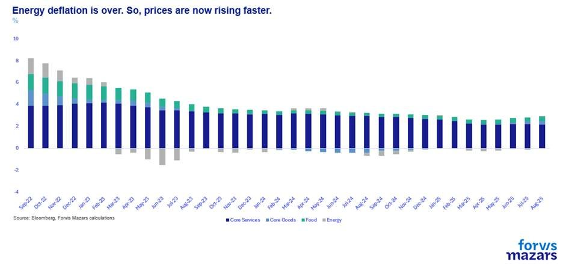
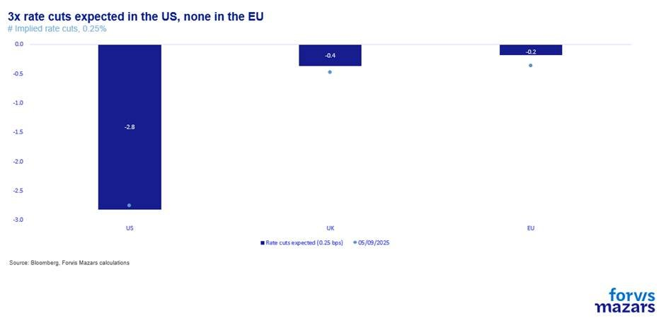

# We shouldn’t fight the Fed. Even if it’s not independent.

**Date:** September 17, 2025  
**Publisher:** Breakwave Advisors | **Category:** Market Insights  
**Original URL:** [https://www.breakwaveadvisors.com/insights/2025/9/17/we-shouldnt-fight-the-fed-even-if-its-not-independent](https://www.breakwaveadvisors.com/insights/2025/9/17/we-shouldnt-fight-the-fed-even-if-its-not-independent)  

---

### The Three Things Investors Should Know This Week

1. **US inflation rose again to 2.9% from 2.7%, increasing pressures on the economy.**
2. **Despite that, markets are now pricing in three rate cuts by the end of the year, a result of rising unemployment and pressures from the White House.**
3. **We believe that, while three cuts may not necessarily be delivered, the Fed is on course to reduce the cost of money. Markets don’t usually care where cheap money comes from, as long as it is available.**

*By*[*George Lagarias*](https://www.linkedin.com/in/george-lagarias-mba-3baa769/)

-----------------------------------

### Summary

*The Fed is expected to cut rates despite inflation edging up, under the twin pressures from a deteriorating jobs market and the White House. What concerns many is not the cuts, is not the cuts themselves but the growing threat to the Fed’s independence. Is the Fed independently assessing rates, or is it doing so under duress? If the central bank yields too much to politics, credibility on inflation could erode, raising long-term borrowing costs and destabilising markets. For investors, near-term cuts may buoy equities and short bonds, but independence risks could weaken long bonds and boost real assets. For businesses, especially unlisted firms, the challenge is coping with inflation through pricing, cost control, or productivity gains—while navigating uncertain policy and political pressures.*

--------------------------

This week, the world’s arguably most important central bank, the US Fed, is almost certain to cut interest rates by 0.25% to 4.25%, as the US central bank begins to focus on the worsening outlook for the US jobs market, rather than the inflation buildup. US inflation rose last week from 2.7% to 2.9% and although it was expected, it has been accelerating for four months.

> **Figure 1: Market Chart 1**  
> [Local Asset](file:///C:/Users/Dell/Github/Shipping/corpus/03-breakwave/insights/2025/assets/2025-09-17_we-shouldnt-fight-the-fed-even-if-its-not-independent_img_image003_99cc71a881b3.jpg)

What is more important is that, following both weaker employment data and presidential pressures on the Fed, recent commentary by Fed officials became more dovish. Bond markets are now pricing in three rate cuts by the end of the year and at least another three by the end of 2026. So, a 1.5% reduction in interest rates to 3%.

> **Figure 2: Market Chart 2**  
> [Local Asset](file:///C:/Users/Dell/Github/Shipping/corpus/03-breakwave/insights/2025/assets/2025-09-17_we-shouldnt-fight-the-fed-even-if-its-not-independent_img_image004_5d187d61229a.jpg)

Is this too much? And should the government really pressure the Fed that much?

William McChesney Martin, Fed Chairman from 1951 to 1970, said in 1955 that the Federal Reserve’s job is “to take away the punch bowl just when the party is getting good.” No government wants the party to stop. Especially one that has launched a global trade war to improve internal growth.

It is becoming clear that the US government wants to exert more influence on the Fed. Their argument is that no institution, independent or not, should have more power than the elected executive in determining fiscal policy. The US is in “a (trade) war” and all hands need to be on deck, no one falling out of line. By hiking rates (or cutting more slowly) as a response to fiscal stimulus, the US just ends up with the same growth and more debt. Economists, on the other hand, are shouting that independent central banks are the pillar of inflation stability. Compromising the Fed’s independence will likely result in higher inflation, endangering the Fed’s two other mandates, employment stability and normalisation of long-term borrowing yields.

The argument, to be sure, cuts both ways. The Fed may be independent, but it is not the independent state of Luxembourg or (quoting our CIO Ben Seager Scott), “an institutional monarchy ruling by divine right”. In recent times, when a few central bankers would decide where the global economy would go, it didn’t always go well with the electorate. If the exec wants a global competition on trade, then independent institutions have no room for counter-policies. On the other hand, inflation destabilised global politics and the economy in the 1970s, and may well do so again. It is the number one economic reason, globally, that may cause governments to be replaced. So “inflation” can also be a very political issue.

Here's the bitter truth, however. Constitutionality is a deep political issue, but a smaller investor concern.**Markets don’t usually care where cheap money comes from, as long as it is available.**When the ECB’s Mario Draghi said, “we will do whatever it takes to preserve the Euro”, no investor was worrying about how this may be violating European constitutions. And when the Fed’s decade and a half of zero interest rate policies and unfettered money printing exacerbated income inequalities and led to a gross asset misallocation focusing just about everyone on one sector (tech), markets didn’t contest it. Nor is anyone contesting China’s low interest rates in a bid to keep local government financing cheap.

### What It Means for Businesses

While Wall Street may not care about the origin of cheap money, Main Street does. This is because it tends to be more impacted by inflation (which in turn can cause government and legislative uncertainty) and less so by stock market rallies. 99.96% of companies are not listed, but they all face the same inflation problems: do they reduce their margins, invest in AI to increase productivity, negotiate with suppliers, cut operating costs, or simply pass on the cost to consumers?

### What It All Means for Investors

We would not necessarily bet that the Fed is going to produce all three cuts until year-end. Inflation is beginning to worry investors. However, we would also adhere to the old adage of “ Not Fighting The Fed”. No matter what the motivations are, the US central bank is now in rate-cutting mode. This usually tends to boost risk assets across the board, especially stocks and shorter-duration bonds. In normal times, higher duration bonds would benefit more than lower duration bonds. However, if the Fed is perceived to be losing its independence, this could have an impact on longer-term bonds (where inflation and debt sustainability worries mostly live), as well as prices for fixed-value assets, like precious metals or other real assets. France’s downgrade from last week, from AA- to A+ by Fitch, should be a warning.

---

**Tags:** Macro, Economy, Markets  
