# Indonesian Coal Flows Gradually Rebound

**Date:** September 18, 2025  
**Publisher:** Breakwave Advisors | **Category:** Market Insights  
**Original URL:** [https://www.breakwaveadvisors.com/insights/2025/9/18/indonesian-coal-flows-gradually-rebound](https://www.breakwaveadvisors.com/insights/2025/9/18/indonesian-coal-flows-gradually-rebound)  

---

**WEEKLY DRY MARKET MONITOR
Spot Rates | Supply-Demand Trends | Port Congestion Overview**

### Week 38, 2025 | Date: Sept 17, 2025

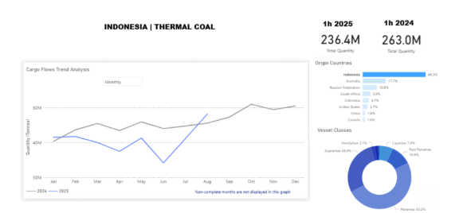

> **Figure 1: Στιγμιότυπο Οθόνης 2025 09 18 155325**  
> **Interactive Data & Source:** [Signal Ocean Platform](https://www.thesignalgroup.com/signal-ocean-platform) | [Local Asset](file:///C:/Users/Dell/Github/Shipping/corpus/03-breakwave/insights/2025/assets/2025-09-18_indonesian-coal-flows-gradually-rebound_img_cea3cf84ceb9ceb3cebcceb9cf8ccf84cf85_84897a9ebbf9.png)

Following a weak start to 2025, Indonesian thermal coal shipments are showing signs of recovery. June marked the lowest monthly volume of the year at around 35 million tonnes, but by August exports had rebounded to nearly 48 million tonnes, surpassing year-ago levels. While first-half flows totaled 236.4 million tonnes, down from 263.0 million tonnes in 1H 2024, the strong August performance suggests some of the earlier contraction may be offset in the second half.

Policy shifts are expected to support this turnaround. In late August, Indonesia removed the obligation for coal and mineral sales to use government benchmark prices as a floor, giving exporters greater flexibility to align with market indices. Taxes and royalties remain benchmark-linked, while September benchmark prices are expected to help Indonesian coal remain competitive against Australian and Russian cargoes.

On the trade policy front, the EU–Indonesia Comprehensive Economic Partnership Agreement (CEPA) is due to be signed in Bali on September 23, a key step in strengthening Indonesia’s trade profile. At the same time, voyage data shows diversification beyond China and India, with the Philippines maintaining steady imports of Indonesian coal. In August, Panamax and Supramax shipments departed from Balikpapan, Taboneo, Tanjung Pemancingan, and Muara Berau, discharging at Sual, Limay, Pagbilao, Mariveles, and Davao. This underscores the Philippines’ role as a consistent outlet, even as its power mix gradually shifts toward LNG.

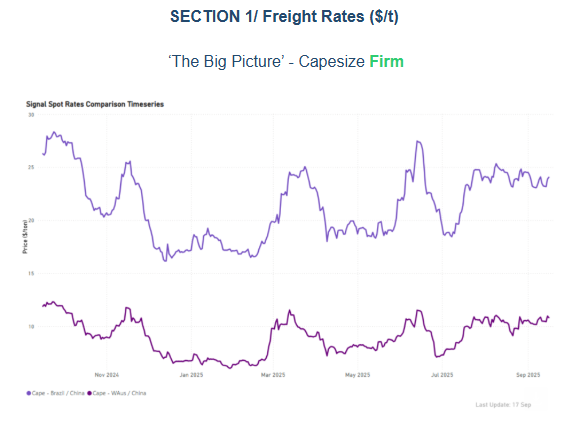

> **Figure 2: Στιγμιότυπο Οθόνης 2025 09 18 155432**  
> **Interactive Data & Source:** [Signal Ocean Platform](https://www.thesignalgroup.com/signal-ocean-platform) | [Local Asset](file:///C:/Users/Dell/Github/Shipping/corpus/03-breakwave/insights/2025/assets/2025-09-18_indonesian-coal-flows-gradually-rebound_img_cea3cf84ceb9ceb3cebcceb9cf8ccf84cf85_1c6cada5d5b6.png)

In the latter half of September, both the C3 and C5 routes are consistently maintaining stronger levels compared to the previous month, backed by robust support from miners' activity. Current rates show little change from the prior week, holding at $24/ton for Brazil–China and nearly $11/ton for Australia–China. Meanwhile, the vessel count of Capesize ballasters to South Atlantic and West Australia continues to show a downward trend in their 7-day Moving Averages. This ongoing decrease, with South Atlantic nearing 250 and West Australia falling below 160, suggests a sustained firmness in the market.

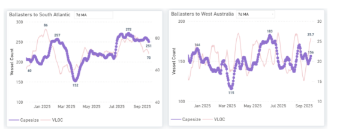

> **Figure 3: Στιγμιότυπο Οθόνης 2025 09 18 155518**  
> **Interactive Data & Source:** [Signal Ocean Platform](https://www.thesignalgroup.com/signal-ocean-platform) | [Local Asset](file:///C:/Users/Dell/Github/Shipping/corpus/03-breakwave/insights/2025/assets/2025-09-18_indonesian-coal-flows-gradually-rebound_img_cea3cf84ceb9ceb3cebcceb9cf8ccf84cf85_049e9526e4fc.png)

Panamax - ECSA / Far East | USG / China**Softer**

Panamax spot rates have softened on the East Coast South America (ECSA) and US Gulf (USG) to Far East routes. Specifically, ECSA to Far East prices are down 3% week-on-week, though still up 7% month-on-month. The USG-China route saw a 4% weekly decline but remains 7% firmer than a month ago. Panamax ballasters heading to ECSA have remained low since mid-August, with daily loaded volumes slightly under 0.8M tonnes. This trend is evident when examining both the vessel count and the ECSA's daily loaded volume.

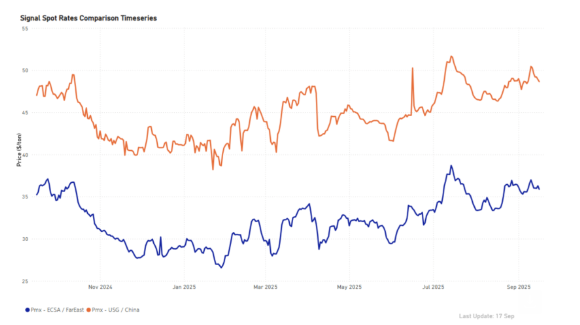

> **Figure 4: Στιγμιότυπο Οθόνης 2025 09 18 155652**  
> **Interactive Data & Source:** [Signal Ocean Platform](https://www.thesignalgroup.com/signal-ocean-platform) | [Local Asset](file:///C:/Users/Dell/Github/Shipping/corpus/03-breakwave/insights/2025/assets/2025-09-18_indonesian-coal-flows-gradually-rebound_img_cea3cf84ceb9ceb3cebcceb9cf8ccf84cf85_934fbe9130cb.png)

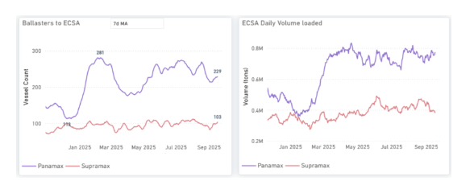

> **Figure 5: Στιγμιότυπο Οθόνης 2025 09 18 155659**  
> **Interactive Data & Source:** [Signal Ocean Platform](https://www.thesignalgroup.com/signal-ocean-platform) | [Local Asset](file:///C:/Users/Dell/Github/Shipping/corpus/03-breakwave/insights/2025/assets/2025-09-18_indonesian-coal-flows-gradually-rebound_img_cea3cf84ceb9ceb3cebcceb9cf8ccf84cf85_4f455436bfef.png)

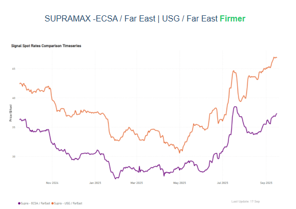

> **Figure 6: Στιγμιότυπο Οθόνης 2025 09 18 155710**  
> **Interactive Data & Source:** [Signal Ocean Platform](https://www.thesignalgroup.com/signal-ocean-platform) | [Local Asset](file:///C:/Users/Dell/Github/Shipping/corpus/03-breakwave/insights/2025/assets/2025-09-18_indonesian-coal-flows-gradually-rebound_img_cea3cf84ceb9ceb3cebcceb9cf8ccf84cf85_4a8f00ab1b8f.png)

Spot rates for Supramax vessels have continued to climb steadily. The East Coast South America (ECSA) to Far East route reached a peak of $37/tonne, marking a 10% increase from the previous month. Similarly, the US Gulf (USG) to Far East route also saw gains, rising 8% monthly to $47/tonne. While the daily loaded volume in ECSA has remained relatively steady at below 0.3M, the number of Supramax vessels ballasting to ECSA has reached a new peak of just under 130. This is an increase from the low of 113 observed at the end of August, and we are waiting to see how this may influence the freight market in the days ahead of September.

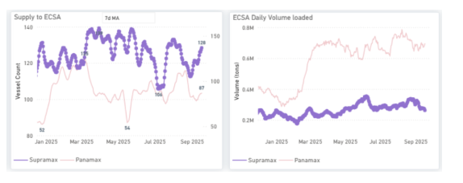

> **Figure 7: Στιγμιότυπο Οθόνης 2025 09 18 155835**  
> **Interactive Data & Source:** [Signal Ocean Platform](https://www.thesignalgroup.com/signal-ocean-platform) | [Local Asset](file:///C:/Users/Dell/Github/Shipping/corpus/03-breakwave/insights/2025/assets/2025-09-18_indonesian-coal-flows-gradually-rebound_img_cea3cf84ceb9ceb3cebcceb9cf8ccf84cf85_10d20b59066e.png)

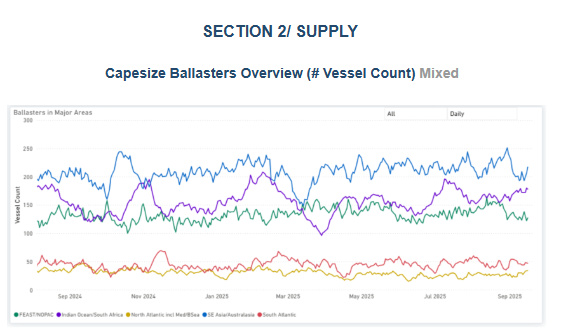

> **Figure 8: Στιγμιότυπο Οθόνης 2025 09 18 155843**  
> **Interactive Data & Source:** [Signal Ocean Platform](https://www.thesignalgroup.com/signal-ocean-platform) | [Local Asset](file:///C:/Users/Dell/Github/Shipping/corpus/03-breakwave/insights/2025/assets/2025-09-18_indonesian-coal-flows-gradually-rebound_img_cea3cf84ceb9ceb3cebcceb9cf8ccf84cf85_f3f58346f42f.png)

**Capesize ballasters view**: In the Atlantic, the South Atlantic region experienced a 6% decrease, while the North Atlantic saw a more moderate increase of 13% compared to the previous week's 40% rise. Meanwhile, the Pacific region continues to show improved absorption of ballasters, with Australasia noting a 12% increase, and the Indian Ocean and Far East/NOPAC regions remaining almost steady.

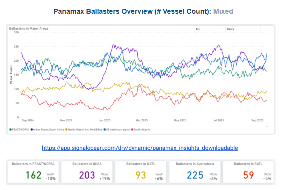

> **Figure 9: Στιγμιότυπο Οθόνης 2025 09 18 160025**  
> **Interactive Data & Source:** [Signal Ocean Platform](https://www.thesignalgroup.com/signal-ocean-platform) | [Local Asset](file:///C:/Users/Dell/Github/Shipping/corpus/03-breakwave/insights/2025/assets/2025-09-18_indonesian-coal-flows-gradually-rebound_img_cea3cf84ceb9ceb3cebcceb9cf8ccf84cf85_c38363afeaf0.png)

**Panamax ballasters view:**The number of ballasters continued to show a greater presence in the Pacific than in the Atlantic. Specifically, the Indian Ocean in the Pacific saw a significant 19% increase, while in the Atlantic, the South Atlantic exhibited a higher upward trend compared to the South.

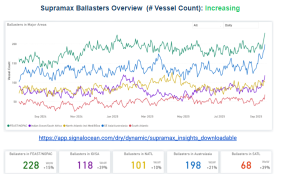

> **Figure 10: Στιγμιότυπο Οθόνης 2025 09 18 160149**  
> **Interactive Data & Source:** [Signal Ocean Platform](https://www.thesignalgroup.com/signal-ocean-platform) | [Local Asset](file:///C:/Users/Dell/Github/Shipping/corpus/03-breakwave/insights/2025/assets/2025-09-18_indonesian-coal-flows-gradually-rebound_img_cea3cf84ceb9ceb3cebcceb9cf8ccf84cf85_7c7a9f01d0b9.png)

**Supramax ballasters view**: Oversupply persists in the Pacific basin, evidenced by a 20% increase in ballasters in Australasia and a 39% increase in the Indian Ocean/South Africa region. The Atlantic also saw a significant rise, with a 39% increase in the South and a 10% increase in the North.

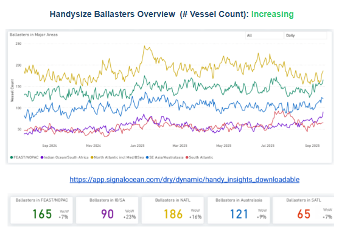

> **Figure 11: Στιγμιότυπο Οθόνης 2025 09 18 160232**  
> **Interactive Data & Source:** [Signal Ocean Platform](https://www.thesignalgroup.com/signal-ocean-platform) | [Local Asset](file:///C:/Users/Dell/Github/Shipping/corpus/03-breakwave/insights/2025/assets/2025-09-18_indonesian-coal-flows-gradually-rebound_img_cea3cf84ceb9ceb3cebcceb9cf8ccf84cf85_c54bb6228606.png)

**Handysize ballasters**: Both the Pacific and Atlantic basins continued to show significant growth. The Far East/NOPAC region in the Pacific experienced a 7% increase, with Australasia seeing a 9% rise. In the Atlantic, the number of ballasters grew by 16% in the North and 7% in the South.

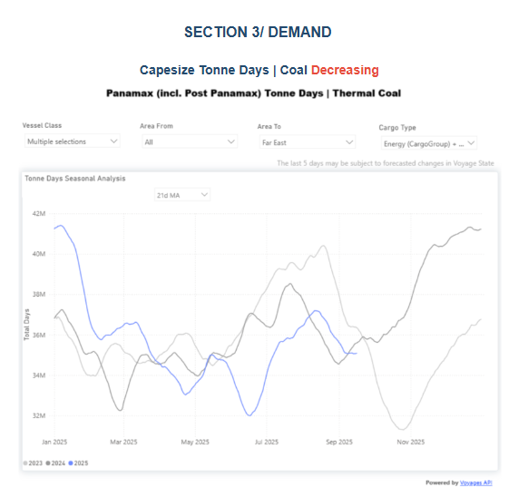

> **Figure 12: Στιγμιότυπο Οθόνης 2025 09 18 160316**  
> **Interactive Data & Source:** [Signal Ocean Platform](https://www.thesignalgroup.com/signal-ocean-platform) | [Local Asset](file:///C:/Users/Dell/Github/Shipping/corpus/03-breakwave/insights/2025/assets/2025-09-18_indonesian-coal-flows-gradually-rebound_img_cea3cf84ceb9ceb3cebcceb9cf8ccf84cf85_c29949242dea.png)

Panamax coal shipments to the Far East have seen weaker tonne-day growth in the second quarter compared to the previous two years. While September began with more strength than July, it's unlikely to reach 2023 levels due to lower Indonesian coal shipments to China in the first six months of the year. The coming weeks will shed more light on how recent Indonesian government actions regarding coal pricing and taxation will influence cargo volumes and tonne-day growth during the second half of the year.

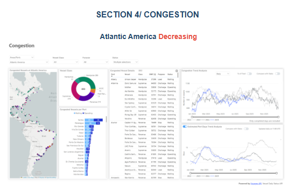

> **Figure 13: Στιγμιότυπο Οθόνης 2025 09 18 160404**  
> **Interactive Data & Source:** [Signal Ocean Platform](https://www.thesignalgroup.com/signal-ocean-platform) | [Local Asset](file:///C:/Users/Dell/Github/Shipping/corpus/03-breakwave/insights/2025/assets/2025-09-18_indonesian-coal-flows-gradually-rebound_img_cea3cf84ceb9ceb3cebcceb9cf8ccf84cf85_ce73a7fd07f9.png)

Port congestion in Atlantic America has decreased, with current levels down to 900, compared to over 1000 in 2023 and 2024. This trend points to lows last observed in the same period of 2022. Conversely, the Far East area, particularly Tianjin, is experiencing increased congestion. Additionally, the estimated port days trend for Atlantic America is approximately 11, significantly lower than the peak of 16 recorded in early September 2023.

Data Source:[Signal Ocean Platform](https://www.thesignalgroup.com/signal-ocean-platform)

---

**Tags:** Coal, Drybulk, Markets  
