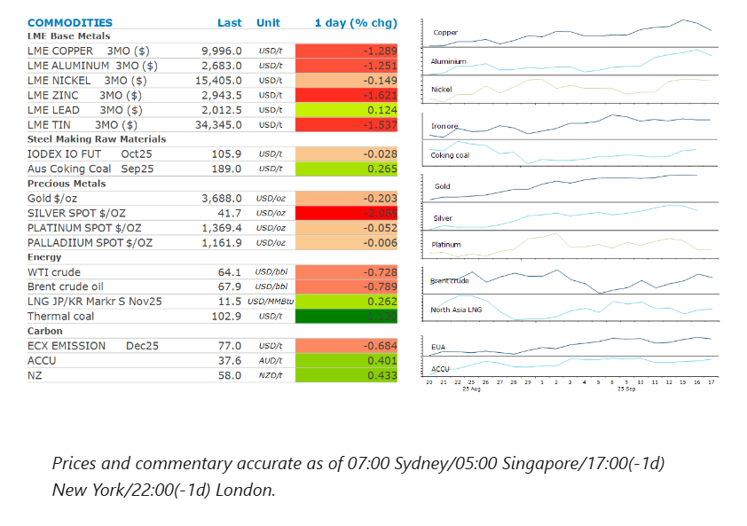
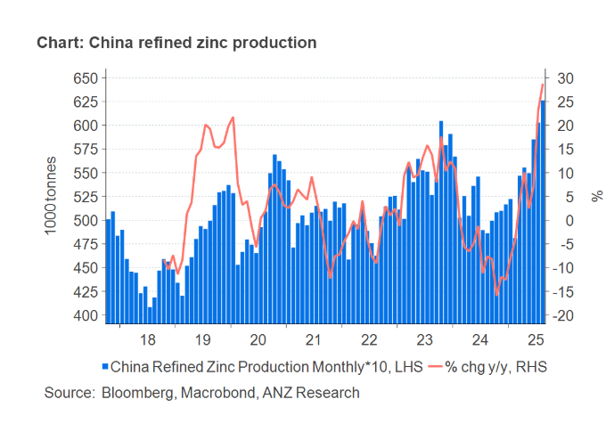

# Stronger USD weighs on sentiment

**Date:** September 18, 2025  
**Publisher:** Breakwave Advisors | **Category:** Market Insights  
**Original URL:** [https://www.breakwaveadvisors.com/insights/2025/9/18/stronger-usd-weighs-on-sentiment](https://www.breakwaveadvisors.com/insights/2025/9/18/stronger-usd-weighs-on-sentiment)  

---

A stronger USD weighed on sentiment across the commodities complex following the Fed decision to cut rates.

*By*[*Daniel Hynes*](https://www.linkedin.com/in/dahynes/)

> **Figure 1: Στιγμιότυπο Οθόνης 2025 09 18 085226**  
> **Interactive Data & Source:** [Linkedin](https://www.linkedin.com/newsletters/commodities-wrap-6692196755876012032/?fbclid=IwAR3kiXJqZdxmp9ZcRwBNI7FsBySI-XSC0pfPur1qzjt7OZp7PTE59Tsl1QI) | [Local Asset](file:///C:/Users/Dell/Github/Shipping/corpus/03-breakwave/insights/2025/assets/2025-09-18_stronger-usd-weighs-on-sentiment_img_cea3cf84ceb9ceb3cebcceb9cf8ccf84cf85_5dfa7fe82bd8.png)

### Market Commentary

**Gold**hit a fresh high in the immediate aftermath of the Fed’s decision to cut interest rates by 25bp, as investors cheered the beginning of the rate cut cycle. However, it quickly gave up those gains after comments from Powell in the post-meeting press conference were less dovish than the market had been expecting. Gold had been driven by the prospect of aggressive cuts in recent weeks. However, Powell’s focus on stronger US GDP forecasts and still elevated inflation projections seemed to create doubt in investors’ minds. The precious metal has been vulnerable to sharp corrections. Its 14-day relative strength index, a gauge of price momentum, is still above the critical 70 level. This suggests that prices rose too fast with too many people buying.

**Copper**led the base metals sector lower heading into the FOMC rate decision. The selloff was driven by bearish sentiment in the Asian market. Copper had been well supported by investors who saw lower borrowing costs boosting demand. However, the focus may now turn back to the impact of US tariffs on global economic activity. That was exacerbated by a rise in LME inventories. Copper stockpiles in US warehouses tracked by the LME rose by 175t. This was the first delivery since December 2023. Higher metals output in China also weighed on sentiment. China’s zinc output in August hit its highest monthly level since the first quarter of 2024 as smelters benefited from higher processing fees and improved availability of ore. Refined zinc output rose 23% y/y to 651kt, according to data from China’s National Bureau of Statistics. Production of refined copper was also stronger, rising 15% y/y to 1.3mt.

**Crude oil**ended the session lower as the stronger USD weighed on sentiment. Traders also dismissed the unexpected fall in US inventories. The Energy Information Administration’s weekly inventory report showed that US crude oil stockpiles fell by 9,285kbbl last week. At 415mbbl, it is at its lowest level since late June. The big drop in crude stocks came despite a slowdown in refinery runs. This was driven by exports, which surged above 5mb/d to the highest level since December 2023. A large jump in EIA’s adjustment factor also cast doubt over the validity of the data. Product inventories also rose, with distillate fuel oil stockpiles rising 4,046kbbl. This stunted a rally following Ukraine’s attack on the Saratov refinery in its latest strike on Russian energy facilities. Earlier this week Reuters reported that Russia’s Transneft pipeline, which handles more than 80% of the country’s oil, has restricted firms’ ability to store crude. The full effect of the attacks on Russia’s oil flow is unclear.

**Global gas**prices edged higher as the spectre of additional sanctions on Russia hang over the market. However, European natural gas pared earlier gains after Slovakia’s Economy Minister, Denisa Sakova, told reporters that the country must first have the right conditions in place before it can phase Russian purchases out. Earlier this week European Commission President, Ursula von der Leyen, said the group will propose speeding up the phase out of Russian fossil fuel imports. The bloc has also been weighing up sanctions on companies in India and China that enable Russia’s oil trade.**North Asian LNG**prices gained on expectations that demand may expand on stronger buying from India and China.

### Chart of the Day

The zinc market has been beset with mine supply issues in recent years. This has weighed on the smelting industry, with processing fees turning negative in 2024. However, the bottleneck in mine supply may be easing. China’s refined zinc output hit 651kt in August. This has led to Chinese smelter to call for better supply terms with overseas miners. Reports suggest they may be seeking treatment fees of USD120-140/t in the fourth quarter.

> **Figure 2: Στιγμιότυπο Οθόνης 2025 09 18 085328**  
> **Interactive Data & Source:** [Linkedin](https://www.linkedin.com/newsletters/commodities-wrap-6692196755876012032/?fbclid=IwAR3kiXJqZdxmp9ZcRwBNI7FsBySI-XSC0pfPur1qzjt7OZp7PTE59Tsl1QI) | [Local Asset](file:///C:/Users/Dell/Github/Shipping/corpus/03-breakwave/insights/2025/assets/2025-09-18_stronger-usd-weighs-on-sentiment_img_cea3cf84ceb9ceb3cebcceb9cf8ccf84cf85_771d5a8836d0.png)

Data source:[Commodities Wrap](https://www.linkedin.com/newsletters/commodities-wrap-6692196755876012032/?fbclid=IwAR3kiXJqZdxmp9ZcRwBNI7FsBySI-XSC0pfPur1qzjt7OZp7PTE59Tsl1QI)

---

**Tags:** Shipping, Commodities, Markets  
