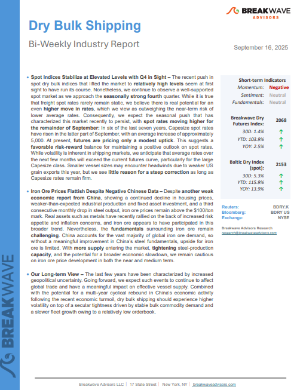
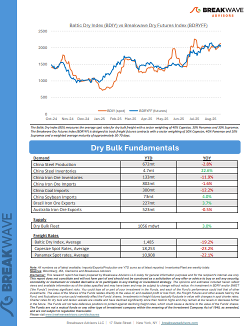
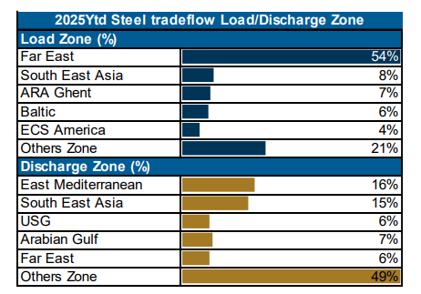
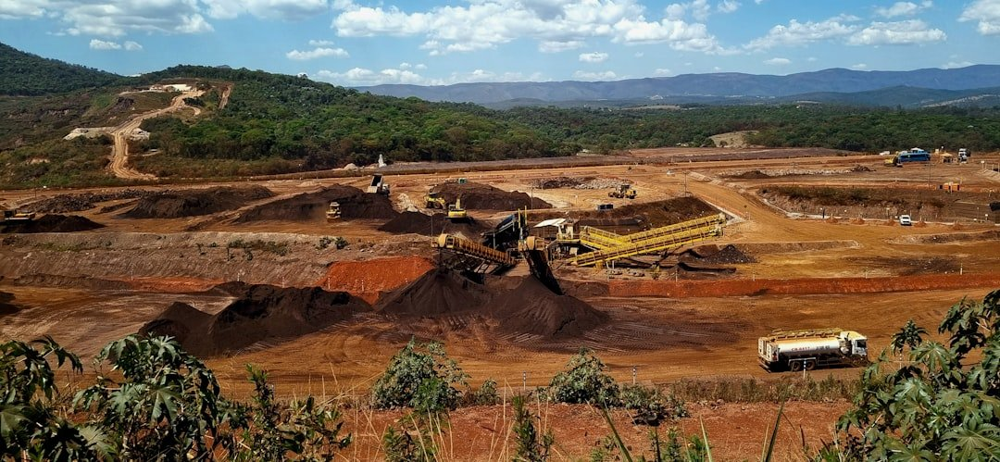

# Breakwave Weekend Read

**Date:** September 19, 2025  
**Publisher:** Breakwave Advisors | **Category:** Market Insights  
**Original URL:** [https://www.breakwaveadvisors.com/insights/2025919-weekly-gyt458](https://www.breakwaveadvisors.com/insights/2025919-weekly-gyt458)  

---

## Welcome Tobreakwave Advisorsweekend Read

***As the week comes to a close, take a moment to review the key insights from the past few days. Missed something? We've gathered all the top insights for you to catch up at your convenience.***

## Breakwave Shipping Report

**Spot Indices Stabilize at Elevated Levels with Q4 in Sight**– The recent push in spot dry bulk indices that lifted the market to**relatively high levels**seem at first sight to have run its course.

[Read More](https://www.breakwaveadvisors.com/insights/2025916db-5cnlk547)

> **Figure 1: Στιγμιότυπο Οθόνης 2025 09 17 163527**  
> **Interactive Data & Source:** [Breakwave Advisors Market Insights](https://www.breakwaveadvisors.com/insights/2025/9/15/the-big-picture-of-the-dry-bulk-market) | [Local Asset](file:///C:/Users/Dell/Github/Shipping/corpus/03-breakwave/insights/2025/assets/2025-09-19_2025919-weekly-gyt458_img_cea3cf84ceb9ceb3cebcceb9cf8ccf84cf85_78387e7616e6.png)

> **Figure 2: Στιγμιότυπο Οθόνης 2025 09 17 163540**  
> **Interactive Data & Source:** [Breakwave Advisors Market Insights](https://www.breakwaveadvisors.com/insights/2025/9/15/the-big-picture-of-the-dry-bulk-market) | [Local Asset](file:///C:/Users/Dell/Github/Shipping/corpus/03-breakwave/insights/2025/assets/2025-09-19_2025919-weekly-gyt458_img_cea3cf84ceb9ceb3cebcceb9cf8ccf84cf85_9d97f5bdd5a6.png)

## The Big Picture of the Dry Bulk Market

> **Figure 3: Στιγμιότυπο Οθόνης 2025 09 17 163959**  
> **Interactive Data & Source:** [Breakwave Advisors Market Insights](https://www.breakwaveadvisors.com/insights/2025/9/15/the-big-picture-of-the-dry-bulk-market) | [Local Asset](file:///C:/Users/Dell/Github/Shipping/corpus/03-breakwave/insights/2025/assets/2025-09-19_2025919-weekly-gyt458_img_cea3cf84ceb9ceb3cebcceb9cf8ccf84cf85_99d0e478802a.png)

The dry bulk market entered a more cautious phase in early September last year, with the BDI range-bound, balancing at 1,890 points after failing to sustain momentum above the 2,000 threshold.

Doric Weekly Market Insights

## Sudden Strong Growth in Coal India's Output

> **Figure 4: Unsplash Image E5egsk4euq0**  
> **Interactive Data & Source:** [Breakwave Advisors Market Insights](https://www.breakwaveadvisors.com/insights/2025/9/16/sudden-strong-growth-in-coal-indias-output) | [Local Asset](file:///C:/Users/Dell/Github/Shipping/corpus/03-breakwave/insights/2025/assets/2025-09-19_2025919-weekly-gyt458_img_unsplash-image-e5egsk4euq0_6da2352e0fd4.jpg)

India produced approximately 133.7 billion kilowatt hours of electricity in August.

From Commodore's Weekly Dry Bulk Reports

## Iron Ore Shipments to China Are Gaining Stronger Momentum

> **Figure 5: Unsplash Image Tsivoid3wsa**  
> **Interactive Data & Source:** [Breakwave Advisors Market Insights](https://www.breakwaveadvisors.com/insights/2025/9/16/iron-ore-shipments-to-china-are-gaining-stronger-momentum) | [Local Asset](file:///C:/Users/Dell/Github/Shipping/corpus/03-breakwave/insights/2025/assets/2025-09-19_2025919-weekly-gyt458_img_unsplash-image-tsivoid3wsa_7b19c7297cba.jpg)

Iron ore shipments to China surprisingly strengthened in August, seemingly driven by the drop in iron ore prices and preparations from Chinese mills for a traditional summer pickup.

Signal Ocean Dry Weekly Market Monitor

## We Shouldn’t Fight the Fed. Even If It’s Not Independent.

> **Figure 6: Unsplash Image S3omjobelvm**  
> **Interactive Data & Source:** [Breakwave Advisors Market Insights](https://www.breakwaveadvisors.com/insights/2025/9/17/we-shouldnt-fight-the-fed-even-if-its-not-independent) | [Local Asset](file:///C:/Users/Dell/Github/Shipping/corpus/03-breakwave/insights/2025/assets/2025-09-19_2025919-weekly-gyt458_img_unsplash-image-s3omjobelvm_bb75fdb738f9.jpg)

The Fed is expected to cut rates despite inflation edging up, under the twin pressures from a deteriorating jobs market and the White House.

Forvis Mazars Weekly Note

## The Steel Behind Geared

> **Figure 7: Στιγμιότυπο Οθόνης 2025 09 17 141152**  
> **Interactive Data & Source:** [Breakwave Advisors Market Insights](https://www.breakwaveadvisors.com/insights/2025/9/17/the-steel-behind-geared) | [Local Asset](file:///C:/Users/Dell/Github/Shipping/corpus/03-breakwave/insights/2025/assets/2025-09-19_2025919-weekly-gyt458_img_cea3cf84ceb9ceb3cebcceb9cf8ccf84cf85_85c5fbd294fd.png)

Typically speaking, steel has been one of the major provider of freight employment within the minor bulk cargoes category.

BRS Weekly Dry Bulk Newsletter

## Stronger Usd Weighs on Sentiment

> **Figure 8: Unsplash Image Log Fqlho7s**  
> **Interactive Data & Source:** [Breakwave Advisors Market Insights](https://www.breakwaveadvisors.com/insights/2025/9/18/stronger-usd-weighs-on-sentiment) | [Local Asset](file:///C:/Users/Dell/Github/Shipping/corpus/03-breakwave/insights/2025/assets/2025-09-19_2025919-weekly-gyt458_img_unsplash-image-log-fqlho7s_2ea2ab2d2cab.jpg)

A stronger USD weighed on sentiment across the commodities complex following the Fed decision to cut rates.

Commodities Wrap

## Indonesian Coal Flows Gradually Rebound

> **Figure 9: Unsplash Image Bgfcnqn0tfo**  
> **Interactive Data & Source:** [Breakwave Advisors Market Insights](https://www.breakwaveadvisors.com/insights/2025/9/18/indonesian-coal-flows-gradually-rebound) | [Local Asset](file:///C:/Users/Dell/Github/Shipping/corpus/03-breakwave/insights/2025/assets/2025-09-19_2025919-weekly-gyt458_img_unsplash-image-bgfcnqn0tfo_d59d62917635.jpg)

Following a weak start to 2025, Indonesian thermal coal shipments are showing signs of recovery.

Signal Ocean Dry Weekly Market Monitor

## Return of Growth in Gas Engine Vehicle Sales in China Continues

> **Figure 10: Unsplash Image O8iff0rutts**  
> **Interactive Data & Source:** [Breakwave Advisors Market Insights](https://www.breakwaveadvisors.com/insights/2025/9/19/return-of-growth-in-gas-engine-vehicle-sales-in-china-continues) | [Local Asset](file:///C:/Users/Dell/Github/Shipping/corpus/03-breakwave/insights/2025/assets/2025-09-19_2025919-weekly-gyt458_img_unsplash-image-o8iff0rutts_07a51cbd8891.jpg)

As we discussed in Commodore Research’s most recent Weekly China Report, August saw a total of 2.86 million vehicles sold in China (and also 611,000 vehicles exported).

From Commodore's Weekly Dry Bulk Reports

## Iron Ore: The Calm Before the Storm?

> **Figure 11: Unsplash Image E5qqoi Aleo**  
> **Interactive Data & Source:** [Breakwave Advisors Market Insights](https://www.breakwaveadvisors.com/insights/2025/9/19/iron-ore-the-calm-before-the-storm) | [Local Asset](file:///C:/Users/Dell/Github/Shipping/corpus/03-breakwave/insights/2025/assets/2025-09-19_2025919-weekly-gyt458_img_unsplash-image-e5qqoi-aleo_ab462e7f6010.jpg)

Iron ore is usually one of the most unpredictable commodities out there..

Novisea

## Reality Check: China’s Appetite for a New Stockpiling Wave

> **Figure 12: Unsplash Image Aav5e1xwtn8**  
> **Interactive Data & Source:** [Breakwave Advisors Market Insights](https://www.breakwaveadvisors.com/insights/2025/9/19/reality-check-chinas-appetite-for-a-new-stockpiling-wave) | [Local Asset](file:///C:/Users/Dell/Github/Shipping/corpus/03-breakwave/insights/2025/assets/2025-09-19_2025919-weekly-gyt458_img_unsplash-image-aav5e1xwtn8_deb833723cc2.jpg)

China’s onshore crude inventories reached all-time highs in August, raising the question of whether another wave of stockpiling is on the horizon.

Vortexa Freight Weekly

---

**Tags:** Shipping, Tankers, Drybulk  
