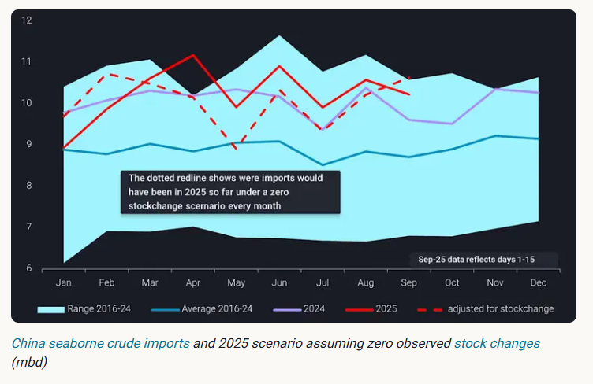
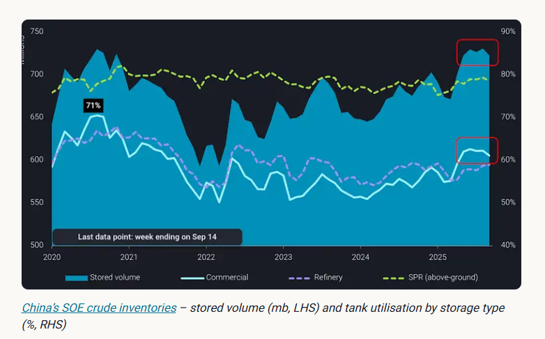
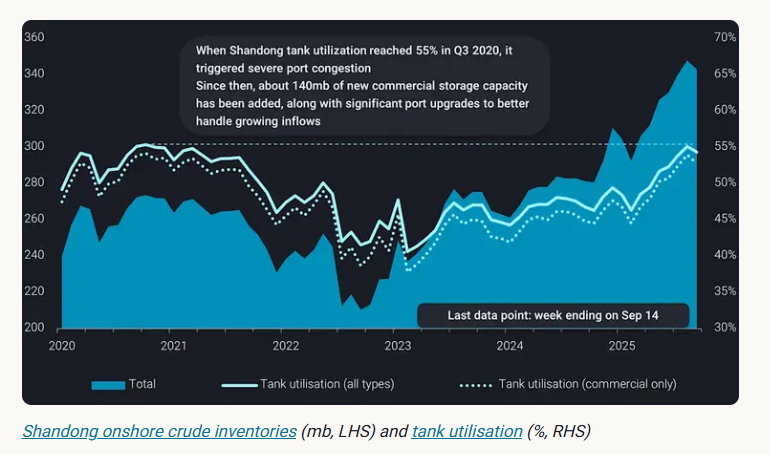

# Reality check: China’s appetite for a new stockpiling wave

**Date:** September 19, 2025  
**Publisher:** Breakwave Advisors | **Category:** Market Insights  
**Original URL:** [https://www.breakwaveadvisors.com/insights/2025/9/19/reality-check-chinas-appetite-for-a-new-stockpiling-wave](https://www.breakwaveadvisors.com/insights/2025/9/19/reality-check-chinas-appetite-for-a-new-stockpiling-wave)  

---

China’s onshore crude inventories reached all-time highs in August, raising the question of whether another wave of stockpiling is on the horizon.

*By*[*Emma Li*](https://www.linkedin.com/in/emma-li-73003443/)

So far this year, China's seaborne crude imports have averaged 10.3 mbd—about 3% higher than the same period in 2024. But if we strip out stock builds, adjusted imports have been consistently lower year-on-year from March to August. This indicates that much of the headline growth in imports has come from stockpiling rather than real consumption, with underlying refining demand broadly flat—or even weaker in some months—compared with last year, when no SPR mandate was in place.

> **Figure 1: Στιγμιότυπο Οθόνης 2025 09 19 121437**  
> **Interactive Data & Source:** [Vortexa](https://www.vortexa.com//oil-gas-data-traders-analysts-data-scientists?gclid=Cj0KCQjw8_qRBhCXARIsAE2AtRZKOvMnbilZ_6_91d7huSFFy71pWLrnPwGwOHVzXsmsG-1a1mZnQw8aAt89EALw_wcB&hsa_acc=1782073842&hsa_ad=548425387665&hsa_cam=14746637662&hsa_grp=125038601902&hsa_kw=&hsa_mt=&hsa_net=adwords&hsa_src=g&hsa_tgt=dsa-1431852288425&hsa_ver=3&utm_campaign=%5BCD%5D%20-%20DSA%20-%20EMEA&utm_medium=cpc&utm_medium=ppc&utm_source=google&utm_source=adwords&utm_term=) | [Local Asset](file:///C:/Users/Dell/Github/Shipping/corpus/03-breakwave/insights/2025/assets/2025-09-19_reality-check-chinas-appetite-for-a-new-stockpiling-wave_img_cea3cf84ceb9ceb3cebcceb9cf8ccf84cf85_c1264c58842c.png)

China’s motor fuel consumption has already peaked, and the petrochemical sector’s recovery has been too sluggish to provide meaningful support. On the export side, refiners have raised fuel shipments in the second half of the year to maximize export quota utilisations, but with the final batch of quotas essentially keeping annual allowance flat year-on-year, the upside to crude demand is limited. The real question is: will stockpiling continue to drive China’s crude imports in the near term?

## State-Owned Builds Stalled, Capacity Expansion on the Horizon

In Q2, state-owned refiners (SOEs) built close to 60mb of crude into storage, almost all in commercial tanks, lifting above-ground inventories to record highs of more than 730mb. SOEs are unique in that they face no import quota restrictions and are tasked with meeting Beijing’s stockpile mandates.

However, since June, stockpiling momentum has stalled. Commercial tank utilisation has held steady around 62%. A further 50mb build would push utilisation beyond 71%—a level last seen in Q3 2020, when tanker arrivals overwhelmed ports and caused severe congestion.

> **Figure 2: Στιγμιότυπο Οθόνης 2025 09 19 121531**  
> **Interactive Data & Source:** [Vortexa](https://www.vortexa.com//oil-gas-data-traders-analysts-data-scientists?gclid=Cj0KCQjw8_qRBhCXARIsAE2AtRZKOvMnbilZ_6_91d7huSFFy71pWLrnPwGwOHVzXsmsG-1a1mZnQw8aAt89EALw_wcB&hsa_acc=1782073842&hsa_ad=548425387665&hsa_cam=14746637662&hsa_grp=125038601902&hsa_kw=&hsa_mt=&hsa_net=adwords&hsa_src=g&hsa_tgt=dsa-1431852288425&hsa_ver=3&utm_campaign=%5BCD%5D%20-%20DSA%20-%20EMEA&utm_medium=cpc&utm_medium=ppc&utm_source=google&utm_source=adwords&utm_term=) | [Local Asset](file:///C:/Users/Dell/Github/Shipping/corpus/03-breakwave/insights/2025/assets/2025-09-19_reality-check-chinas-appetite-for-a-new-stockpiling-wave_img_cea3cf84ceb9ceb3cebcceb9cf8ccf84cf85_2947530b0118.png)

China has already added about 100mb of SOE storage capacity over 2022–2023 and is moving ahead with further expansions. Company disclosures suggest at least another 100mb will come online by 2027, creating room for renewed long-term stockpiling. But with most new tanks only expected from late 2026 onward, there is little scope for inventories to climb much higher in the near term.

## Shandong Inventories Rise on Robust Iranian Inflows

In Shandong, home to the independent “teapot” refiners, commercial stocks have continued to climb over the past six months, even as SOE builds paused.

> **Figure 3: Στιγμιότυπο Οθόνης 2025 09 19 121618**  
> **Interactive Data & Source:** [Vortexa](https://www.vortexa.com//oil-gas-data-traders-analysts-data-scientists?gclid=Cj0KCQjw8_qRBhCXARIsAE2AtRZKOvMnbilZ_6_91d7huSFFy71pWLrnPwGwOHVzXsmsG-1a1mZnQw8aAt89EALw_wcB&hsa_acc=1782073842&hsa_ad=548425387665&hsa_cam=14746637662&hsa_grp=125038601902&hsa_kw=&hsa_mt=&hsa_net=adwords&hsa_src=g&hsa_tgt=dsa-1431852288425&hsa_ver=3&utm_campaign=%5BCD%5D%20-%20DSA%20-%20EMEA&utm_medium=cpc&utm_medium=ppc&utm_source=google&utm_source=adwords&utm_term=) | [Local Asset](file:///C:/Users/Dell/Github/Shipping/corpus/03-breakwave/insights/2025/assets/2025-09-19_reality-check-chinas-appetite-for-a-new-stockpiling-wave_img_cea3cf84ceb9ceb3cebcceb9cf8ccf84cf85_f71769eade4f.png)

This has been driven by a strong inflow of sanctioned crude—especially Iranian barrels—as traders and refiners seek to move volumes onshore to mitigate risks from potential Western sanctions on tankers or port facilities. Despite weaker refining runs among teapots, Iranian imports into China have averaged above 1.4mbd this year, up 12% year-on-year.

Shandong non-SOE commercial tanks have absorbed around 40mb of additional crude since March, with utilisation still below 55%, leaving room for further builds.

However, the build-up has come at a price: elevated inventories have pressured Iranian differentials, widening discounts for delivered barrels from around $1/b in March to more than $6/b in September. If traders want to increase the price to end buyers, stocks will need to be drawn down, which may then limit the pace of further Iranian imports in the months ahead.

## Outlook

Taken together, China appears unlikely to sustain another strong wave of crude stockpiling in the near term. SOE inventories are already at record highs with limited spare capacity until new tanks come online from 2026 onward. While Shandong commercial storages still have room to build, widening teapot feedstock discounts signal that the cost of further accumulation is already high.

In short: China’s crude stockpile growth looks set to plateau, leaving imports more closely tied to underlying demand trends rather than storage plays in the months ahead.

Data Source:[Vortexa](https://www.vortexa.com//oil-gas-data-traders-analysts-data-scientists?gclid=Cj0KCQjw8_qRBhCXARIsAE2AtRZKOvMnbilZ_6_91d7huSFFy71pWLrnPwGwOHVzXsmsG-1a1mZnQw8aAt89EALw_wcB&hsa_acc=1782073842&hsa_ad=548425387665&hsa_cam=14746637662&hsa_grp=125038601902&hsa_kw=&hsa_mt=&hsa_net=adwords&hsa_src=g&hsa_tgt=dsa-1431852288425&hsa_ver=3&utm_campaign=%5BCD%5D%20-%20DSA%20-%20EMEA&utm_medium=cpc&utm_medium=ppc&utm_source=google&utm_source=adwords&utm_term=)

---

**Tags:** Crude, Markets, China  
