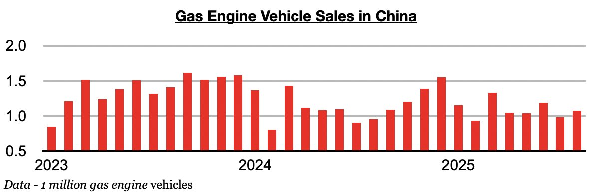
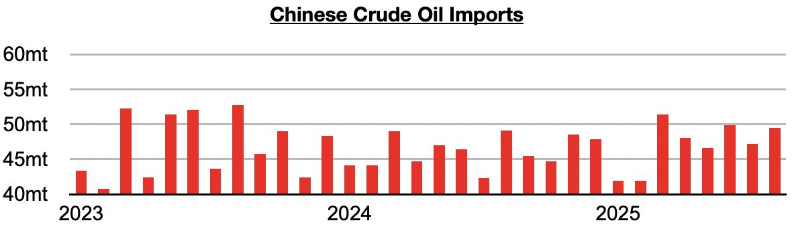
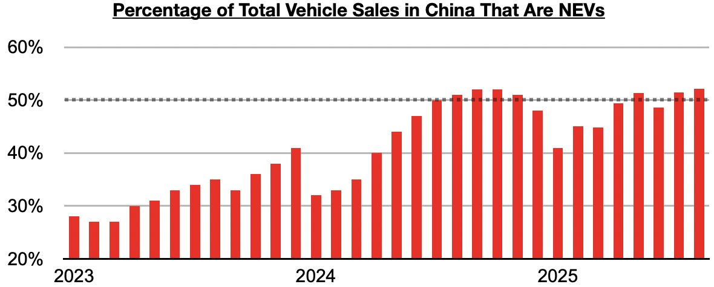

# Return of Growth in Gas Engine Vehicle Sales in China Continues

**Date:** September 19, 2025  
**Publisher:** Breakwave Advisors | **Category:** Market Insights  
**Original URL:** [https://www.breakwaveadvisors.com/insights/2025/9/19/return-of-growth-in-gas-engine-vehicle-sales-in-china-continues](https://www.breakwaveadvisors.com/insights/2025/9/19/return-of-growth-in-gas-engine-vehicle-sales-in-china-continues)  

---

*By*[*Jeffrey Landsberg*](https://www.linkedin.com/in/jeffrey-landsberg-70ab957/)

As we discussed in Commodore Research’s most recent Weekly China Report, August saw a total of 2.86 million vehicles sold in China (and also 611,000 vehicles exported). Of the 2.86 million vehicles, 1.08 million were gas engine vehicles, which marked a year-on-year rise of 13%. Gas-engine vehicle sales have now grown on a year-on-year basis for three straight months. Previously, they had contracted on a year-on-year basis in fifteen of the prior sixteen months.

> **Figure 1: Chart 1**  
> [Local Asset](file:///C:/Users/Dell/Github/Shipping/corpus/03-breakwave/insights/2025/assets/2025-09-19_return-of-growth-in-gas-engine-vehicle-sales-in-china-continues_img_chart1_0598e2d4062b.jpg)

China’s crude oil imports totaled 49.5 million tons in August, which was up from July by 2.3 million tons (5%) and up year-on-year by 400,000 tons (1%). Very significant is that imports have now grown on a year-on-year basis in five of the last six months. Previously, they had contracted on a year-on-year basis in nine of the prior ten months.

> **Figure 2: Chart 2**  
> [Local Asset](file:///C:/Users/Dell/Github/Shipping/corpus/03-breakwave/insights/2025/assets/2025-09-19_return-of-growth-in-gas-engine-vehicle-sales-in-china-continues_img_chart2_4b128e8f4042.jpg)

Also of note is that 52% of China’s total vehicle sales in August were NEVs. Sales of NEV vehicles in China have now exceeded sales of gas-engine vehicles in three of the last four months – but lately this has not been stopping gas engine vehicle sales from growing on a year-on-year basis.

> **Figure 3: Chart 3**  
> [Local Asset](file:///C:/Users/Dell/Github/Shipping/corpus/03-breakwave/insights/2025/assets/2025-09-19_return-of-growth-in-gas-engine-vehicle-sales-in-china-continues_img_chart3_4d11f30698c7.jpg)

---

**Tags:** China, Economy, Markets  
