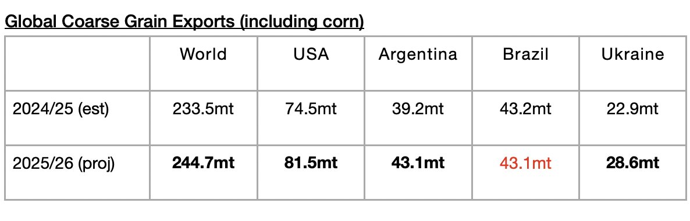

# Even More Global Grain Exports Now Expected

**Date:** September 22, 2025  
**Publisher:** Breakwave Advisors | **Category:** Market Insights  
**Original URL:** [https://www.breakwaveadvisors.com/insights/2025/9/22/even-more-global-grain-exports-now-expected](https://www.breakwaveadvisors.com/insights/2025/9/22/even-more-global-grain-exports-now-expected)  

---

*By*[*Jeffrey Landsberg*](https://www.linkedin.com/in/jeffrey-landsberg-70ab957/)

As we discussed in Commodore Research’s most recent Weekly Executive Report, the United States Department of Agriculture (USDA) has released its latest forecast for the upcoming 2025/26 grain trade season and is now predicting that global coarse grain, wheat, soybean, and soymeal exports will collectively total 729.4 million tons. This is 3.7 million tons (1%) more than was predicted a month ago and would mark a year-on-year increase of 21.4 million tons (3%). Remaining very significant, too, is that during the 2024/25 global grain season, a year-on-year contraction of approximately 2.4 million tons occurred. Overall, we have been stressing that a return of growth in grain trade (and growth in all major dry bulk commodity trade) has been needed considering that the dry bulk fleet this year has been set to grow by a net addition of at least 350 vessels. It is very positive that matters have changed with grain and Chinese coal demand.

The USDA is forecasting that global coarse grain exports in 2025/26 will total 244.7 million tons. This would mark a year-on-year increase of 11.2 million tons (5%) from the 2024/25 season. Coarse grain exports will remain the global grain market’s largest cargo by volume. Moderate year-on-year increases in coarse grain exports are expected from Argentina and Ukraine. A large year-on-year increase is expected from the United States. A small year-on-year decline is expected from Brazil.

> **Figure 1: Chart**  
> [Local Asset](file:///C:/Users/Dell/Github/Shipping/corpus/03-breakwave/insights/2025/assets/2025-09-22_even-more-global-grain-exports-now-expected_img_chart_aca6358d5319.jpg)

---

**Tags:** Grains, Drybulk, Markets  
