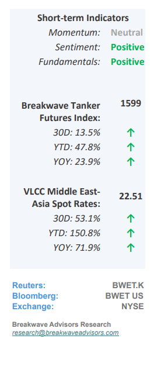
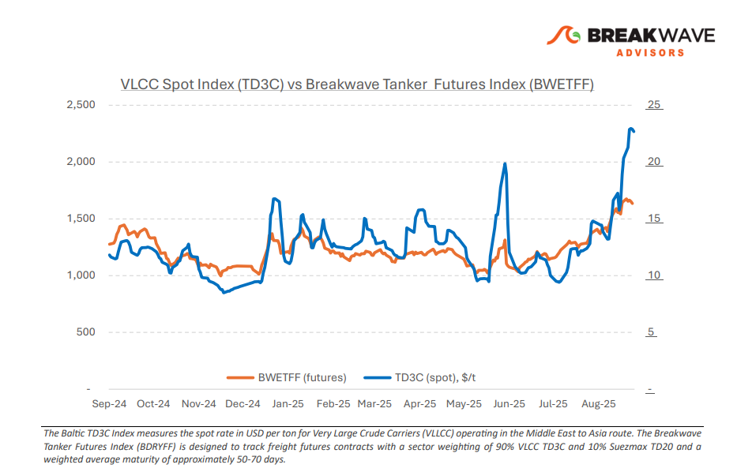
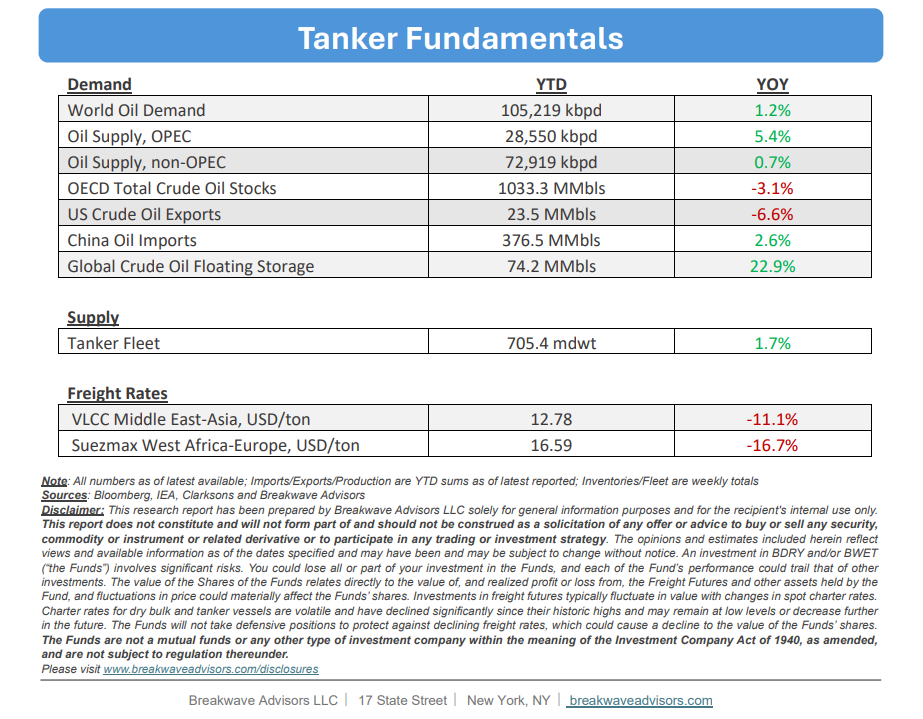

# Breakwave Bi-Weekly Tanker Report - September 23, 2025

**Date:** September 23, 2025  
**Publisher:** Breakwave Advisors | **Category:** Market Insights  
**Original URL:** [https://www.breakwaveadvisors.com/insights/2025923wetreport5k889](https://www.breakwaveadvisors.com/insights/2025923wetreport5k889)  

---

•**VLCC Rally Gathers Pace While Winter Demand is Still Upon Us**– Since early September, VLCC spot rates have**smashed key psychological thresholds**in both the Atlantic and Pacific basins, continuing a relentless rally that is counter to historical seasonality. The Middle East Gulf–China benchmark has led the advance,**rising 84% month over month**and is up 40% quarter over quarter. On a**year-over-year****basis**, rates are**approximately 75% higher,**marking one of the steepest annual gains and drawing comparisons to the September 2022 path. The rally has been driven by uncovered September stems in the MEG, which spurred a surge in**fixing activity, tightened tonnage lists, and reinforced bullish sentiment**. Furthermore, China’s crude stockpiling further supports the positive market backdrop for VLCCs: August imports averaged 11.65 mbpd, and early September onshore inventories were estimated at ~1.4 billion barrels, indicating**sustained intake**above refining demand with surplus volumes redirected into storage (see notes below). While risks remain, namely a potential slowdown in Chinese intake or renewed OPEC supply restraint, the stockpiling surge provides a firm underpinning for VLCC demand and should help**sustain elevated freight levels**into the typically seasonally strong fourth quarter.

> **Figure 1: Στιγμιότυπο Οθόνης 2025 09 23 103925**  
> [Local Asset](file:///C:/Users/Dell/Github/Shipping/corpus/03-breakwave/insights/2025/assets/2025-09-23_2025923wetreport5k889_img_cea3cf84ceb9ceb3cebcceb9cf8ccf84cf85_1fbb1092f30e.png)

•**China’s Storage Demand Shrouds Underlying Oil Market Weakness**– We view China’s oil storage demand as a primary driver supporting the current relatively balanced oil markets, which has**allowed OPEC+ to gradually increase****production**by approximately 2.5 million barrels per day into an otherwise stable demand setting. Regarding**specifically crude oil**(non-gas oil), which is tightly linked to transportation fuels, near-term growth in Chinese**demand remains limited**: Structural factors, such as strong electric vehicle penetration in both consumer and industrial sectors, an extensive railroad network, and efficiency gains in air travel, are expected to constrain demand in the coming years and thus oil demand growth. Nevertheless, for**strategic and geopolitical reasons**, China may continue to absorb substantial volumes of crude for onshore storage over the foreseeable future.**For tankers,**transferring oil from underground to above-ground storage is**a****positive development**, but it largely reflects a market-neutral mechanism rather than a signal of sustained higher underlying oil demand. While OPEC+ has less readily available capacity today, global storage has increased, which provides a significant cushion. Chinese**implied demand**for storage remains highly**price-sensitive**while actual market demand may not be as robust as trade flows suggest.

•**Our Long-term View**– The tanker market is recovering from a long period of staggered rates as the growth in new vessel supply shrinks while oil demand remains elevated in line with the global economy. A historically low orderbook combined with favorable shifting trade patterns should continue to support increased spot rate volatility, which combined with the ongoing geopolitical turmoil, should sustain freight rates in the medium to long term.

> **Figure 2: Στιγμιότυπο Οθόνης 2025 09 23 091547**  
> [Local Asset](file:///C:/Users/Dell/Github/Shipping/corpus/03-breakwave/insights/2025/assets/2025-09-23_2025923wetreport5k889_img_cea3cf84ceb9ceb3cebcceb9cf8ccf84cf85_c50c13955091.png)

> **Figure 3: Στιγμιότυπο Οθόνης 2025 09 23 103939**  
> [Local Asset](file:///C:/Users/Dell/Github/Shipping/corpus/03-breakwave/insights/2025/assets/2025-09-23_2025923wetreport5k889_img_cea3cf84ceb9ceb3cebcceb9cf8ccf84cf85_7e24450ed146.png)

### Subscribe:
