# Russian Oil Flows

**Date:** September 23, 2025  
**Publisher:** Breakwave Advisors | **Category:** Market Insights  
**Original URL:** [https://www.breakwaveadvisors.com/insights/2025/9/22/russian-oil-flows](https://www.breakwaveadvisors.com/insights/2025/9/22/russian-oil-flows)  

---

### Tanker - Weekly Market Monitor

Snapshot of Crude and Product Freight Rates, Supply-Demand

Week 38, 22 Sept, 2025

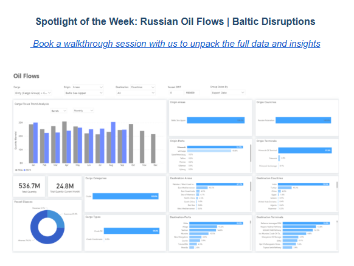

> **Figure 1: Στιγμιότυπο Οθόνης 2025 09 22 143416**  
> **Interactive Data & Source:** [Signal Ocean Platform](https://www.thesignalgroup.com/signal-ocean-platform) | [Local Asset](file:///C:/Users/Dell/Github/Shipping/corpus/03-breakwave/insights/2025/assets/2025-09-23_russian-oil-flows_img_cea3cf84ceb9ceb3cebcceb9cf8ccf84cf85_0efe5ae18dcf.png)

### Baltic Sea Flows Under Pressure

This week’s focus is on the volatility of dirty oil flows from the Baltic Sea's upper region. Russian exports through this corridor have faced pressure after Ukrainian drone strikes on terminals and pipelines introduced new uncertainty into export patterns at Primorsk and Ust-Luga. The ports of Primorsk and Ust-Luga handle nearly all regional shipments. Primorsk accounts for over 55%, while Ust-Luga makes up 44%. Exports are almost entirely transported by Aframax (74%) and Suezmax (26%) ships, with India (73%) and Turkey (19%) as the main buyers, together taking more than 90% of shipments. Since the recent disturbances, we are beginning to see the first signs of a potential significant decrease in the monthly volume of dirty oil shipments from Primorsk. For the first 20 days of September, exports are estimated at 25 million barrels so far, roughly matching the same period last year. However, this is a notable drop of about 6 million barrels from the August peak of approximately 31 million barrels, underscoring how vulnerable Baltic crude flows remain in the face of ongoing shocks.

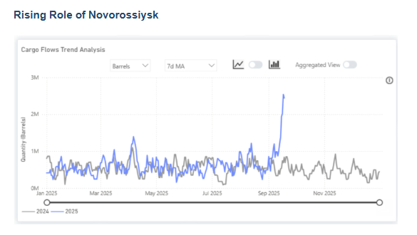

> **Figure 2: Στιγμιότυπο Οθόνης 2025 09 22 143505**  
> **Interactive Data & Source:** [Signal Ocean Platform](https://www.thesignalgroup.com/signal-ocean-platform) | [Local Asset](file:///C:/Users/Dell/Github/Shipping/corpus/03-breakwave/insights/2025/assets/2025-09-23_russian-oil-flows_img_cea3cf84ceb9ceb3cebcceb9cf8ccf84cf85_c2d3449121cb.png)

Black Sea crude flows show a marked reconfiguration of Russia’s export network. Volumes through Novorossiysk appeared to be rising sharply in September, with the 7-day moving average approaching 3 million barrels per day equivalent. The Sheskharis terminal now handles nearly 70% of shipments, while Novorossiysk accounts for a further 25%.

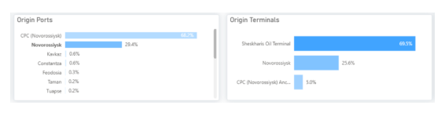

> **Figure 3: Στιγμιότυπο Οθόνης 2025 09 22 143546**  
> **Interactive Data & Source:** [Signal Ocean Platform](https://www.thesignalgroup.com/signal-ocean-platform) | [Local Asset](file:///C:/Users/Dell/Github/Shipping/corpus/03-breakwave/insights/2025/assets/2025-09-23_russian-oil-flows_img_cea3cf84ceb9ceb3cebcceb9cf8ccf84cf85_7ddba63adaf9.png)

India receives the largest share of flows, at 48%, followed by Romania, Turkey, and Italy. This distribution demonstrates Moscow's strategy to maintain market access despite disruptions in the Baltic region.

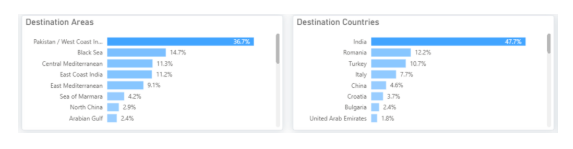

> **Figure 4: Στιγμιότυπο Οθόνης 2025 09 22 143553**  
> **Interactive Data & Source:** [Signal Ocean Platform](https://www.thesignalgroup.com/signal-ocean-platform) | [Local Asset](file:///C:/Users/Dell/Github/Shipping/corpus/03-breakwave/insights/2025/assets/2025-09-23_russian-oil-flows_img_cea3cf84ceb9ceb3cebcceb9cf8ccf84cf85_274f7eb21f13.png)

Planned September exports from Novorossiysk are now revised upward, with producers such as Novatek redirecting volumes southward after damage at Ust-Luga. These latest adjustments underline the Black Sea’s crucial role for sustaining Russian seaborne exports.

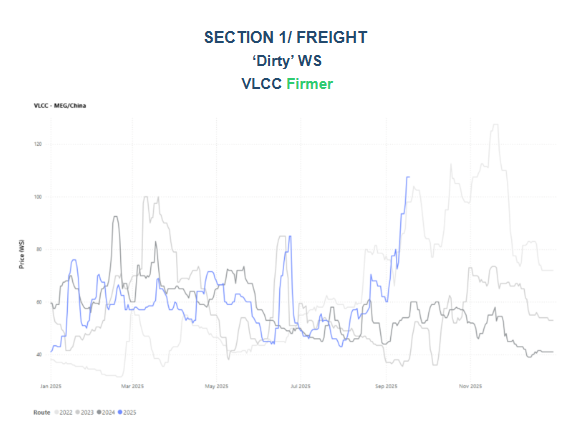

> **Figure 5: Στιγμιότυπο Οθόνης 2025 09 22 143715**  
> **Interactive Data & Source:** [Signal Ocean Platform](https://www.thesignalgroup.com/signal-ocean-platform) | [Local Asset](file:///C:/Users/Dell/Github/Shipping/corpus/03-breakwave/insights/2025/assets/2025-09-23_russian-oil-flows_img_cea3cf84ceb9ceb3cebcceb9cf8ccf84cf85_570d86a7804d.png)

In the third week of September, VLCC freight rates on the MEG-China route continued their significant ascent, exceeding WS100. This marks a 90% increase within a month, signaling a bullish market by month-end. The current surge in rates mirrors the pattern observed in September 2022, primarily driven by a noticeable decline in the number of vessels in the Arabian Gulf, as illustrated in the supply trend below.

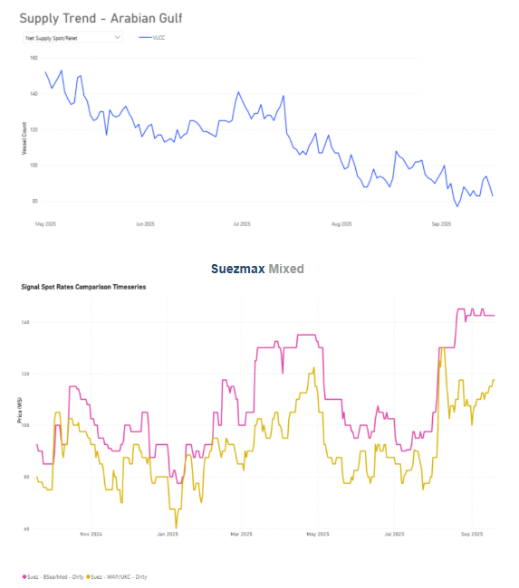

> **Figure 6: Στιγμιότυπο Οθόνης 2025 09 22 143800**  
> **Interactive Data & Source:** [Signal Ocean Platform](https://www.thesignalgroup.com/signal-ocean-platform) | [Local Asset](file:///C:/Users/Dell/Github/Shipping/corpus/03-breakwave/insights/2025/assets/2025-09-23_russian-oil-flows_img_cea3cf84ceb9ceb3cebcceb9cf8ccf84cf85_2d9235b1ce60.png)

Suezmax rates for the Black Sea – Mediterranean route saw a 36% quarter-on-quarter increase, holding at xsWS140. The West Africa - UKC route also continued its upward trajectory, reaching WS115 with a 4% weekly rise and a 27% quarterly increase.

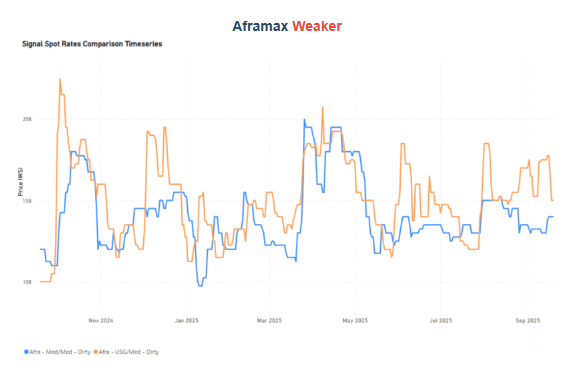

> **Figure 7: Στιγμιότυπο Οθόνης 2025 09 22 143845**  
> **Interactive Data & Source:** [Signal Ocean Platform](https://www.thesignalgroup.com/signal-ocean-platform) | [Local Asset](file:///C:/Users/Dell/Github/Shipping/corpus/03-breakwave/insights/2025/assets/2025-09-23_russian-oil-flows_img_cea3cf84ceb9ceb3cebcceb9cf8ccf84cf85_6f75c68e7027.png)

Aframax rates in the Mediterranean have recently seen a mild upward trend, reaching WS 140, a 40-point increase from the previous week. This follows a downward trend observed earlier in September. Meanwhile, the USG-Med route experienced a mid-September spike, but rates are now decreasing, settling at WS150, nearly 20 points lower than their recent peak.

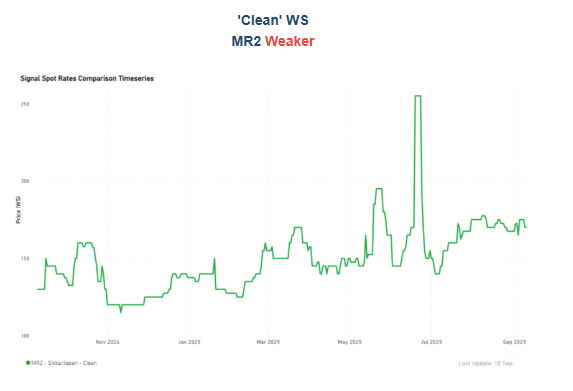

> **Figure 8: Στιγμιότυπο Οθόνης 2025 09 22 143925**  
> **Interactive Data & Source:** [Signal Ocean Platform](https://www.thesignalgroup.com/signal-ocean-platform) | [Local Asset](file:///C:/Users/Dell/Github/Shipping/corpus/03-breakwave/insights/2025/assets/2025-09-23_russian-oil-flows_img_cea3cf84ceb9ceb3cebcceb9cf8ccf84cf85_381d841e2fc6.png)

Freight rates for the Sikka-Japan route have dropped to WS 170, a significant decrease from mid-June when they exceeded WS 250. However, recent momentum shows a 10% quarterly increase.

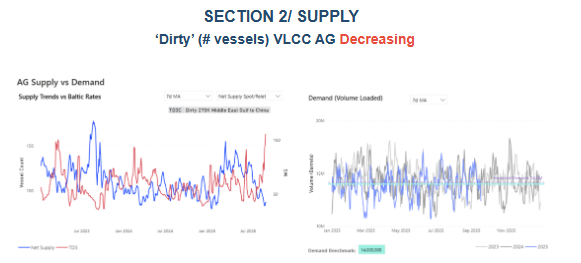

> **Figure 9: Στιγμιότυπο Οθόνης 2025 09 22 144824**  
> **Interactive Data & Source:** [Signal Ocean Platform](https://www.thesignalgroup.com/signal-ocean-platform) | [Local Asset](file:///C:/Users/Dell/Github/Shipping/corpus/03-breakwave/insights/2025/assets/2025-09-23_russian-oil-flows_img_cea3cf84ceb9ceb3cebcceb9cf8ccf84cf85_8432a046dbd5.png)

Ras Tanura has seen a consistent decrease in VLCC numbers throughout the summer, following a peak in early July. As noted in our previous weekly market monitor, this trend has continued for the third week of September. The vessel count has now reached a year-low of 85, leading to skyrocketing rates and a bullish market sentiment for the end of September.

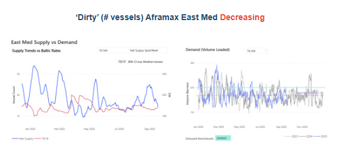

> **Figure 10: Στιγμιότυπο Οθόνης 2025 09 22 144922**  
> **Interactive Data & Source:** [Signal Ocean Platform](https://www.thesignalgroup.com/signal-ocean-platform) | [Local Asset](file:///C:/Users/Dell/Github/Shipping/corpus/03-breakwave/insights/2025/assets/2025-09-23_russian-oil-flows_img_cea3cf84ceb9ceb3cebcceb9cf8ccf84cf85_cf909eb843b0.png)

Although the number of Aframax vessels in the East Mediterranean has declined since late August, freight rates have failed to gain traction. The main constraint lies in demand: daily loaded volumes continue to average well below the 2 million-ton threshold. As a result, limited supply pressure has not translated into higher earnings, as subdued cargo activity continues to keep rates under downward pressure.

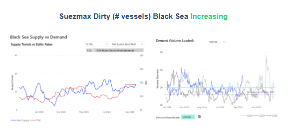

> **Figure 11: Στιγμιότυπο Οθόνης 2025 09 22 145011**  
> **Interactive Data & Source:** [Signal Ocean Platform](https://www.thesignalgroup.com/signal-ocean-platform) | [Local Asset](file:///C:/Users/Dell/Github/Shipping/corpus/03-breakwave/insights/2025/assets/2025-09-23_russian-oil-flows_img_cea3cf84ceb9ceb3cebcceb9cf8ccf84cf85_a346f891de41.png)

Black Sea Suezmax supply continues to rise, but the impact on freight rates remains muted as demand has stayed firm. Loaded volumes (14-day moving average) surged in September, holding above the 1.6 million mt benchmark, which has so far absorbed the additional tonnage and prevented a downward correction in the market.

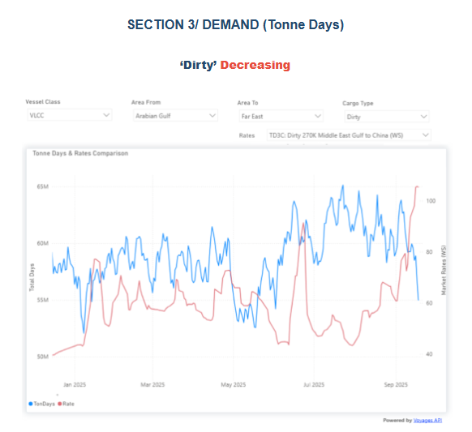

> **Figure 12: Στιγμιότυπο Οθόνης 2025 09 22 145105**  
> **Interactive Data & Source:** [Signal Ocean Platform](https://www.thesignalgroup.com/signal-ocean-platform) | [Local Asset](file:///C:/Users/Dell/Github/Shipping/corpus/03-breakwave/insights/2025/assets/2025-09-23_russian-oil-flows_img_cea3cf84ceb9ceb3cebcceb9cf8ccf84cf85_0dfff8c6721d.png)

Dirty tonne days: Despite a decreasing trend in dirty tonne-days for AG-China during September, the recent skyrocketing rates remain unaffected. This is due to a surprising tightening of the tonnage list, which is solidifying freight sentiment.

Data Source:[Signal Ocean Platform](https://www.thesignalgroup.com/signal-ocean-platform)

---

**Tags:** Tankers, Crude, Markets  
