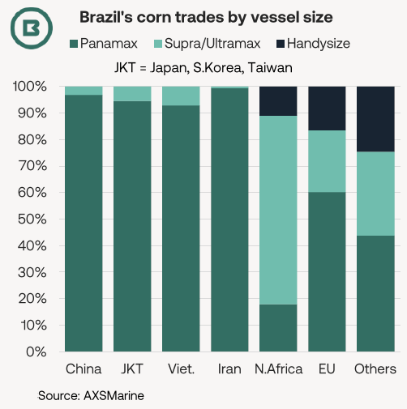
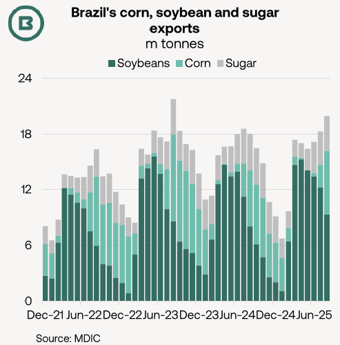
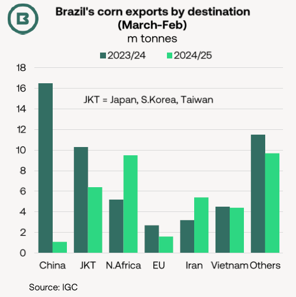
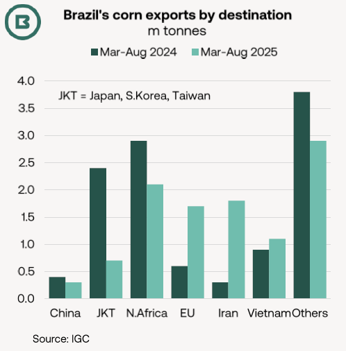

# How will Brazil’s corn trades affect Panamax and geared bulker demand?

**Date:** September 25, 2025  
**Publisher:** Breakwave Advisors | **Category:** Market Insights  
**Original URL:** [https://www.breakwaveadvisors.com/insights/2025/9/25/how-will-brazils-corn-trades-affect-panamax-and-geared-bulker-demand](https://www.breakwaveadvisors.com/insights/2025/9/25/how-will-brazils-corn-trades-affect-panamax-and-geared-bulker-demand)  

---

- *Brazil’s combined corn, soybean and bulk sugar trades in August were close to 20m tonnes, official data show, as the peak corn export season arrived (see light green series on the chart, right).*
- *Although corn exports from Brazil are set to fall below the 2023/24 all-time high this year due to (1) a “notable drop” in Chinese demand and (2) higher usage in domestic ethanol production, the International Grains Council (IGC) projected a 2m tonne yearly gain last week, involving a wide range of markets.*
- *What could this mean for Panamax and geared bulkers demand, respectively?*

Brazil’s corn trades have experienced significant re-routing over the last two years.

In 2023/24 (March-February), China was the dominant export market for Brazil’s corn, taking 16.5m tonnes of a 54.0m tonne total. For comparison, the second-largest destination that year, Japan, received fewer than 5m tonnes.

> **Figure 1: A368 Image 0 1758624425199**  
> [Local Asset](file:///C:/Users/Dell/Github/Shipping/corpus/03-breakwave/insights/2025/assets/2025-09-25_how-will-brazils-corn-trades-affect-panamax-and-geared-bulker-demand_img_a368-image-0-1758624425199_6ae6c5418ca7.png)

> **Figure 2: 1911 Image 1 1758624437686**  
> [Local Asset](file:///C:/Users/Dell/Github/Shipping/corpus/03-breakwave/insights/2025/assets/2025-09-25_how-will-brazils-corn-trades-affect-panamax-and-geared-bulker-demand_img_1911-image-1-1758624437686_7d20cd3483e7.png)

Then, in 2024/25, the Brazil-China corn trade slumped to 1.1m tonnes, and Brazil’s corn export total (to all markets) dropped almost 30% to 38.2m tonnes.

So, what does early season data tell us about Brazil’s corn trades this year and how could this affect demand for various bulker sectors?

Our first observation is that while a modest improvement in China’s corn import appetite is expected in this trade year, March-August shipments from Brazil to China were only 0.3m tonnes, marginally lower than last year (but all arrived in August after a six-month gap, so creating the highest month since January 2024).

Moreover, the corresponding March-August figure for the other Northeast Asian markets of Japan, South Korea and Taiwan combined of 0.7m tonnes lagged the year-ago (2.7m tonnes) by a large margin.

For Panamax demand, this has negative implications, given the large share of Brazil to East Asia corn trades.

Our second chart, left, outlines Brazil’s corn trades by destination and vessel size using AXSMarine data for the last two years.

In summary, voyages to Asia from Brazil are predominantly Panamax (defined here as 70-99.9k dwt), whereas the Supra/Ultramax fleet (45-99.9k dwt) is the largest individual sector involved in the trade to North Africa.

> **Figure 3: 2e2f Image 2 1758624461128**  
> [Local Asset](file:///C:/Users/Dell/Github/Shipping/corpus/03-breakwave/insights/2025/assets/2025-09-25_how-will-brazils-corn-trades-affect-panamax-and-geared-bulker-demand_img_2e2f-image-2-1758624461128_813c9175d481.png)

In place of Northeast Asia, other countries have assumed more importance for Brazil’s corn exporters. Together, Egypt, Iran and Vietnam (the three largest buyers) made up more than 40% of last year’s shipments.

Brazilian corn shipments to the EU have a more even split by vessel size (60% Panamax; 40% geared bulker by cargo volume). The EU, and Spain in particular, is important for Brazil’s corn exporters.

> **Figure 4: Ac72 Image 3 1758624477918**  
> [Local Asset](file:///C:/Users/Dell/Github/Shipping/corpus/03-breakwave/insights/2025/assets/2025-09-25_how-will-brazils-corn-trades-affect-panamax-and-geared-bulker-demand_img_ac72-image-3-1758624477918_ae12ebeebce5.png)

Volumes from Brazil to the EU remain below previous peaks owing to competition from Ukraine and the US (incidentally, the IGC adds that increased US price competitiveness has been a factor behind the downturn in Brazil’s corn exports to Japan, so creating more Panamax employment in the Pacific instead).

These changes explain the pronounced fall in the number of Panamax shipments, typically longhaul, (from 70% in August 2023 to 60% two years later), which has, in turn, boosted the share held by geared bulkers (from 23% to 26% for Supra/Ultramax and from 10% to 14% for Handysizes), according to AXSMarine.

---

**Tags:** Drybulk, Shipping, Markets  
