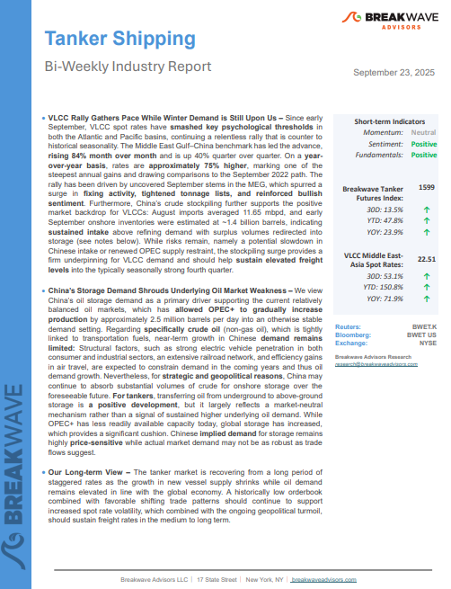
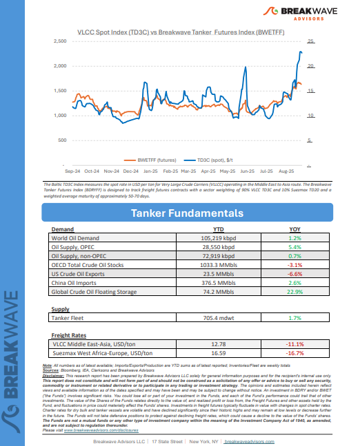
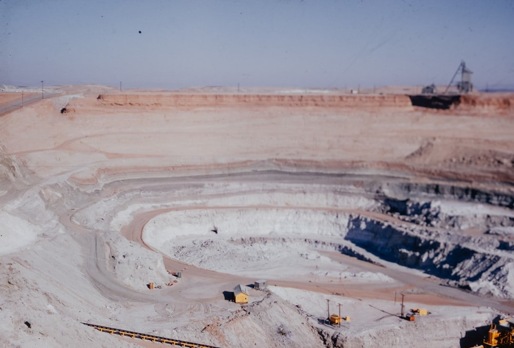

# Breakwave Weekend Read

**Date:** September 26, 2025  
**Publisher:** Breakwave Advisors | **Category:** Market Insights  
**Original URL:** [https://www.breakwaveadvisors.com/insights/2025919-weekly-gyt458-wdeww](https://www.breakwaveadvisors.com/insights/2025919-weekly-gyt458-wdeww)  

---

## Welcome Tobreakwave Advisorsweekend Read

***As the week comes to a close, take a moment to review the key insights from the past few days. Missed something? We've gathered all the top insights for you to catch up at your convenience.***

## Breakwave Shipping Report

**VLCC Rally Gathers Pace While Winter Demand is Still Upon Us**– Since early September, VLCC spot rates have**smashed key psychological thresholds**in both the Atlantic and Pacific basins, continuing a relentless rally that is counter to historical seasonality.

[Read More](https://www.breakwaveadvisors.com/insights/2025923wetreport5k889)

> **Figure 1: Στιγμιότυπο Οθόνης 2025 09 26 124516**  
> **Interactive Data & Source:** [Breakwave Advisors Market Insights](https://www.breakwaveadvisors.com/insights/2025/9/22/0yve3bbo06uw2fjj8spgpunuo550vo) | [Local Asset](file:///C:/Users/Dell/Github/Shipping/corpus/03-breakwave/insights/2025/assets/2025-09-26_2025919-weekly-gyt458-wdeww_img_cea3cf84ceb9ceb3cebcceb9cf8ccf84cf85_a8f300c333c5.png)

> **Figure 2: Στιγμιότυπο Οθόνης 2025 09 26 124528**  
> **Interactive Data & Source:** [Breakwave Advisors Market Insights](https://www.breakwaveadvisors.com/insights/2025/9/22/0yve3bbo06uw2fjj8spgpunuo550vo) | [Local Asset](file:///C:/Users/Dell/Github/Shipping/corpus/03-breakwave/insights/2025/assets/2025-09-26_2025919-weekly-gyt458-wdeww_img_cea3cf84ceb9ceb3cebcceb9cf8ccf84cf85_ba4a07c4f9ea.png)

## A Balancing Act – An Attempt to Nurture Economic Recovery

> **Figure 3: Unsplash Image Skfy8ljb7x4**  
> **Interactive Data & Source:** [Breakwave Advisors Market Insights](https://www.breakwaveadvisors.com/insights/2025/9/22/0yve3bbo06uw2fjj8spgpunuo550vo) | [Local Asset](file:///C:/Users/Dell/Github/Shipping/corpus/03-breakwave/insights/2025/assets/2025-09-26_2025919-weekly-gyt458-wdeww_img_unsplash-image-skfy8ljb7x4_ccb232fcbeeb.jpg)

One year ago this week, the U.S. Federal Reserve commanded global attention by cutting interest rates for the first time in more than four years, delivering a bold 50 basis point reduction that brought the federal funds target range down to 4.75-5.00 percent.

Doric Weekly Market Insights

## Even More Global Grain Exports Now Expected

> **Figure 4: Unsplash Image Lxjvlftfbs4**  
> **Interactive Data & Source:** [Breakwave Advisors Market Insights](https://www.breakwaveadvisors.com/insights/2025/9/22/even-more-global-grain-exports-now-expected) | [Local Asset](file:///C:/Users/Dell/Github/Shipping/corpus/03-breakwave/insights/2025/assets/2025-09-26_2025919-weekly-gyt458-wdeww_img_unsplash-image-lxjvlftfbs4_0318171d6d39.jpg)

The United States Department of Agriculture (USDA) has released its latest forecast for the upcoming 2025/26 grain trade season..

From Commodore's Weekly Dry Bulk Reports

## Russian Oil Flows

> **Figure 5: Unsplash Image Ae8vuq1rlj8**  
> **Interactive Data & Source:** [Breakwave Advisors Market Insights](https://www.breakwaveadvisors.com/insights/2025/9/22/russian-oil-flows) | [Local Asset](file:///C:/Users/Dell/Github/Shipping/corpus/03-breakwave/insights/2025/assets/2025-09-26_2025919-weekly-gyt458-wdeww_img_unsplash-image-ae8vuq1rlj8_e623cdccab86.jpg)

This week’s focus is on the volatility of dirty oil flows from the Baltic Sea's upper region.

Signal Ocean Tanker Weekly Market Monitor

## African Iron Ore Meet Gulf Steel Ambitions

> **Figure 6: Pexels Fabrizio Zini 606841368 19500302**  
> **Interactive Data & Source:** [Breakwave Advisors Market Insights](https://www.breakwaveadvisors.com/insights/2025/9/24/african-iron-ore-meet-gulf-steel-ambitions) | [Local Asset](file:///C:/Users/Dell/Github/Shipping/corpus/03-breakwave/insights/2025/assets/2025-09-26_2025919-weekly-gyt458-wdeww_img_pexels-fabrizio-zini-606841368-19500_db5775946972.jpg)

In late August, according to Mysteel reports, Mauritania’s state-owned mining company SNIM and Saudi Arabia’s steel company Hadeed announced plans to establish a joint venture to develop an iron ore mine in Mauritania,

BRS Weekly Dry Bulk Newsletter

## A Three-Tier Tanker Market

> **Figure 7: Unsplash Image Fthjdjetimq**  
> **Interactive Data & Source:** [Breakwave Advisors Market Insights](https://www.breakwaveadvisors.com/insights/2025/9/24/a-three-tier-tanker-market) | [Local Asset](file:///C:/Users/Dell/Github/Shipping/corpus/03-breakwave/insights/2025/assets/2025-09-26_2025919-weekly-gyt458-wdeww_img_unsplash-image-fthjdjetimq_f9d9cefc29b4.jpg)

The illicit trading debate in shipping sharpened this month, with the U.S. Senate introducing the SHADOW Fleets Act to impose new sanctions on Russia’s “shadow fleet.”

Allied Weekly Report

## Implications on Raw Material Flows

> **Figure 8: Unsplash Image C6n81yfspi0**  
> **Interactive Data & Source:** [Breakwave Advisors Market Insights](https://www.breakwaveadvisors.com/insights/2025/9/25/implications-on-raw-material-flows) | [Local Asset](file:///C:/Users/Dell/Github/Shipping/corpus/03-breakwave/insights/2025/assets/2025-09-26_2025919-weekly-gyt458-wdeww_img_unsplash-image-c6n81yfspi0_304091f0ca3b.jpg)

China’s aluminium powerhouse is approaching a hard ceiling.

Intermodal Weekly Market Report

## How Will Brazil’s Corn Trades Affect Panamax and Geared Bulker Demand?

> **Figure 9: Pexels Danail Vasilev 247861001 29887019**  
> **Interactive Data & Source:** [Breakwave Advisors Market Insights](https://www.breakwaveadvisors.com/insights/2025/9/25/how-will-brazils-corn-trades-affect-panamax-and-geared-bulker-demand) | [Local Asset](file:///C:/Users/Dell/Github/Shipping/corpus/03-breakwave/insights/2025/assets/2025-09-26_2025919-weekly-gyt458-wdeww_img_pexels-danail-vasilev-247861001-2988_48e264123be8.jpg)

Brazil’s corn trades have experienced significant re-routing over the last two years.

Braemar Dry Bulk 360 Degrees

## Consumption Growth in China's Retail Sector Remains Well Below 2025's Peak

> **Figure 10: Unsplash Image Njubfl1oc3y**  
> **Interactive Data & Source:** [Breakwave Advisors Market Insights](https://www.breakwaveadvisors.com/insights/2025/9/26/consumption-growth-in-chinas-retail-sector-remains-well-below-2025s-peak) | [Local Asset](file:///C:/Users/Dell/Github/Shipping/corpus/03-breakwave/insights/2025/assets/2025-09-26_2025919-weekly-gyt458-wdeww_img_unsplash-image-njubfl1oc3y_b287ad3062be.jpg)

As we discussed in Commodore Research’s most recent Weekly China Report, China’s retail sales in August grew year-on-year by 3.4%, which has marked the lowest growth seen since November.

From Commodore's Weekly Dry Bulk Reports

## Vlccs in the Spotlight

> **Figure 11: Pexels Ranjith Ar 6835 40642**  
> **Interactive Data & Source:** [Breakwave Advisors Market Insights](https://www.breakwaveadvisors.com/insights/2025/9/26/vlccs-in-the-spotlight) | [Local Asset](file:///C:/Users/Dell/Github/Shipping/corpus/03-breakwave/insights/2025/assets/2025-09-26_2025919-weekly-gyt458-wdeww_img_pexels-ranjith-ar-6835-40642_8327158c677c.jpg)

The VLCC sector has returned to the center of attention, with spot freight rates soaring in September to levels close to $100,000 per day on certain routes.

Novisea

## Coal Market Insights

> **Figure 12: Unsplash Image Qcb Fzt35s**  
> **Interactive Data & Source:** [Breakwave Advisors Market Insights](https://www.breakwaveadvisors.com/insights/2025/9/26/coal-market-insights) | [Local Asset](file:///C:/Users/Dell/Github/Shipping/corpus/03-breakwave/insights/2025/assets/2025-09-26_2025919-weekly-gyt458-wdeww_img_unsplash-image-qcb-fzt35s_bf5418ec570c.jpg)

Global coal demand reached 8.79 billion tons in 2024, marking a new record.

Signal Ocean Dry Weekly Market Monitor

---

**Tags:** Shipping, Tankers, Drybulk  
