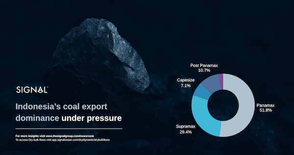
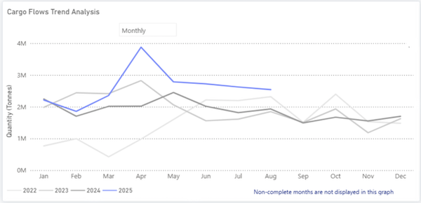
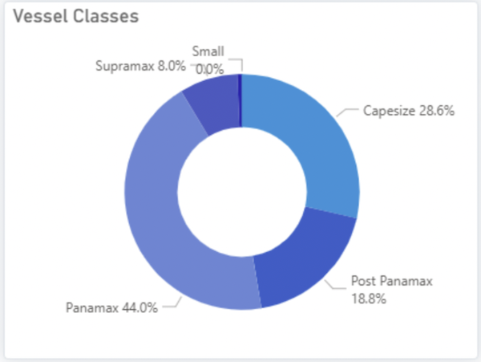
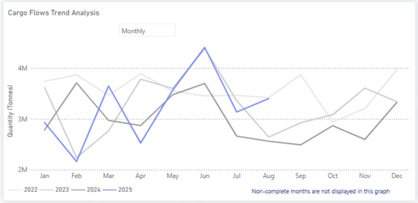
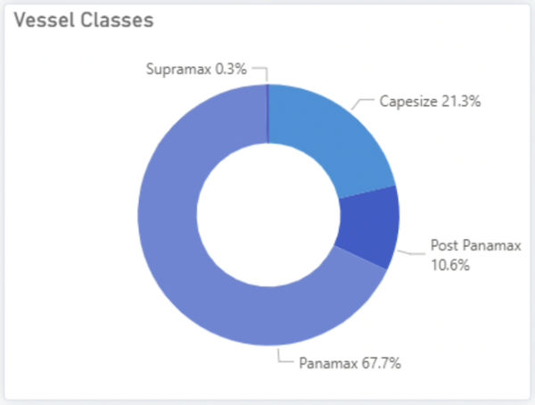
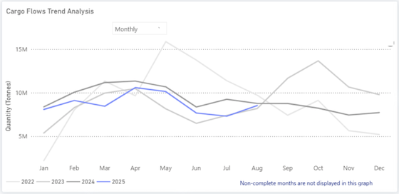
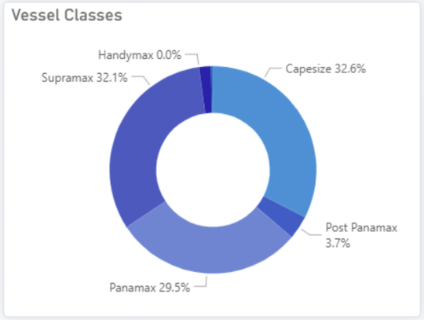
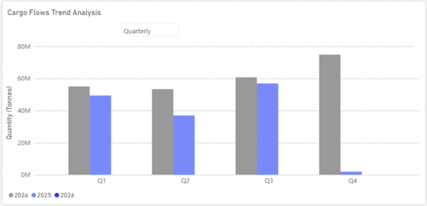
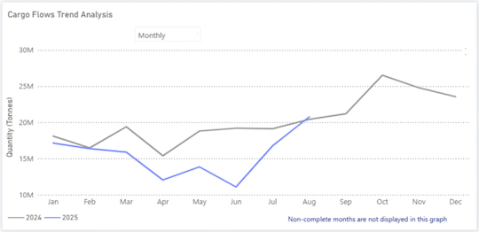

# Coal Market Insights

**Date:** September 26, 2025  
**Publisher:** Breakwave Advisors | **Category:** Market Insights  
**Original URL:** [https://www.breakwaveadvisors.com/insights/2025/9/26/coal-market-insights](https://www.breakwaveadvisors.com/insights/2025/9/26/coal-market-insights)  

---

> **Figure 1: Market Chart 1**  
> **Interactive Data & Source:** [Signal Ocean Platform](https://www.thesignalgroup.com/signal-ocean-platform) | [Local Asset](file:///C:/Users/Dell/Github/Shipping/corpus/03-breakwave/insights/2025/assets/2025-09-26_coal-market-insights_img_unnamed_947cab049f02.png)

### Global Perspective

Global coal demand reached 8.79 billion tons in 2024, marking a new record. According to the IEA’s Coal Mid-Year Update 2025 (July, 2025), consumption is expected to plateau at similar levels in 2025, reflecting a critical shift.

In China, coal demand fell by around 0.5% in the first half of 2025, as electricity demand growth slowed and renewable generation expanded. This contraction, alongside a 3% decline in coal-fired power generation, suggests that China is entering a phase where renewables and efficiency gains can begin to curb coal growth. Coal, however, still underpins system stability. In India, first-half demand also dipped (–2.1% y/y in the power sector), yet the IEA projects a 1.3% annual increase for 2025.

By contrast, the United States is an outlier among advanced economies. Coal demand rose 12% in H1 2025, and full-year growth is projected at 7% (to ~400 Mt), driven by robust electricity demand and elevated natural gas prices. In the European Union, coal use increased in the power sector during the first half of 2025, reflecting weaker hydro and wind output as well as higher gas prices.

Looking ahead, the IEA expects global demand in 2026 to fall marginally below 2024 levels, signaling the beginning of a potential downward phase. However, supply remains abundant: coal production is projected to exceed 9.2 billion tons in 2025, led by China and India, with incremental U.S. growth offsetting Indonesia’s decline. This supply expansion, in the context of flat demand, could exert downward pressure on prices and trade flows. Global coal trade is forecast to contract in 2025, the first decline since the COVID-19 shock of 2020, with another drop expected in 2026. If confirmed, this would mark the first consecutive two-year decline in seaborne coal trade in the 21st century, a development that could reshape freight markets and alter vessel employment patterns.

### Indonesia: Export Giant Under Pressure

Indonesia, the world’s largest exporter of thermal coal, has sharply expanded output over the past two decades, from about 557 million tons in 2018 to about 775 million tons in 2023, according to the Ministry of Energy & Mineral Resources. In 2024, production rose further to around 836 million tons. China and India remain Indonesia’s two biggest markets. Chinese buyers have openly resisted the government’s HBA benchmark pricing, while India has continued importing large volumes, albeit with periodic shifts in buying patterns.

In March 2025, the government required that all coal transactions use its benchmark price (Harga Batubara Acuan, HBA) as a minimum, updated twice a month. The rule faced resistance from exporters and buyers, particularly in China, and in late August 2025, the government rescinded the requirement. Producers are no longer obliged to sell at benchmark levels, but taxes, royalties, and levies continue to be calculated on the HBA, leaving miners exposed to the spread between official valuations and actual market prices.

### India: Expanding Production, Rising Steel Ambitions

India's coal market is set for substantial growth. The nation's domestic coal production, which was approximately 1.05 billion tons in FY25, is projected to climb by 42% to nearly 1.53 billion tons by FY30. This expansion is driven by New Delhi's strategy to meet escalating electricity demand and lessen its reliance on thermal coal imports. Concurrently, the steel sector is becoming the primary catalyst for coking coal demand, with consumption anticipated to increase by about 55% by 2030, from roughly 87 million tons to 135 million tons. Despite initiatives to enhance beneficiation and diversify supply, India is expected to remain dependent on imports for the majority of its coking coal requirements throughout the decade.

Beyond India’s expanding domestic output and steel-driven demand, shifting trade flows are reshaping coal supply dynamics, with Russia and Australia regaining ground in the Indian import mix. Coal shipments from Russia to India have increased substantially this year compared to the first eight months of last year. After reaching a high of almost 4 million metric tons in April, shipments leveled off, consistently surpassing an average of 2.5 million metric tons per month between June and August.

> **Figure 2: Market Chart 2**  
> **Interactive Data & Source:** [Signal Ocean Platform](https://www.thesignalgroup.com/signal-ocean-platform) | [Local Asset](file:///C:/Users/Dell/Github/Shipping/corpus/03-breakwave/insights/2025/assets/2025-09-26_coal-market-insights_img_unnamed28129_e0dc5f7e26b3.png)

> **Figure 3: Market Chart 3**  
> **Interactive Data & Source:** [Signal Ocean Platform](https://www.thesignalgroup.com/signal-ocean-platform) | [Local Asset](file:///C:/Users/Dell/Github/Shipping/corpus/03-breakwave/insights/2025/assets/2025-09-26_coal-market-insights_img_unnamed28229_90a1d43148f1.png)

metallurgical coal shipments have shown significant strength since May 2025, reaching around 3.4 million metric tons in August. This follows a peak of 4.4 million metric tons at the end of June, a typical seasonal high driven by fiscal year-end production efforts and increased Asian steel demand. While current year trends mirror the strong monthly activity seen in 2022, Australian exporters are now facing heightened competition from Russia. Additionally, miners continue to grapple with escalating costs and substantial Queensland royalty burdens, which are jeopardizing the profitability of higher-cost operations.

> **Figure 4: Australia's**  
> **Interactive Data & Source:** [Signal Ocean Platform](https://www.thesignalgroup.com/signal-ocean-platform) | [Local Asset](file:///C:/Users/Dell/Github/Shipping/corpus/03-breakwave/insights/2025/assets/2025-09-26_coal-market-insights_img_unnamed28329_102c2aaadbd5.png)

> **Figure 5: Market Chart 5**  
> **Interactive Data & Source:** [Signal Ocean Platform](https://www.thesignalgroup.com/signal-ocean-platform) | [Local Asset](file:///C:/Users/Dell/Github/Shipping/corpus/03-breakwave/insights/2025/assets/2025-09-26_coal-market-insights_img_unnamed28429_fbbaea6eb2d7.png)

While coal shipments from Russia and Australia increased,coal shipments reached a record low in July, mirroring July 2022 figures. Shipments fell to 7 million metric tons before recovering to approximately 8.5 million metric tons by the end of August. These volumes, however, remain below the May 2022 peak of about 16 million metric tons.

> **Figure 6: Indonesian**  
> **Interactive Data & Source:** [Signal Ocean Platform](https://www.thesignalgroup.com/signal-ocean-platform) | [Local Asset](file:///C:/Users/Dell/Github/Shipping/corpus/03-breakwave/insights/2025/assets/2025-09-26_coal-market-insights_img_unnamed28529_811fd35a1834.png)

> **Figure 7: Market Chart 7**  
> **Interactive Data & Source:** [Signal Ocean Platform](https://www.thesignalgroup.com/signal-ocean-platform) | [Local Asset](file:///C:/Users/Dell/Github/Shipping/corpus/03-breakwave/insights/2025/assets/2025-09-26_coal-market-insights_img_unnamed28629_f8cbcc3a5d19.png)

### China: Balancing Coal Growth with Renewables

China presents a complex balance between fossil fuels and clean energy. In the first half of 2025, the country approved roughly 25 GW of new coal power projects and commissioned another 21 GW, the highest level of first-half commissioning since 2016, keeping coal deeply embedded in its energy system (CREA/GEM, Aug 2025). Record additions of solar and wind accelerated the shift in China’s generation mix, lowering coal’s share to about 50% (CREA, Aug 2025).

**Coal imports, however, tell a different story**. In Q2 2025, shipments from Indonesia to China fell by nearly, reflecting weaker demand and strong domestic supply.

> **Figure 8: 30% Year-on-Year**  
> **Interactive Data & Source:** [Signal Ocean Platform](https://www.thesignalgroup.com/signal-ocean-platform) | [Local Asset](file:///C:/Users/Dell/Github/Shipping/corpus/03-breakwave/insights/2025/assets/2025-09-26_coal-market-insights_img_unnamed28729_2c8a7ee953a7.png)

By late summer, though, volumes had clearly rebounded: estimated cargoes in July, August, and the first 20 days of September were about 50% higher than in Q1 2025, though still around 6% below the same period in 2024. In August 2025, import volumes reached their highest point for the year, highlighting the impact of domestic supply constraints on trade. According to the National Bureau of Statistics of China, raw coal output slipped by 2.5% YoY to 380 Mt in August 2025 as safety inspections constrained production. With summer heat lifting power demand and drought curbing hydropower, utilities leaned more heavily on seaborne coal to bridge the gap.

> **Figure 9: Market Chart 9**  
> **Interactive Data & Source:** [Signal Ocean Platform](https://www.thesignalgroup.com/signal-ocean-platform) | [Local Asset](file:///C:/Users/Dell/Github/Shipping/corpus/03-breakwave/insights/2025/assets/2025-09-26_coal-market-insights_img_unnamed28829_0dd5c69f3582.png)

### Key Takeaways

Looking ahead, the challenge lies in coal’s uncertain trajectory. Although both China and India have shown signs of moderating coal imports, coal remains firmly embedded in their energy mix. The freight market must contend with Asian governments’ plans to expand domestic supply, which could limit import growth from today's picture onwards, while demand for high-CV coal persists. The key question is whether longer-haul flows from exporters such as South Africa and Colombia can offset the gradual erosion of Indonesia’s market share, and how this balance will influence tonne-mile demand going forward.

Data Source:[Signal Ocean Platform](https://www.thesignalgroup.com/signal-ocean-platform)

---

**Tags:** Drybulk, Shipping, Coal  
