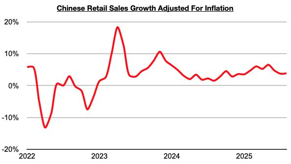
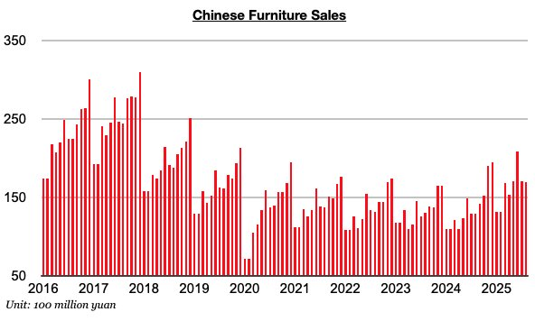

# Consumption Growth in China's Retail Sector Remains Well Below 2025's Peak

**Date:** September 26, 2025  
**Publisher:** Breakwave Advisors | **Category:** Market Insights  
**Original URL:** [https://www.breakwaveadvisors.com/insights/2025/9/26/consumption-growth-in-chinas-retail-sector-remains-well-below-2025s-peak](https://www.breakwaveadvisors.com/insights/2025/9/26/consumption-growth-in-chinas-retail-sector-remains-well-below-2025s-peak)  

---

*By*[*Jeffrey Landsberg*](https://www.linkedin.com/in/jeffrey-landsberg-70ab957/)

As we discussed in Commodore Research’s most recent Weekly China Report, China’s retail sales in August grew year-on-year by 3.4%, which has marked the lowest growth seen since November. Taking August’s 0.4% deflation into account, retail sales adjusted for inflation/deflation grew year-on-year by 3.8%. This is just above the 3.7% seen in July. Overall, consumption growth in China's retail sector remains well below this year's peak. China's industrial sector continues to fare better than the retail sector.

> **Figure 1: Chart 1**  
> [Local Asset](file:///C:/Users/Dell/Github/Shipping/corpus/03-breakwave/insights/2025/assets/2025-09-26_consumption-growth-in-chinas-retail-sector-remains-well-below-2025s-peak_img_chart1_8632bf6d92eb.jpg)

While growth remains below this year’s peak, important is that retail sales growth has at least again come in higher than any inflation. This has now occurred for thirty-two straight months. Prior to the last thirty-two months, retail sales came in lower than inflation for four straight months. Of note on the consumer side is that furniture sales, clothing sales, and appliance sales (which includes consumer electronics) again all experienced year-on-year growth. Furniture sales continue to fare the best.

Furniture sales in China in August increased year-on-year by 31%. They have now grown on a year-on-year basis in sixteen of the last seventeen months. Prior to October, the year-on-year growth during this period was averaging just 2%. Growth has stayed strong — but August's most recent 31% year-on-year growth has notably marked the lowest growth seen since February.

> **Figure 2: Chart 2**  
> [Local Asset](file:///C:/Users/Dell/Github/Shipping/corpus/03-breakwave/insights/2025/assets/2025-09-26_consumption-growth-in-chinas-retail-sector-remains-well-below-2025s-peak_img_chart2_873a3edd8d8d.jpg)

---

**Tags:** China, Economy, Markets  
