# Argentina soybeans to China

**Date:** September 29, 2025  
**Publisher:** Breakwave Advisors | **Category:** Market Insights  
**Original URL:** [https://www.breakwaveadvisors.com/insights/2025/9/29/argentina-soybeans-to-china](https://www.breakwaveadvisors.com/insights/2025/9/29/argentina-soybeans-to-china)  

---

### Weekly Dry Market Monitor

Spot Rates | Supply-Demand Trends | Port Congestion Overview

Week 39, 25 Sept, 2025

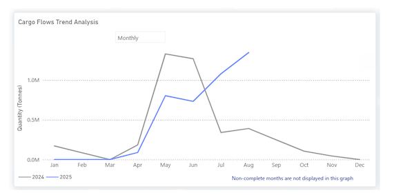

> **Figure 1: Στιγμιότυπο Οθόνης 2025 09 29 105344**  
> **Interactive Data & Source:** [Signal Ocean Platform](https://www.thesignalgroup.com/signal-ocean-platform) | [Local Asset](file:///C:/Users/Dell/Github/Shipping/corpus/03-breakwave/insights/2025/assets/2025-09-29_argentina-soybeans-to-china_img_cea3cf84ceb9ceb3cebcceb9cf8ccf84cf85_bdffeb9b2e57.png)

**Soybean**flows from Argentina to China in 2025 tell a striking turnaround story. Early in the year, shipments (blue line) lagged 2024 levels (grey line), but from April onward, they overtook them and stayed strong through Q3. The April harvest ignited momentum, and the mid-year slump that weighed on 2024 was largely avoided. Soybeans now account for 67% of Argentina’s agricultural dry bulk exports, with China absorbing 86% of that volume.

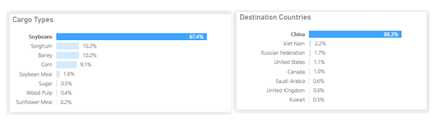

> **Figure 2: Στιγμιότυπο Οθόνης 2025 09 29 105534**  
> **Interactive Data & Source:** [Signal Ocean Platform](https://www.thesignalgroup.com/signal-ocean-platform) | [Local Asset](file:///C:/Users/Dell/Github/Shipping/corpus/03-breakwave/insights/2025/assets/2025-09-29_argentina-soybeans-to-china_img_cea3cf84ceb9ceb3cebcceb9cf8ccf84cf85_2ffe851307b8.png)

China’s demand is on track for record import volumes as it builds reserves ahead of Q4. That surge is underpinned by the revival of the domestic livestock sector, which supports robust soymeal consumption.

Strategically, China has withdrawn from U.S. sourcing at the onset of harvest. New American soybean sales in September were minimal, according to trade watchers. Instead, the latest trade news indicates Chinese crushers secured as many as 20 Argentine cargoes (roughly 1.3 million tonnes) in late September. This uptick aligns with reports that Buenos Aires has temporarily suspended export taxes, thereby sharpening the price competitiveness of Argentine beans and encouraging farmers to sell.

Meanwhile,, the dominant global supplier, experienced a seasonal dip in exports in August, falling below its June peak of 10 million tons, creating space for Argentine beans to capture more market share. After the severe drought in 2023, Argentina’s 2025 harvest rebound seems to have been crucial, serving as a swing supplier, stepping in with additional volumes during Brazil’s seasonal slowdown and reduced U.S. flows, to help meet China’s increasing demand.

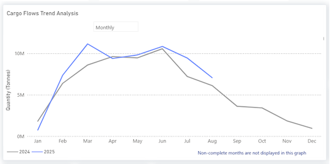

> **Figure 3: Brazil**  
> **Interactive Data & Source:** [Signal Ocean Platform](https://www.thesignalgroup.com/signal-ocean-platform) | [Local Asset](file:///C:/Users/Dell/Github/Shipping/corpus/03-breakwave/insights/2025/assets/2025-09-29_argentina-soybeans-to-china_img_unnamed_cf5e36b5e5ab.png)

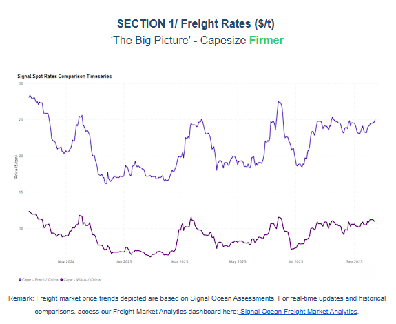

> **Figure 4: Στιγμιότυπο Οθόνης 2025 09 29 105700**  
> **Interactive Data & Source:** [Signal Ocean Platform](https://www.thesignalgroup.com/signal-ocean-platform) | [Local Asset](file:///C:/Users/Dell/Github/Shipping/corpus/03-breakwave/insights/2025/assets/2025-09-29_argentina-soybeans-to-china_img_cea3cf84ceb9ceb3cebcceb9cf8ccf84cf85_9e637f9382cc.png)

In the final days of September, both the C3 and C5 routes are continuing their upward trajectory. The Brazil–China rate (C3) has reached $26 per ton, marking a 6.5% increase week-on-week, while the Australia–China rate (C5) is nearing $11 per ton. The decrease in ballast available for the Capesize South Atlantic market during September suggests a reduction in oversupply. This, coupled with sustained iron ore exports from Brazil, is driving demand for tonnage. On the C5 route, consistent miner activity continues to push daily loaded volumes above the 2 million metric ton demand benchmark.

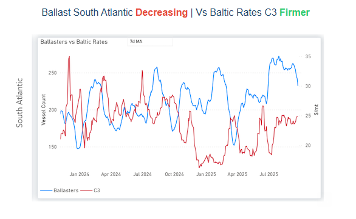

> **Figure 5: Στιγμιότυπο Οθόνης 2025 09 29 105744**  
> **Interactive Data & Source:** [Signal Ocean Platform](https://www.thesignalgroup.com/signal-ocean-platform) | [Local Asset](file:///C:/Users/Dell/Github/Shipping/corpus/03-breakwave/insights/2025/assets/2025-09-29_argentina-soybeans-to-china_img_cea3cf84ceb9ceb3cebcceb9cf8ccf84cf85_bdfa0aa49aa8.png)

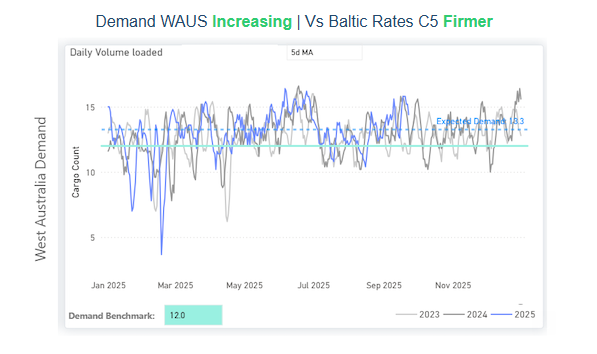

> **Figure 6: Στιγμιότυπο Οθόνης 2025 09 29 105752**  
> **Interactive Data & Source:** [Signal Ocean Platform](https://www.thesignalgroup.com/signal-ocean-platform) | [Local Asset](file:///C:/Users/Dell/Github/Shipping/corpus/03-breakwave/insights/2025/assets/2025-09-29_argentina-soybeans-to-china_img_cea3cf84ceb9ceb3cebcceb9cf8ccf84cf85_8c38e77d87e4.png)

Panamax - ECSA / Far East | USG / China**Weaker**

**Panamax**spot rates for routes from East Coast South America (ECSA) and the US Gulf (USG) to the Far East have recently experienced downward pressure as the month concludes. Specifically, ECSA to Far East prices are down to $35/ton from the peak seen in mid-July of $38/ton. Panamax ballasters heading to ECSA are now indicating an increase to a 7-day MA of nearly 240 from the lows of 210 in early September.

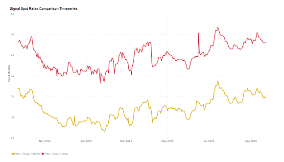

> **Figure 7: Στιγμιότυπο Οθόνης 2025 09 29 105855**  
> **Interactive Data & Source:** [Signal Ocean Platform](https://www.thesignalgroup.com/signal-ocean-platform) | [Local Asset](file:///C:/Users/Dell/Github/Shipping/corpus/03-breakwave/insights/2025/assets/2025-09-29_argentina-soybeans-to-china_img_cea3cf84ceb9ceb3cebcceb9cf8ccf84cf85_060dadb24d5c.png)

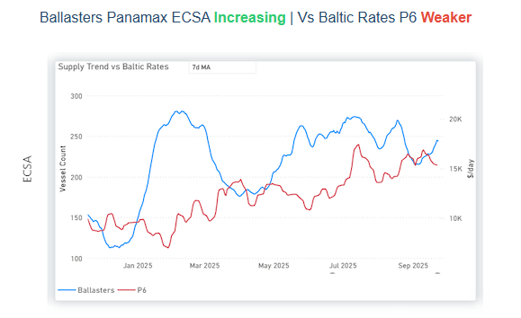

> **Figure 8: Στιγμιότυπο Οθόνης 2025 09 29 105905**  
> **Interactive Data & Source:** [Signal Ocean Platform](https://www.thesignalgroup.com/signal-ocean-platform) | [Local Asset](file:///C:/Users/Dell/Github/Shipping/corpus/03-breakwave/insights/2025/assets/2025-09-29_argentina-soybeans-to-china_img_cea3cf84ceb9ceb3cebcceb9cf8ccf84cf85_ea0a2c2582b7.png)

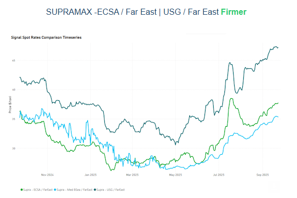

> **Figure 9: Στιγμιότυπο Οθόνης 2025 09 29 105913**  
> **Interactive Data & Source:** [Signal Ocean Platform](https://www.thesignalgroup.com/signal-ocean-platform) | [Local Asset](file:///C:/Users/Dell/Github/Shipping/corpus/03-breakwave/insights/2025/assets/2025-09-29_argentina-soybeans-to-china_img_cea3cf84ceb9ceb3cebcceb9cf8ccf84cf85_51c87f65051a.png)

Supramax spot rates have continued their upward trend throughout September, even as the net fleet supply increased to 130 vessels. The ongoing US-China agricultural dispute has shifted export demand toward Brazil and Argentina, boosting market sentiment for cargoes moving from ECSA to the Far East. This surge in the ECSA freight market appears to be spilling over into the US Gulf and Mediterranean/Black Sea routes, strengthening links to the Far Eastern market.

Rates for the East Coast South America (ECSA) to Far East route have reached a high of $36/tonne, reflecting a 9% increase over the last month.

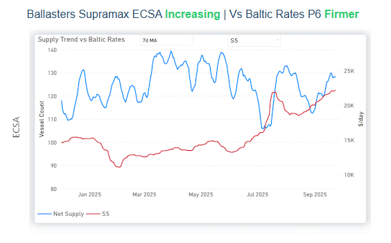

> **Figure 10: Στιγμιότυπο Οθόνης 2025 09 29 110047**  
> **Interactive Data & Source:** [Signal Ocean Platform](https://www.thesignalgroup.com/signal-ocean-platform) | [Local Asset](file:///C:/Users/Dell/Github/Shipping/corpus/03-breakwave/insights/2025/assets/2025-09-29_argentina-soybeans-to-china_img_cea3cf84ceb9ceb3cebcceb9cf8ccf84cf85_66c3d92ff7c5.png)

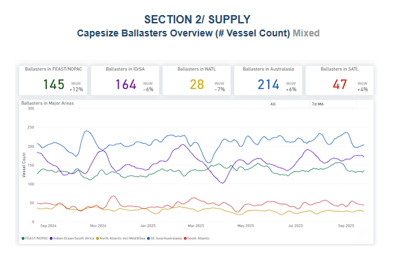

> **Figure 11: Στιγμιότυπο Οθόνης 2025 09 29 110124**  
> **Interactive Data & Source:** [Signal Ocean Platform](https://www.thesignalgroup.com/signal-ocean-platform) | [Local Asset](file:///C:/Users/Dell/Github/Shipping/corpus/03-breakwave/insights/2025/assets/2025-09-29_argentina-soybeans-to-china_img_cea3cf84ceb9ceb3cebcceb9cf8ccf84cf85_61ae4e4132c0.png)

**Capesize ballasters view**: In the Atlantic, the South Atlantic region experienced a 4% increase, while the North Atlantic saw 7% decrease. Meanwhile, the Pacific region continues to show improved absorption of ballasters in the Indian Ocean, while an increase of 12% is recorded in the Far East/NOPAC and 6% in Australasia.

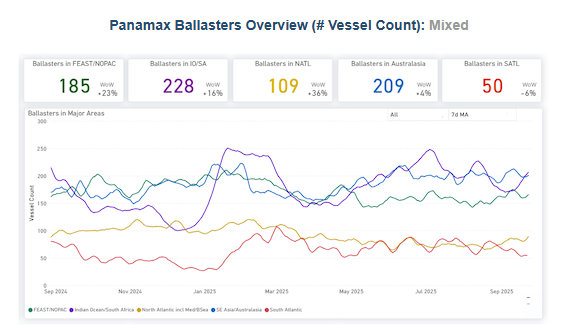

> **Figure 12: Στιγμιότυπο Οθόνης 2025 09 29 110220**  
> **Interactive Data & Source:** [Signal Ocean Platform](https://www.thesignalgroup.com/signal-ocean-platform) | [Local Asset](file:///C:/Users/Dell/Github/Shipping/corpus/03-breakwave/insights/2025/assets/2025-09-29_argentina-soybeans-to-china_img_cea3cf84ceb9ceb3cebcceb9cf8ccf84cf85_ad60711fa2e7.png)

**Panamax ballasters view:**There's a noticeable uptick in the number of ballasters in the Pacific and North Atlantic regions. The Indian Ocean experienced a 16% rise, while the North Atlantic saw an even more significant increase of 36%.

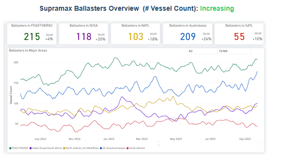

> **Figure 13: Στιγμιότυπο Οθόνης 2025 09 29 110333**  
> **Interactive Data & Source:** [Signal Ocean Platform](https://www.thesignalgroup.com/signal-ocean-platform) | [Local Asset](file:///C:/Users/Dell/Github/Shipping/corpus/03-breakwave/insights/2025/assets/2025-09-29_argentina-soybeans-to-china_img_cea3cf84ceb9ceb3cebcceb9cf8ccf84cf85_8d8399e59f75.png)

**Supramax ballasters view**: Oversupply persists in the Pacific basin, evidenced by a 24% increase in ballasters in Australasia and a 20% increase in the Indian Ocean/South Africa region. The Atlantic also saw a significant rise, with a 10% increase in the South and an 18% increase in the North.

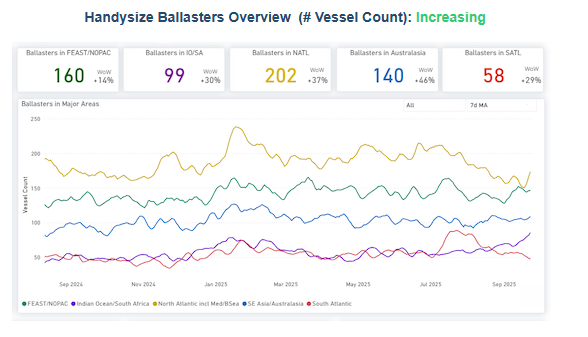

> **Figure 14: Στιγμιότυπο Οθόνης 2025 09 29 110430**  
> **Interactive Data & Source:** [Signal Ocean Platform](https://www.thesignalgroup.com/signal-ocean-platform) | [Local Asset](file:///C:/Users/Dell/Github/Shipping/corpus/03-breakwave/insights/2025/assets/2025-09-29_argentina-soybeans-to-china_img_cea3cf84ceb9ceb3cebcceb9cf8ccf84cf85_0a70811cf649.png)

**Handysize ballasters**: Both the Pacific and Atlantic basins continued to show significant growth. The Far East/NOPAC region in the Pacific experienced a 14% increase, with Australasia seeing a 46% rise. In the Atlantic, the number of ballasters grew by 37% in the North and 29% in the South.

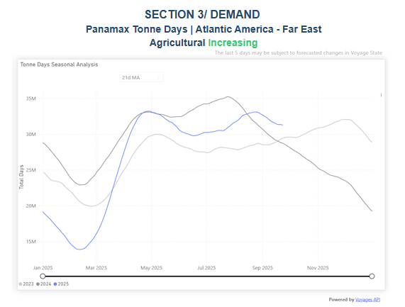

> **Figure 15: Στιγμιότυπο Οθόνης 2025 09 29 110523**  
> **Interactive Data & Source:** [Signal Ocean Platform](https://www.thesignalgroup.com/signal-ocean-platform) | [Local Asset](file:///C:/Users/Dell/Github/Shipping/corpus/03-breakwave/insights/2025/assets/2025-09-29_argentina-soybeans-to-china_img_cea3cf84ceb9ceb3cebcceb9cf8ccf84cf85_f484620f57f3.png)

Panamax agricultural shipments from the Atlantic America to the Far East have shown stronger tonne-day growth in the second and third quarters, recently exceeding 30M mt, compared to the beginning of the year. Notably, September has exhibited higher growth than the previous year, offsetting the slower trend observed during the summer. This suggests a firm fourth quarter, driven by China's continued strong purchases from Brazil and Argentina.

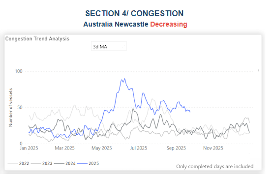

> **Figure 16: Στιγμιότυπο Οθόνης 2025 09 29 110621**  
> **Interactive Data & Source:** [Signal Ocean Platform](https://www.thesignalgroup.com/signal-ocean-platform) | [Local Asset](file:///C:/Users/Dell/Github/Shipping/corpus/03-breakwave/insights/2025/assets/2025-09-29_argentina-soybeans-to-china_img_cea3cf84ceb9ceb3cebcceb9cf8ccf84cf85_d9754096c40e.png)

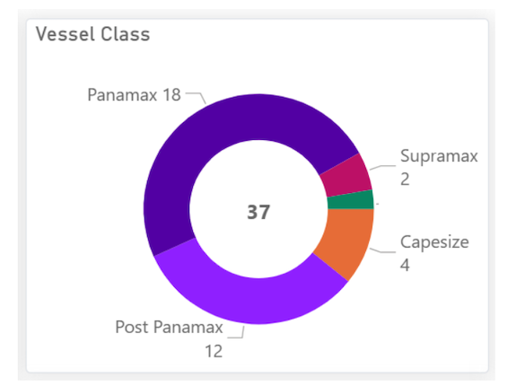

> **Figure 17: Στιγμιότυπο Οθόνης 2025 09 29 110629**  
> **Interactive Data & Source:** [Signal Ocean Platform](https://www.thesignalgroup.com/signal-ocean-platform) | [Local Asset](file:///C:/Users/Dell/Github/Shipping/corpus/03-breakwave/insights/2025/assets/2025-09-29_argentina-soybeans-to-china_img_cea3cf84ceb9ceb3cebcceb9cf8ccf84cf85_df779404b653.png)

Port congestion in Newcastle, Australia, has significantly decreased to 44 vessels, nearly 50% lower than the mid-June peak. However, despite this third-quarter decline, congestion levels remain almost double those observed in the lows of previous years during the same period. Panamax and Post-Panamax vessels account for nearly all vessels currently awaiting port entry.

Data Source:[Signal Ocean Platform](https://www.thesignalgroup.com/signal-ocean-platform)

---

**Tags:** Tankers, Crude, Markets  
