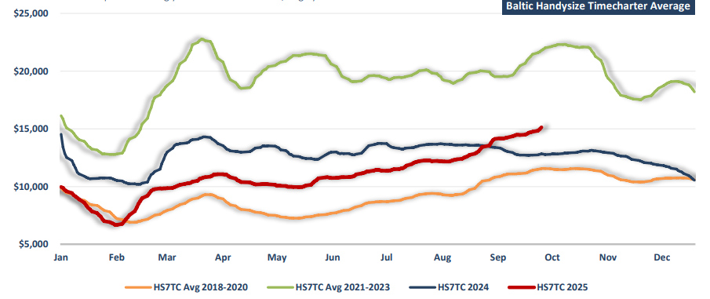

# Inflation remains a persistent challenge

**Date:** September 29, 2025  
**Publisher:** Breakwave Advisors | **Category:** Market Insights  
**Original URL:** [https://www.breakwaveadvisors.com/insights/2025/9/29/nm3qkbrxk1sc6ns960w6yo1577x6dd](https://www.breakwaveadvisors.com/insights/2025/9/29/nm3qkbrxk1sc6ns960w6yo1577x6dd)  

---

*By*[*Michalis Voutsinas*](https://www.linkedin.com/in/michalis-voutsinas-587544163/)

Over the past several cycles, the OECD has consistently warned that the global economy faces a gradually slowing growth trajectory, weighed down by both structural headwinds and cyclical risks. In more optimistic phases – such as mid-2022 into 2023 – the organization highlighted the rebound from the pandemic, strong consumer demand, and a revival in trade as key drivers of moderate global expansion. Yet by late 2023 and throughout 2024, forecasts were steadily revised lower as inflation pressures, higher interest rates, persistent supply chain bottlenecks, and geopolitical tensions, particularly trade frictions, began to undermine investment and consumption. Each semi-annual Outlook reinforced the same message: while near-term resilience remained visible, the balance of risks tilted firmly to the downside. In its most recent Interim Economic Outlook, the OECD acknowledges that global growth in early 2025 has held up better than expected, aided by front-loading of trade activity ahead of tariff increases. However, the relief is proving temporary as headwinds gather strength. The OECD now forecasts world GDP growth of 3.2 percent in 2025, slightly below 3.3 percent in 2024, and expects a further slowdown to 2.9 percent in 2026. Much of the first-half support came from stronger industrial production in most G20 economies and surging investment in high-technology sectors in the U.S. and Japan. Still, private consumption growth has lost momentum. Among emerging markets, upside surprises reflected idiosyncratic factors unlikely to persist, including an agricultural surge in Brazil, a sharp fall in the GDP deflator in India and an investment rebound in Indonesia.

Advanced economies are expected to feel the drag most acutely over the next two years. In the U.S., GDP growth is projected to slow from 2.8 percent in 2024 to 1.8 percent in 2025 and 1.5 percent in 2026, as higher tariffs and policy uncertainty begin to bite. In Europe, increased trade frictions and geopolitical tensions will partly offset the benefits of easier credit conditions, leaving growth at 1.2 percent in 2025 and 1.0 percent in 2026. The U.K. faces a similar pattern of pressure from tighter fiscal policy and elevated trade costs, with growth projected to decelerate from 1.4 percent in 2025 to 1.0 percent in 2026. In Japan, strong corporate profits and solid investment provide some cushion, with growth projected at 1.1 percent in 2025 and 0.5 percent in 2026. Korea, by contrast, is expected to strengthen, with growth rising from 1.0 percent in 2025 to 2.2 percent in 2026. Emerging markets are also set to moderate, albeit from stronger starting points. In China, the unwinding of front-loaded exports, higher import tariffs, and reduced fiscal support will drag on activity from the second half, with GDP growth projected at 4.9 percent in 2025 and 4.4 percent in 2026. Brazil, Türkiye, and South Africa are expected to lose momentum. India, though facing weaker exports due to higher tariffs, is expected to remain one of the strongest performers, with growth at 6.7 percent in 2025 and 6.2 percent in 2026.

Inflation remains a persistent challenge. Over the past two years, the OECD has repeatedly revised its estimates upward as energy, food, and services inflation proved more durable than initially expected. In its June 2025 full Outlook, the OECD projected average OECD-area inflation at 4.2 percent in 2025 and 3.2 percent in 2026, above earlier expectations. The more recent Interim report emphasized that core inflation is proving sticky. Trade dynamics have added both support and uncertainty. Global merchandise trade expanded strongly in the first half of 2025, largely due to a surge in shipments to the U.S. ahead of tariff changes. This activity boosted industrial output and led to rising inventory-to-sales ratios among U.S. retailers. Trade momentum also remained firm in advanced Asian economies. However, imports into the U.S. declined sharply in recent months, while bilateral trade between the U.S. and China contracted significantly. High-frequency indicators now point to a softening trend, with container port volumes, air freight, and passenger traffic moderating over the summer.

Against this rather tepid macroeconomic backdrop, the performance of the Handysize segment tells a more nuanced story. Market conditions in the first half of the year were broadly lacklustre, reflecting the uncertain global trade environment. The year-to-date average earnings for Handysizes stand at $10,870 daily, well below the $12,794 daily average achieved during the same period last year. Yet, by late summer, momentum began to turn. According to Platts, seaborne minor bulk trade rose 6 percent year-on-year in August, reaching 149 million tonnes. Gains were particularly pronounced in bauxite (up 13 percent), nickel (up 8 percent), and forest products (up 9 percent), which were sufficient to offset declines in steel products (down 3 percent), fertilizers (down 13 percent), petcoke (down 31 percent), building materials (down 1 percent), salt (down 7 percent), and copper (down 10 percent). This improvement in volumes helped to lift sentiment and strengthen earnings, with the Baltic Handysize indices climbing steadily through September. By the end of the month, the Baltic Handysize TC average reached $15,130 daily, the highest since December 2023, marking a clear reversal from the subdued conditions earlier in the year.

Looking forward, the OECD stresses that many of the longer-term risks it has flagged are now coming to the forefront. Rising trade barriers, ongoing geopolitical uncertainty, delayed impacts of tariffs, and strains on fiscal and financial stability are all weighing on the outlook. A particular concern is the potential for further tariff escalation. On inflation, renewed spikes in food or energy costs could undermine expectations and force monetary policy to remain tighter for longer. Fiscal vulnerabilities are also drawing greater scrutiny: large and persistent budget deficits combined with high debt levels are reflected in rising sovereign bond yields, raising refinancing risks and exposing the financial system to valuation pressures. On the upside, stronger defence spending and accelerated investment in productivity-enhancing technologies could deliver a more resilient trajectory for global growth. For the Handysize market, this mixture of caution and opportunity creates a distinctive environment. On one hand, the macroeconomic signals remain far from reassuring, pointing to a world economy that is slowing, fragmented, and vulnerable to policy shocks. On the other hand, the very resilience of minor bulk trades – tied more closely to construction inputs, agricultural commodities, and regional industrial activity – offers the segment a degree of insulation from the volatility seen in larger bulk carrier markets. Seasonality has historically provided a reliable tailwind during the final months of the year. Coupled with the recent momentum in bauxite, nickel, and forestry products, Handysize earnings have scope to remain supported, even if the broader economic backdrop stays lukewarm.

> **Figure 1: Στιγμιότυπο Οθόνης 2025 09 29 103435**  
> **Interactive Data & Source:** [Doric](https://www.doric.gr/) | [Local Asset](file:///C:/Users/Dell/Github/Shipping/corpus/03-breakwave/insights/2025/assets/2025-09-29_nm3qkbrxk1sc6ns960w6yo1577x6dd_img_cea3cf84ceb9ceb3cebcceb9cf8ccf84cf85_b529266c0186.png)

Data source:[Doric](https://www.doric.gr/)

---

**Tags:** Drybulk, Shipping, Economy  
