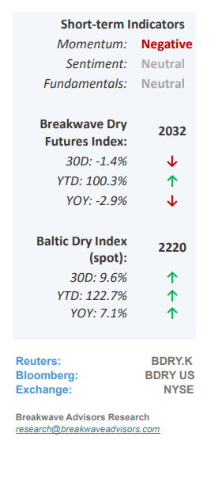
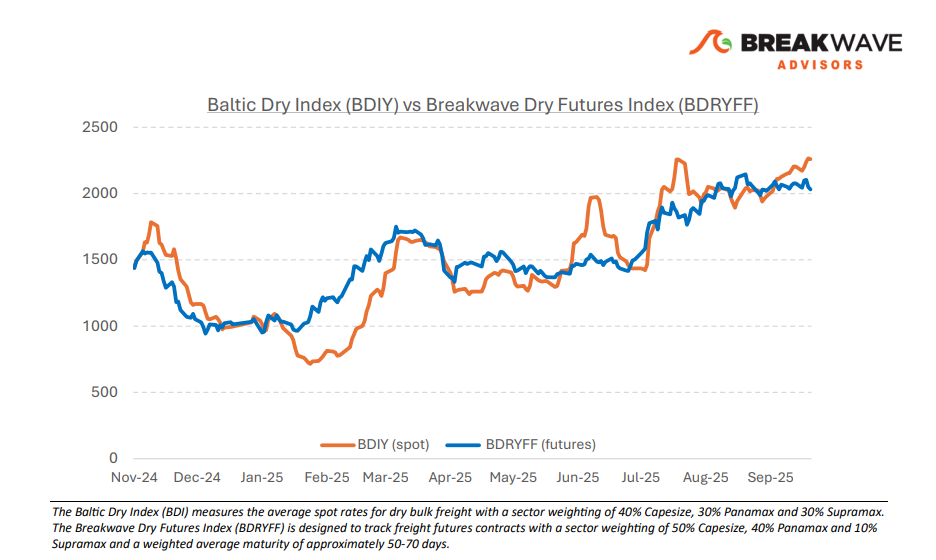
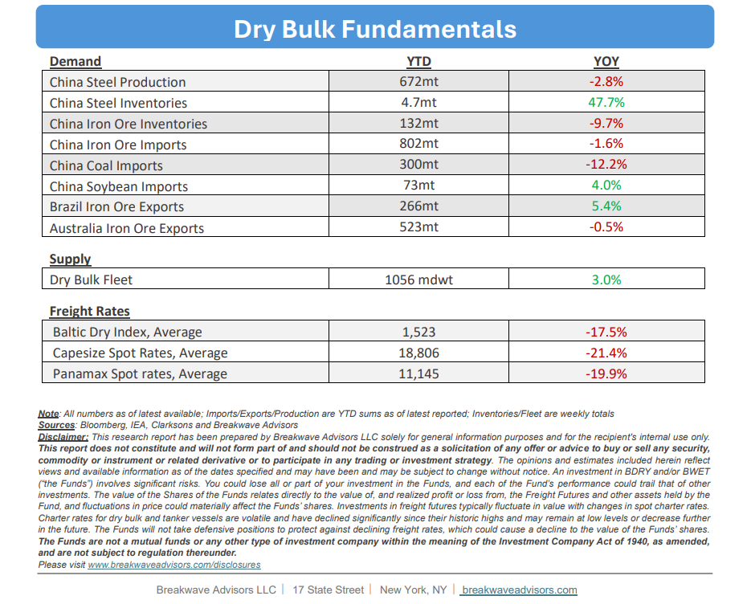

# Breakwave Bi-Weekly Dry Bulk Report - September 30, 2025

**Date:** September 30, 2025  
**Publisher:** Breakwave Advisors | **Category:** Market Insights  
**Original URL:** [https://www.breakwaveadvisors.com/insights/2025930db-jhy4458](https://www.breakwaveadvisors.com/insights/2025930db-jhy4458)  

---

•**Seasonal Headwinds as We Enter October**– Despite relatively robust spot rates across all dry bulk segments, a**note of caution**for the**near term**is warranted. Historically,**October**has**not**been**favorable**for dry bulk spot rates, with the Baltic Dry Index, a broad measure of spot global dry bulk rates, declining in 9 of the last 10 Octobers. We believe this pattern stems from the historically strong September rates, which often give way to softer rates in the following month. Futures pricing currently reflects this potential weakness in the Panamax and Supramax sectors, with**October futures**positioned**below the prevailing**spot levels.**Capesize**futures, by contrast, remain**more optimistic**and broadly in line with current spot levels. Time will tell whether this historical pattern can be broken given recent gains and prevailing optimism across the market. Regardless of short-term fluctuations,**we maintain a constructive view**for the remainder of the year. Any**near-term weakness**could be viewed as a**breather**within a broader trajectory toward a robust dry bulk market, supported by strong cargo flows into China, limited vessel availability due to fleet inefficiencies, and a generally positive sentiment toward commodities as well as global shipping.

> **Figure 1: Cea3cf84ceb9ceb3cebcceb9cf8ccf84cf85**  
> [Local Asset](file:///C:/Users/Dell/Github/Shipping/corpus/03-breakwave/insights/2025/assets/2025-09-30_2025930db-jhy4458_img_cea3cf84ceb9ceb3cebcceb9cf8ccf84cf85_c8f2bca5746a.png)

•**Iron Ore Imports into China Recover**– Following a comparatively weak first half,**Chinese iron ore imports have rebounded**to relatively high levels, bringing the year-to-date total imports down less than 2%. The recovery is largely driven by material from Brazil, which is up around 5% year to date, supporting tonne-mile demand and**contributing to the notable strength**in the Capesize market thus far this year.**Inventories**remain lower year over year but are broadly at**average levels**compared to history. Looking ahead, the Chinese steel market and**government attempts to reduce overcapacity**will continue to be key determinants for iron ore trade. It is important to recall that the low iron ore trade in the first half exerted a pronounced negative impact on Capesize rates. Despite current elevated levels, a slowdown in Chinese steel production, particularly at blast-furnace mills, could again depress spot freight rates. As is**typical in shipping,**rate trajectories are driven by the**intensity and marginal demand**for ships rather than total cargo volume, a dynamic that is evident in the progression of this year’s spot rates.

•**Our Long-term View**– The last few years have been characterized by increased geopolitical uncertainty. Going forward, we expect such events to continue to affect global trade and have a meaningful impact on effective vessel supply. Combined with the potential for a multi-year cyclical rebound in China’s economic activity following the recent economic turmoil, dry bulk shipping should experience higher volatility on top of a secular tightness driven by stable bulk commodity demand and a slower fleet growth owing to a relatively low orderbook.

> **Figure 2: Στιγμιότυπο Οθόνης 2025 09 30 091354**  
> [Local Asset](file:///C:/Users/Dell/Github/Shipping/corpus/03-breakwave/insights/2025/assets/2025-09-30_2025930db-jhy4458_img_cea3cf84ceb9ceb3cebcceb9cf8ccf84cf85_95952a0a3a90.png)

> **Figure 3: Στιγμιότυπο Οθόνης 2025 09 30 091411**  
> [Local Asset](file:///C:/Users/Dell/Github/Shipping/corpus/03-breakwave/insights/2025/assets/2025-09-30_2025930db-jhy4458_img_cea3cf84ceb9ceb3cebcceb9cf8ccf84cf85_0573dad9c89d.png)

### Subscribe:
