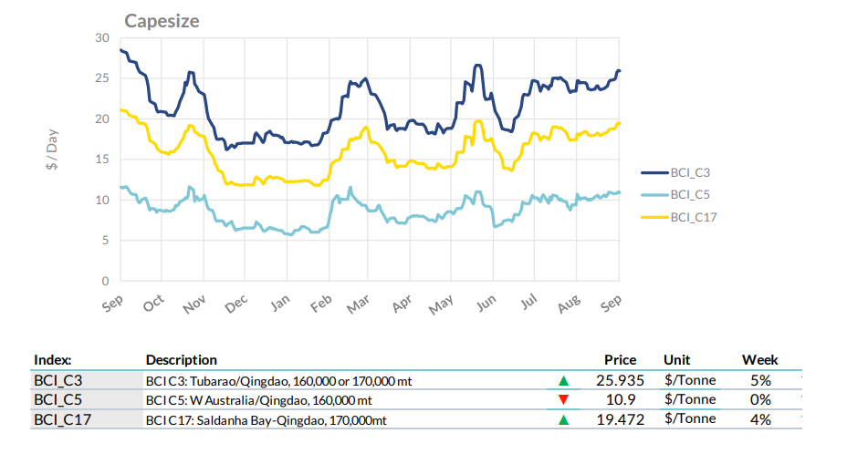
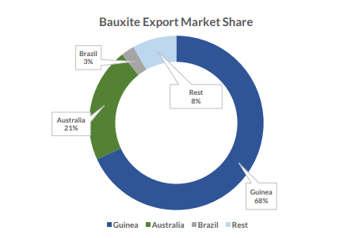
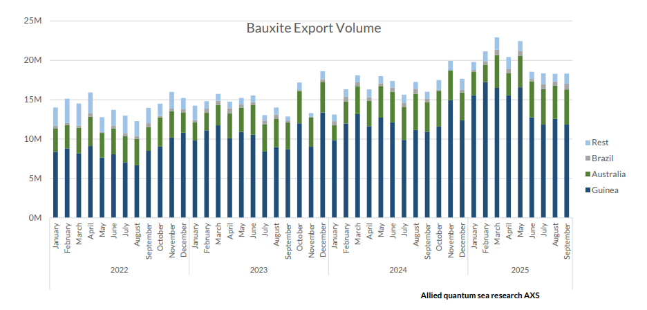
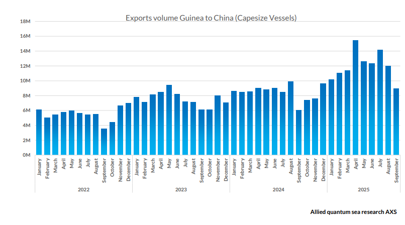

# Bauxite Market Update

**Date:** October 01, 2025  
**Publisher:** Breakwave Advisors | **Category:** Market Insights  
**Original URL:** [https://www.breakwaveadvisors.com/insights/2025/10/1/bauxite-market-update](https://www.breakwaveadvisors.com/insights/2025/10/1/bauxite-market-update)  

---

This week’s Allied Quantumsea Research highlights bauxite export dynamics against the backdrop of a stronger Capesize iron ore freight market in Q3. Rising shipments of bauxite from Australia, Brazil, and Guinea continue to support Capesize demand, emerging as a steady foundation for freight market strength.

> **Figure 1: Στιγμιότυπο Οθόνης 2025 10 01 142712**  
> **Interactive Data & Source:** [Allied-shipbroking](https://www.allied-shipbroking.gr/) | [Local Asset](file:///C:/Users/Dell/Github/Shipping/corpus/03-breakwave/insights/2025/assets/2025-10-01_bauxite-market-update_img_cea3cf84ceb9ceb3cebcceb9cf8ccf84cf85_2cee757f0c41.png)

### Mining, Alumina Demand, and Trade Flows

Bauxite production is fundamentally linked to alumina demand, as more than 85% of mined bauxite is refined into alumina through the Bayer process. This intermediate product is then smelted into aluminum, a metal crucial for construction, transportation, packaging, and energy infrastructure. The close integration of these stages means that changes in alumina demand directly affect bauxite extraction.

The Bayer process dominates global refining, making refinery capacity and utilization key factors in bauxite production. Countries like Australia and Brazil refine a large portion of their bauxite locally. In contrast, Guinea exports most of its mined bauxite to overseas refineries, which lack local resources but have increasing alumina needs. This geographic division shapes global trade patterns. Rising alumina output, especially in China, has led to ongoing demand for long-distance bauxite imports. These flows support bulk shipping activity, with Atlantic-to-Asia routes becoming the most prominent.

From a freight perspective, bauxite shipments significantly impact ton-mile demand. The shipment volumes are sizable, and the trade predominantly involves Capesize vessels, highlighting its importance to long-haul dry bulk markets.

### Production and Reserves

Global bauxite production is concentrated among a handful of leading suppliers, with Australia, Guinea, and Brazil standing out as the dominant exporters. Together, these countries form the backbone of the international trade system, providing most of the raw material that feeds alumina refineries worldwide.

China plays a dual role in this landscape. It produces significant volumes domestically, but its reserves are neither abundant nor highquality enough to satisfy the needs of its vast refining sector. This shortfall has turned China into the world’s largest importer of bauxite, drawing steady flows from Guinea, Australia, and Southeast Asia. These long-haul shipments have become a central pillar of bulk shipping demand, especially for Capesize vessels.

By contrast, the United States holds only limited reserves in a few southern states. Mining activity there is negligible today, leaving the country almost fully reliant on imports to sustain its alumina and aluminum industries.

> **Figure 2: Στιγμιότυπο Οθόνης 2025 10 01 142901**  
> **Interactive Data & Source:** [Allied-shipbroking](https://www.allied-shipbroking.gr/) | [Local Asset](file:///C:/Users/Dell/Github/Shipping/corpus/03-breakwave/insights/2025/assets/2025-10-01_bauxite-market-update_img_cea3cf84ceb9ceb3cebcceb9cf8ccf84cf85_ac65c6bbe5ae.png)

Guinea clearly dominates the bauxite export market with a 68% share, followed by Australia at 21%, while all other countries combined account for just 11%, highlighting a highly concentrated supply landscape.

> **Figure 3: Στιγμιότυπο Οθόνης 2025 10 01 142910**  
> **Interactive Data & Source:** [Allied-shipbroking](https://www.allied-shipbroking.gr/) | [Local Asset](file:///C:/Users/Dell/Github/Shipping/corpus/03-breakwave/insights/2025/assets/2025-10-01_bauxite-market-update_img_cea3cf84ceb9ceb3cebcceb9cf8ccf84cf85_4e0131a1f882.png)

### Australia

In Australia, sustained investment in production capacity and plateauing domestic demand are projected to drive modest growth in bauxite exports in the coming years. Rio Tinto commenced work on the Norman Creek access project at the Amrun bauxite mine on Cape York Peninsula in Q3 2025, an integral component of the broader Weipa operation expansion. Concurrently, early works and a definitive feasibility study have begun for the Kangwinan project, which is intended to replace the retiring Gove and Andoom mines. These initiatives are estimated to raise Rio Tinto's output in Australia by at least 7 Mtpa and reinforce long-term production stability. In addition, Metro Mining, the second-largest bauxite producer in Australia, could increase its annual shipment capacity from the current 6.5–7 Mtpa to 8 Mtpa. These developments are likely to lift Australian bauxite exports above the 50 Mtpa mark by the end of this decade and consolidate its position as the world’s second-largest bauxite exporter in the long term.

### Brazil

Brazil’s bauxite sector is characterized by stability at MRN’s Trombetas mine and ongoing constraints at Alcoa’s Juruti operation. Trombetas continues to underpin Brazil’s output at around 12–13 Mt annually, with approximately 60% consumed by domestic alumina refineries and the rest exported across the Atlantic and Pacific basins. Expansion remains possible through the New Mines Project, which has received preliminary environmental approval, though final approval depends on sensitive social and environmental reviews. Glencore’s 45% stake enhances MRN’s commercial reach, while investments in a transmission line to the national grid should improve energy reliability. If fully licensed and expanded, MRN can reach nearly 18 Mt per year, cementing its role as Brazil’s leading bauxite supplier.

In contrast, Juruti faces challenges from a late-2024 river incident that triggered force majeure and exposed logistical vulnerabilities. Although production has resumed, throughput remains below capacity as navigation risks continue, leading Alcoa to source alternative feedstock to support alumina output. As a result, Brazil’s supply profile is less flexible than West Africa’s, particularly Guinea, which continues to expand exports more nimbly into Asia.

### Guinea

Guinea remains the backbone of the global bauxite trade, with shipments continuing to expand in 2025. During the first half of the year, Guinean exports recorded strong annual growth, though signs of a slowdown emerged in Q3.

### Guinea’s Capesize Exports to China More Than Doubled (+123%) Since 2022

> **Figure 4: Cea3cf84ceb9ceb3cebcceb9cf8ccf84cf85**  
> **Interactive Data & Source:** [Allied-shipbroking](https://www.allied-shipbroking.gr/) | [Local Asset](file:///C:/Users/Dell/Github/Shipping/corpus/03-breakwave/insights/2025/assets/2025-10-01_bauxite-market-update_img_cea3cf84ceb9ceb3cebcceb9cf8ccf84cf85_20481df172fe.png)

### Sierra Leone

The completion of Maforki Port in May 2025 marks a milestone for Sierra Leone’s re-emergence as a bauxite exporter. The new facility enhances the country’s export capacity and reduces logistical bottlenecks. Estimates suggest Sierra Leone could reach 8 Mtpa in 2025/2026, with the potential to double capacity to 16 Mtpa by 2026/2027 as expansion phases are rolled out. While still small compared with Guinea, Sierra Leone’s supply growth contributes to greater diversification in West African exports.

### Cameroon

Cameroon is preparing to join the seaborne bauxite market in Q1 2026 with the startup of the Minim Martap project, developed by Canyon Resources. Initial production is projected at 6 Mtpa, with longer-term expansion potential to 10 Mtpa. If realized, Cameroon will add another Atlantic Basin supplier to the market, further diversifying global sourcing options for alumina refineries in Asia and beyond.

### Outlook: Guinea’s Leadership Endures But Faces Emerging Competitive Pressures

Heavy Chinese investments are expected to drive the continued expansion of Guinean output, with annual bauxite exports potentially exceeding 200 Mt by 2028/2029. At the same time, the gradual development of new capacity in Australia, Sierra Leone, Cameroon, and emerging suppliers such as Guyana and Ghana could raise seaborne bauxite exports outside Guinea to more than 90 Mtpa by 2029/2030, compared with around 60 Mtpa in 2024. While Guinea is likely to maintain its leading role in the global market, these developments indicate that its market share may level off closer to, or slightly below, 70% over the next five years. Such a scenario would not displace Guinea’s pre-eminence but could moderate its path toward further dominance, while also fostering greater supply diversification and potentially altering bargaining dynamics in the bauxite trade.

Data Source:[Allied](https://www.allied-shipbroking.gr/)

---

**Tags:** China, Ironore, Drybulk  
