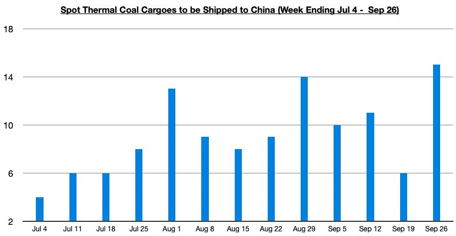

# Jump in Spot Thermal Coal Cargoes To Be Shipped to China

**Date:** October 02, 2025  
**Publisher:** Breakwave Advisors | **Category:** Market Insights  
**Original URL:** [https://www.breakwaveadvisors.com/insights/2025/10/2/jump-in-spot-thermal-coal-cargoes-to-be-shipped-to-china](https://www.breakwaveadvisors.com/insights/2025/10/2/jump-in-spot-thermal-coal-cargoes-to-be-shipped-to-china)  

---

*By*[*Jeffrey Landsberg*](https://www.linkedin.com/in/jeffrey-landsberg-70ab957/)

As we discussed in Commodore Research’s most recent Weekly China Report and Weekly Executive Report, the initial count of formally announced thermal coal cargoes to be shipped to Chinese buyers reported in the spot market last week came in at 15 cargoes. This is 9 more than were reported during the previous week, 5 more than the trailing four week average, and has marked the second largest amount reported all year.

> **Figure 1: Chart**  
> [Local Asset](file:///C:/Users/Dell/Github/Shipping/corpus/03-breakwave/insights/2025/assets/2025-10-02_jump-in-spot-thermal-coal-cargoes-to-be-shipped-to-china_img_chart_ddec206e6f91.jpg)

As we have continued to stress in Commodore Research’s weekly reports, a significant change began in China (and the dry bulk market) two months ago. July marked the very first time since September 2024 that China's coal-derived electricity generation fared better than domestic coal production, and it was the first time since May 2024 that domestic coal production contracted on a year-on-year basis. This shift continued last month and through this month — and as a result, China’s coal import demand is strengthening again. This remains a very helpful development for the dry bulk market.

---

**Tags:** China, Coal, Drybulk  
