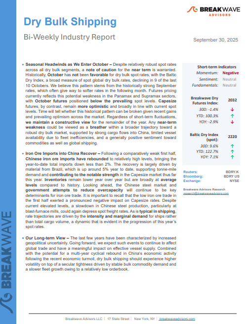
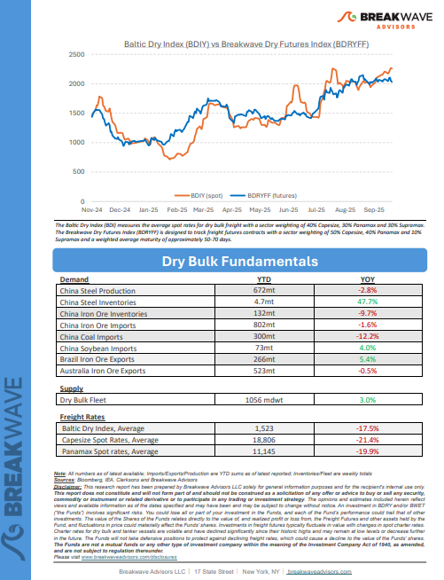
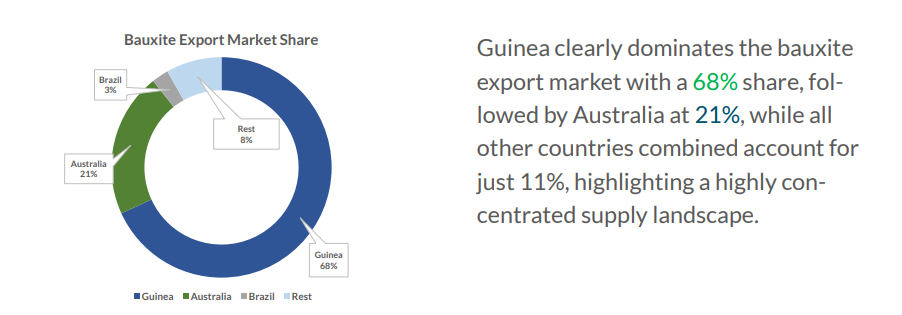

# Breakwave Weekend Read

**Date:** October 03, 2025  
**Publisher:** Breakwave Advisors | **Category:** Market Insights  
**Original URL:** [https://www.breakwaveadvisors.com/insights/2025310-weekly-gytlo115](https://www.breakwaveadvisors.com/insights/2025310-weekly-gytlo115)  

---

## Welcome Tobreakwave Advisorsweekend Read

***As the week comes to a close, take a moment to review the key insights from the past few days. Missed something? We've gathered all the top insights for you to catch up at your convenience.***

## Breakwave Shipping Report

**Seasonal Headwinds as We Enter October**– Despite relatively robust spot rates across all dry bulk segments, a**note of caution**for the**near term**is warranted.

[Read More](https://www.breakwaveadvisors.com/insights/2025930db-jhy4458)

> **Figure 1: Στιγμιότυπο Οθόνης 2025 09 30 191609**  
> **Interactive Data & Source:** [Breakwave Advisors Market Insights](https://www.breakwaveadvisors.com/insights/2025/9/29/nm3qkbrxk1sc6ns960w6yo1577x6dd) | [Local Asset](file:///C:/Users/Dell/Github/Shipping/corpus/03-breakwave/insights/2025/assets/2025-10-03_2025310-weekly-gytlo115_img_cea3cf84ceb9ceb3cebcceb9cf8ccf84cf85_c9e54939f0ea.png)

> **Figure 2: Στιγμιότυπο Οθόνης 2025 09 30 191622**  
> **Interactive Data & Source:** [Breakwave Advisors Market Insights](https://www.breakwaveadvisors.com/insights/2025/9/29/nm3qkbrxk1sc6ns960w6yo1577x6dd) | [Local Asset](file:///C:/Users/Dell/Github/Shipping/corpus/03-breakwave/insights/2025/assets/2025-10-03_2025310-weekly-gytlo115_img_cea3cf84ceb9ceb3cebcceb9cf8ccf84cf85_9894290d4a03.png)

## Inflation Remains a Persistent Challenge

> **Figure 3: Unsplash Image Gemrkzgh4twjj**  
> **Interactive Data & Source:** [Breakwave Advisors Market Insights](https://www.breakwaveadvisors.com/insights/2025/9/29/nm3qkbrxk1sc6ns960w6yo1577x6dd) | [Local Asset](file:///C:/Users/Dell/Github/Shipping/corpus/03-breakwave/insights/2025/assets/2025-10-03_2025310-weekly-gytlo115_img_unsplash-image-gemrkzgh4twjj_f8595ceb5e1b.jpg)

Over the past several cycles, the OECD has consistently warned that the global economy faces a gradually slowing growth trajectory, weighed down by both structural headwinds and cyclical risks.

Doric Weekly Market Insights

## Oil Glut Looms

> **Figure 4: Istock 1184092411**  
> **Interactive Data & Source:** [Breakwave Advisors Market Insights](https://www.breakwaveadvisors.com/insights/2025/9/29/oil-glut-looms) | [Local Asset](file:///C:/Users/Dell/Github/Shipping/corpus/03-breakwave/insights/2025/assets/2025-10-03_2025310-weekly-gytlo115_img_istock-1184092411_e59424513d5b.jpg)

More and more analysts expect the oil market to move into significant surplus next year.

Gibson Tanker Market Report

## Argentina Soybeans to China

> **Figure 5: Unsplash Image Tcca Nibnccnn**  
> **Interactive Data & Source:** [Breakwave Advisors Market Insights](https://www.breakwaveadvisors.com/insights/2025/9/29/argentina-soybeans-to-china) | [Local Asset](file:///C:/Users/Dell/Github/Shipping/corpus/03-breakwave/insights/2025/assets/2025-10-03_2025310-weekly-gytlo115_img_unsplash-image-tcca-nibnccnn_b5b3e9548911.jpg)

Soybean flows from Argentina to China in 2025 tell a striking turnaround story.

Signal Ocean Dry Weekly Market Monitor

## Government Shutdown? Maybe, But We'd Still Look at Tech

> **Figure 6: Unsplash Image W69z8k Hgqu**  
> **Interactive Data & Source:** [Breakwave Advisors Market Insights](https://www.breakwaveadvisors.com/insights/2025/9/30/government-shutdown-maybe-but-wed-still-look-at-tech) | [Local Asset](file:///C:/Users/Dell/Github/Shipping/corpus/03-breakwave/insights/2025/assets/2025-10-03_2025310-weekly-gytlo115_img_unsplash-image-w69z8k-hgqu_7018de307739.jpg)

A potential U.S. government shutdown looms by midnight September 30, 2025, risking a 0.1-0.2% GDP loss per week, with the 2018-19 shutdown’s $3bn hit as a precedent.

Forvis Mazars Weekly Note

## The Crude Tanker Market

> **Figure 7: Istock 1155718700**  
> **Interactive Data & Source:** [Breakwave Advisors Market Insights](https://www.breakwaveadvisors.com/insights/2025/10/1/the-crude-tanker-market) | [Local Asset](file:///C:/Users/Dell/Github/Shipping/corpus/03-breakwave/insights/2025/assets/2025-10-03_2025310-weekly-gytlo115_img_istock-1155718700_fabb1516784c.jpg)

The crude tanker market in September saw a marked upswing, with rates rising to their highest levels in years.

Intermodal Weekly Market Report

## Tankers Research Update

> **Figure 8: Pexels Jan Rune Smenes Reite 221584 3197704**  
> **Interactive Data & Source:** [Breakwave Advisors Market Insights](https://www.breakwaveadvisors.com/insights/2025/10/1/tankers-research-update) | [Local Asset](file:///C:/Users/Dell/Github/Shipping/corpus/03-breakwave/insights/2025/assets/2025-10-03_2025310-weekly-gytlo115_img_pexels-jan-rune-smenes-reite-221584-_e3f63e9aea07.jpg)

Four oil terminals under Qingdao port implement new tanker scoring system, effects marginal

Braemar Research

## Bauxite Market Update

> **Figure 9: Στιγμιότυπο Οθόνης 2025 10 01 143358**  
> **Interactive Data & Source:** [Breakwave Advisors Market Insights](https://www.breakwaveadvisors.com/insights/2025/10/1/bauxite-market-update) | [Local Asset](file:///C:/Users/Dell/Github/Shipping/corpus/03-breakwave/insights/2025/assets/2025-10-03_2025310-weekly-gytlo115_img_cea3cf84ceb9ceb3cebcceb9cf8ccf84cf85_bd4210620ae3.png)

This week’s Allied Quantumsea Research highlights bauxite export dynamics against the backdrop of a stronger Capesize iron ore freight market in Q3.

Allied Weekly Report

## Bauxite, Manganese Ore, and Forestry: More Protectionism to Come

> **Figure 10: Στιγμιότυπο Οθόνης 2025 10 02 101134**  
> **Interactive Data & Source:** [Breakwave Advisors Market Insights](https://www.breakwaveadvisors.com/insights/2025/10/2/bauxite-manganese-ore-and-forestry-more-protectionism-to-come) | [Local Asset](file:///C:/Users/Dell/Github/Shipping/corpus/03-breakwave/insights/2025/assets/2025-10-03_2025310-weekly-gytlo115_img_cea3cf84ceb9ceb3cebcceb9cf8ccf84cf85_1b24fb6c9650.png)

Minor bulk, made up of all dry cargo types that are not categorized as iron ore, coal, or grains, has consistently outperformed the previous year in terms of total tonnage exported. In August, this trend continued as the total tonnage of minor bulk exports increased by 7% compared to the same period last year.

Signal Ocean Special Report

## Jump in Spot Thermal Coal Cargoes to Be Shipped to China

> **Figure 11: Unsplash Image Aej Dtls Q**  
> **Interactive Data & Source:** [Breakwave Advisors Market Insights](https://www.breakwaveadvisors.com/insights/2025/10/2/jump-in-spot-thermal-coal-cargoes-to-be-shipped-to-china) | [Local Asset](file:///C:/Users/Dell/Github/Shipping/corpus/03-breakwave/insights/2025/assets/2025-10-03_2025310-weekly-gytlo115_img_unsplash-image-aej-dtls-q_41fb45fce9c1.jpg)

As we discussed in Commodore Research’s most recent Weekly China Report and Weekly Executive Report, the initial count of formally announced thermal coal cargoes to be shipped to Chinese buyers reported in the spot market last week came in at 15 cargoes.

From Commodore's Weekly Dry Bulk Reports

## VLCC Recovery and Spillovers

> **Figure 12: Unsplash Image Mismgfbdc9o**  
> **Interactive Data & Source:** [Breakwave Advisors Market Insights](https://www.breakwaveadvisors.com/insights/2025/10/3/vlcc-recovery-and-spillovers) | [Local Asset](file:///C:/Users/Dell/Github/Shipping/corpus/03-breakwave/insights/2025/assets/2025-10-03_2025310-weekly-gytlo115_img_unsplash-image-mismgfbdc9o_b4b2efce834f.jpg)

Signal Ocean Insights reviews late-September dirty tanker dynamics, focusing on the surge that drove VLCC rates to unexpected highs at the close of Q3. With winter approaching, we also consider the outlook for the weeks ahead.

Signal Ocean Tanker Weekly Market Monitor

---

**Tags:** Shipping, Tankers, Drybulk  
