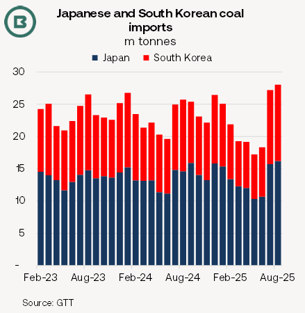
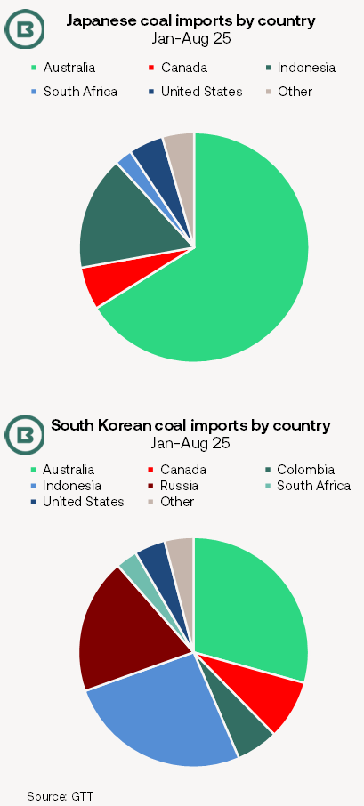

# The Big Picture: Japan and South Korea’s coal trade boost to Q3 Panamax demand

**Date:** October 03, 2025  
**Publisher:** Breakwave Advisors | **Category:** Market Insights  
**Original URL:** [https://www.breakwaveadvisors.com/insights/2025/10/3/the-big-picture-japan-and-south-koreas-coal-trade-boost-to-q3-panamax-demand](https://www.breakwaveadvisors.com/insights/2025/10/3/the-big-picture-japan-and-south-koreas-coal-trade-boost-to-q3-panamax-demand)  

---

- *With (1) South Korean coal imports officially a three-year high in August and (2) Japan’s coal imports a 31-month high (see chart, below), the Q3 may well be confirmed as the largest quarterly import jump from the two countries combined.*
- *Additional coal demand from Japan and South Korea mainly benefitted Panamax demand in the Pacific, alongside China’s coal import upturn and port congestion off the East Coast of Australia.*
- *The thermal coal import boost followed an early start to summer exacerbated by extreme heat in Japan and South Korea—so temporarily reversing the structural decline of coal in the energy mix.*

> **Figure 1: In Itscoal Mid-Year Update**  
> *In itsCoal Mid-Year Update, the International Energy Agency (IEA) notedSouth Korean coal consumption was down 17%during the 1H 2025.*  
> [Local Asset](file:///C:/Users/Dell/Github/Shipping/corpus/03-breakwave/insights/2025/assets/2025-10-03_the-big-picture-japan-and-south-koreas-coal-trade-boost-to-q3-panamax-demand_img_5b8d-image-0-1759420638007_f8535819454b.png)

### Subdued Activity Prior to the Q3 Thermal Coal Import Jump

**The positive Q3**for thermal coal imports into Japan and South Korea**contrasted with sliding volumes during the 1H 2025**.

At the same time, though positive, coking coal has been a less significant part of the import story.

Moreover, at 15.5m tonnes, South Korean coking coal imports in the first eight months of the year lagged the year-ago level by 1.0m tonnes, while crude steel output fell -3.5%.

Similarly, from a monthly average of 9.5m tonnes in the 1H,**Japan’s imports of thermal coal**(plus anthracite) leapt to 12.1m tonnes in July and 12.7m tonnes in August.

As with South Korea, Japan’s crude steel production fell in January-August, down -4.5% annually, also resulting in a -1.0m tonne year-on-year decline slide in coking coal imports.

### Q3 Interrupting a Structural Trend of Decline?

Japan’s Q3 import gains are eye-catching when compared with preceding months, but less so in relation to the Q3 last year.

**Japan’s energy mix is unique**in the sense that nuclear power capacity idled in the aftermath of the Fukushima earthquake and tsunami in 2011 did not return fully.

Renewable energy is growing in Japan. By mid-September, McCloskey commented that heat waves in Japan was doing little to raise coal burn.

In the 1H 2025 official data showed coal comprised 27% of Japan’s generation, behind gas at 29%, and ahead of solar at 12%, nuclear 10%, hydro 8%, bioenergy 6%, and other fossil fuels with 3%.

In December last year the IEA reported Japan’s goal of phasing out inefficient coal-fired power plants by 2030 with a commitment to ending unabated coal-fired power plants in the 2030s.

Last year, inefficient coal-fired power plants (efficiency below 40%) accounted for around 20% of Japan's total power plant fleet.

> **Figure 2: 5ee2 Image 1 1759420657450**  
> [Local Asset](file:///C:/Users/Dell/Github/Shipping/corpus/03-breakwave/insights/2025/assets/2025-10-03_the-big-picture-japan-and-south-koreas-coal-trade-boost-to-q3-panamax-demand_img_5ee2-image-1-1759420657450_8a16ef373220.png)

With the exception of nuclear power, which is expanding, many of the overall trends evident in Japan’s power sector can be applied to**South Korea**.

**The IEA expects coal demand in South Korea to reduce by 4% next year**, with higher nuclear and renewable power generation in prospect. Nuclear generation was up 6.2% year-on-year in January–July.

South Korean coal sourcing differs from Japan in that Russia is a significant supplier (in fact, the single-largest in July).

While coal industry analysts still predict a**long-term downward trend for thermal coal burn in Japan and South Korea, the Q3 demonstrated sudden increases can still occur**, with the impact on freight market balances accentuated if port congestion is involved. Berthing delays at Newcastle from June led to queues of more than 70 Panamaxes at times.

---

**Tags:** Drybulk, Freightrates, Markets  
