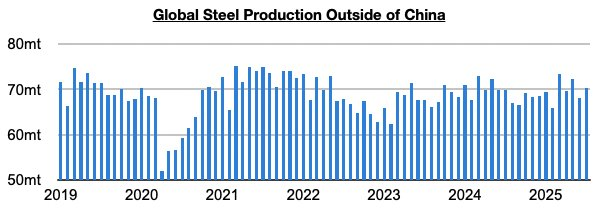
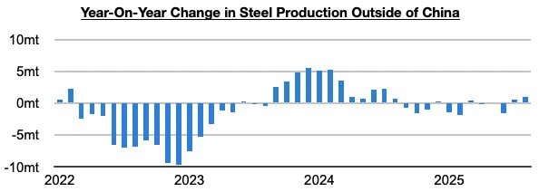

# Return Of Steel Production Growth Ex-China Continues

**Date:** October 06, 2025  
**Publisher:** Breakwave Advisors | **Category:** Market Insights  
**Original URL:** [https://www.breakwaveadvisors.com/insights/2025/10/6/return-of-steel-production-growth-ex-china-continues](https://www.breakwaveadvisors.com/insights/2025/10/6/return-of-steel-production-growth-ex-china-continues)  

---

*By*[*Jeffrey Landsberg*](https://www.linkedin.com/in/jeffrey-landsberg-70ab957/)

As we discussed in Commodore Research’s most recent Weekly Executive Report, global steel production totaled approximately 145.3 million tons in August. This is down month-on-month by 4.8 million tons (-3%) but is up year-on-year by 500,000 tons. Steel production outside of China totaled approximately 67.9 million tons. This is down month-on-month by 2.5 million tons (-4%) but is up year-on-year by 1 million tons (2%).

> **Figure 1: Chart 1**  
> [Local Asset](file:///C:/Users/Dell/Github/Shipping/corpus/03-breakwave/insights/2025/assets/2025-10-06_return-of-steel-production-growth-ex-china-continues_img_chart1_65f6cd362dd9.jpg)

August has marked only the fourth time in the last twelve months that steel production ex-China has grown on a year-on-year basis (including during each of the last two months).

> **Figure 2: Chart 2**  
> [Local Asset](file:///C:/Users/Dell/Github/Shipping/corpus/03-breakwave/insights/2025/assets/2025-10-06_return-of-steel-production-growth-ex-china-continues_img_chart2_a3c44f1ff210.jpg)

Overall, it remains helpful for the dry bulk shipping market that steel production in China and ex-China are both enjoying year-on-year growth (in China, daily steel production has most recently come in at a level that is up year-on-year by 4%). This remains a new development that has been underway since only July. Significant is that iron ore prices remain at firm levels and global iron ore producers are still not close to lowering production. Healthy global steel production, iron ore prices, iron ore production, and most importantly iron ore exports collectively remains a tailwind for the capesize market.

---

**Tags:** China, Drybulk, Ironore  
