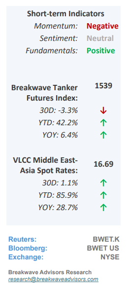
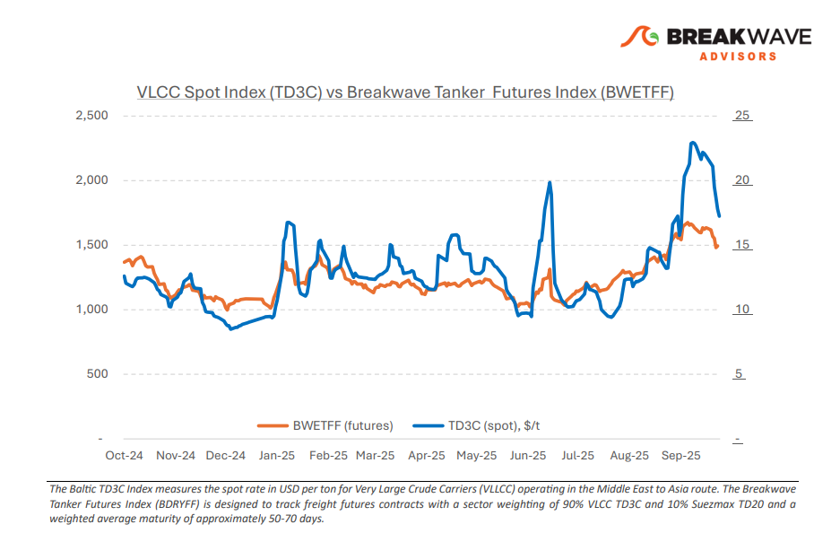
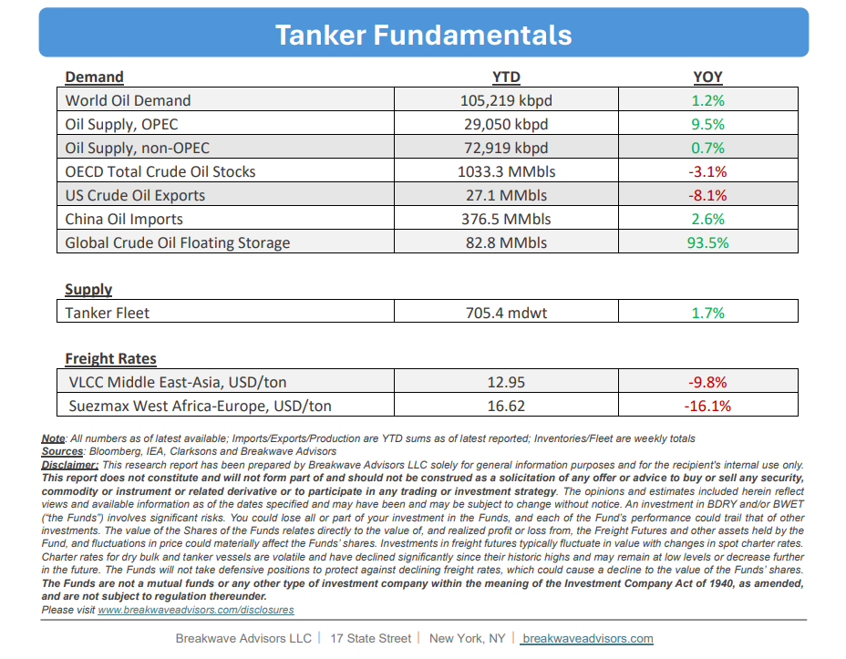

# Breakwave Bi-Weekly Tanker Report - October 7, 2025

**Date:** October 07, 2025  
**Publisher:** Breakwave Advisors | **Category:** Market Insights  
**Original URL:** [https://www.breakwaveadvisors.com/insights/2025107wetreport5k88j447](https://www.breakwaveadvisors.com/insights/2025107wetreport5k88j447)  

---

•**VLCC Market Softens as Post Golden Week Demand Fails to Gain Traction**– As September ends, the previously robust VLCC market driven by tight supply and high activity has**shown signs of softening**in demand, with spot rates retreating from the multi-year highs reached recently. The pullback highlights the**market’s fragility**and its sensitivity to incremental small shifts in demand. Sentiment weakened further as the anticipated**post-Golden Week**rebound did not materialize. Freight rates continued to decline across major routes, with charterers maintaining the upper hand amid increasing tonnage availability in the Arabian Gulf. Activity from both Asian and Western charterers remained subdued, intensifying competition among owners as prompt availability widened. With**few new fixtures**concluded and the tonnage list expanding, the balance remains decisively in charterers’ favor. Market focus now shifts to**China’s crude procurement**pace following Golden Week and to OPEC+ export trends, factors that will determine whether the current softness persists into mid-October or stabilizes on renewed Eastbound demand.

> **Figure 1: Στιγμιότυπο Οθόνης 2025 10 07 112540**  
> [Local Asset](file:///C:/Users/Dell/Github/Shipping/corpus/03-breakwave/insights/2025/assets/2025-10-07_2025107wetreport5k88j447_img_cea3cf84ceb9ceb3cebcceb9cf8ccf84cf85_124800615df1.png)

•**As OPEC+ Adds More Barrels into the Market, “Real” Demand Seems Flat**– During the past weekend’s meeting, OPEC+ agreed to**raise its production**by 137,000 barrels per day, effective November 1. While**oil prices**have largely priced in this increase and**are broadly flat**at the low end of its multi-month range, we remain skeptical about the underlying demand supporting the decision.**Chinese storage injections**have been the sole significant incremental buyer in recent months. Although global commercial storage remains low, we believe this reflects the evolving structure of the oil market; absent the substantial build in Chinese strategic inventories,**supply and demand appear looser**than trade data suggest. Nonetheless, OPEC+’s strategy of regaining market share is proceeding, with little visible impact on prices thus far.**Oil in transit**has reached a new multi-year high, underscoring the surge in tanker activity. Any forthcoming incremental demand could further elevate tanker utilization, particularly given the sizable number of vessels already committed in the near term.

•**Our Long-term View**– The tanker market is recovering from a long period of staggered rates as the growth in new vessel supply shrinks while oil demand remains elevated in line with the global economy. A historically low orderbook combined with favorable shifting trade patterns should continue to support increased spot rate volatility, which combined with the ongoing geopolitical turmoil, should sustain freight rates in the medium to long term.

> **Figure 2: Στιγμιότυπο Οθόνης 2025 10 07 093041**  
> [Local Asset](file:///C:/Users/Dell/Github/Shipping/corpus/03-breakwave/insights/2025/assets/2025-10-07_2025107wetreport5k88j447_img_cea3cf84ceb9ceb3cebcceb9cf8ccf84cf85_34120697007d.png)

> **Figure 3: Στιγμιότυπο Οθόνης 2025 10 07 111940**  
> [Local Asset](file:///C:/Users/Dell/Github/Shipping/corpus/03-breakwave/insights/2025/assets/2025-10-07_2025107wetreport5k88j447_img_cea3cf84ceb9ceb3cebcceb9cf8ccf84cf85_d604948bbce7.png)

### Subscribe:
