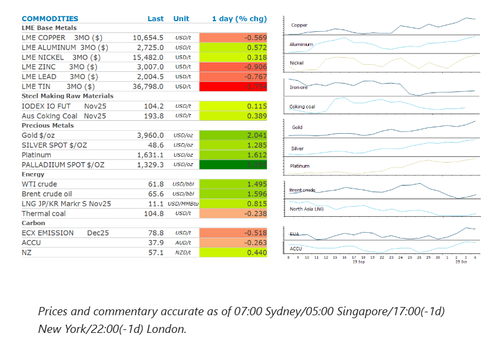
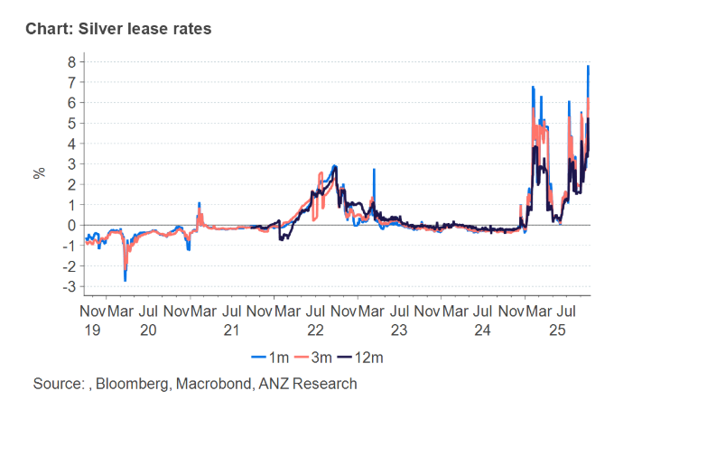

# Gold hits fresh record high amid political unease

**Date:** October 07, 2025  
**Publisher:** Breakwave Advisors | **Category:** Market Insights  
**Original URL:** [https://www.breakwaveadvisors.com/insights/2025/10/7/gold-hits-fresh-record-high-amid-political-unease](https://www.breakwaveadvisors.com/insights/2025/10/7/gold-hits-fresh-record-high-amid-political-unease)  

---

Commodity markets started the week on a positive note as a risk-on tone across markets boosted sentiment. Precious metals led the sector higher, as gold and silver hit record highs. A stronger USD checked gains in industrial metals.

*By*[*Daniel Hynes*](https://www.linkedin.com/in/dahynes/)

> **Figure 1: Στιγμιότυπο Οθόνης 2025 10 07 104551**  
> **Interactive Data & Source:** [Linkedin](https://www.linkedin.com/newsletters/commodities-wrap-6692196755876012032/?fbclid=IwAR3kiXJqZdxmp9ZcRwBNI7FsBySI-XSC0pfPur1qzjt7OZp7PTE59Tsl1QI) | [Local Asset](file:///C:/Users/Dell/Github/Shipping/corpus/03-breakwave/insights/2025/assets/2025-10-07_gold-hits-fresh-record-high-amid-political-unease_img_cea3cf84ceb9ceb3cebcceb9cf8ccf84cf85_a85928657e74.png)

### Market Commentary

**Gold**rose to a fresh high as geopolitics dominate markets. The US shutdown has delayed the release of key economic data, clouding the economic backdrop. Fed governor Austan Goolsbee said the lack of official data will make it harder for central bankers to interpret the economy. For the moment markets are still pricing in a 25bp cut this month, which should benefit the precious metal. The shutdown is also affecting confidence, leading to demand for haven assets. The broader geopolitical backdrop was also supportive. Japan’s election of a new prime minister put the JPY under pressure, while France’s prime minister resigned after less than a month in office. Gold’s rally has gained steam in recent weeks amid strong inflows in gold-backed ETFs. September alone saw volumes swell by 112t, the biggest gain in more than three years. Strong flows have continued in the first few days of October. Silver, platinum and palladium also climbed. The London**silver**market is showing signs of tightening, with the implied annualised cost of borrowing the metal rising above 7% to record levels.

**Copper**gained in early trade as supply issues continue to raise concerns about market tightness. The sector has seen a swathe of disruptions to major operations in recent months. The latest includes Indonesia’s Grasberg, the world’s second largest copper mine. In Chile, the state-owned giant Codelco temporarily shut its El Teniente operation after a deadly accident in late July. This contributed to Chile’s copper production falling 9.9% y/y in August, the steepest drop since 2023. However, those early gains were wiped out amid the political turmoil in France and Japan. The USD gained on the news of the French PM’s resignation, leading to a broad selloff across the sector.

**Crude oil**prices gained after OPEC announced a smaller than expected production rise. The oil market has been anticipating a large rise in quotas for the group’s members as they met to discuss their supply agreement over the weekend. Media reports last week suggested supply hikes of about 500kb/d where being considered. However, OPEC subsequently approved a smaller 137kb/d rise for November, the same amount that was agreed to for October. This staved off fears of an even bigger surplus than the one the market is anticipating in coming months. Oil prices also found support from reports that Russia’s Kirishi oil refinery halted its most productive unit following a drone attack and fire on 4 October. The facility has an annual processing capacity exceeding 20mt. In the last two months, Ukraine has attacked at least 15 Russian refineries, reducing refinery runs by over 500kb/d, with refinery throughput falling below 5mb/d.

**European gas**prices jumped amid concerns that recent attacks on energy infrastructure in the region will impact supplies. Following recent strikes by Ukraine on Russian oil and gas facilities, Russia ramped up its air strikes on targets across Ukraine, further damaging gas infrastructure. Meanwhile, top LNG exporter Qatar reported the suspension of maritime navigation over the weekend due to a malfunction of the country’s GPS system. While it’s not expected to have a lasting impact on the market, it added to nervousness. Europe is on target to refill its storage facilities ahead of the winter heating season. However, a cold snap last week caused some countries to tap into gas storage earlier than expected.

### Chart of the Day

The silver lease rate is currently elevated, hovering above 7%, significantly higher than its historical ~0% average, indicating a tight physical silver market. Aside from the inevitable pull from gold’s rally, this surge is also been supported by stronger industrial demand, particularly from China. The metal’s classification as critical to US national security has also spurred concerns about potential US tariffs. These factors have ultimately led to reduction in available silver supply in London and pushing up borrowing costs.

> **Figure 2: Στιγμιότυπο Οθόνης 2025 10 07 104656**  
> **Interactive Data & Source:** [Linkedin](https://www.linkedin.com/newsletters/commodities-wrap-6692196755876012032/?fbclid=IwAR3kiXJqZdxmp9ZcRwBNI7FsBySI-XSC0pfPur1qzjt7OZp7PTE59Tsl1QI) | [Local Asset](file:///C:/Users/Dell/Github/Shipping/corpus/03-breakwave/insights/2025/assets/2025-10-07_gold-hits-fresh-record-high-amid-political-unease_img_cea3cf84ceb9ceb3cebcceb9cf8ccf84cf85_78558e70c0d6.png)

Data source:[Commodities Wrap](https://www.linkedin.com/newsletters/commodities-wrap-6692196755876012032/?fbclid=IwAR3kiXJqZdxmp9ZcRwBNI7FsBySI-XSC0pfPur1qzjt7OZp7PTE59Tsl1QI)

---

**Tags:** Shipping, Commodities, Markets  
