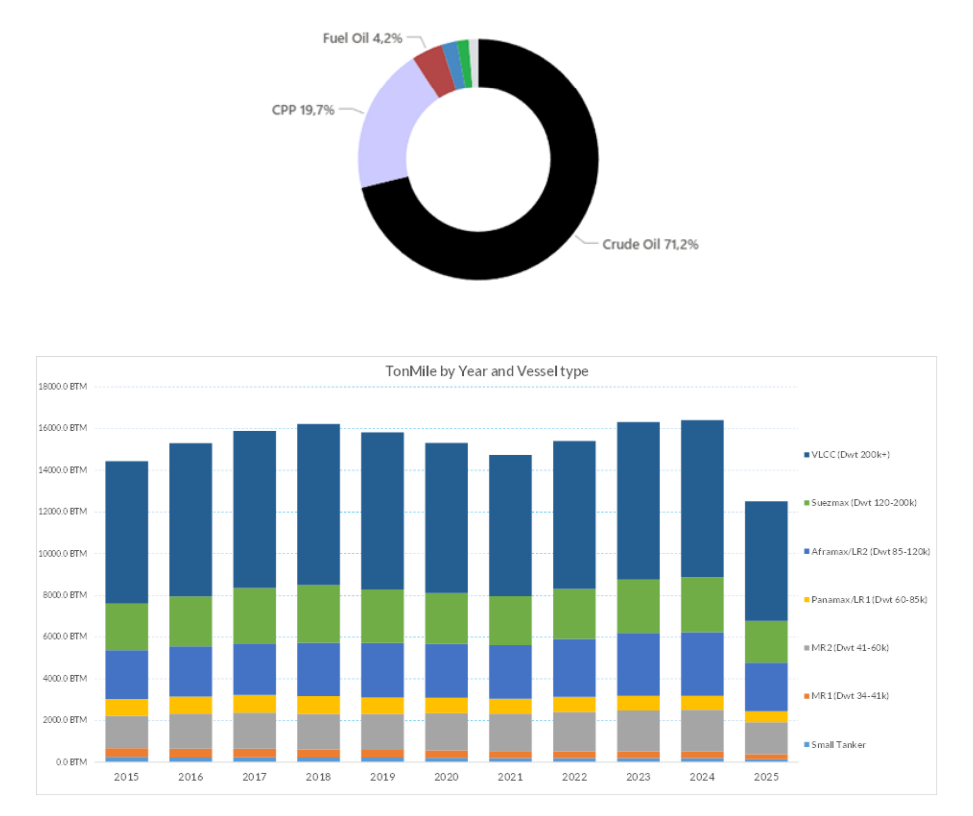
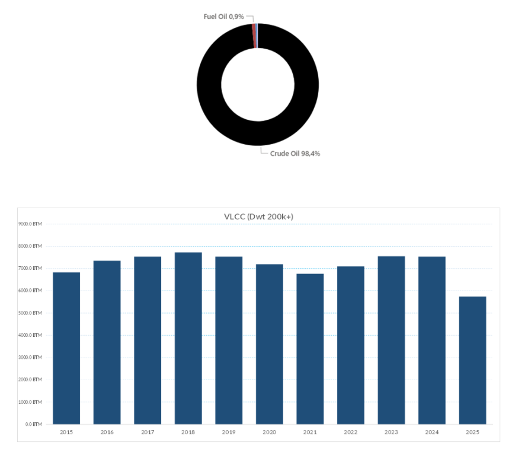
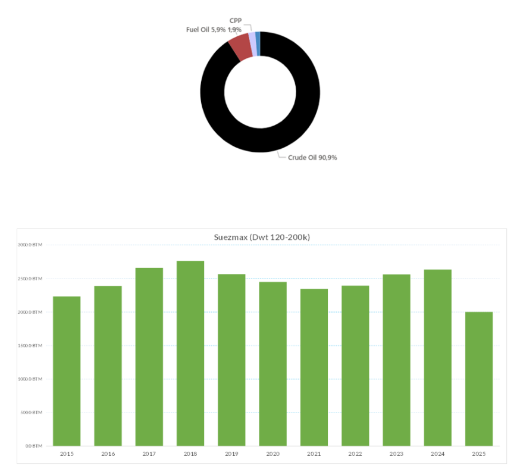
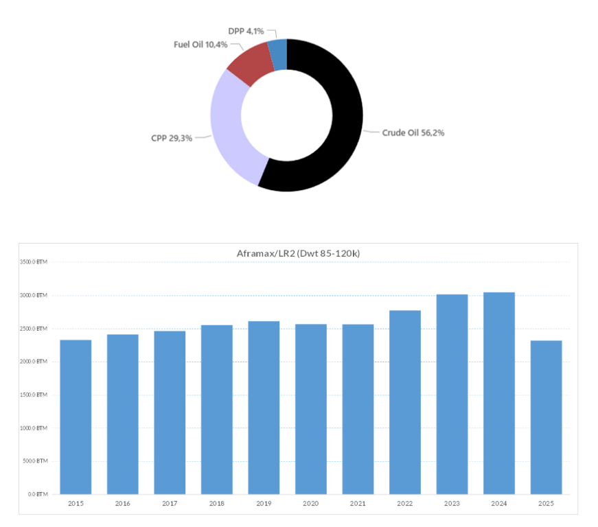
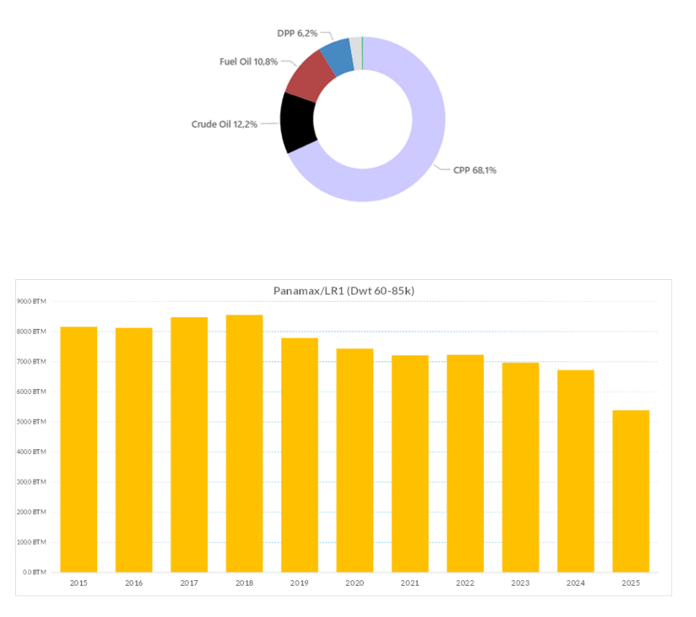
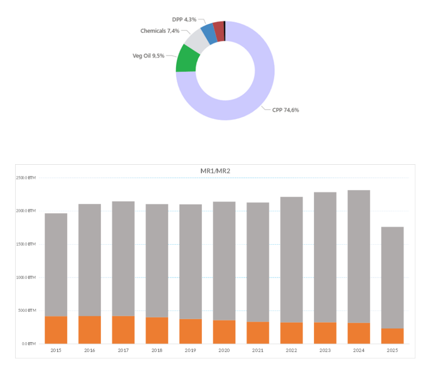

# Weekly Seaborne Oil Market Report – Q4 2025 Outlook

**Date:** October 08, 2025  
**Publisher:** Breakwave Advisors | **Category:** Market Insights  
**Original URL:** [https://www.breakwaveadvisors.com/insights/2025/10/8/weekly-seaborne-oil-market-report-q4-2025-outlook](https://www.breakwaveadvisors.com/insights/2025/10/8/weekly-seaborne-oil-market-report-q4-2025-outlook)  

---

The seaborne oil trade enters the final quarter of 2025 under intensifying geopolitical and policy-driven strain. This week’s Allied Quantumsea Research examines the evolution of oil tonne-miles using AXS data across both dirty and clean segments, highlighting the imbalances that continue to shape vessel deployment seaborne patterns as the market transitions into Q4.

### Oil Tonne-Mile Dynamics and Commodity Breakdown

Global oil tonne-miles rose from roughly 15.3 trillion in 2020 to around 16.4 trillion in 2024, representing an increase of about 6% over four years. In 2025, the figure currently stands at approximately 12.2 trillion, marking a notable year-to-date contraction relative to 2024. By commodity, crude oil constitutes roughly 70% of total tonne-miles, clean petroleum products (CPP) about 20%, and fuel oil near 4%, reaffirming crude’s dominant role in driving seaborne oil transport demand by distance carried.

> **Figure 1: Στιγμιότυπο Οθόνης 2025 10 08 110955**  
> **Interactive Data & Source:** [Allied-shipbroking](https://www.allied-shipbroking.gr/) | [Local Asset](file:///C:/Users/Dell/Github/Shipping/corpus/03-breakwave/insights/2025/assets/2025-10-08_weekly-seaborne-oil-market-report-q4-2025-outlook_img_cea3cf84ceb9ceb3cebcceb9cf8ccf84cf85_2ccbd6b34d45.png)

### VLCC

VLCC tonne-miles expanded from around 6.8 trillion in 2015 to a peak of 7.7 trillion in 2018, marking an increase of roughly 13% over three years. After moderate fluctuations between 7.0 and 7.5 trillion from 2020 to 2024, the series has eased to about 5.6 trillion in 2025 year-to-date, a decline of around 25% from the previous year.

> **Figure 2: Στιγμιότυπο Οθόνης 2025 10 08 111010**  
> **Interactive Data & Source:** [Allied-shipbroking](https://www.allied-shipbroking.gr/) | [Local Asset](file:///C:/Users/Dell/Github/Shipping/corpus/03-breakwave/insights/2025/assets/2025-10-08_weekly-seaborne-oil-market-report-q4-2025-outlook_img_cea3cf84ceb9ceb3cebcceb9cf8ccf84cf85_bd78bb4b9a9e.png)

### Suezmax

Suezmax tonne-miles expanded from approximately 2.23 trillion in 2015 to a peak of 2.76 trillion in 2018, a gain of about 24% over three years. Volumes then eased to around 2.35 trillion by 2021, down roughly 15% from the peak, before a partial rebound to 2.64 trillion in 2024. The 2025 year-to-date level stands near 1.96 trillion, indicating a decline of about 26% year -on-year. By commodity, crude oil represents around 90.9% of total Suezmax tonne-miles, followed by fuel oil at 5.9% and (CPP) at 1.9%.

> **Figure 3: Στιγμιότυπο Οθόνης 2025 10 08 111024**  
> **Interactive Data & Source:** [Allied-shipbroking](https://www.allied-shipbroking.gr/) | [Local Asset](file:///C:/Users/Dell/Github/Shipping/corpus/03-breakwave/insights/2025/assets/2025-10-08_weekly-seaborne-oil-market-report-q4-2025-outlook_img_cea3cf84ceb9ceb3cebcceb9cf8ccf84cf85_99fe9e4374e4.png)

### Aframax

Aframax and LR2 tonne-miles have shown steady long-term growth, rising from about 2.33 trillion in 2015 to a peak of 3.05 trillion in 2024, an overall increase of roughly 30% across the period. After relatively stable volumes between 2018 and 2021, activity accelerated from 2022 onward. The 2025 year-to-date level, around 2.26 trillion, reflects a 26% year-on-year decline. By commodity, crude oil accounts for 56 % of total tonne-miles, clean petroleum products (CPP) for 29.3%, fuel oil for 10.4%, and dirty petroleum products (DPP) for 4.1%.

> **Figure 4: Στιγμιότυπο Οθόνης 2025 10 08 111035**  
> **Interactive Data & Source:** [Allied-shipbroking](https://www.allied-shipbroking.gr/) | [Local Asset](file:///C:/Users/Dell/Github/Shipping/corpus/03-breakwave/insights/2025/assets/2025-10-08_weekly-seaborne-oil-market-report-q4-2025-outlook_img_cea3cf84ceb9ceb3cebcceb9cf8ccf84cf85_1a670019725a.png)

### Panamax

Panamax and LR1 tonne-miles have shown a mild downward trend over the past decade. From 816 billion in 2015 to a high of 855 billion in 2018, tonne-miles rose by about 5% before gradually declining to 673 billion in 2024, a drop of roughly 21% from the peak. The 2025 year-to-date figure, near 529 billion, marks an additional 21% year-on-year decline. By commodity, clean petroleum products (CPP) account for 68.2% of total tonne-miles, followed by crude oil at 12.2%, fuel oil at 10.8%, and dirty petroleum products (DPP) at 6.2%.

> **Figure 5: Στιγμιότυπο Οθόνης 2025 10 08 111057**  
> **Interactive Data & Source:** [Allied-shipbroking](https://www.allied-shipbroking.gr/) | [Local Asset](file:///C:/Users/Dell/Github/Shipping/corpus/03-breakwave/insights/2025/assets/2025-10-08_weekly-seaborne-oil-market-report-q4-2025-outlook_img_cea3cf84ceb9ceb3cebcceb9cf8ccf84cf85_d09cfa4fb35d.png)

### MR

The combined MR1 and MR2 tonne-mile performance has remained buoyant over the past decade. Total tonne-miles rose from 1.97 trillion in 2015 to a peak of 2.3 trillion in 2024, an increase of roughly 17%, before easing to about 1.7 trillion in 2025 year-to-date, a 26% reduction from the prior year. MR2s account for most of this activity, consistently contributing around 85–90% of total MR tonne-miles. By commodity, clean petroleum products (CPP) make up 74.6% of total tonnemiles, followed by vegetable oils (9.5%), chemicals (7.4%), and dirty petroleum products (4.3%).

> **Figure 6: Στιγμιότυπο Οθόνης 2025 10 08 111107**  
> **Interactive Data & Source:** [Allied-shipbroking](https://www.allied-shipbroking.gr/) | [Local Asset](file:///C:/Users/Dell/Github/Shipping/corpus/03-breakwave/insights/2025/assets/2025-10-08_weekly-seaborne-oil-market-report-q4-2025-outlook_img_cea3cf84ceb9ceb3cebcceb9cf8ccf84cf85_5585bd693fbe.png)

### What Challenges the Oil Market in Q4 2025

### OPEC+ Supply and Demand Dynamics

OPEC+ decided to maintain its cautious production strategy, confirming an output increase of 137,000 b/d for November 2025, matching the increment introduced in October. The move signals a measured approach to supply management at a time when global demand growth is losing momentum. According to the IEA’s September 2025 Oil Market Report, global oil demand is projected to rise by roughly 700 kb/d in 2025—marking a clear slowdown compared to previous years. This divergence between modest supply increases and decelerating demand growth emphasizes the producers’ effort to balance the market and prevent renewed downward pressure on prices.

### Russia Tightens Product Export Controls

In late September 2025, Russia extended its gasoline export ban through December 2025 and introduced a partial diesel export restriction aimed at intermediaries and resellers while exempting direct producers. The measures were introduced to stabilize domestic fuel supply after refinery disruptions earlier in the year, including damage from Ukrainian drone attacks, and tightened local availability. Under the extended framework, all gasoline exports remain prohibited, apart from limited humanitarian or government-approved deliveries. The diesel restrictions are narrower in scope, allowing exports by refinery operators holding direct production licenses but barring sales through independent trading entities and resellers.

### U.s. Gulf Coast Fuel-Oil Imports Hit Multi-Year High

U.S. Gulf Coast fuel-oil imports rose to around 541,000 b/d in September 2025, a multi-year high that underscores a structural shift in refinery feedstock sourcing. The increase reflects tightened availability of Venezuelan heavy crude, as renewed U.S. scrutiny of sanctions compliance and logistical bottlenecks at Venezuelan export terminals constrained flows earlier in Q3.

Data Source:[Allied](https://www.allied-shipbroking.gr/)

---

**Tags:** OPEC, Crude, Markets  
