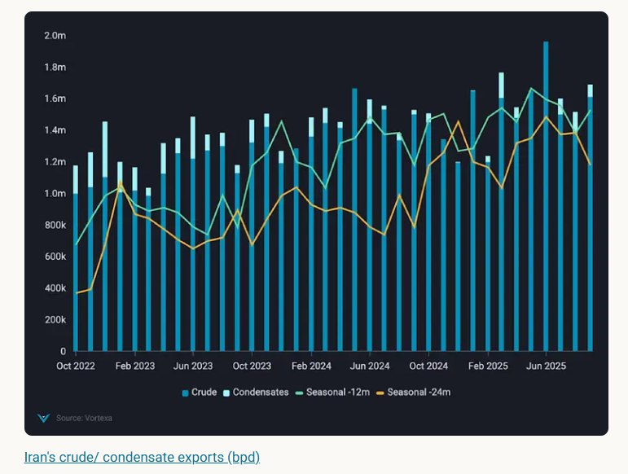
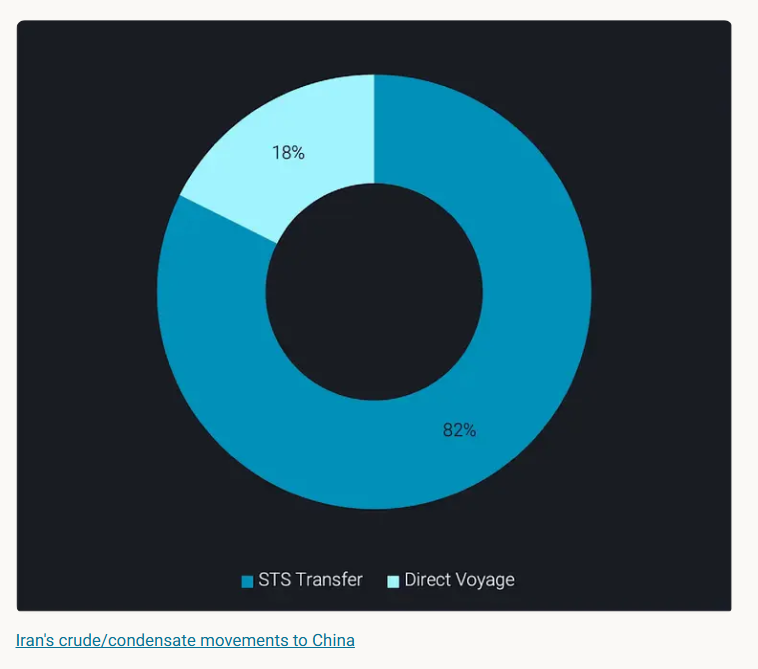
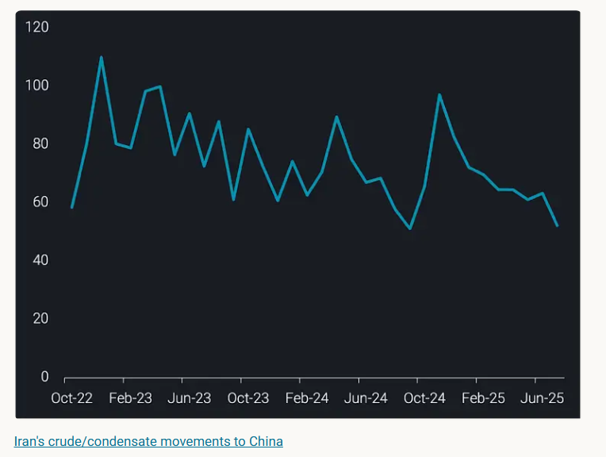

# Iran’s oil network matures under sanctions pressure

**Date:** October 09, 2025  
**Publisher:** Breakwave Advisors | **Category:** Market Insights  
**Original URL:** [https://www.breakwaveadvisors.com/insights/2025/10/9/irans-oil-network-matures-under-sanctions-pressure](https://www.breakwaveadvisors.com/insights/2025/10/9/irans-oil-network-matures-under-sanctions-pressure)  

---

Iran’s shadow fleet has matured, sustaining 1.3–1.6 mbd exports despite UN snapback sanctions, with faster, more efficient STS operations to China.

*By*[*Claire Jungman*](https://www.linkedin.com/in/claire-jungman-b40a78110/)

When the UN’s snapback sanctions on Iran officially returned on September 27, many expected exports to falter. Instead, tankers kept loading, ships kept sailing and China — Iran’s top buyer — kept taking cargoes.

The result: Iran’s oil keeps moving, but through a tighter, more efficient shadow fleet that has quietly adapted despite renewed legal pressure.

## What the Un Snapback Actually Does

The snapback mechanism, part of[UN Resolution 2231](https://www.un.org/securitycouncil/content/resolutions-adopted-security-council-2015), reinstates prior UN sanctions if Iran breaches its nuclear commitments.

Triggered in August 2025 by France, Germany, and the United Kingdom, it restored restrictions on arms, finance and shipping that were originally due to expire on October 18, 2025.

Now that the snapback has taken effect, these sanctions are effectively back in force - reactivating must of the UN’s pre-2016 sanctions framework.

Russia and China have rejected the move, and enforcement remains uneven, meaning the impact is legal, not logistical. While enforcement remains limited, the snapback restores a unified legal framework for future action — giving the US and E3 a stronger platform for coordinated secondary sanctions.

## Flows Stay High and Predictable

Vortexa data shows Iran’s crude and condensate loadings ranged between 1.3–1.6 mbd since late 2023, with several peaks above 1.8 mbd in early 2025 — the highest since 2018.

Roughly 85–90% of those volumes head to China, driven by deep[discounts](https://www.vortexa.com/insights/chinas-appetite-for-stockpiling)and reported barter-style payment arrangements.

> **Figure 1: Στιγμιότυπο Οθόνης 2025 10 09 095957**  
> **Interactive Data & Source:** [Vortexa](https://www.vortexa.com//oil-gas-data-traders-analysts-data-scientists?gclid=Cj0KCQjw8_qRBhCXARIsAE2AtRZKOvMnbilZ_6_91d7huSFFy71pWLrnPwGwOHVzXsmsG-1a1mZnQw8aAt89EALw_wcB&hsa_acc=1782073842&hsa_ad=548425387665&hsa_cam=14746637662&hsa_grp=125038601902&hsa_kw=&hsa_mt=&hsa_net=adwords&hsa_src=g&hsa_tgt=dsa-1431852288425&hsa_ver=3&utm_campaign=%5BCD%5D%20-%20DSA%20-%20EMEA&utm_medium=cpc&utm_medium=ppc&utm_source=google&utm_source=adwords&utm_term=) | [Local Asset](file:///C:/Users/Dell/Github/Shipping/corpus/03-breakwave/insights/2025/assets/2025-10-09_irans-oil-network-matures-under-sanctions-pressure_img_cea3cf84ceb9ceb3cebcceb9cf8ccf84cf85_0fc553a61a85.png)

## A Stabilised Dark Fleet

Beneath those volumes lies a network built on ship-to-ship (STS) transfers — the engine of Iran’s shadow trade.

Over the past three years, 82% of Iran–China voyages involved at least one STS operation, typically near Malaysia or Fujairah.

> **Figure 2: Στιγμιότυπο Οθόνης 2025 10 09 100501**  
> **Interactive Data & Source:** [Vortexa](https://www.vortexa.com//oil-gas-data-traders-analysts-data-scientists?gclid=Cj0KCQjw8_qRBhCXARIsAE2AtRZKOvMnbilZ_6_91d7huSFFy71pWLrnPwGwOHVzXsmsG-1a1mZnQw8aAt89EALw_wcB&hsa_acc=1782073842&hsa_ad=548425387665&hsa_cam=14746637662&hsa_grp=125038601902&hsa_kw=&hsa_mt=&hsa_net=adwords&hsa_src=g&hsa_tgt=dsa-1431852288425&hsa_ver=3&utm_campaign=%5BCD%5D%20-%20DSA%20-%20EMEA&utm_medium=cpc&utm_medium=ppc&utm_source=google&utm_source=adwords&utm_term=) | [Local Asset](file:///C:/Users/Dell/Github/Shipping/corpus/03-breakwave/insights/2025/assets/2025-10-09_irans-oil-network-matures-under-sanctions-pressure_img_cea3cf84ceb9ceb3cebcceb9cf8ccf84cf85_c3ade67b8833.png)

That system is no longer improvised — it’s optimised.

Voyage data show a long-term compression in voyage durations. Averaging around 85–90 days in 2022, when routing inefficiencies and prolonged anchorage times were common, average durations gradually shortened through 2023–24. Following a brief spike above 100 days in early 2025, voyages have now stabilised within a tighter 50–70-day range. This sustained reduction in voyage length – and in volatility – reflects a more disciplined, coordinated fleet operation, with fewer extended delays between load and discharge.

> **Figure 3: Στιγμιότυπο Οθόνης 2025 10 09 100545**  
> **Interactive Data & Source:** [Vortexa](https://www.vortexa.com//oil-gas-data-traders-analysts-data-scientists?gclid=Cj0KCQjw8_qRBhCXARIsAE2AtRZKOvMnbilZ_6_91d7huSFFy71pWLrnPwGwOHVzXsmsG-1a1mZnQw8aAt89EALw_wcB&hsa_acc=1782073842&hsa_ad=548425387665&hsa_cam=14746637662&hsa_grp=125038601902&hsa_kw=&hsa_mt=&hsa_net=adwords&hsa_src=g&hsa_tgt=dsa-1431852288425&hsa_ver=3&utm_campaign=%5BCD%5D%20-%20DSA%20-%20EMEA&utm_medium=cpc&utm_medium=ppc&utm_source=google&utm_source=adwords&utm_term=) | [Local Asset](file:///C:/Users/Dell/Github/Shipping/corpus/03-breakwave/insights/2025/assets/2025-10-09_irans-oil-network-matures-under-sanctions-pressure_img_cea3cf84ceb9ceb3cebcceb9cf8ccf84cf85_d6dacf9cc710.png)

Iran’s exports have not just weathered renewed sanctions — they’ve matured under them. Voyage durations have normalised, STS coordination is faster, and routing has become increasingly structured.

This shift reflects more than resilience: it marks the institutionalisation of sanctions evasion within Iran’s oil logistics.

- Operational efficiency: Shorter, more consistent voyages have lowered delivery risk and improved turnover, helping Iran sustain export volumes despite sanctions constraints.
- Cost absorption: Even as compliance and freight premiums persist, Iran’s ability to move barrels efficiently offsets some of that cost — allowing exports to remain competitive despite geopolitical strain.
- Systemic adaptation: What began as improvised workarounds are now repeatable supply chains connecting sanctioned oil to Chinese refiners. This operational maturity is reshaping market behaviour. This operational maturity is already evident in freight spreads and crude pricing, where Iranian barrels compete directly with Venezuelan and Russian grades for Chinese refiners.

The shadow fleet has become a functional parallel system, not an emergency patch. This matters because Iran’s flows are now reliably unconventional — steady, but not safe. The longer the network operates this way, the harder it becomes to unwind.

## Pressure Without Disruption

The next signal to watch isn’t whether Iran’s system can withstand pressure; it’s how it adapts to it. Each new layer of enforcement, from STS monitoring to insurance tightening, is met with logistical recalibration rather than retreat.

The key indicators will be routing shifts, changes in vessel-pairing patterns, and discharge timing adjustments. These micro-signals, rather than headline volumes, will reveal how durable Iran’s shadow fleet truly is.

Data Source:[Vortexa](https://www.vortexa.com//oil-gas-data-traders-analysts-data-scientists?gclid=Cj0KCQjw8_qRBhCXARIsAE2AtRZKOvMnbilZ_6_91d7huSFFy71pWLrnPwGwOHVzXsmsG-1a1mZnQw8aAt89EALw_wcB&hsa_acc=1782073842&hsa_ad=548425387665&hsa_cam=14746637662&hsa_grp=125038601902&hsa_kw=&hsa_mt=&hsa_net=adwords&hsa_src=g&hsa_tgt=dsa-1431852288425&hsa_ver=3&utm_campaign=%5BCD%5D%20-%20DSA%20-%20EMEA&utm_medium=cpc&utm_medium=ppc&utm_source=google&utm_source=adwords&utm_term=)

---

**Tags:** Crude, Tankers, Markets  
