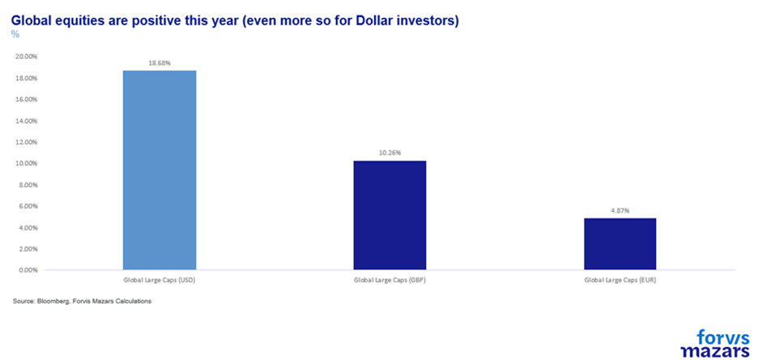
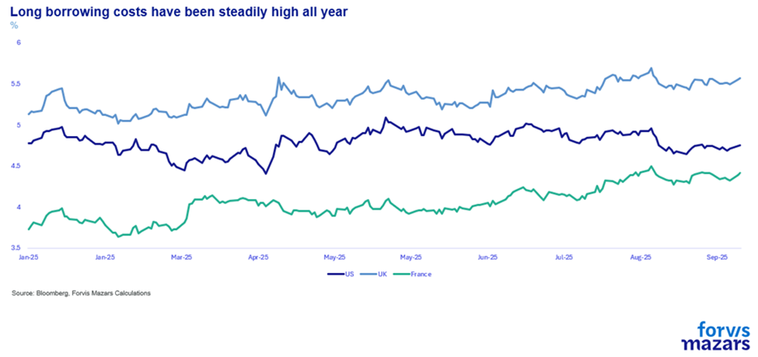
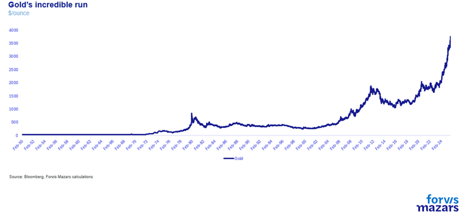
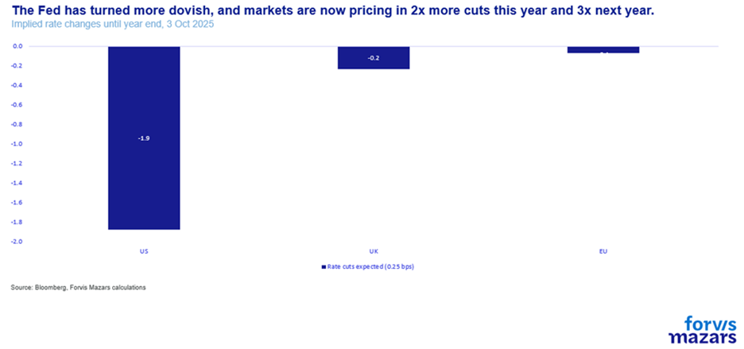
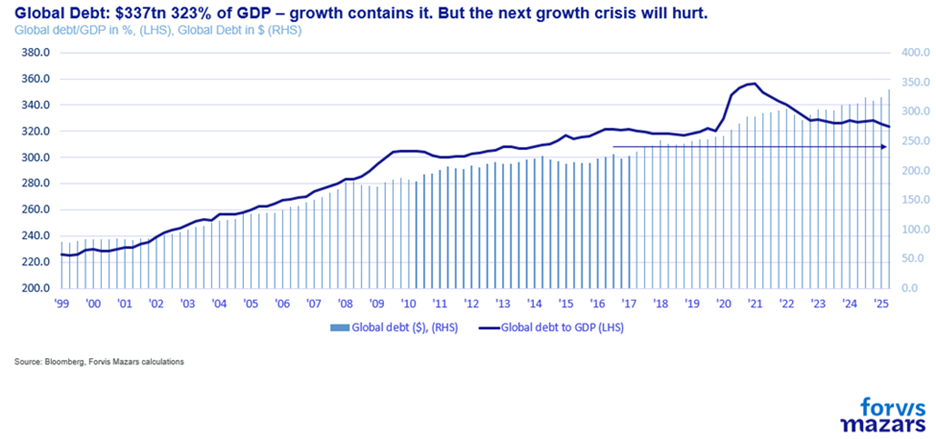
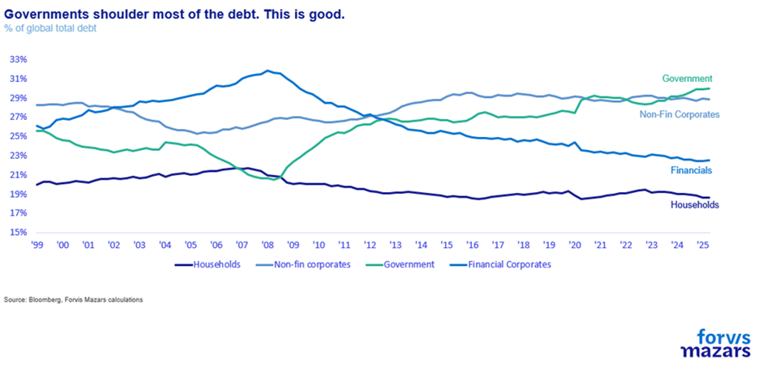
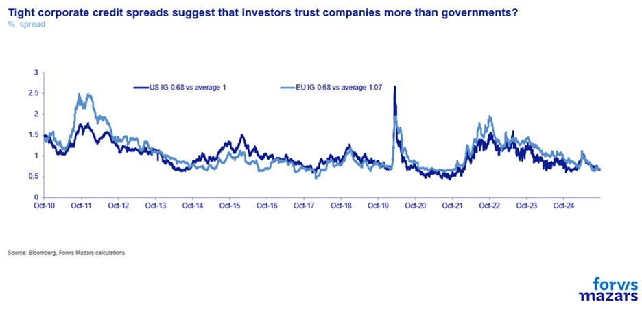

# Risk on AND Risk off?

**Date:** October 09, 2025  
**Publisher:** Breakwave Advisors | **Category:** Market Insights  
**Original URL:** [https://www.breakwaveadvisors.com/insights/2025/10/9/risk-on-and-risk-off](https://www.breakwaveadvisors.com/insights/2025/10/9/risk-on-and-risk-off)  

---

The three things investors should know about this week

1. **The equity rally signals exuberance, even as gold signals caution.**
2. **While the world is fixated on debt rising, the latest IIF data suggest that this rise is at least in line with GDP growth.**
3. **Frequent policy changes and the outcome uncertainty make strategic corporate decisions a lot more difficult. But unlike businesses, investors can afford to be less tactical.**

*By*[*George Lagarias*](https://www.linkedin.com/in/george-lagarias-mba-3baa769/)

Summary

Global markets show a rare pattern: equities, bonds, and gold rallying simultaneously — a sign of broad currency debasement rather than growth. Governments are managing high debt through devaluation while central banks avoid tightening, supporting risk assets but eroding purchasing power. Yet global debt/GDP has stabilised, delaying crisis risks.**For businesses**, this means heightened policy and currency uncertainty, complicating medium-term planning and forcing short-term flexibility.**For investors**, it underscores the need for discipline and patience: markets may remain buoyant despite structural fragility, but timing and allocation agility will determine who benefits from this extended, debt-fuelled cycle.

If you ever saw Mel Gibson’s Braveheart, you’d never know that the real “Braveheart” wasn’t the protagonist, William Wallace, but actually Robert the Bruce (who appears as a traitor in the movie). Or that by the time Wallace was executed, Isabella of France was only 10 years old, and therefore, they could not have had an affair. But it makes for a nice story. And nice stories stick. That’s how you make movies. It’s also how you sell books, and even how our memory often works.

Which is why the one thing most of us get wrong from history books is the timeline of events. Political and economic textbooks, when they analyse the long trends, use simple words to convey trends that may last anywhere between months to decades. They quickly move past long time periods where “nothing of note” happened. Important details are often missed for simplicity.

This doesn’t help analyse the present, however. As a profound geopolitical and geoeconomic change is taking place around us, it is easy to look back at the textbooks and say, “This is what usually happens”. The key, for investment and business decisions, lies not in the “what”, but in the “when”. Which is why John Maynard Keynes famously mused: “In the Long Run, we are all dead”.

Let’s unpack this.

It is quite unusual to have a rally of risk-on assets (stocks, and even bonds on occasion) and at the same time experience a sharp rally in gold, the ubiquitous risk-off asset.

There is only one condition in which this may happen: currency debasement. In such a case, the prices for real and financial assets would rise, as the currency denominator becomes smaller.

The rally in equities, which persists on the back of mega-AI tech funding deals,

> **Figure 1: Market Chart 1**  
> [Local Asset](file:///C:/Users/Dell/Github/Shipping/corpus/03-breakwave/insights/2025/assets/2025-10-09_risk-on-and-risk-off_img_image008_bba260301f7e.png)

the jitters in the bond market, including some G7 like the UK and France,

> **Figure 2: Market Chart 2**  
> [Local Asset](file:///C:/Users/Dell/Github/Shipping/corpus/03-breakwave/insights/2025/assets/2025-10-09_risk-on-and-risk-off_img_image009_4f6f49277024.png)

Dollar’s depreciation (with the Renminbi following and Pound Sterling also weak vs the Euro) and of course, the gold rally,

> **Figure 3: Market Chart 3**  
> [Local Asset](file:///C:/Users/Dell/Github/Shipping/corpus/03-breakwave/insights/2025/assets/2025-10-09_risk-on-and-risk-off_img_image010_60f7f4d6aaee.png)

all point to the same conclusion: we are at the mature part of a debt cycle, where debt issuance accounts for increasing interest payments. Governments devalue their currencies to reduce the real debt burden. And if they (or most of them) try to do it together, then real assets, like commodities and real estate, would tend to appreciate.

We discussed this extensively in our latest quarterly, when we deduced that so-called “currency wars” were the likeliest outcome of debt increase.

Now, central banks, vigilant of inflation, can of course intervene to protect their currencies, lest too much depreciation becomes inflationary, but we get a sense that no central bank wants to engage in such counter-cyclical policies. The ECB has a dovish bias. It has already taken rates back down to 2%, and still may have to contend with serious policy and political complications in France and perhaps Germany. The BoE is more reserved because inflation persists, but ultimately it may be forced towards a more dovish stance as well. The Labour government in the UK is fending off challenges (albeit nothing like the pressures Mr Macron seems to endure), and the fiscal situation is deteriorating, which means that monetary policy will come to the rescue. A dilemma which the Fed doesn’t seem to have, despite sharper tariff-related inflation pressures, as the central bank was finally convinced (sic) to see things more in line with the President and the Treasury, who advocate for cheaper money. Markets are now pricing in 5 rate cuts until the end of 2026, despite persistent inflation.

> **Figure 4: Market Chart 4**  
> [Local Asset](file:///C:/Users/Dell/Github/Shipping/corpus/03-breakwave/insights/2025/assets/2025-10-09_risk-on-and-risk-off_img_image011_d5bfa4bff607.png)

So the story is so far consistent: currency debasement leading to higher equity prices, while at the same time the US government is creating demand for Treasuries (GENIUS Act, pressures to reduce rates), keeping US bond long rates manageable despite underlying weakness. All that, under the pressure of more debt, which is obviously spilling over to the fiscally weaker G7 nations.

Except… It’s not entirely true. The latest data from the International Institute of Finance suggests that global debt/GDP has actually fallen, from 325% to 323% in the last quarter.

> **Figure 5: Market Chart 5**  
> [Local Asset](file:///C:/Users/Dell/Github/Shipping/corpus/03-breakwave/insights/2025/assets/2025-10-09_risk-on-and-risk-off_img_image012_cb27bad3b354.png)

More to the point, the longer-term chart suggests that global debt as a percentage of global growth has actually been pretty stable throughout the past decade.

Now, one could argue that government debt is still high. This is true. As a percentage of total debt, corporates and governments hold the largest share, while consumers and banks have deleveraged.

> **Figure 6: Market Chart 6**  
> [Local Asset](file:///C:/Users/Dell/Github/Shipping/corpus/03-breakwave/insights/2025/assets/2025-10-09_risk-on-and-risk-off_img_image013_a66833eb324f.png)

But here is the crux. Governments can always print money to pay off their debts. And corporates tend to be more careful with their balance sheets than banks have been in the past (which also affected consumer balance sheets).

> **Figure 7: Market Chart 7**  
> [Local Asset](file:///C:/Users/Dell/Github/Shipping/corpus/03-breakwave/insights/2025/assets/2025-10-09_risk-on-and-risk-off_img_image014_f44bb6a5e73e.png)

A financials-driven debt cycle is usually one of leverage, which can be reduced quickly, turning a difficult situation into a crisis. Not all debt cycles are the same. They might end up in similar places eventually, but where each cycle differs is in the time it takes for risks to manifest.

In simple terms, Gold is right to rally, insofar as governments try to print their way out of their accumulated debt. But accommodative central banks, well-capitalised commercial banks and delevered consumers can stave off a crisis for a long time.

The reason why we haven’t added back Gold in our portfolios is that it is not screaming “danger” as much as it shouts “we are worried”. It’s easy to say “the global monetary system is crashing, evidenced by investors pouring into gold”, but this “crash” could be years or even decades away.

The Debt narrative, complete with the geopolitical disturbance coming from the abandonment of the Washington Consensus and the inflationary challenges from Trade Wars, is certainly reason to worry about. But we can never be sure how long the trends will take to play out. Central banks are equipped to stave off crises for quite time. The longer it takes to see a crisis play out, the longer mitigating factors may appear (legal challenges to the US President, policy reversals, global policy initiatives, etc). I.e. further elongating (or shortening) the time of its arrival.

### What This Means for Businesses and Consumers:

Policy and outcome uncertainty make planning very difficult. Typically, boards make decisions on 3-5 year horizons. But the frequent policy changes and the outcome uncertainty make those decisions a lot more difficult. So companies are forced to be more short-termist, even as they know they are in the midst of a paradigm shift.

For investors, things are similar, but somewhat easier. Uncertainty means being more vigilant to be sure. But unlike businesses, which are also disrupted by AI, they can afford to be less tactical. They can rely on the long-term bullish nature of capitalism (what we call a Strategic Asset Allocation) and hope for the patience of their investors throughout the volatile periods.

---

**Tags:** Macro, Economy, Markets  
