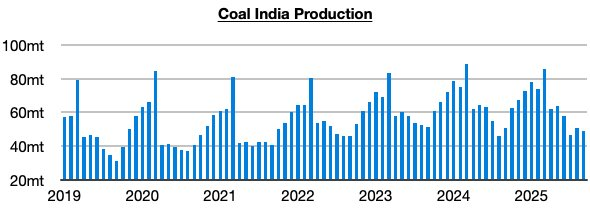
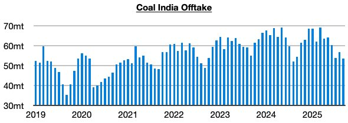
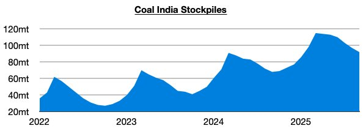

# Coal India's Production Returns to Contraction

**Date:** October 10, 2025  
**Publisher:** Breakwave Advisors | **Category:** Market Insights  
**Original URL:** [https://www.breakwaveadvisors.com/insights/2025/10/10/coal-indias-production-returns-to-contraction](https://www.breakwaveadvisors.com/insights/2025/10/10/coal-indias-production-returns-to-contraction)  

---

*By*[*Jeffrey Landsberg*](https://www.linkedin.com/in/jeffrey-landsberg-70ab957/)

As we discussed in Commodore Research's most recent Weekly Executive Report, Coal India produced approximately 49 million tons of coal last month (Coal India is responsible for over 75% of India’s coal production). This is down month-on-month by 1.4 million tons (-3%) and is down year-on-year by 1.9 million tons (-4%). Coal India’s output has now contracted on a year-on-year basis during seven of the last nine months. During these seven months, Coal India’s output has contracted year-on-year by 2.7% while India’s coal-derived electricity generation contracted by 3.6%.

> **Figure 1: Chart 1**  
> [Local Asset](file:///C:/Users/Dell/Github/Shipping/corpus/03-breakwave/insights/2025/assets/2025-10-10_coal-indias-production-returns-to-contraction_img_chart1_ac52f17cad5a.jpg)

Offtake (the amount sent to customers) totaled 53.6 million tons, which is down month-on-month by 3.1 million tons (-6%) and down year-on-year by 800,000 tons (-2%). Offtake has now exceeded production for six straight months. Previously, it had come in under production for six straight months.

> **Figure 2: Chart 2**  
> [Local Asset](file:///C:/Users/Dell/Github/Shipping/corpus/03-breakwave/insights/2025/assets/2025-10-10_coal-indias-production-returns-to-contraction_img_chart2_94465f445c76.jpg)

Stockpiles have fallen again with offtake again exceeding production. They now stand at approximately 92 million tons. This is 23 million tons (-20%) less than March’s record 115 million tons but is up year-on-year by 24 million tons (35%).

> **Figure 3: Chart 3**  
> [Local Asset](file:///C:/Users/Dell/Github/Shipping/corpus/03-breakwave/insights/2025/assets/2025-10-10_coal-indias-production-returns-to-contraction_img_chart3_bb3a9cf5aa9b.jpg)

---

**Tags:** Coal, India, Drybulk  
