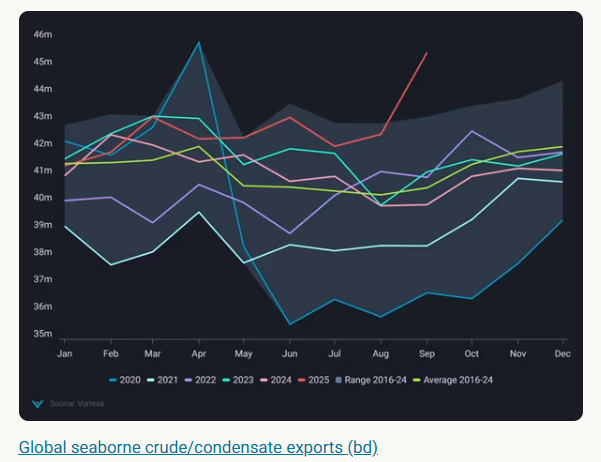
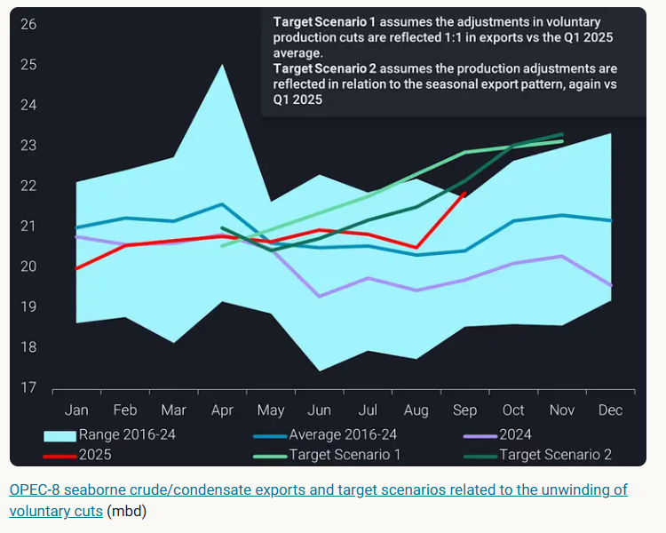
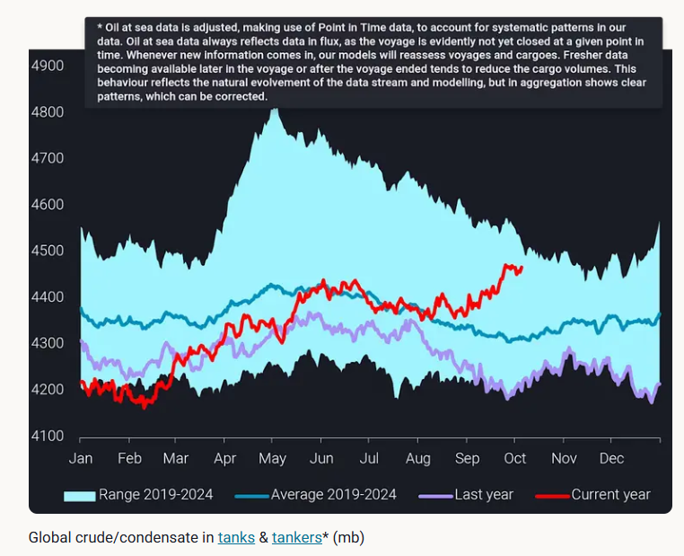

# Oil in the supply chain now close to seasonal highs

**Date:** October 10, 2025  
**Publisher:** Breakwave Advisors | **Category:** Market Insights  
**Original URL:** [https://www.breakwaveadvisors.com/insights/2025/10/10/oil-in-the-supply-chain-now-close-to-seasonal-highs](https://www.breakwaveadvisors.com/insights/2025/10/10/oil-in-the-supply-chain-now-close-to-seasonal-highs)  

---

The significant increase in global oil exports in September marks a new chapter: can demand keep pace with growing supplies?

*By*[*Xavier Tang*](https://www.linkedin.com/in/xavier-tang/)

In September, global crude and condensate exports reached near-peak levels of over 45mbd, similar to those seen in April 2020 when the OPEC+ group disagreed on a drastic production cut in March 2020. The collapse of cooperation within the OPEC+ group in March 2020 led to a surge in oil production and exports, resulting in an oil price crash in mid-April, when WTI prices fell into negative territory for the first time.

Fast forward to 2025, crude prices have been supported by geopolitical tensions in the Middle East and stockpiling activities seen in China ([read more on China’s appetite for stockpiling](https://www.vortexa.com/insights/chinas-appetite-for-stockpiling)). The question is, how long can prices remain supported as we enter into the seasonally higher export period in the fourth quarter of the year?

> **Figure 1: Στιγμιότυπο Οθόνης 2025 10 10 114717**  
> **Interactive Data & Source:** [Analytics Vortexa](https://analytics.vortexa.com/Flows?dateRange=2020-01-01T00%3A00%3A00.000Z__2025-09-30T23%3A59%3A59.999Z&filtersEnabled=%5B%22p%22%2C%22o%22%2C%22d%22%2C%22d_r%22%2C%22v%22%2C%22intra_d%22%2C%22sts_o%22%2C%22c_o%22%2C%22w%22%2C%22sts%22%5D&from=%5B%22b996521be9c996db3560ca234a56286ac38f798d34be229437555fab4f12a6a5%22%2C%22d308ddc557e774187ad6c7da81b39db990def9a39e6c88e79cb163b6bdd6e8e5%22%2C%22a1acb291bb339d07faa0d9c7b62ea292aa0ea1a01813b26c890aeeb4e2334b09%22%5D&metric=bpd&page=Flows&products=%5B%2254af755a090118dcf9b0724c9a4e9f14745c26165385ffa7f1445bc768f06f11%22%5D&productsExcluded=%5B%22578b0722570521d64e6a1527e1fb88ddb1a064cc15afe1d6023d2a0b6d66be6b%22%2C%22bb70cf56200f5b72ba69a90bda2c6b47ba29da23945c6f1994cfd4c2ef2fe0ff%22%5D&tabId=857eb1db-362e-4e14-8d86-67f84d388038&timeSeriesChartView=seasonal&timeSeriesProperty=origin_country&v=3) | [Local Asset](file:///C:/Users/Dell/Github/Shipping/corpus/03-breakwave/insights/2025/assets/2025-10-10_oil-in-the-supply-chain-now-close-to-seasonal-highs_img_cea3cf84ceb9ceb3cebcceb9cf8ccf84cf85_1d7272928eee.png)

## The Main Contributors to Supply Additions

[Seaborne crude and condensate exports from Iran, Russia (excluding transit flows from Kazakhstan), and Venezuela](https://analytics.vortexa.com/Flows?dateRange=2020-01-01T00%3A00%3A00.000Z__2025-09-30T23%3A59%3A59.999Z&filtersEnabled=%5B%22p%22%2C%22o%22%2C%22d%22%2C%22d_r%22%2C%22v%22%2C%22intra_d%22%2C%22sts_o%22%2C%22c_o%22%2C%22w%22%2C%22sts%22%5D&from=%5B%22b996521be9c996db3560ca234a56286ac38f798d34be229437555fab4f12a6a5%22%2C%22d308ddc557e774187ad6c7da81b39db990def9a39e6c88e79cb163b6bdd6e8e5%22%2C%22a1acb291bb339d07faa0d9c7b62ea292aa0ea1a01813b26c890aeeb4e2334b09%22%5D&metric=bpd&page=Flows&products=%5B%2254af755a090118dcf9b0724c9a4e9f14745c26165385ffa7f1445bc768f06f11%22%5D&productsExcluded=%5B%22578b0722570521d64e6a1527e1fb88ddb1a064cc15afe1d6023d2a0b6d66be6b%22%2C%22bb70cf56200f5b72ba69a90bda2c6b47ba29da23945c6f1994cfd4c2ef2fe0ff%22%5D&tabId=857eb1db-362e-4e14-8d86-67f84d388038&timeSeriesChartView=seasonal&timeSeriesProperty=origin_country&v=3)contributed to 30% of the month-over-month increase in exports. Despite a slew of policies, including the US maximum pressure campaign, US secondary tariffs, and the EU price cap on Russian oil, targeted at curbing oil supplies from sanctioned countries, oil continues to flow.

Although OPEC-8 crude and condensate exports have remained relatively stable from February to August this year, the unwinding of OPEC+ production cuts has now begun to show up in September, as export volumes have jumped to a 29-month high of 22mbd. The increase in OPEC-8 exports could partly be a compensation effort after August’s low exports and a seasonal rise in the fourth quarter of the year.

Within the OPEC-8 members,[Saudi Arabia has led the export growth](https://analytics.vortexa.com/Flows?dateRange=2024-01-01T00%3A00%3A00.000Z__2025-09-30T23%3A59%3A59.999Z&filtersEnabled=%5B%22p%22%2C%22o%22%2C%22d%22%2C%22d_r%22%2C%22v%22%2C%22intra_d%22%2C%22sts_o%22%2C%22c_o%22%2C%22w%22%2C%22v_i%22%2C%22sts%22%2C%22hd%22%5D&from=%5B%2243a70ba6b21894cd24165d9d7ee59b012e698cf97e22fd275ccdd05a556e7061%22%5D&geoBreakdownOriginGlobal=terminal&metric=bpd&page=Flows&products=%5B%2254af755a090118dcf9b0724c9a4e9f14745c26165385ffa7f1445bc768f06f11%22%5D&tabId=c72d86b9-60fd-46f5-8936-2ea676bc191b&timeSeriesBaselineEnd=2024-04-01T10%3A59%3A59.999Z&timeSeriesBaselineStart=2023-01-01T10%3A59%3A59.999Z&timeSeriesChartView=seasonal&timeSeriesProperty=product_grade&v=3), with a month-over-month increase of 640kbd, due to lower domestic crude burn as power generation demand in the kingdom falls. Concurrently, Kazakhstan continues to exhibit noncompliance with OPEC+ policies, with[exports reaching record highs of over 2mbd](https://analytics.vortexa.com/Flows?dateRange=2024-01-01T00%3A00%3A00.000Z__2025-09-30T23%3A59%3A59.999Z&filtersEnabled=%5B%22p%22%2C%22o%22%2C%22d%22%2C%22d_r%22%2C%22v%22%2C%22intra_d%22%2C%22sts_o%22%2C%22c_o%22%2C%22w%22%2C%22v_i%22%2C%22sts%22%2C%22hd%22%5D&geoBreakdownOriginGlobal=terminal&intraMovementDropdown=all&metric=bpd&page=Flows&products=%5B%22bb70cf56200f5b72ba69a90bda2c6b47ba29da23945c6f1994cfd4c2ef2fe0ff%22%2C%22578b0722570521d64e6a1527e1fb88ddb1a064cc15afe1d6023d2a0b6d66be6b%22%2C%22c5ecbe5f8269262d4faaa69597f8710f614edc2be702e8a84713ba9962c889ca%22%5D&tabId=c72d86b9-60fd-46f5-8936-2ea676bc191b&timeSeriesBaselineEnd=2024-04-01T10%3A59%3A59.999Z&timeSeriesBaselineStart=2023-01-01T10%3A59%3A59.999Z&timeSeriesChartView=seasonal&timeSeriesProperty=product_grade&v=3), and[Russia’s crude exports have picked up](https://analytics.vortexa.com/Flows?dateRange=2024-01-01T00%3A00%3A00.000Z__2025-09-30T23%3A59%3A59.999Z&filtersEnabled=%5B%22p%22%2C%22o%22%2C%22d%22%2C%22d_r%22%2C%22v%22%2C%22intra_d%22%2C%22sts_o%22%2C%22c_o%22%2C%22w%22%2C%22v_i%22%2C%22sts%22%2C%22hd%22%5D&from=%5B%22b996521be9c996db3560ca234a56286ac38f798d34be229437555fab4f12a6a5%22%5D&geoBreakdownOriginGlobal=terminal&intraMovementDropdown=all&metric=bpd&page=Flows&products=%5B%2254af755a090118dcf9b0724c9a4e9f14745c26165385ffa7f1445bc768f06f11%22%5D&productsExcluded=%5B%22578b0722570521d64e6a1527e1fb88ddb1a064cc15afe1d6023d2a0b6d66be6b%22%2C%22bb70cf56200f5b72ba69a90bda2c6b47ba29da23945c6f1994cfd4c2ef2fe0ff%22%5D&tabId=c72d86b9-60fd-46f5-8936-2ea676bc191b&timeSeriesBaselineEnd=2024-04-01T10%3A59%3A59.999Z&timeSeriesBaselineStart=2023-01-01T10%3A59%3A59.999Z&timeSeriesChartView=seasonal&timeSeriesProperty=product_grade&v=3)as its refinery runs have fallen to the lowest since April 2022 (Bloomberg).

There were also notable[supply increases seen outside the OPEC-8 group,](https://analytics.vortexa.com/Flows?dateRange=2016-01-01T00%3A00%3A00.000Z__2025-09-30T23%3A59%3A59.999Z&filtersEnabled=%5B%22p%22%2C%22o%22%2C%22d%22%2C%22d_r%22%2C%22v%22%2C%22intra_d%22%2C%22sts_o%22%2C%22c_o%22%2C%22w%22%5D&fromExcluded=%5B%221c47e09ebf73cbb0fda6e36ffc125d4be50936d17888e0a7d2acb17a439db108%22%5D&geoBreakdownOriginGlobal=shipping_region_v2&metric=bpd&page=Flows&products=%5B%2254af755a090118dcf9b0724c9a4e9f14745c26165385ffa7f1445bc768f06f11%22%5D&tabId=c6c71457-2f70-43fb-a9c1-7cfe50584e23&timeSeriesBaselineEnd=2024-04-01T10%3A59%3A59.999Z&timeSeriesBaselineStart=2023-01-01T10%3A59%3A59.999Z&timeSeriesProperty=origin_country&v=3)with the US being the largest driver in supply growth.[US exports jumped 0.5mbd](https://analytics.vortexa.com/Flows?dateRange=2016-01-01T00%3A00%3A00.000Z__2025-09-30T23%3A59%3A59.999Z&filtersEnabled=%5B%22p%22%2C%22o%22%2C%22d%22%2C%22d_r%22%2C%22v%22%2C%22intra_d%22%2C%22sts_o%22%2C%22c_o%22%2C%22w%22%5D&from=%5B%22bbb65b6cb13db7dca985347796498c0f4458e8982c73fbe612515a536e5277b5%22%2C%22eb51f8315cf769b317615f7fcbdad3ff8612baaea0e9a39d3a63550c44784658%22%2C%22ae06d7e47d6ca2a5bcd7625b8ad402d39e5e92fcc740157dc3301a6d2a6bb207%22%5D&metric=bpd&originGlobalXFilter=%5B%222d92cc08f22524dba59f6a7e340f132a9da0ce9573cca968eb8e3752ef17a963%22%5D&page=Flows&products=%5B%2254af755a090118dcf9b0724c9a4e9f14745c26165385ffa7f1445bc768f06f11%22%5D&tabId=c6c71457-2f70-43fb-a9c1-7cfe50584e23&timeSeriesBaselineEnd=2024-04-01T10%3A59%3A59.999Z&timeSeriesBaselineStart=2023-01-01T10%3A59%3A59.999Z&timeSeriesProperty=origin_country&v=3)month-over-month and are likely to maintain high levels for the rest of the year due to the ad-valorem tax that incentivises sellers to minimise onshore inventories and record high US crude oil production in July (EIA data).[Latin America also contributed to the supply increases](https://analytics.vortexa.com/Flows?dateRange=2016-01-01T00%3A00%3A00.000Z__2025-09-30T23%3A59%3A59.999Z&filtersEnabled=%5B%22p%22%2C%22o%22%2C%22d%22%2C%22d_r%22%2C%22v%22%2C%22intra_d%22%2C%22sts_o%22%2C%22c_o%22%2C%22w%22%5D&from=%5B%22bbb65b6cb13db7dca985347796498c0f4458e8982c73fbe612515a536e5277b5%22%2C%22eb51f8315cf769b317615f7fcbdad3ff8612baaea0e9a39d3a63550c44784658%22%5D&metric=bpd&page=Flows&products=%5B%2254af755a090118dcf9b0724c9a4e9f14745c26165385ffa7f1445bc768f06f11%22%5D&tabId=c6c71457-2f70-43fb-a9c1-7cfe50584e23&timeSeriesBaselineEnd=2024-04-01T10%3A59%3A59.999Z&timeSeriesBaselineStart=2023-01-01T10%3A59%3A59.999Z&timeSeriesProperty=origin_country&v=3), although the rise in exports began in 2023, with Guyana and Brazil driving the growth in exports.

> **Figure 2: Στιγμιότυπο Οθόνης 2025 10 10 114805**  
> **Interactive Data & Source:** [Analytics Vortexa](https://analytics.vortexa.com/Flows?dateRange=last-24-months-minus-two-days&filtersEnabled=%5B%22p%22%2C%22o%22%2C%22d%22%2C%22d_r%22%2C%22v%22%2C%22intra_d%22%2C%22sts_o%22%2C%22c_o%22%2C%22w%22%2C%22sts%22%5D&frequency=day&metric=bpd&movementEvent=transiting_state&page=Flows&products=%5B%2254af755a090118dcf9b0724c9a4e9f14745c26165385ffa7f1445bc768f06f11%22%5D&tabId=0405c102-1e2d-4598-a9ba-1d5ce2ef23fa&timeSeriesProperty=origin_country&v=3) | [Local Asset](file:///C:/Users/Dell/Github/Shipping/corpus/03-breakwave/insights/2025/assets/2025-10-10_oil-in-the-supply-chain-now-close-to-seasonal-highs_img_cea3cf84ceb9ceb3cebcceb9cf8ccf84cf85_4ed4648b6871.png)

## Oil in Transit Is Growing, But Onshore Storage Can Absorb It

[Crude and condensates currently in transit](https://analytics.vortexa.com/Flows?dateRange=last-24-months-minus-two-days&filtersEnabled=%5B%22p%22%2C%22o%22%2C%22d%22%2C%22d_r%22%2C%22v%22%2C%22intra_d%22%2C%22sts_o%22%2C%22c_o%22%2C%22w%22%2C%22sts%22%5D&frequency=day&metric=bpd&movementEvent=transiting_state&page=Flows&products=%5B%2254af755a090118dcf9b0724c9a4e9f14745c26165385ffa7f1445bc768f06f11%22%5D&tabId=0405c102-1e2d-4598-a9ba-1d5ce2ef23fa&timeSeriesProperty=origin_country&v=3)have accumulated since September due to a recent surge in long-haul[crude voyages from the Atlantic Basin to the Pacific Basin](https://analytics.vortexa.com/Flows?dateRange=2024-01-01T00%3A00%3A00.000Z__2025-09-30T23%3A59%3A59.999Z&filtersEnabled=%5B%22p%22%2C%22o%22%2C%22d%22%2C%22d_r%22%2C%22v%22%2C%22intra_d%22%2C%22sts_o%22%2C%22c_o%22%2C%22w%22%2C%22sts%22%5D&from=%5B%2267be333ea46a3cd312e207b05e2c5c4502a9353e39ec81642a93e3b23cc3c10a%22%5D&metric=bpd&page=Flows&products=%5B%2254af755a090118dcf9b0724c9a4e9f14745c26165385ffa7f1445bc768f06f11%22%5D&tabId=0405c102-1e2d-4598-a9ba-1d5ce2ef23fa&timeSeriesChartView=seasonal&to=%5B%22715b6aab56723cb55c3ddbdc12a2851b379919010f119cf98765d4debbdb793d%22%5D&v=3). The slowdown in demand in the Atlantic Basin during the autumn refinery maintenance season, along with the narrowing of Brent-Dubai EFS in late August and early September, prompted these extensive long-haul voyages. However, these long-haul flows are expected to slow down in October as arbitrage economics have weakened considerably due to weaker Brent-Dubai EFS and elevated freight rates.

The growth in crude and condensates at tanks and tankers, which includes onshore crude inventories, oil in floating storage and oil in transit, has sparked growing concerns about whether the market is entering an oversupply situation. The backwardation in the Dubai m1/m3 curve has narrowed from US$3.74/bl on September 15th to US$0.83/bl on October 7th, reflecting a weaker overall sentiment in oil markets as doubts arise on whether the market can absorb these high volumes in the oil supply chain.

> **Figure 3: Στιγμιότυπο Οθόνης 2025 10 10 114848**  
> **Interactive Data & Source:** [Analytics Vortexa](https://analytics.vortexa.com/OnShoreCrudeInventories?dateRange=last-full-60-months&filtersEnabled=%5B%22t_s_t%22%2C%22d_r%22%2C%22v_o%22%2C%22t_c_c%22%2C%22ve_ow%22%5D&multiSelect=1&onshoreInventoriesLocations=%5B%22bc0412e33d806bd8361f6a98d1779402a683633d0e36c5d1098bb9c5acd81677%22%2C%22fef51e481251cb18e6baa2d009d15f0fbd856687d425f783dc0b5d58d452e173%22%2C%227f97abda5311b51c2463779249f9a9b62478ed87f8e24ce04dddf58fe077bae5%22%2C%22e21ed02b282c14bec4fec50cec6ce09ee4795f0dc332c4cf6d787f9bc2b2bad6%22%2C%22d2ca3bc900922e8fdc33f394c2074ad10c1e82815868662c71e9da0b7a837ed8%22%2C%228fc803bba1e888808f954f5fc025b489e729a23d6f957f8991b4d71c572c3fd1%22%2C%22360ca6ba499f26f7dc481f99badda909af99c44466697f33e57ee628179183c6%22%2C%2223d89c430d1f8ee5ccfd78a82243d3e17199d520898d3463cc99ddd2f97eb971%22%2C%2250182d9d05051a6c8d24f0514d4ee828da6eaa29eacbb11cfe368f51526328ce%22%2C%22bcd7dddaf951959ebf6076a3a594b426a246d3bffe13339b10d04e45f222e011%22%2C%22b15970adfcd316d11d698d13de23e2291a60e1fb05070feab30957c6645e576e%22%2C%22934c47f36c16a58d68ef5e007e62a23f5f036ee3f3d1f5f85a48c572b90ad8b2%22%2C%2270425373a1836d6d0390dc6fef838a468717fba7776d66065a5043488f9f041b%22%5D&page=OnShoreCrudeInventories&selectedRegion=%5B%2270425373a1836d6d0390dc6fef838a468717fba7776d66065a5043488f9f041b%22%2C%22Global%22%5D&tabId=9105bc65-2948-4849-9d9a-d5317a559063&tankCrude=%5B%22confirmed%22%2C%22probable%22%5D) | [Local Asset](file:///C:/Users/Dell/Github/Shipping/corpus/03-breakwave/insights/2025/assets/2025-10-10_oil-in-the-supply-chain-now-close-to-seasonal-highs_img_cea3cf84ceb9ceb3cebcceb9cf8ccf84cf85_fb5604d80003.png)

[Global crude onshore inventories](https://analytics.vortexa.com/OnShoreCrudeInventories?dateRange=last-full-60-months&filtersEnabled=%5B%22t_s_t%22%2C%22d_r%22%2C%22v_o%22%2C%22t_c_c%22%2C%22ve_ow%22%5D&multiSelect=1&onshoreInventoriesLocations=%5B%22bc0412e33d806bd8361f6a98d1779402a683633d0e36c5d1098bb9c5acd81677%22%2C%22fef51e481251cb18e6baa2d009d15f0fbd856687d425f783dc0b5d58d452e173%22%2C%227f97abda5311b51c2463779249f9a9b62478ed87f8e24ce04dddf58fe077bae5%22%2C%22e21ed02b282c14bec4fec50cec6ce09ee4795f0dc332c4cf6d787f9bc2b2bad6%22%2C%22d2ca3bc900922e8fdc33f394c2074ad10c1e82815868662c71e9da0b7a837ed8%22%2C%228fc803bba1e888808f954f5fc025b489e729a23d6f957f8991b4d71c572c3fd1%22%2C%22360ca6ba499f26f7dc481f99badda909af99c44466697f33e57ee628179183c6%22%2C%2223d89c430d1f8ee5ccfd78a82243d3e17199d520898d3463cc99ddd2f97eb971%22%2C%2250182d9d05051a6c8d24f0514d4ee828da6eaa29eacbb11cfe368f51526328ce%22%2C%22bcd7dddaf951959ebf6076a3a594b426a246d3bffe13339b10d04e45f222e011%22%2C%22b15970adfcd316d11d698d13de23e2291a60e1fb05070feab30957c6645e576e%22%2C%22934c47f36c16a58d68ef5e007e62a23f5f036ee3f3d1f5f85a48c572b90ad8b2%22%2C%2270425373a1836d6d0390dc6fef838a468717fba7776d66065a5043488f9f041b%22%5D&page=OnShoreCrudeInventories&selectedRegion=%5B%2270425373a1836d6d0390dc6fef838a468717fba7776d66065a5043488f9f041b%22%2C%22Global%22%5D&tabId=9105bc65-2948-4849-9d9a-d5317a559063&tankCrude=%5B%22confirmed%22%2C%22probable%22%5D)are still under the six-year seasonal average, signifying room for stock builds. Global storage capacities have also increased over the past few years, meaning that the same stock level this year would reflect lower storage utilisation rates compared to a few years ago. It remains to be seen whether such high export figures will continue over the next few months; in the short term however, the oil market is likely able to absorb these additional volumes into onshore storage tanks.

Data Source:[Vortexa](https://www.vortexa.com//oil-gas-data-traders-analysts-data-scientists?gclid=Cj0KCQjw8_qRBhCXARIsAE2AtRZKOvMnbilZ_6_91d7huSFFy71pWLrnPwGwOHVzXsmsG-1a1mZnQw8aAt89EALw_wcB&hsa_acc=1782073842&hsa_ad=548425387665&hsa_cam=14746637662&hsa_grp=125038601902&hsa_kw=&hsa_mt=&hsa_net=adwords&hsa_src=g&hsa_tgt=dsa-1431852288425&hsa_ver=3&utm_campaign=%5BCD%5D%20-%20DSA%20-%20EMEA&utm_medium=cpc&utm_medium=ppc&utm_source=google&utm_source=adwords&utm_term=)

---

**Tags:** Crude, Tankers, Markets  
