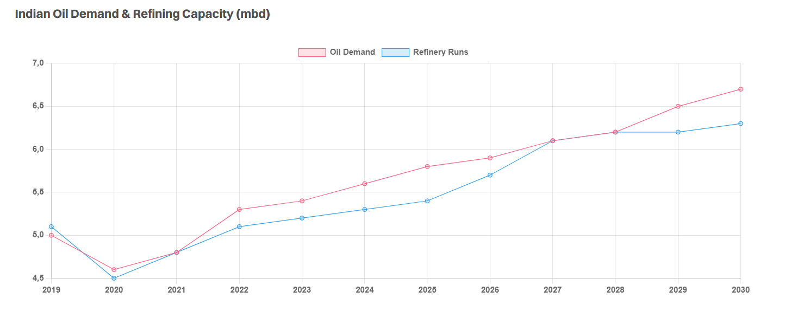

# Indian Expansion

**Date:** October 13, 2025  
**Publisher:** Breakwave Advisors | **Category:** Market Insights  
**Original URL:** [https://www.breakwaveadvisors.com/insights/2025/10/13/indian-expansion](https://www.breakwaveadvisors.com/insights/2025/10/13/indian-expansion)  

---

> **Figure 1: Istock 1298139701 Resize**  
> **Interactive Data & Source:** [Gibsons Co](https://www.gibsons.co.uk/market-reports) | [Local Asset](file:///C:/Users/Dell/Github/Shipping/corpus/03-breakwave/insights/2025/assets/2025-10-13_indian-expansion_img_istock-1298139701-resize_850e2d5df027.jpg)

Until recently, Indian CPP exports were broadly flat for the past 9 years, averaging around 1.2mbd. Whilst domestic refining capacity grew over this period, incremental output was largely used to service domestic customers. This year, exports have grown at the fastest pace since 2021 and could be set for further growth as the country continues to expand its refining capacity.

Unlike most countries, India’s near term refining ambitions are not reliant on a few greenfield mega projects, and instead are mostly expansions and upgrades to existing facilities. Next year the nation is expected to commission 680kbd of new capacity, the largest increase for more than a decade. With so much new capacity coming online in such a short period, further increases in Indian CPP exports could be seen in the near term.

Next year several projects are due to start up, including a 200kbd expansion in the north of India at Panipat, 120kbd at Numaligarh and 60kbd in Bina (all far inland). The only greenfield refinery project to come online in the near term is the 180kbd Barmer refinery, which is scheduled to start operations later this year, albeit taking time to reach design capacity. Nearer to the coast, a smaller 80kbd addition will come online in Koyali. Given nearly all of the capacity additions coming online next year are located inland, they are unlikely to be exporting their product via sea. However, coastal refineries may find it harder to sell product to inland customers, particularly those on the West Coast and as such could be forced to look overseas for new customers, leading to further gains in exports once these new facilities come on stream. However, the growth will be tapered by rising domestic demand. India’s oil demand is set to grow at a faster pace than any other country, which could limit increases in, and eventually pressure export volumes. Much will depend on the how long it takes these new refineries to reach their design utilisation vs. the pace of demand growth, but over the long term, downwards pressure in Indian CPP exports could materialise.

Nevertheless, in the short term, product tankers may enjoy one last increase in clean exports as the country commissions new plants, before rising domestic demand reverses this trend once again. For crude tankers, the picture remains positive. India’s domestic production is forecast to post a marginal decline, meaning all of the increase in refining runs will require substantial increases in crude imports.

> **Figure 2: Cea3cf84ceb9ceb3cebcceb9cf8ccf84cf85**  
> **Interactive Data & Source:** [Gibsons Co](https://www.gibsons.co.uk/market-reports) | [Local Asset](file:///C:/Users/Dell/Github/Shipping/corpus/03-breakwave/insights/2025/assets/2025-10-13_indian-expansion_img_cea3cf84ceb9ceb3cebcceb9cf8ccf84cf85_f6a28eac7778.png)

Data source:[Gibson Shipbrokers](https://www.gibsons.co.uk/market-reports)

---

**Tags:** Tankers, Shipping, Markets  
