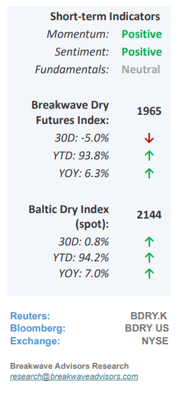
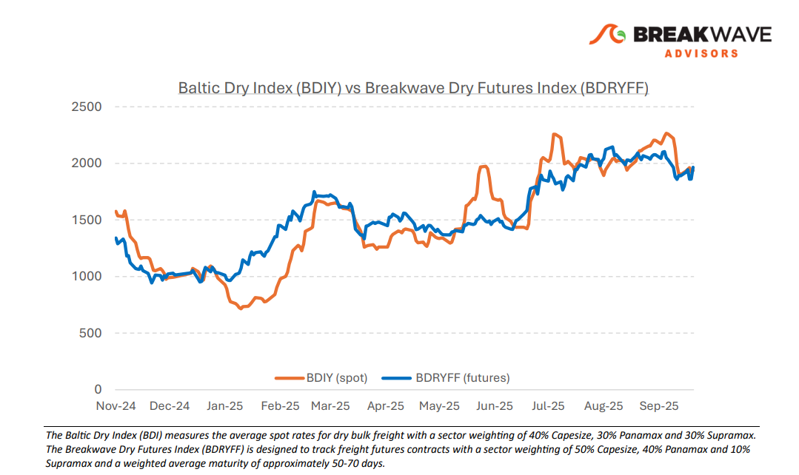
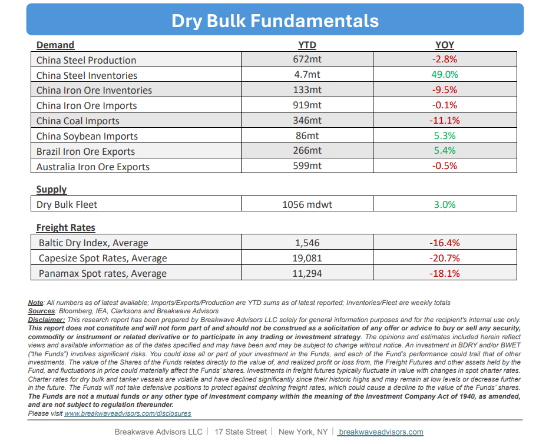

# Breakwave Bi-Weekly Dry Bulk Report - October 14, 2025

**Date:** October 14, 2025  
**Publisher:** Breakwave Advisors | **Category:** Market Insights  
**Original URL:** [https://www.breakwaveadvisors.com/insights/20251014db-jhy44lo458](https://www.breakwaveadvisors.com/insights/20251014db-jhy44lo458)  

---

•**Panic Bid in Freight Sends Spot Rates Flying as Uncertainty Skyrockets**– It took only a brief press release from the Chinese government to shift sentiment and push both dry bulk freight futures and spot rates higher as market participants**grappled with uncertainty**. The prospect of port fees on US-linked ships, a policy echoing a measure the United States is anticipated to implement, has prompted many dry bulk players to seek clarity, in the process pushing freight costs higher. Although the**US shipping industry**has**limited**direct**exposure**to dry bulk, the policy appears to touch a broad spectrum of potential linkages, including**trading**,**financing, and ownership.**Consequently, in the absence of clear guidance, freight rates have moved along the path of least resistance, which traditionally has been up, amid great uncertainty. The port-fee policy is scheduled for implementation on October 14, and market participants are awaiting details on its scope and implications. For the moment, the**overall commodity shipping market remains confused.**While the potential impact could range from minimal to substantial, the fundamental balance of cargoes versus ships has not materially changed. Accordingly, any effects are likely to be**short-lived**, given China’s significant role in dry-bulk trade and its influence on freight costs, independent of policy shifts and trade frictions.

> **Figure 1: Cea3cf84ceb9ceb3cebcceb9cf8ccf84cf85**  
> [Local Asset](file:///C:/Users/Dell/Github/Shipping/corpus/03-breakwave/insights/2025/assets/2025-10-14_20251014db-jhy44lo458_img_cea3cf84ceb9ceb3cebcceb9cf8ccf84cf85_c7dfd2560577.png)

•**Port Fees Correspond to Higher Freight, but Who Pays Is What Matters**– Freight mechanics remain inherently complex, as different stakeholders bear distinct components of the transport cost. Given the predominantly “net” nature of dry-bulk freight, especially in the context of freight futures, an increase in gross freight prices can translate into a**disproportionately larger rise**in net freight once a fixed deduction is applied. Yet the dynamics are not straightforward. Key questions arise: Will charterers pivot to non–US-linked ships to avoid port fees? If so, are enough non–US-linked vessels available to execute such a strategy? How will the substantial influence of US-linked**trading houses**and commodity**traders**, which control a large portion of the global dry-bulk fleet, shape outcomes? If a**two-tier market**emerges while these policies remain in place, what is the true price of net freight on a given route? Will there be an inclusive versus an exclusive freight rate, akin to the EU’s carbon-adjustment mechanism for tankers? If both concepts are possible, which would prevail, and would such a disruption prove durable? There are**no definitive answers**at present. History suggests that rates tend to converge toward the supply–demand balance over time, similar to what occurred in the tanker sector. In our view, it is the**compressed lead time**to implementation (less than a week), rather than to a fundamentally higher equilibrium for the broader dry-bulk market versus a week ago that has**pushed rates sharply higher,**yet shipping is always full of such impressive, unexpected changes.

•**Our Long-term View**– The last few years have been characterized by increased geopolitical uncertainty. Going forward, we expect such events to continue to affect global trade and have a meaningful impact on effective vessel supply. Combined with the potential for a multi-year cyclical rebound in China’s economic activity following the recent economic turmoil, dry bulk shipping should experience higher volatility on top of a secular tightness driven by stable bulk commodity demand and a slower fleet growth owing to a relatively low orderbook.

> **Figure 2: Στιγμιότυπο Οθόνης 2025 10 14 092836**  
> [Local Asset](file:///C:/Users/Dell/Github/Shipping/corpus/03-breakwave/insights/2025/assets/2025-10-14_20251014db-jhy44lo458_img_cea3cf84ceb9ceb3cebcceb9cf8ccf84cf85_db7498125553.png)

> **Figure 3: Στιγμιότυπο Οθόνης 2025 10 14 111718**  
> [Local Asset](file:///C:/Users/Dell/Github/Shipping/corpus/03-breakwave/insights/2025/assets/2025-10-14_20251014db-jhy44lo458_img_cea3cf84ceb9ceb3cebcceb9cf8ccf84cf85_38266577a884.png)

### Subscribe:
