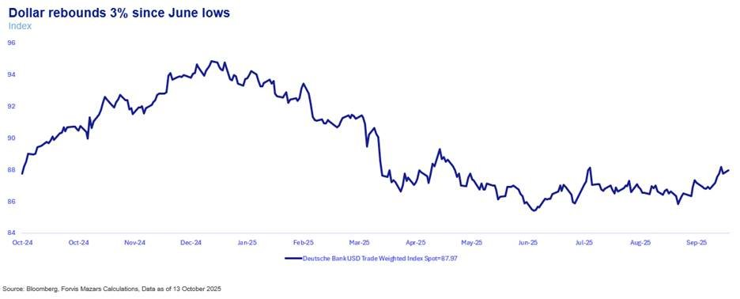
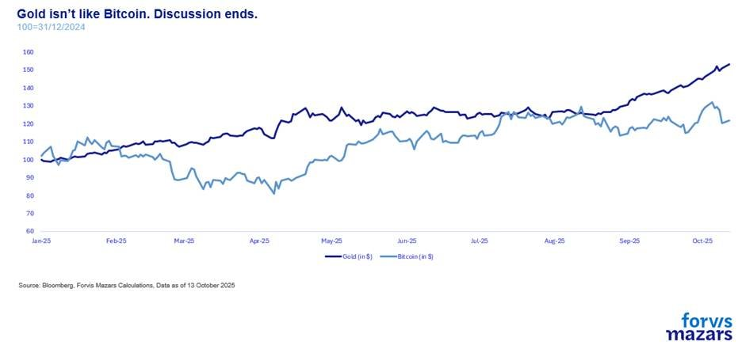
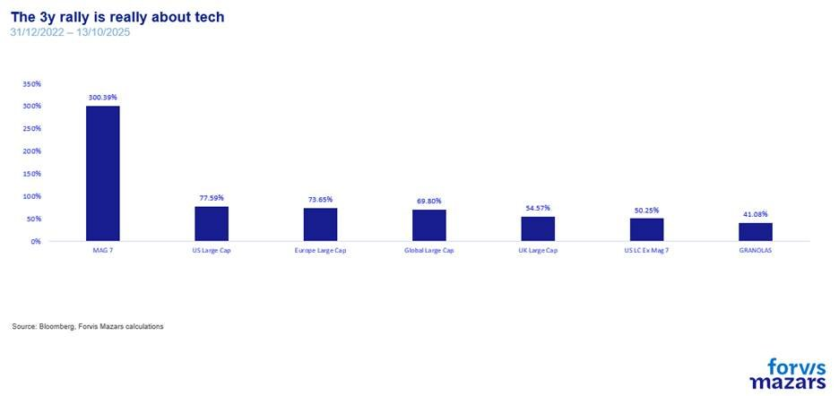
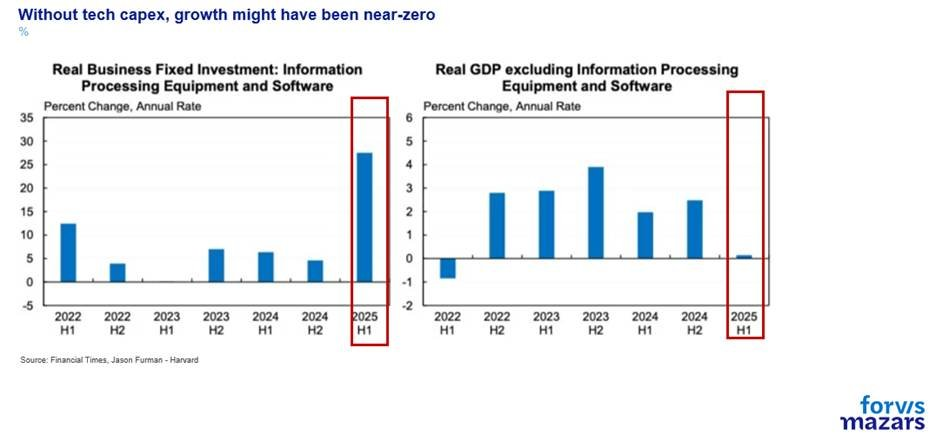
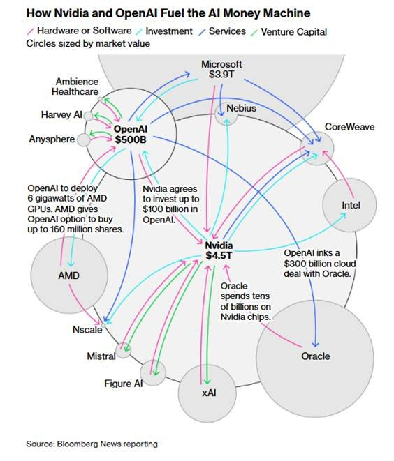

# How dependent are we on politics and Sam Altman?

**Date:** October 14, 2025  
**Publisher:** Breakwave Advisors | **Category:** Market Insights  
**Original URL:** [https://www.breakwaveadvisors.com/insights/2025/10/13/how-dependent-are-we-on-politics-and-sam-altman](https://www.breakwaveadvisors.com/insights/2025/10/13/how-dependent-are-we-on-politics-and-sam-altman)  

---

### The Three Things Investors Should Know This Week

1. **Distinguishing between true short and long-term risks is (and will always be) key to investing. Debt is a problem, to be sure, but a long-term one.**
2. **Trade wars are still very much a live issue, and so is policy uncertainty.**
3. **Open AI and Sam Altman will be crucial for the equity rally and overall risks going forward.**

*By*[*George Lagarias*](https://www.linkedin.com/in/george-lagarias-mba-3baa769/)

----------------

### Summary

*Trade tensions, AI exuberance, and policy uncertainty continue to shape markets. While debt and dollar debates dominate headlines, these are long-term issues. The real short-term drivers lie in U.S.–China trade risks and the concentration of market momentum around OpenAI and Sam Altman. Equity valuations are stretched, but liquidity and optimism persist. For investors and businesses, the key takeaway is resilience and selectivity: avoid chasing hype, prepare for volatility, and focus on fundamentals. Even if an AI financing setback triggers turbulence, it would mark a pause—not an end—in the technological cycle driving the next phase of economic growth.*

---------------

We live in the age of internet memes. The person getting the most attention (and often money) is the person who makes the most noise. To get attention, one has to say something important, very loud and very definitively. “The Dollar’s reign has ended”, “Monetarism is dead”, “New Post-Liberal Order”, “End of the Debt Cycle”, “The Fourth Industrial Revolution is here”, etc. Sells books to be sure and gets one on TV. But how accurate is all that?

The answer: they may be in the long term, but the “when” matters to everyone. From business planning to investors, even long-term ones, no one can afford to live in a world that hasn’t yet come to pass and spend years waiting for everyone else to join in.

So to make the point, the “when” becomes vaguely “near”. Cults, soothsayers, and all sorts of timeless attempts to predict the future for a profit are definitive about when something happens. “The End is Near”, while some even give dates. It has to be “near”, of course, or people will rationalise away from it, and won’t act in a panicked manner and respond to what one needs them to. So these future risks are often presented (or implied) as now risks. But we need to remember that a lot of these are long-term trends, with lots of turns, twists and policy responses to them.

Is the dollar in decline? Well, it is currently being debased for economic reasons. But that doesn’t mean it will sink immediately, or that it will be replaced tomorrow. In fact, for the last couple of months, it has been rebounding.

> **Figure 1: Market Chart 1**  
> **Interactive Data & Source:** [Bloomberg News](https://www.bloomberg.com/news/articles/2025-10-06/openai-signs-amd-chips-deal-worth-tens-of-billions-of-dollars?utm_source=website&utm_medium=share&utm_campaign=linkedin?sref&sref=EiJDOcNb) | [Local Asset](file:///C:/Users/Dell/Github/Shipping/corpus/03-breakwave/insights/2025/assets/2025-10-14_how-dependent-are-we-on-politics-and-sam-altman_img_image006_9967def86d5d.jpg)

Until the Renminbi or some other currency steps up, it’s difficult to predict its demise.

The week held some other useful reminders for investors and businesses.

**a. Trade wars are still very much a live issue, and so is uncertainty.**Trade wars are one-half of the present chapter in the book of the long-standing tension buildup between two competing superpowers. Tech supremacy, as the most important reason behind this trade war, is the other half. China tightened its grip on rare earths, the US President expectedly threatened 100% tariffs, and an overvalued equity market very briefly took a short breather. If businesses and investors are banking on the present status quo being anything close to the next long-term status quo, they could find themselves surprised.

**b**.and therefore not a gold-like substitute in a potential post-Dollar world. In case it was missed, when President Trump threatened, stocks lost around c. 1.6%, and Bitcoin lost 11% overnight (rebounded by about a third on Monday morning). Bonds and gold, on the other hand, did what they are supposed to do, held and rose.

> **Figure 2: Crypto Is Not a Safe Asset,**  
> **Interactive Data & Source:** [Bloomberg News](https://www.bloomberg.com/news/articles/2025-10-06/openai-signs-amd-chips-deal-worth-tens-of-billions-of-dollars?utm_source=website&utm_medium=share&utm_campaign=linkedin?sref&sref=EiJDOcNb) | [Local Asset](file:///C:/Users/Dell/Github/Shipping/corpus/03-breakwave/insights/2025/assets/2025-10-14_how-dependent-are-we-on-politics-and-sam-altman_img_image007_c26e728cd326.jpg)

. Sam Altman, Open AI’s holds the three-year bull market at the palm of his hand. And when all is said and done, this is now the biggest issue in the market. OpenAI’s capitalisation is an estimated $500bn. The company, which is a recipient of hardware, is investing c. $1tn in data centres and microchips. Open AI now influences both the financial economy…

> **Figure 3: C. Openai Is Crucial for the Future of the Rally**  
> **Interactive Data & Source:** [Bloomberg News](https://www.bloomberg.com/news/articles/2025-10-06/openai-signs-amd-chips-deal-worth-tens-of-billions-of-dollars?utm_source=website&utm_medium=share&utm_campaign=linkedin?sref&sref=EiJDOcNb) | [Local Asset](file:///C:/Users/Dell/Github/Shipping/corpus/03-breakwave/insights/2025/assets/2025-10-14_how-dependent-are-we-on-politics-and-sam-altman_img_image008_85e9bc8830e2.jpg)

and the real economy, where Professor Furman from Harvard suggests that US economic growth would be near-zero without technological capital expenditure.

> **Figure 4: Market Chart 4**  
> **Interactive Data & Source:** [Bloomberg News](https://www.bloomberg.com/news/articles/2025-10-06/openai-signs-amd-chips-deal-worth-tens-of-billions-of-dollars?utm_source=website&utm_medium=share&utm_campaign=linkedin?sref&sref=EiJDOcNb) | [Local Asset](file:///C:/Users/Dell/Github/Shipping/corpus/03-breakwave/insights/2025/assets/2025-10-14_how-dependent-are-we-on-politics-and-sam-altman_img_image009_7ea07b3b2ccb.jpg)

Now, Bloomberg, and other organisations have identified many of these deals as “circular”, which means that they remain between a closed circuit of companies, driving each other’s valuation higher.

> **Figure 5: Market Chart 5**  
> **Interactive Data & Source:** [Bloomberg News](https://www.bloomberg.com/news/articles/2025-10-06/openai-signs-amd-chips-deal-worth-tens-of-billions-of-dollars?utm_source=website&utm_medium=share&utm_campaign=linkedin?sref&sref=EiJDOcNb) | [Local Asset](file:///C:/Users/Dell/Github/Shipping/corpus/03-breakwave/insights/2025/assets/2025-10-14_how-dependent-are-we-on-politics-and-sam-altman_img_image010_6f94d2807ea4.jpg)

Valuations are high, the rally is extended, and the speed at which equities and risk assets were rebought after Friday’s fall suggests there’s a lot of appetite and cash to buy the equity dips. With the Fed now in rate-cutting mode, it’s difficult to see which event (barring a black swan) could derail markets.

Except one. Sam Altman. OpenAI’s boss has often said he wants to invest trillions of dollars in AI. He now runs the highest-value private firm in the world, and he’s very important to the nexus that fuels a 3-year-old rally. His flaws will be amplified. Two years ago, markets barely budged when he was temporarily ousted by his own board. And a few days ago, when asked how he would finance the deals, he said “his company is working to devise a**'new kind' of financial instrument,**[**without providing details**](https://www.bloomberg.com/news/articles/2025-10-06/openai-signs-amd-chips-deal-worth-tens-of-billions-of-dollars?utm_source=website&utm_medium=share&utm_campaign=linkedin?sref&sref=EiJDOcNb)**.**” For people with memories of 2000 and 2008, this is an alarming statement from someone so important to present asset valuations.

### What Does This All Mean for Businesses and Investors?

It is not in the realm of the impossible that the high-stakes financing around OpenAI’s global domination plans does not deliver. A potential AI crash will make headlines and will likely affect investment in the industry. Companies should not be stirred. The fate of one company does not change the fact that we are steering towards the next industrial revolution. If anything, a pullback would allow boards to spend time thinking about and carefully designing their knowledge management strategy, instead of blindly pouring money into AI, hoping to help profitability.

Investors should be reminded that the 2000 bubble was not really a[dot.com](http://dot.com/)crash, but rather a corporate governance crash, around Enron’s collapse. Tech, eventually, rebounded and won its high valuations. Today is not then. Valuations for key companies are not at the triple digits. NVIDIA, the world’s biggest company, is trading at 32x times its projected earnings. High, to be sure, but really at par with most high-growth firms. As long as investors try to identify who the winners of the next trend will be (more hardware right now than software), they can still come out on top if they are patient enough.

---

**Tags:** Macro, Economy, Markets  
