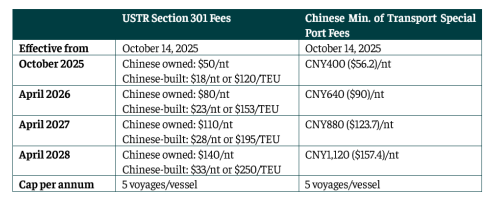

# The latest escalation in U.S.-China trade tensions

**Date:** October 15, 2025  
**Publisher:** Breakwave Advisors | **Category:** Market Insights  
**Original URL:** [https://www.breakwaveadvisors.com/insights/2025/10/15/the-latest-escalation-in-us-china-trade-tensions](https://www.breakwaveadvisors.com/insights/2025/10/15/the-latest-escalation-in-us-china-trade-tensions)  

---

*By*[*Nikolaos Tagoulis*](https://www.linkedin.com/in/nikolaos-tagoulis-9317252a/)

The latest escalation in U.S.-China trade tensions marks a setback to hopes for a gradual return to a less protectionist trading environment. After a relatively calm summer, Beijing’s announcement of retaliatory port fees on U.S.-linked vessels has sent ripples through global seaborne trade. The move mirrors Washington’s USTR fees on Chinese vessels. It appears Beijing had anticipated a possible U.S. reversal and, upon realizing that Washington would proceed, opted for an assertive and symmetrical reaction. The escalation has injected uncertainty into markets, highlighting once again the use of trade policy as both a display of power and negotiation tactic.

> **Figure 1: Στιγμιότυπο Οθόνης 2025 10 15 113351**  
> **Interactive Data & Source:** [Intermodal](https://www.intermodal.gr/) | [Local Asset](file:///C:/Users/Dell/Github/Shipping/corpus/03-breakwave/insights/2025/assets/2025-10-15_the-latest-escalation-in-us-china-trade-tensions_img_cea3cf84ceb9ceb3cebcceb9cf8ccf84cf85_3be2265b08db.png)

For the most part, Chinese fees broadly mirror U.S. port fees. A difference however is that China’s Special Port Fees targets U.S.- linked vessels and is generally applied without specifying particular sectors. In contrast, the U.S. measures include size-based exemptions and provisions for certain vessel segments, such as LNG carriers and vehicle carriers, aimed at supporting the domestic industry and promote U.S. shipbuilding.

China's measures extend beyond the few U.S.-flagged and U.S.- built vessels, targeting ships owned or managed by entities with 25% or greater American ownership, broadening significantly the affected tonnage. Market participants are awaiting further clarification on this provision, as the full scope remains uncertain. Meanwhile, recent updates by CCTV, Beijing's national broadcaster, indicate certain exemptions, such as Chinese-built vessels and ships ballasting to Chinese repair yards, which could significantly reduce the impact.

Furthermore, the financial burden is punitive, even though capped at a maximum of 5 voyages per vessel per year. Indicatively, a VLCC could face fees of around $6 million per port call, escalating to $17m by 2028 at current exchange rates. For a Capesize bulk carrier, fees could reach $3m initially, rising to $8m by 2028. At these levels, Chinese port calls become economically unviable for U.S.-linked vessels, functioning as exclusionary measures rather than standard tariffs.

Shipping markets reacted swiftly on the above developments. FFAs and spot rates surged, particularly across large vessel classes. TCE earnings for VLCCs and Capesizes rose by approx. 20%, reflecting a firming of sentiment, amid expectations of tighter tonnage supply for Chinese ports. While this market response underscores volatility, it also creates meaningful short- to medium-term opportunities. The avoidance of Chinese cargoes by U.S. -linked vessels is likely to tighten effective tonnage availability, providing sustained support to freight rates rather than a purely temporary spike. Over the medium term, the market may experience a degree of bifurcation on certain routes, as U.S.-linked tonnage faces elevated cost conditions compared with non-U.S. vessels.

Zooming out to a broader strategic perspective, both the U.S. and China appear to be preparing for sustained trade fragmentation. Beijing continues to deepen trade ties through the Belt and Road Initiative, expanding connections with South America, the Middle East and Canada, while investing in domestic self-sufficiency. The United States acts similarly, redirecting energy and commodity exports toward India, Southeast Asia, and Europe. Collectively, these developments point to a gradual rerouting of trade flows, with new corridors emerging to compensate for disruptions in U.S.-China trade patterns.

The renewed U.S.-China tariff confrontation underscores the broader trend toward protectionism. This escalation adds to the macroeconomic uncertainty and raises concerns that persistent frictions could slow global trade growth trigger recession. For shipping, the medium-term trajectory of global seaborne trade will hinge on how these trade tensions evolve, with clarity from the Chinese Ministry of Transport on the 25% ownership clause being critical to grasp the full scope and potential impact of these measures, while the recent updates on exceptions seem to narrow the scope.

Data Source:[Intermodal](https://www.intermodal.gr/)

---

**Tags:** Shipping, Commodities, Markets  
