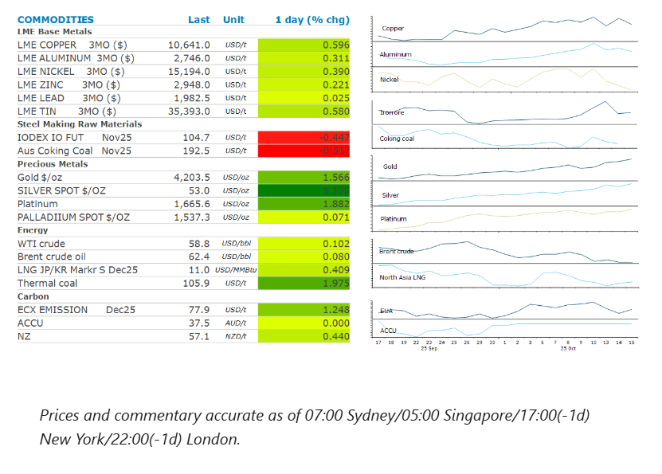
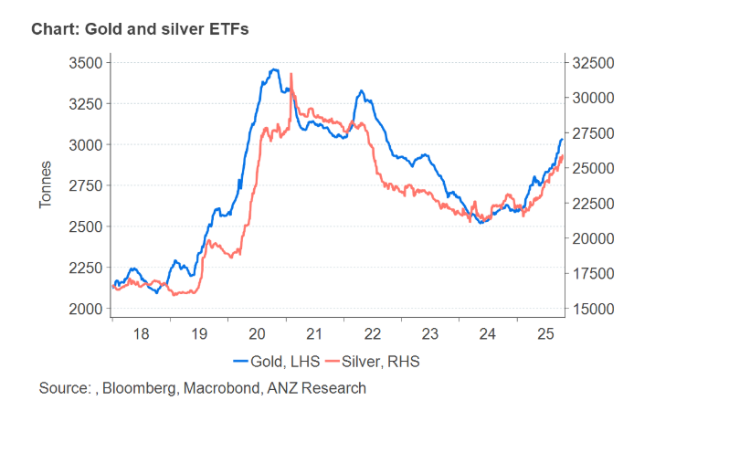

# Gold's rally shows no signs of slowing

**Date:** October 16, 2025  
**Publisher:** Breakwave Advisors | **Category:** Market Insights  
**Original URL:** [https://www.breakwaveadvisors.com/insights/2025/10/16/golds-rally-shows-no-signs-of-slowing](https://www.breakwaveadvisors.com/insights/2025/10/16/golds-rally-shows-no-signs-of-slowing)  

---

The prospect of further cuts by the Fed triggered a risk-on tone across the commodity complex. This was constrained by concerns over the economic outlook.

*By*[*Daniel Hynes*](https://www.linkedin.com/in/dahynes/)

> **Figure 1: Στιγμιότυπο Οθόνης 2025 10 16 135204**  
> **Interactive Data & Source:** [Linkedin](https://www.linkedin.com/newsletters/commodities-wrap-6692196755876012032/?fbclid=IwAR3kiXJqZdxmp9ZcRwBNI7FsBySI-XSC0pfPur1qzjt7OZp7PTE59Tsl1QI) | [Local Asset](file:///C:/Users/Dell/Github/Shipping/corpus/03-breakwave/insights/2025/assets/2025-10-16_golds-rally-shows-no-signs-of-slowing_img_cea3cf84ceb9ceb3cebcceb9cf8ccf84cf85_e6d671809af6.png)

### Market Commentary

**Copper**gained after Fed Chair Powell signalled the central bank is on track to cut rates later this month. In a speech at the National Association for Business Economics’ annual meeting, he said the economic outlook appeared unchanged since policymakers met in September, when they lowered rates and projected two more rate cuts this year. He pointed several times to the low pace of hiring and noted it had weakened further. Fed governor Stephen Miran said recent trade tensions have increased uncertainty in the outlook for growth, making it more important for policymakers to lower rates quickly. Easing monetary policy tends to boost sentiment across the metals complex, with lower borrowing costs supporting restocking of metals. The mood at LME Week, the annual gathering of the metals industry, has been relatively positive.

**Iron ore**futures edged lower after weak economic data raised concerns of lower demand. China’s credit growth slowed from a year ago in September, as the slowdown in government bond sales stretched into another month. Aggregate financing increased to CNY3.5trn in September, versus CNY3.8trn a year ago. Absent of stronger issuance of government debt, fixed asset investment has slowed rapidly in recent months, with growth in the first eight months hitting the weakest on record outside the pandemic. The losses were mitigated by further drawdowns in steel inventories. China’s steel mill stockpiles dropped 4.05% to 14.7mt in late September compared with mid-September, according to the China Iron and Steel Association.

**Gold’s**rally is showing no signs of abating, with the precious metal breaking through USD4,200/oz. Powell’s dovish comments boosted confidence in further rate cuts this year. However, investors are also seeking havens against the increasingly challenging economic outlook. The US government shutdown has entered its third week, with no sign either side is willing to budge on key issues. The rapid ascent has also triggered a wave of ‘fear of missing out’ among investors, despite concerns over heightened volatility and the potential for a sharp technical correction.

**Crude oil**failed to benefit from the risk-on tone across markets, with oversupply fears dominating opinion. Earlier this week, the International Energy Agency increased its estimate for a record oversupply next year to 4mb/d. This comes as the OPEC+ alliance continues to revive output. However, that surge in output may not be what it seems. While crude oil production from the group rose for the second consecutive month in September, it trailed the quota ceiling this month. This is partly due to some members still implementing compensation cuts for over producing earlier in the year. However, others are struggling to raise output due to a lack of investment in recent years which has lowered their effective capacity.

**European gas**prices remained stuck in a tight range, as imports keep the market balanced. A steady flow of both LNG and Norwegian piped gas supplies into Europe’s vast storage sites has helped the region cope with higher consumption as temperatures drop. The increased supplies have been supported by China, which has been taking LNG from Russia’s Arctic LNG 2 plant, potentially freeing up more supply for the wider market.

### Chart of the Day

Gold’s surge above USD4,000/oz has been partly driven by the huge influx of investors into gold-backed exchange traded funds. Inflows so far this year have exceeded 442t. However, at just over 3kt, they remain below levels seen during the peak of the pandemic. This suggests their is more upside to inflows in the short term.

> **Figure 2: Στιγμιότυπο Οθόνης 2025 10 16 135303**  
> **Interactive Data & Source:** [Linkedin](https://www.linkedin.com/newsletters/commodities-wrap-6692196755876012032/?fbclid=IwAR3kiXJqZdxmp9ZcRwBNI7FsBySI-XSC0pfPur1qzjt7OZp7PTE59Tsl1QI) | [Local Asset](file:///C:/Users/Dell/Github/Shipping/corpus/03-breakwave/insights/2025/assets/2025-10-16_golds-rally-shows-no-signs-of-slowing_img_cea3cf84ceb9ceb3cebcceb9cf8ccf84cf85_4df8b91d76fa.png)

Data source:[Commodities Wrap](https://www.linkedin.com/newsletters/commodities-wrap-6692196755876012032/?fbclid=IwAR3kiXJqZdxmp9ZcRwBNI7FsBySI-XSC0pfPur1qzjt7OZp7PTE59Tsl1QI)

---

**Tags:** Shipping, Commodities, Markets  
