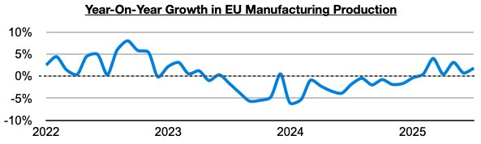
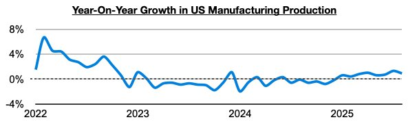
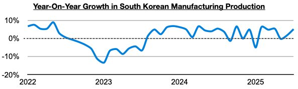

# Ongoing Global Manufacturing Production Growth

**Date:** October 17, 2025  
**Publisher:** Breakwave Advisors | **Category:** Market Insights  
**Original URL:** [https://www.breakwaveadvisors.com/insights/2025/10/17/ongoing-global-manufacturing-production-growth](https://www.breakwaveadvisors.com/insights/2025/10/17/ongoing-global-manufacturing-production-growth)  

---

*By*[*Jeffrey Landsberg*](https://www.linkedin.com/in/jeffrey-landsberg-70ab957/)

While during much of last year we discussed weakness in the global economy outside of China, this year in our Weekly Executive Reports we have been stressing there has been sustained improvement. At present, we can continue to report that the majority of major economies are enjoying growth in manufacturing production (manufacturing specifically refers to using raw materials to create finished products and is the largest component of overall industrial production). In addition to manufacturing production continuing to enjoy long periods of year-on-year growth in China, India, and Russia (all have seen at least thirty months of sustained year-on-year growth) — the European Union, the United States, and South Korea have all more recently been continuing to enjoy sustained growth as well

In the European Union, manufacturing production has now grown on a year-on-year basis for six straight months. Previously, it had contracted on a year-on-year basis for thirteen straight months.

> **Figure 1: Chart 1**  
> [Local Asset](file:///C:/Users/Dell/Github/Shipping/corpus/03-breakwave/insights/2025/assets/2025-10-17_ongoing-global-manufacturing-production-growth_img_chart1_50bf1d1f9631.jpg)

In the United States, manufacturing production has now grown on a year-on-year basis for eight straight months. Previously, it had contracted on a year-on-year basis during nineteen of the prior twenty-two months.

> **Figure 2: Chart 2**  
> [Local Asset](file:///C:/Users/Dell/Github/Shipping/corpus/03-breakwave/insights/2025/assets/2025-10-17_ongoing-global-manufacturing-production-growth_img_chart2_2ea1586c2e04.jpg)

In South Korea, manufacturing production has now grown on a year-on-year basis during five of the last six months. Previously, it had contracted on a year-on-year basis during three of the prior five months.

> **Figure 3: Chart 3**  
> [Local Asset](file:///C:/Users/Dell/Github/Shipping/corpus/03-breakwave/insights/2025/assets/2025-10-17_ongoing-global-manufacturing-production-growth_img_chart3_529afc305257.jpg)

---

**Tags:** Economy, Markets, China  
