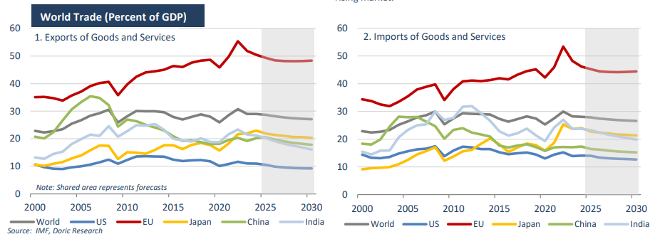

# For the dry bulk sector outlook remains constructive

**Date:** October 20, 2025  
**Publisher:** Breakwave Advisors | **Category:** Market Insights  
**Original URL:** [https://www.breakwaveadvisors.com/insights/2025/10/20/for-the-dry-bulk-sector-outlook-remains-constructive](https://www.breakwaveadvisors.com/insights/2025/10/20/for-the-dry-bulk-sector-outlook-remains-constructive)  

---

*By*[*Michalis Voutsinas*](https://www.linkedin.com/in/michalis-voutsinas-587544163/)

After spending much of the past fortnight navigating the complexities of “U.S. and China special port fees” – including assessments of ownership structures, operational control, and even the nationality of board members – a return to core fundamentals feels necessary. The year so far has been shaped by volatility and shifting policy priorities, most notably in the United States, where trade policy has taken a decisive turn away from established norms. According to the IMF, global sentiment has been strongly influenced by these developments, with every major trade announcement shaping perceptions of growth prospects. In April 2025, the United States imposed sweeping tariffs on most of its trading partners, marking a sharp departure from decades of trade liberalisation. The IMF’s World Economic Outlook at the time anticipated a broad range of potential outcomes, depending on the scale of the resulting trade shock. Six months on, the global economy appears to have weathered the storm better than feared. Much of this resilience can be attributed to the private sector’s agility in reorganising supply chains, the front-loading of imports earlier in the year, and the measured response of other major economies, which have largely avoided retaliatory protectionism. Against this backdrop, global growth is projected to slow slightly from 3.3 percent in 2024 to 3.2 percent in 2025 and 3.1 percent in 2026. Although this represents a modest deceleration, it is still a more favourable outcome than anticipated in the midyear update.

Among advanced economies, growth is projected to moderate to 1.6 percent in both 2025 and 2026, slightly below 2024 levels. In the United States, GDP growth is expected to ease to 2.0 percent in 2025 and stabilise at 2.1 percent in 2026. The slowdown reflects increased policy uncertainty, tighter trade conditions, and a cooling labour market. In the euro area, growth is projected to recover modestly to 1.2 percent in 2025 and 1.1 percent in 2026, an improvement from earlier this year but still constrained by high tariffs and subdued investment sentiment. Japan’s economy is forecast to accelerate from 0.1 percent in 2024 to 1.1 percent in 2025 before moderating to 0.6 percent in 2026, supported by rising real wages and steady private consumption. In the United Kingdom, growth is expected at 1.3 percent in both 2025 and 2026, bolstered by a partial recovery in trade activity following the UK-US trade agreement signed in May. Canada, however, faces a weaker outlook, with growth of just 1.2 percent in 2025 and 1.5 percent in 2026, reflecting the cumulative effects of higher tariffs and weaker exports.

In emerging and developing economies, the growth picture is more mixed. Output is expected to expand by 4.2 percent in 2025 and 4.0 percent in 2026 – virtually unchanged from earlier projections, but below pre-tariff expectations. China’s growth forecast for 2025 stands at 4.8 percent, 0.3 percentage point higher than in the October 2024 outlook, supported by robust domestic consumption and fiscal stimulus that offset trade headwinds. The economy is, however, projected to slow to 4.2 percent in 2026 as front-loaded exports unwind and policy support is gradually withdrawn. India remains the standout performer among major emerging economies, with projected growth of 6.6 percent in 2025 and 6.2 percent in 2026. The momentum reflects solid domestic investment and expanding manufacturing capacity, even as higher trade costs slightly temper the overall outlook. In Latin America, growth is expected to remain stable at 2.4 percent in 2025 before softening marginally to 2.3 percent in 2026, while Brazil’s trajectory shows an upward revision for next year followed by a slight moderation. Growth in emerging Europe is set to drop sharply to 1.8 percent in 2025, largely due to weakness in Russia, before recovering to 2.2 percent in 2026. Meanwhile, the Middle East and Central Asia are projected to benefit from stabilising oil production and reduced geopolitical disruptions, with growth expected to rise to 3.5 percent in 2025 and 3.8 percent in 2026. In sub-Saharan Africa, growth remains steady at 4.1 percent in 2025 and is forecast to edge up to 4.4 percent in 2026, reflecting a gradual improvement in investment and consumption.

Under the baseline, global inflation is expected to continue its descent, reaching 4.2 percent in 2025 and 3.7 percent in 2026, broadly consistent with previous estimates. Nonetheless, variations remain substantial across regions. In the United States and the United Kingdom, inflation is projected to rise temporarily in late 2025 as tariff effects pass through to consumers, before easing toward target levels by 2027. Conversely, inflation expectations in much of emerging Asia, including China, India, and Thailand, have been revised lower, largely due to subdued food and energy prices.

From a trade perspective, global volumes are expected to remain constrained over the next five years, despite short-term gains from front-loaded shipments. The IMF expects world trade to expand faster in 2025 but to lose momentum in 2026 as temporary boosts fade. World trade is expected to expand by an average of 2.9 percent in 2025-26, supported by the temporary boost from front-loaded transactions, though still below the 3.5 percent recorded in 2024. Persistent fragmentation in global trade patterns remains a key constraint. Structural challenges – including demographic pressures, low productivity growth, and increasingly fragmented trade relationships – continue to cap long-term potential. Over the medium term, global output is projected to expand by an average of just 3.2 percent annually through 2030, well below the pre-pandemic average of 3.7 percent.

For the dry bulk sector, the near-term outlook remains constructive. Seasonal restocking, robust commodity flows, and active trading across key routes are expected to keep freight rates supported through year-end. Chinese imports remain steady, Indian demand resilient, and sentiment in emerging markets has improved, providing further short-term underpinning. Looking into the next year, in the absence of supportive measures or a reversal of the current trade fragmentation, and as the effects of front-loaded exports and recent stimulus fade, earnings are likely to plateau. Market focus will increasingly shift toward vessel efficiency, disciplined cost management, and strategic deployment of tonnage across Atlantic and Pacific trades, rather than chasing the momentum of a rapidly rising market.

> **Figure 1: Στιγμιότυπο Οθόνης 2025 10 20 094606**  
> **Interactive Data & Source:** [Doric](https://www.doric.gr/) | [Local Asset](file:///C:/Users/Dell/Github/Shipping/corpus/03-breakwave/insights/2025/assets/2025-10-20_for-the-dry-bulk-sector-outlook-remains-constructive_img_cea3cf84ceb9ceb3cebcceb9cf8ccf84cf85_bbc8aee9a161.png)

Data source:[Doric](https://www.doric.gr/)

---

**Tags:** Drybulk, Shipping, Markets  
