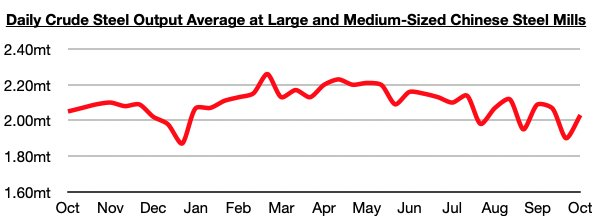
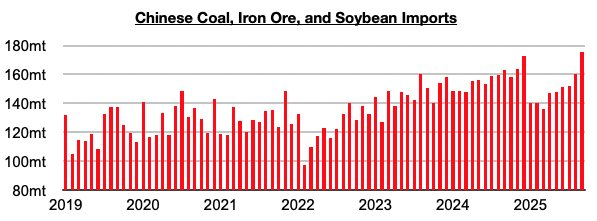

# Recent Rebound in Chinese Steel Production

**Date:** October 20, 2025  
**Publisher:** Breakwave Advisors | **Category:** Market Insights  
**Original URL:** [https://www.breakwaveadvisors.com/insights/2025/10/20/recent-rebound-in-chinese-steel-production](https://www.breakwaveadvisors.com/insights/2025/10/20/recent-rebound-in-chinese-steel-production)  

---

*By*[*Jeffrey Landsberg*](https://www.linkedin.com/in/jeffrey-landsberg-70ab957/)

The most recently released data shows that daily crude steel production at large and medium-sized mills in China averaged 2.03 million tons during October 1 - October 10. This is up by 7% from late September and is down year-on-year by only 1%. As we have been highlighting in Commodore Research's Weekly China Reports and Weekly Executive Reports, year-on-year growth in China's steel production returned in late July. However, production levels have now been back in a year-on-year contraction since late September.

> **Figure 1: Chart 1**  
> [Local Asset](file:///C:/Users/Dell/Github/Shipping/corpus/03-breakwave/insights/2025/assets/2025-10-20_recent-rebound-in-chinese-steel-production_img_chart1_df230ffd5203.jpg)

Despite China's steel production recently returning to a year-on-year contraction, we remain very bullish for China’s iron ore import prospects. As we have stressed throughout the years even when pundits turned bearish for iron ore import prospects, it is global iron ore production that dictates China's iron ore import volume. Significant is that China's iron ore imports most recently totaled a record 116.3 million tons in September. This is up by 11.1 million tons (11%) from August and is up year-on-year by 12.2 million tons (12%). China’s iron ore, coal and soybean imports collectively totaled a record 175.2 million tons. This is up by 15 million tons (9%) from August and is up year-on-year by 12 million tons (7%). As we have continued to examine in Commodore Research's Weekly China Reports and Weekly Executive Reports, our bullishness for China's import demand is continuing to play out to fruition.

> **Figure 2: Chart 2**  
> [Local Asset](file:///C:/Users/Dell/Github/Shipping/corpus/03-breakwave/insights/2025/assets/2025-10-20_recent-rebound-in-chinese-steel-production_img_chart2_ab4b94e71e12.jpg)

---

**Tags:** China, Commodities, Drybulk  
