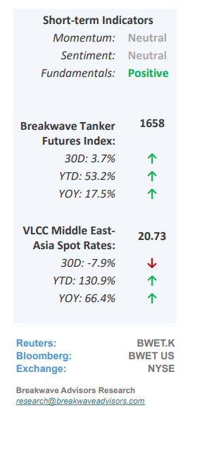
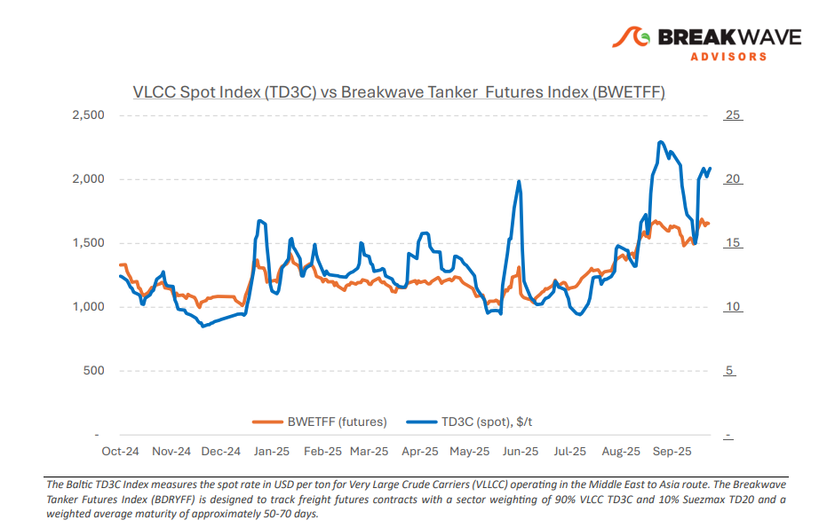
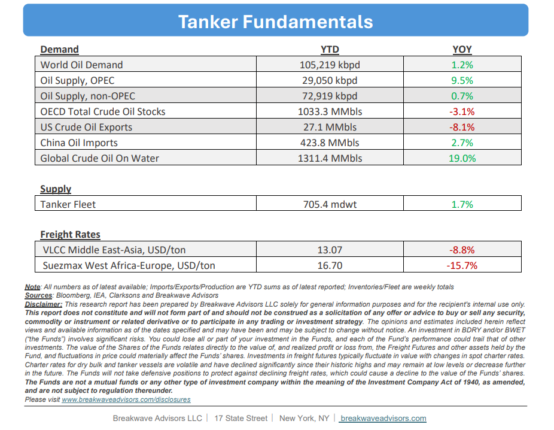

# Breakwave Bi-Weekly Tanker Report - October 21, 2025

**Date:** October 21, 2025  
**Publisher:** Breakwave Advisors | **Category:** Market Insights  
**Original URL:** [https://www.breakwaveadvisors.com/insights/20251021wetreport5k88j458-47p](https://www.breakwaveadvisors.com/insights/20251021wetreport5k88j458-47p)  

---

•**VLCCs Remains Supported as Charterers Consider New Trade Barriers**– Following a subdued start to October, the VLCC segment shows early signs of support. In the Arabian Gulf, owners resisted further downward pressure amid a tightening tonnage list and**expectations of increased activity**linked to Saudi’s November loading programs. Furthermore, sentiment improved as charterers sought early cover in response to China’s recently implemented**port fees**on U.S.- linked vessels. However,**confusion and uncertainty**continue to dominate industry discussions given the vague directives by China on the specific details. The recent decision to**delay any global carbon tax**implementation in shipping adds another layer of uncertainty for the medium to long term. For the remainder of Q4, the VLCC outlook will hinge on evolving**geopolitical dynamics. China’s port-fee system**introduces operational and cost uncertainty for U.S.-linked ownership structures, while Washington’s growing use of secondary tariffs on Indian trade partners adds further friction. Increased pressure from Washington on India to curb Russian crude imports could disrupt established trade flows and reshape long-haul demand patterns. If Indian refiners shift sourcing toward the Middle East or the U.S., ton-mile demand could adjust accordingly, potentially tightening effective vessel supply. Overall, early**Q4 indicators point to a firmer market**than Q3, with macro risks and limited tonnage availability continuing to support VLCC freight dynamics.

> **Figure 1: Στιγμιότυπο Οθόνης 2025 10 21 112610**  
> [Local Asset](file:///C:/Users/Dell/Github/Shipping/corpus/03-breakwave/insights/2025/assets/2025-10-21_20251021wetreport5k88j458-47p_img_cea3cf84ceb9ceb3cebcceb9cf8ccf84cf85_3d2ec7b1462d.png)

•**IEA Continues to Project Oil Surplus Amid OPEC Production Hikes**– Oil prices remain**under pressure,**and the futures curve has now shifted into contango for contracts with the exception of the first few months. The prospect of a**substantial oil surplus**, particularly among non-gas-related barrels, appears likely as China shows limited signs of real oil demand growth. The IEA projects oil supply to rise by 3 million bpd in 2025 and 2.4 million bpd in 2026,**well above the expected demand**increase of about 0.7 million bpd per year. Although China continues accumulating crude for storage, this strategy effectively moves oil from underground reserves to above-ground inventories without altering consumption and thus not affecting market balance.**Oil in transit has jumped to multi-year highs**, indicating higher carrying and storage costs, but also supporting tanker freight rates in the process. Moreover, a shift toward a deeper contango would further bolster demand for oil tankers used to store surplus crude, a reminder of the 2015-2017 oil markets when oil tankers enjoyed some of the strongest returns in the past decade.

•**Our Long-term View**– The tanker market is recovering from a long period of staggered rates as the growth in new vessel supply shrinks while oil demand remains elevated in line with the global economy. A historically low orderbook combined with favorable shifting trade patterns should continue to support increased spot rate volatility, which combined with the ongoing geopolitical turmoil, should sustain freight rates in the medium to long term.

> **Figure 2: Στιγμιότυπο Οθόνης 2025 10 21 092126**  
> [Local Asset](file:///C:/Users/Dell/Github/Shipping/corpus/03-breakwave/insights/2025/assets/2025-10-21_20251021wetreport5k88j458-47p_img_cea3cf84ceb9ceb3cebcceb9cf8ccf84cf85_67783bb22c4b.png)

> **Figure 3: Στιγμιότυπο Οθόνης 2025 10 21 092138**  
> [Local Asset](file:///C:/Users/Dell/Github/Shipping/corpus/03-breakwave/insights/2025/assets/2025-10-21_20251021wetreport5k88j458-47p_img_cea3cf84ceb9ceb3cebcceb9cf8ccf84cf85_c4f1a7681190.png)

### Subscribe:
