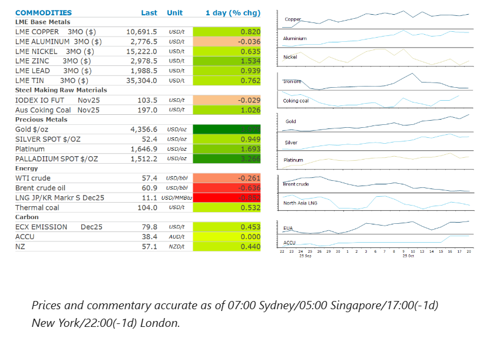
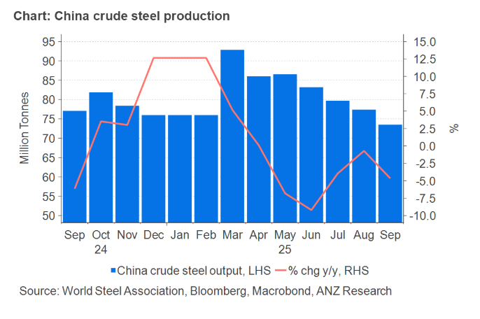

# Metals gains on better-than-expected economic data

**Date:** October 21, 2025  
**Publisher:** Breakwave Advisors | **Category:** Market Insights  
**Original URL:** [https://www.breakwaveadvisors.com/insights/2025/10/21/metals-gains-on-better-than-expected-economic-data](https://www.breakwaveadvisors.com/insights/2025/10/21/metals-gains-on-better-than-expected-economic-data)  

---

Easing trade tensions helped support sentiment, with all sectors ending the session higher. Better than expected economic data in China saw metals gain, while crude oil fell amid signs of rising supplies.

*By*[*Daniel Hynes*](https://www.linkedin.com/in/dahynes/)

> **Figure 1: Στιγμιότυπο Οθόνης 2025 10 21 135857**  
> **Interactive Data & Source:** [Linkedin](https://www.linkedin.com/newsletters/commodities-wrap-6692196755876012032/?fbclid=IwAR3kiXJqZdxmp9ZcRwBNI7FsBySI-XSC0pfPur1qzjt7OZp7PTE59Tsl1QI) | [Local Asset](file:///C:/Users/Dell/Github/Shipping/corpus/03-breakwave/insights/2025/assets/2025-10-21_metals-gains-on-better-than-expected-economic-data_img_cea3cf84ceb9ceb3cebcceb9cf8ccf84cf85_dabf138eebcb.png)

### Market Commentary

**Copper**gained as easing trade tensions boosted sentiment. Last week President Trump threatened China with a 100% tariff following Beijing’s decision to apply restrictions on rare earth exports. However, Trump sought to temper confrontation with China, ahead of trade talks this week. He predicted the meeting would result in a fantastic trade deal. He also downplayed China’s move to curb flows of rare earths, saying they are not threatening us too much right now. Economic data released yesterday also provided some support. China’s GDP grew by 4.8% y/y in Q3, primarily driven by industrial production, which expanded 6.5% in September. This should see China reach its GDP growth target of 5% in 2025. State-backed researcher, Beijing Antaike Information Co, said that while growth is slowing, copper consumption in 2025 is expected to be 4.2% above last year, helped by higher demand from the transport sector.

Easing trade tensions failed to dampen investor demand for haven assets, such as**gold**, with the precious which finished the session just shy of its record high of USD4,379/oz. Instead, traders took advantage of a selloff on Friday to buy more gold. This highlights the strong underlying factors behind gold’s rise. Mounting geopolitical, economic and financial uncertainties along with the Fed’s easing should see the metal continue to break new highs in 2026. Rising prices have also done little to douse retail demand. Diwali, the Hindu festival of light, kicked off in India with the public rushing to purchase gold.

**Iron ore**futures fell as further weakness in China’s property sector raised concerns over demand. Home prices fell more steeply in September, despite recent easing measures introduced by major cities to revive the struggling sector. New home prices in 70 cities dropped 0.4% m/m, the biggest decline in 11 months. Real estate investment tumbled 13.9% in the first three quarters, marking a new low since 2014. Outside of property, fixed asset investment was also weaker, notching up a rare contraction in the nine months to September. Capital spending on infrastructure and manufacturing also slowed.

**Crude oil**edged lower amid mounting evidence that the long-awaited surplus is finally starting to emerge. Crude oil held in tankers traversing the world’s oceans expanded to a fresh high, hitting 1.24mbbl in the week to 17 October, according to data from analytics firm Vortexa. Geopolitical pressure was also at play. Trump urged Ukraine’s President Zelenskiy to accept President Putin’s terms for a peace deal or be destroyed by Russia. This was amid a tense meeting in the White House, which appears to reflect the US president’s shifting position on the war. This eased concerns that the US would increase pressure on Russia by increasing sanctions on its oil industry.

**European gas**prices were steady as the market weighed up efforts to reach a peace deal in Ukraine with the EU’s push to end imports from Russia. European energy ministers agreed to proceed with plans to end all gas supplies from Russia by the end of 2027. Separately, the European Commission has proposed sanctions to ban imports of Russian LNG a year before that. Meanwhile, Trump’s effort to get Russia and Ukraine to reach a peace deal could mean the eventual easing of restrictions on Russia’s energy trade.

### Chart of the Day

China’s steel output fell in September, the fifth consecutive monthly decline as Beijing pushes ahead with its anti-involution campaign. Crude steel production fell 4.6% y/y to 73.49mt, bringing the year-to-date total to 746.25mt. That’s down 2.9% on the same period in 2025. Beijing is looking to ease deflationary pressures by alleviating over-capacity in sectors such as the steel industry. This has seen restrictions on new capacity and closure of old, inefficient mills.

> **Figure 2: Στιγμιότυπο Οθόνης 2025 10 21 135954**  
> **Interactive Data & Source:** [Linkedin](https://www.linkedin.com/newsletters/commodities-wrap-6692196755876012032/?fbclid=IwAR3kiXJqZdxmp9ZcRwBNI7FsBySI-XSC0pfPur1qzjt7OZp7PTE59Tsl1QI) | [Local Asset](file:///C:/Users/Dell/Github/Shipping/corpus/03-breakwave/insights/2025/assets/2025-10-21_metals-gains-on-better-than-expected-economic-data_img_cea3cf84ceb9ceb3cebcceb9cf8ccf84cf85_ed2d78b18df1.png)

Data source:[Commodities Wrap](https://www.linkedin.com/newsletters/commodities-wrap-6692196755876012032/?fbclid=IwAR3kiXJqZdxmp9ZcRwBNI7FsBySI-XSC0pfPur1qzjt7OZp7PTE59Tsl1QI)

---

**Tags:** Shipping, Commodities, Markets  
