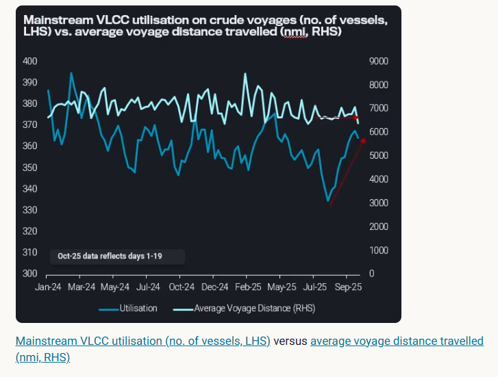
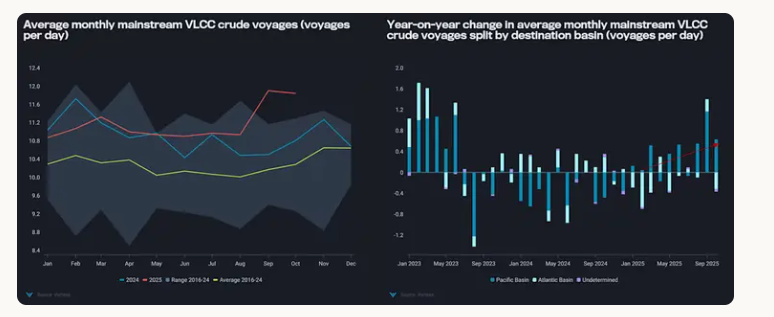
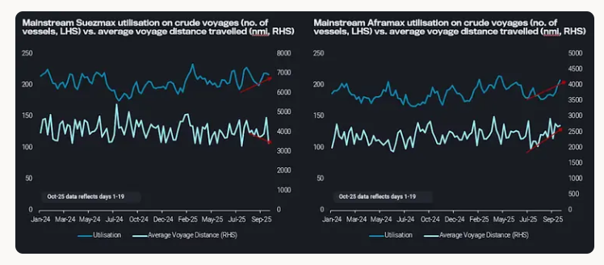

# Regulatory disruptions and oversupply support crude freight

**Date:** October 23, 2025  
**Publisher:** Breakwave Advisors | **Category:** Market Insights  
**Original URL:** [https://www.breakwaveadvisors.com/insights/2025/10/23/regulatory-disruptions-and-oversupply-support-crude-freight](https://www.breakwaveadvisors.com/insights/2025/10/23/regulatory-disruptions-and-oversupply-support-crude-freight)  

---

Crude freight markets remain well-supported by regulatory disruptions and an oversupplied seaborne crude market.

*By*[*Delia He*](https://www.linkedin.com/in/hedelia/)

So far, 2025 has been fraught with continuous geopolitical and regulatory disruptions that have increasingly fragmented trade flows, and consequently, changed crude freight trading behaviour.

Crude freight rates across VLCCs and[Suezmaxes have hit multi-month highs](https://analytics.vortexa.com/AnywhereFreightPricing?page=AnywhereFreightPricing&routes=%5B%22b4234bed-255a-44ad-81a9-ed9107fd1e39-3%22%2C%2294fa1515-953f-44a2-8bfe-929e28d90a5e-3%22%2C%222a9e15ab-4bb1-4b25-a4ad-e9f175e24ba9-3%22%2C%228606fe0e-fadc-4444-abbf-71bc46cb8472-3%22%2C%226ba11f00-34f3-4918-a936-4e4b6c5e45dc-3%22%2C%225df69596-2a6c-4685-9da3-b003f08a3e52-3%22%2C%224b879d05-8ba6-4801-9fcd-5150a564bd00-3%22%2C%22a66d89ca-3665-484a-82d8-eee8f3a910c4-3%22%2C%22867bc9b3-38dd-4ae6-9b97-3c8cb83aa0e2-3%22%2C%22e8760468-e2a5-4076-80e0-b34f6275d874-3%22%5D&routesSelected=%5B5%2C6%2C7%2C8%2C9%5D&tabId=260197de-48ab-422a-ac04-10e1ba72bce0&timeSeriesDateRange=5-years&timeSeriesFrequency=month)in October, with[VLCCs leading the charge on the rate surge](https://tinyurl.com/4zu94jy8). Gains in Suezmax rates are trailing closely, recording a two-year high, whereas[Aframax freight rates have tracked a year-to-date high at end-September](https://analytics.vortexa.com/AnywhereFreightPricing?page=AnywhereFreightPricing&routes=%5B%22b4234bed-255a-44ad-81a9-ed9107fd1e39-2%22%2C%2294fa1515-953f-44a2-8bfe-929e28d90a5e-2%22%2C%222a9e15ab-4bb1-4b25-a4ad-e9f175e24ba9-2%22%2C%228606fe0e-fadc-4444-abbf-71bc46cb8472-2%22%2C%226ba11f00-34f3-4918-a936-4e4b6c5e45dc-2%22%2C%225df69596-2a6c-4685-9da3-b003f08a3e52-2%22%2C%224b879d05-8ba6-4801-9fcd-5150a564bd00-2%22%2C%22a66d89ca-3665-484a-82d8-eee8f3a910c4-2%22%2C%22867bc9b3-38dd-4ae6-9b97-3c8cb83aa0e2-2%22%2C%22e8760468-e2a5-4076-80e0-b34f6275d874-2%22%5D&routesSelected=%5B0%2C1%2C2%2C3%2C4%5D&tabId=bc927a66-f80d-484d-8e95-9be8b010ac53&timeSeriesDateRange=5-years). Looking closer into each vessel class reveals different underlying support factors. reveals different underlying support factors.

## High Oil on Water Levels Drives Mainstream VLCC Utilisation

> **Figure 1: Στιγμιότυπο Οθόνης 2025 10 23 110756**  
> **Interactive Data & Source:** [Analytics Vortexa](https://analytics.vortexa.com/Flows?dateRange=2023-01-01T00%3A00%3A00.000Z__2025-10-20T23%3A59%3A59.999Z&filtersEnabled=%5B%22p%22%2C%22o%22%2C%22d%22%2C%22d_r%22%2C%22v%22%2C%22intra_d%22%2C%22sts_o%22%2C%22c_o%22%2C%22w%22%5D&intraMovementDropdown=all&metric=bpd&movementEvent=oil_on_water_state&page=Flows&products=%5B%2254af755a090118dcf9b0724c9a4e9f14745c26165385ffa7f1445bc768f06f11%22%5D&tabId=3025bf1d-43de-4cb0-86fc-9afc2c18d0b2&timeSeriesChartView=seasonal&v=3) | [Local Asset](file:///C:/Users/Dell/Github/Shipping/corpus/03-breakwave/insights/2025/assets/2025-10-23_regulatory-disruptions-and-oversupply-support-crude-freight_img_cea3cf84ceb9ceb3cebcceb9cf8ccf84cf85_c7b28e95c2f9.png)

[Global crude/condensates on water](https://analytics.vortexa.com/Flows?dateRange=2023-01-01T00%3A00%3A00.000Z__2025-10-20T23%3A59%3A59.999Z&filtersEnabled=%5B%22p%22%2C%22o%22%2C%22d%22%2C%22d_r%22%2C%22v%22%2C%22intra_d%22%2C%22sts_o%22%2C%22c_o%22%2C%22w%22%5D&intraMovementDropdown=all&metric=bpd&movementEvent=oil_on_water_state&page=Flows&products=%5B%2254af755a090118dcf9b0724c9a4e9f14745c26165385ffa7f1445bc768f06f11%22%5D&tabId=3025bf1d-43de-4cb0-86fc-9afc2c18d0b2&timeSeriesChartView=seasonal&v=3)have been steadily rising since August, reaching historical highs so far in October. While the oversupply of seaborne crude/condensates is tied to exports of sanctioned barrels ([read more here](https://analytics.vortexa.com/InsightsHubPage?articleId=6m8MkY5ELAb6OAVsVtalxX&articleType=Highlight&page=InsightsHubPage&searchTerm=&tabId=90ad0d2c-d0a8-418a-bce8-3cdce4895219)), elevated levels of non-sanctioned oil on water have nonetheless benefitted mainstream tonnage.

Mainstream VLCC utilisation has climbed close to 5% y-o-y, supported by long-haul arbitrage flows and higher OPEC+ exports[pointed to the Pacific Basin](https://tinyurl.com/mry67bfh).[Average monthly voyage counts of the global mainstream VLCC fleet](https://tinyurl.com/2fweucr2)have reached seasonal highs in September, and so far in October.

> **Figure 2: Στιγμιότυπο Οθόνης 2025 10 23 110918**  
> **Interactive Data & Source:** [Tinyurl](https://tinyurl.com/2fweucr2) | [Local Asset](file:///C:/Users/Dell/Github/Shipping/corpus/03-breakwave/insights/2025/assets/2025-10-23_regulatory-disruptions-and-oversupply-support-crude-freight_img_cea3cf84ceb9ceb3cebcceb9cf8ccf84cf85_0b439c4ab832.png)

LHS Chart:[Average monthly mainstream VLCC crude voyages (voyages per day)](https://tinyurl.com/2fweucr2)

RHS Chart:[Year-on-year change in average monthly mainstream VLCC crude voyages split by destination basin (voyages per day)](https://tinyurl.com/mry67bfh)

The situation has been further aggravated by USTR measures and China’s Special Port Fees, both of which were implemented on October 14. These newly introduced fees have prompted delays in discharges, keeping vessels laden at sea for longer periods of time. As of October 21, there are[3 laden US-linked VLCCs en-route to China](https://tinyurl.com/48bhxcya), two of which appear to be seeking alternative buyers and/or STS operations to circumvent China’s Special Port Fees.

The high level of crude oil on water, coupled with extended voyage durations have kept demand for mainstream VLCCs high, effectively tightening vessel availability, and pushing VLCC rates to a 31-month high.

## Sanctions Supportive for Suezmaxes and Aframaxes

Suezmaxes and Aframaxes are vessel classes disproportionately represented within the dark fleet and a harshening sanctions landscape has proved beneficial for mainstream utilisation. The surge in exports of sanctioned crude out of Russia, Iran, and Venezuela amid an expanding share of the dark fleet coming under sanctions, has accelerated the transition of mainstream vessels into the dark fleet.

At the same time,[crude inflows to the Atlantic Basin](https://tinyurl.com/ezbhv5hu)in Q3 have trended up close to 8% year-on year. Given that Suezmaxes and Aframaxes are the workhorses of AB crude trade, stronger demand coupled with tightening mainstream tonnage has lent support to healthy utilisation levels, in turn supporting freight rates.

> **Figure 3: Στιγμιότυπο Οθόνης 2025 10 23 111029**  
> **Interactive Data & Source:** [Tinyurl](https://tinyurl.com/msxy5uda) | [Local Asset](file:///C:/Users/Dell/Github/Shipping/corpus/03-breakwave/insights/2025/assets/2025-10-23_regulatory-disruptions-and-oversupply-support-crude-freight_img_cea3cf84ceb9ceb3cebcceb9cf8ccf84cf85_711473d895c7.png)

LHS Chart:[Mainstream Suezmax utilisation (no. of vessels, LHS)](https://tinyurl.com/msxy5uda)versus[average voyage distance travelled (nmi, RHS)](https://tinyurl.com/e2xd4mb3)

RHS Chart:[Mainstream Aframax utilisation (no. of vessels, LHS)](https://tinyurl.com/32d5zmdd)versus[average voyage distance travelled (nmi, RHS)](https://tinyurl.com/2f6m35n9)

On the other hand, sanctions activity and tariffs this year have pushed Suezmaxes towards trade regionalisation. In Q3, Suezmax mileage benefitted from Atlantic Basin crude exports to India, due to the latter’s need for replacement buying of sanctioned Russia crude grades.

Once that short-term upside for long-haul employment subsided, mainstream Suezmax employment was buoyed by intra-Atlantic Basin employment. Particularly as crude export growth out of South America – driven by Argentina, Brazil, and Guyana exports pointed primarily to Europe and US – have sharply increased this year. Ultimately,[intra-Atlantic Basin employment](https://tinyurl.com/mr3t96uz)has reached seasonal highs for seven out of 10 months this year, while[Atlantic-to-Pacific voyages](https://tinyurl.com/y9buv4n9)have hovered around nine-year seasonal lows for much of the year.

Aframaxes are observing both higher utilisation and higher mileage. In September,[mainstream employment out of the Atlantic Basin](https://tinyurl.com/3abn5x2v)had grown by 7% m-o-m, and continues to trend higher so far in October. Steadily rising voyages out of the Gulf of Mexico, particularly[transatlantic voyages lifting WTI towards Northwest Europe and the Mediterranean](https://analytics.vortexa.com/VoyagesFlows?dateRange=2024-01-01T00%3A00%3A00.000Z__2025-10-19T23%3A59%3A59.999Z&destinationBreakdown=shipping_region_v2&filtersEnabled=%5B%22v_v_st%22%2C%22v%22%2C%22l_c%22%2C%22o%22%2C%22d%22%2C%22d_r%22%2C%22v_or%22%2C%22v_de%22%2C%22dwt%22%2C%22v_i%22%2C%22v_cg_st%22%2C%22v_l_st%22%2C%22v_co_st%22%2C%22v_m_st%22%2C%22v_wt%22%2C%22v_c%22%2C%22l%22%2C%22v_o%22%2C%22intra_d%22%2C%22v_t%22%2C%22v_a%22%5D&from=%5B%2237c8c4eeb730d1cd41f90ca6bf95c923222b0734b1b0336a475acce821f87ebd%22%5D&intraMovementDropdown=exclude_intra_country&latestProducts=%5B%226803d791bb6f749469fc8145c4111a4e05599550461a847abc95ba02e1886f70%22%5D&metric=t&originBreakdown=shipping_region_v2&page=VoyagesFlows&routeBreakdown=shipping_region_v2&tabId=f49123af-b572-46c5-8e79-6d1987f7e0cf&timeSeriesBreakdown=destination-shipping-region-v2&timeSeriesMetric=voyage-count-per-day&tsAnalysisPercentagesEnabled=1&tsAnalysisSeasonalEnabled=0&vesselClasses=%5B%22oil_aframax_lr2%22%5D&voyageDateRangeActivity=departures&voyageStatus=%5B%22laden%22%5D), has supported voyage distances, and has replaced[employment on the shorter-haul Mexico EC-to-US Gulf Coast crude trade route](https://analytics.vortexa.com/VoyagesFlows?dateRange=2024-01-01T00%3A00%3A00.000Z__2025-10-19T23%3A59%3A59.999Z&destinationBreakdown=shipping_region_v2&filtersEnabled=%5B%22v_v_st%22%2C%22v%22%2C%22l_c%22%2C%22o%22%2C%22d%22%2C%22d_r%22%2C%22v_or%22%2C%22v_de%22%2C%22dwt%22%2C%22v_i%22%2C%22v_cg_st%22%2C%22v_l_st%22%2C%22v_co_st%22%2C%22v_m_st%22%2C%22v_wt%22%2C%22v_c%22%2C%22l%22%2C%22v_o%22%2C%22intra_d%22%2C%22v_t%22%2C%22v_a%22%5D&from=%5B%2240e617c427e49f6510df4eefedbd145a2cadbf5f7b2cacd3ea65702b92632f24%22%5D&intraMovementDropdown=exclude_intra_country&latestProducts=%5B%2254af755a090118dcf9b0724c9a4e9f14745c26165385ffa7f1445bc768f06f11%22%5D&metric=t&originBreakdown=shipping_region_v2&page=VoyagesFlows&routeBreakdown=shipping_region_v2&tabId=f49123af-b572-46c5-8e79-6d1987f7e0cf&timeSeriesMetric=voyage-count-per-day&to=%5B%224e79eb8e84d26f5c3c0006283bc1aa52c170b58d667be9848e136afea91a57e9%22%5D&tsAnalysisPercentagesEnabled=1&tsAnalysisSeasonalEnabled=0&tsVisualType=seasonal&vesselClasses=%5B%22oil_aframax_lr2%22%5D&voyageDateRangeActivity=departures&voyageStatus=%5B%22laden%22%5D)– which has hit nine-year seasonal lows for much of the year.

## What Next?

This year’s patchwork of sanctions, tariffs, and regulatory action has splintered global crude flows, creating distinct layers of support across crude freight. The durability of these support conditions is dependent on the longevity of present-day geopolitical frictions that distort fleet efficiency.

Tightening sanctions enforcement, coupled with regulatory disruptions – notably tariffs, USTR, and China’s Special Port Fees – have caused significant market segmentation in the global VLCC, Suezmax, and Aframax fleet. Moreover, as the effects of these geopolitics/ regulatory-related structural inefficiencies have been further exacerbated by the massive surge in crude oil on water, crude freight looks to remain well-supported in the medium-term.

Data Source:[Vortexa](https://www.vortexa.com//oil-gas-data-traders-analysts-data-scientists?gclid=Cj0KCQjw8_qRBhCXARIsAE2AtRZKOvMnbilZ_6_91d7huSFFy71pWLrnPwGwOHVzXsmsG-1a1mZnQw8aAt89EALw_wcB&hsa_acc=1782073842&hsa_ad=548425387665&hsa_cam=14746637662&hsa_grp=125038601902&hsa_kw=&hsa_mt=&hsa_net=adwords&hsa_src=g&hsa_tgt=dsa-1431852288425&hsa_ver=3&utm_campaign=%5BCD%5D%20-%20DSA%20-%20EMEA&utm_medium=cpc&utm_medium=ppc&utm_source=google&utm_source=adwords&utm_term=)

---

**Tags:** Crude, Markets, Tankers  
