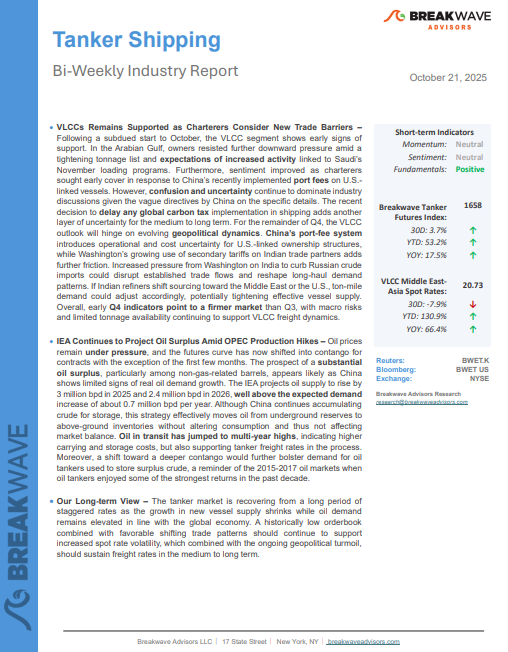
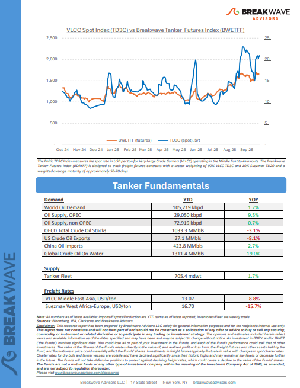

# Breakwave Weekend Read

**Date:** October 24, 2025  
**Publisher:** Breakwave Advisors | **Category:** Market Insights  
**Original URL:** [https://www.breakwaveadvisors.com/insights/2025310-weekly-gytlo115-xhbxa](https://www.breakwaveadvisors.com/insights/2025310-weekly-gytlo115-xhbxa)  

---

## Welcome Tobreakwave Advisorsweekend Read

***As the week comes to a close, take a moment to review the key insights from the past few days. Missed something? We've gathered all the top insights for you to catch up at your convenience.***

## Breakwave Shipping Report

**VLCCs Remains Supported as Charterers Consider New Trade Barriers**– Following a subdued start to October, the VLCC segment shows early signs of support.

[Read More](https://www.breakwaveadvisors.com/insights/20251021wetreport5k88j458-47p)

> **Figure 1: Στιγμιότυπο Οθόνης 2025 10 22 153937**  
> **Interactive Data & Source:** [Breakwave Advisors Market Insights](https://www.breakwaveadvisors.com/insights/2025/10/20/for-the-dry-bulk-sector-outlook-remains-constructive) | [Local Asset](file:///C:/Users/Dell/Github/Shipping/corpus/03-breakwave/insights/2025/assets/2025-10-24_2025310-weekly-gytlo115-xhbxa_img_cea3cf84ceb9ceb3cebcceb9cf8ccf84cf85_2159f00693fe.png)

> **Figure 2: Στιγμιότυπο Οθόνης 2025 10 22 153952**  
> **Interactive Data & Source:** [Breakwave Advisors Market Insights](https://www.breakwaveadvisors.com/insights/2025/10/20/for-the-dry-bulk-sector-outlook-remains-constructive) | [Local Asset](file:///C:/Users/Dell/Github/Shipping/corpus/03-breakwave/insights/2025/assets/2025-10-24_2025310-weekly-gytlo115-xhbxa_img_cea3cf84ceb9ceb3cebcceb9cf8ccf84cf85_b76b50fd78ab.png)

## For the Dry Bulk Sector Outlook Remains Constructive

> **Figure 3: Στιγμιότυπο Οθόνης 2025 10 22 162017**  
> **Interactive Data & Source:** [Breakwave Advisors Market Insights](https://www.breakwaveadvisors.com/insights/2025/10/20/for-the-dry-bulk-sector-outlook-remains-constructive) | [Local Asset](file:///C:/Users/Dell/Github/Shipping/corpus/03-breakwave/insights/2025/assets/2025-10-24_2025310-weekly-gytlo115-xhbxa_img_cea3cf84ceb9ceb3cebcceb9cf8ccf84cf85_66fb5cb51ae6.png)

After spending much of the past fortnight navigating the complexities of “U.S. and China special port fees” – including assessments of ownership structures, operational control, and even the nationality of board members – a return to core fundamentals feels necessary.

Doric Weekly Market Insights

## Recent Rebound in Chinese Steel Production

> **Figure 4: Unsplash Image Tmviieoapri**  
> **Interactive Data & Source:** [Breakwave Advisors Market Insights](https://www.breakwaveadvisors.com/insights/2025/10/20/recent-rebound-in-chinese-steel-production) | [Local Asset](file:///C:/Users/Dell/Github/Shipping/corpus/03-breakwave/insights/2025/assets/2025-10-24_2025310-weekly-gytlo115-xhbxa_img_unsplash-image-tmviieoapri_03836ff22939.jpg)

The most recently released data shows that daily crude steel production at large and medium-sized mills in China averaged 2.03 million tons during October 1 - October 10.

From Commodore's Weekly Dry Bulk Reports

## Metals Gains on Better-Than-Expected Economic Data

> **Figure 5: Unsplash Image Utwn4z9n9wo**  
> **Interactive Data & Source:** [Breakwave Advisors Market Insights](https://www.breakwaveadvisors.com/insights/2025/10/21/metals-gains-on-better-than-expected-economic-data) | [Local Asset](file:///C:/Users/Dell/Github/Shipping/corpus/03-breakwave/insights/2025/assets/2025-10-24_2025310-weekly-gytlo115-xhbxa_img_unsplash-image-utwn4z9n9wo_b1c4e1900916.jpg)

Easing trade tensions helped support sentiment, with all sectors ending the session higher. Better than expected economic data in China saw metals gain, while crude oil fell amid signs of rising supplies.

Commodities Wrap

## Can Cockroaches Fly Solo?

> **Figure 6: Unsplash Image Wb63zqj5gne**  
> **Interactive Data & Source:** [Breakwave Advisors Market Insights](https://www.breakwaveadvisors.com/insights/2025/10/22/can-cockroaches-fly-solo) | [Local Asset](file:///C:/Users/Dell/Github/Shipping/corpus/03-breakwave/insights/2025/assets/2025-10-24_2025310-weekly-gytlo115-xhbxa_img_unsplash-image-wb63zqj5gne_95b912f835bb.jpg)

Recent loan fraud disclosures at U.S. regional banks and bankruptcies in the auto sector have revived memories of 2008-style stress.

Forvis Mazars Weekly Note

## U.s.–china Agri Trade Battle Rekindled

> **Figure 7: Unsplash Image D I7l2uispq**  
> **Interactive Data & Source:** [Breakwave Advisors Market Insights](https://www.breakwaveadvisors.com/insights/2025/10/22/uschina-agri-trade-battle-rekindled) | [Local Asset](file:///C:/Users/Dell/Github/Shipping/corpus/03-breakwave/insights/2025/assets/2025-10-24_2025310-weekly-gytlo115-xhbxa_img_unsplash-image-d-i7l2uispq_74ccbde931e1.jpg)

This week’s Allied Quantumsea Research examines the latest escalation in U.S.–China trade tensions following President Trump’s announcement of a 100% tariff on Chinese imports, effective November 1.

Allied Weekly Report

## Regulatory Disruptions and Oversupply Support Crude Freight

> **Figure 8: Στιγμιότυπο Οθόνης 2025 10 23 111306**  
> **Interactive Data & Source:** [Breakwave Advisors Market Insights](https://www.breakwaveadvisors.com/insights/2025/10/23/regulatory-disruptions-and-oversupply-support-crude-freight) | [Local Asset](file:///C:/Users/Dell/Github/Shipping/corpus/03-breakwave/insights/2025/assets/2025-10-24_2025310-weekly-gytlo115-xhbxa_img_cea3cf84ceb9ceb3cebcceb9cf8ccf84cf85_b6c14e1adebc.png)

Crude freight markets remain well-supported by regulatory disruptions and an oversupplied seaborne crude market.

Vortexa Freight Weekly

## Russian Sanctions Provide Sharp Boost to Tanker Optimism

> **Figure 9: Pexels Duartefotografia 22944224**  
> **Interactive Data & Source:** [Breakwave Advisors Market Insights](https://www.breakwaveadvisors.com/insights/2025/10/24/russian-sanctions-provide-sharp-boost-to-tanker-optimism) | [Local Asset](file:///C:/Users/Dell/Github/Shipping/corpus/03-breakwave/insights/2025/assets/2025-10-24_2025310-weekly-gytlo115-xhbxa_img_pexels-duartefotografia-22944224_d7b6387c7fd2.jpg)

Over the past 24 hours the US announced sanctions on Rosneft and Lukoil and the EU has released its long-awaited 19th Russian sanctions package.

Braemar Research

## Newfound Growth in Gas Engine Vehicle Sales in China Continues

> **Figure 10: Unsplash Image Hbnpklsozgg**  
> **Interactive Data & Source:** [Breakwave Advisors Market Insights](https://www.breakwaveadvisors.com/insights/2025/10/24/newfound-growth-in-gas-engine-vehicle-sales-in-china-continues) | [Local Asset](file:///C:/Users/Dell/Github/Shipping/corpus/03-breakwave/insights/2025/assets/2025-10-24_2025310-weekly-gytlo115-xhbxa_img_unsplash-image-hbnpklsozgg_b70d4fc7fd55.jpg)

As we discussed in Commodore Research's most recent Weekly China Report, September saw a total of 2.58 million vehicles sold in China.

From Commodore's Weekly Dry Bulk Reports

## China’s Soybean Imports Pivot South: U.s. Shipments Vanish in September As South America Fills the Gap

> **Figure 11: Unsplash Image Ynteered0sy**  
> **Interactive Data & Source:** [Breakwave Advisors Market Insights](https://www.breakwaveadvisors.com/insights/2025/10/24/chinas-soybean-imports-pivot-south-us-shipments-vanish-in-september-as-south-america-fills-the-gap) | [Local Asset](file:///C:/Users/Dell/Github/Shipping/corpus/03-breakwave/insights/2025/assets/2025-10-24_2025310-weekly-gytlo115-xhbxa_img_unsplash-image-ynteered0sy_ce5ed73b341f.jpg)

China’s soybean supply chain took a sharp turn south in September.

Signal Ocean Dry Weekly Market Monitor

---

**Tags:** Shipping, Tankers, Drybulk  
